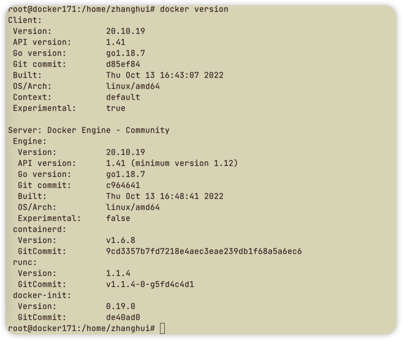
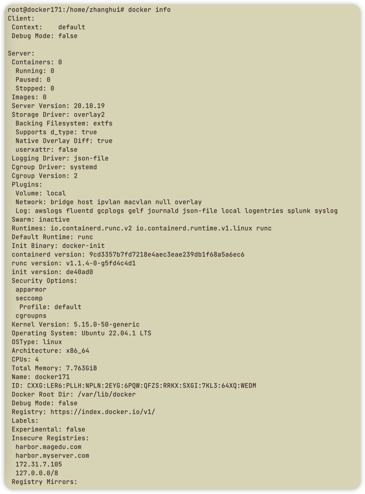
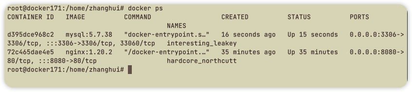
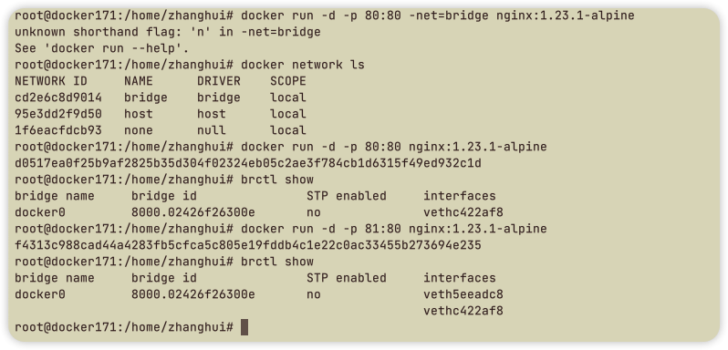
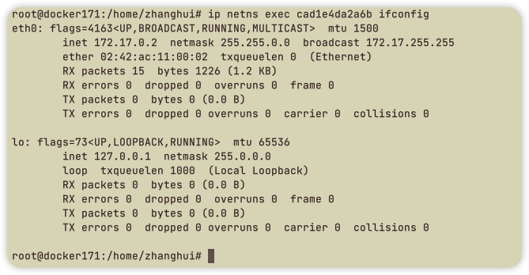

## 作业要求

1. 梳理各Namespace的作用。
2. 使用apt/yum/二进制安装指定版本的Docker
3. 熟练使用Docker数据卷
4. 熟练使用Docker的bridge和container模式网络

### 1. 梳理各 Namespace 的作用

MNT Namespace实现不同容器的文件系统隔离

IPC Namespace实现进程隔离

UTS Namespace实现主机名隔离

PID Namespace实现进程PID隔离

Net Namespace实现不同容器间的网络隔离，User Namespace实现用户隔离

### 2. 使用apt/二进制安装指定版本的Docker

二进制安装方式

```bash
# 解压
tar xvf docker-20.10.19-binary-install.tar.gz 

# 修改脚本docker-install.sh
PACKAGE_NAME="docker-20.10.19.tgz"

# 运行脚本
bash docker-install.sh

# 检查
docker version
docker info
```
apt安装方式

```bash
# 安装必要的系统工具
sudo apt-get update
sudo apt-get -y install apt-transport-https ca-certificates curl software-properties-common

# 安装GPG证书
curl -fsSL http://mirrors.aliyun.com/docker-ce/linux/ubuntu/gpg | sudo apt-key add -

# 写入软件源信息
sudo add-apt-repository "deb [arch=amd64] http://mirrors.aliyun.com/docker-ce/linux/ubuntu $(lsb_release -cs) stable"

# 查找可用版本并安装
sudo apt-get -y update
apt-cache madison docker-ce
apt install docker-ce=5:20.10.17~3-0~ubuntu-jammy docker-ce-cli=5:20.10.17~3-0~ubuntu-jammy
```

运行结果





### 3. 熟练使用Docker数据卷

国内镜像加速

```bash
vim /etc/docker/daemon.json

{
  "registry-mirrors": [
    "https://hub-mirror.c.163.com", 
    "https://mirror.baidubce.com"
  ]
}

# 启动容器
sudo systemctl daemon-reload
sudo systemctl restart docker
```

拉取镜像并启动容器

```bash
# 拉取nginx完整镜像
docker pull nginx:1.20.2

# 运行容器
docker run -itd -p 8080:80 -p 8443:443 nginx:1.20.2
docker exec -it 72c465dae4e5 bash
```

创建卷

```bash
# 创建卷
docker volume create nginx-data

# 启动容器
docker run -itd -p 8080:80 -v nginx-data:/data nginx:1.20.2

# 容器内创建文件
dcker exec -it 72c465dae4e5 sh
ls /data
mkdir /data/logs
echo "111" >> /data/logs/access.log
exit

# 宿主机查看文件
cat /var/lib/docker/volumes/nginx-data/_data/logs/access.log
111

# 删除容器
docker rm -fv 7a4f5d6f9ca4
# 检查宿主机中是否存在
cat /var/lib/docker/volumes/nginx-data/_data/logs/access.log
111
```
映射目录

```bash
# 创建宿主机目录
mkdir -p /data/testapp
echo "testapp web page" >> /data/testapp/index.html
cat /data/testapp/index.html
testapp web pag

# 运行容器并映射目录
docker run -itd -p 8080:80 -v /data/testapp:/data nginx:alpine-1.20.2

# 浏览
http://172.16.7.1:8080
```

创建mysql容器

```bash
# 运行容器
docker run -itd -p 3306:3306 -e MYSQL_ROOT_PASSWORD=12345678 -v /data/mysql:/var/lib/mysql mysql:5.7.38

# 进入容器创建数据库
docker exec -it d22eacfc7f86 bash
bash-4.2# mysql -uroot -p12345678 -h127.0.0.1
mysql> show databases;
mysql> create database myserver;
mysql> show databases;
exit

# 删除容器
docker rm -fv d22eacfc7f86

# 宿主机查看myserver的目录仍旧存在
ll /data/mysql
```



### 4. 熟练使用Docker的bridge和container模式网络

使用bridge网络

```bash
# 使用bridge网络
docker run -d -p 80:80 nginx:1.23.1-alpine
docker run -d -p 81:80 nginx:1.23.1-alpine

# 查看容器内网络
docker exec -it f4313c988cad sh
/ # ifconfig

# 查看宿主机上网络端口监听
netstat -tanlp

# 查看桥接网络
sudo apt install bridge-utils
brctl show
```



使用container网络

```bash
# 创建第一个容器
docker run -itd --name nginx-container -p 80:80 --net=bridge nginx:1.23.1-alpine

# 创建第二个容器
docker run -itd --name php-container --net=container:nginx-container php:7.4.30-fpm-alpine

# 验证namespace
apt install net-tools
ln -s /var/run/docker/netns/* /var/run/netns/
ip netns list
ip netns exec cad1e4da2a6b ifconfig
```


