# 极客时间运维进阶训练营第十周作业


## 作业要求

1. 熟练管理存储池(创建存储池、删除存储池)、掌握pg与pgp的基本分配方法
2. 熟练ceph的用户管理及授权
3. 使用普通客户挂载块存储
4. 使用普通用户挂载cephfs（可以通过secret或者secretfile的形式多主机同时挂载）
5. 实现MDS服务的多主一备高可用架构


## 1. 熟练管理存储池(创建存储池、删除存储池)、掌握pg与pgp的基本分配方法

### 管理存储池

```bash
# ceph-deploy节点
# 创建存储池
su - cephadmin
ceph osd pool create mypool2 32 32

# 列出存储池
ceph osd pool ls

# 列出带ID的存储池
ceph osd lspools

# 获取存储池的事件信息
ceph osd pool stats mypool2

# 重命名存储池，将myrbd1更名为myrbd2
ceph osd pool rename myrbd1 myrbd2

# 显示存储池的用量信息
rados df

# 设置允许删除
ceph tell mon.* injectargs --mon-allow-pool-delete=true

# 删除存储池
ceph osd pool rm mypool2 mypool2 --yes-i-really-really-mean-it
```

### 掌握pg和pgp

```bash
# PG：Placement Group归置组，默认每个PG三个OSD
# PGP：Placement Group for Placement purpose，归置组的组合，pgp相当于是pg对应osd的一种逻辑排列组合关系
# pg数量推荐是2的整次幂
# pg不能大于pgp

# pg数量推荐应是2的整次幂
ceph osd pool create testpoo2 60 60
ceph osd pool create testpoo4 45 45

# pg不能大于pgp
ceph osd pool create testpoo3 40 30

# 检查状态报错
ceph health detail

# 验证pg与pgp组合
ceph pg ls-by-pool mypool2 | awk '{print$1,$2,$15}'

# 观察pg状态
ceph pg stat
# 预期输出
Active表示正常工作状态
Clean表示干净不存在待修复
442 pgs: 442 active+clean; 14 MiB data, 576 MiB used, 32 TiB / 32 TiB avail
```

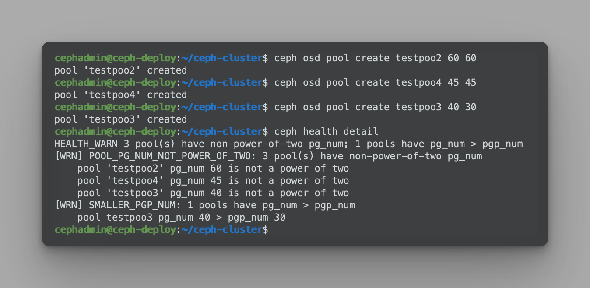


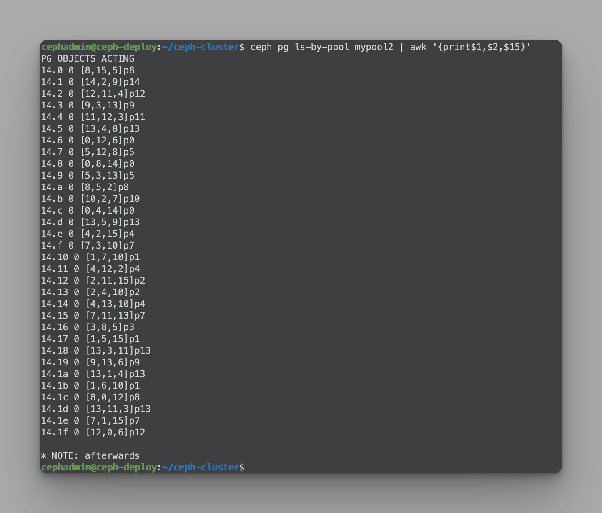


## 2. 熟练ceph的用户管理及授权

### 创建及删除用户

```bash
# 列出用户
ceph auth list

# 创建用户client.jerry并赋予权限
ceph auth add client.jerry mon 'allow r' osd 'allow rwx pool=mypool'

# 验证key
ceph auth get client.jerry
# 预期输出
[client.jerry]
        key = AQDLp65js1aOOBAA5hVtFwNiKfaDPnzoHzAHnw==
        caps mon = "allow r"
        caps osd = "allow rwx pool=mypool"
exported keyring for client.jerry

# 创建用户，如果用户存在则返回用户名及密钥
ceph auth get-or-create client.jerry mon 'allow r' osd 'allow rwx pool=mypool'
# 预期输出
[client.jerry]
        key = AQDLp65js1aOOBAA5hVtFwNiKfaDPnzoHzAHnw==

# 删除用户
ceph auth del client.jerry
```

### 修改用户能力

```bash
# 查看用户当前权限
ceph auth get client.jerry
# 预期输出
[client.jerry]
        key = AQDLp65js1aOOBAA5hVtFwNiKfaDPnzoHzAHnw==
        caps mon = "allow r"
        caps osd = "allow rwx pool=mypool"
exported keyring for client.jerry

#修改用户权限
ceph auth caps client.jerry mon 'allow r' osd 'allow rw pool=mypool'

#再次验证权限
ceph auth get client.jerry
# 预期输出
[client.jerry]
        key = AQDLp65js1aOOBAA5hVtFwNiKfaDPnzoHzAHnw==
        caps mon = "allow r"
        caps osd = "allow rw pool=mypool"
exported keyring for client.jerry
```

### 导出用户认证

```bash
# 创建用户
ceph auth get-or-create client.user1 mon 'allow r' osd 'allow * pool=mypool'

# 验证用户
ceph auth get client.user1

#创建keyring文件
ceph-authtool --create-keyring ceph.client.user1.keyring

# 验证keyring 文件，目前是空文件
file ceph.client.user1.keyring

# 导出keyring至指定文件
ceph auth get client.user1 -o ceph.client.user1.keyring

# 验证指定用户的keyring文件
cat ceph.client.user1.keyring
# 输出
[client.user1]
        key = AQBaqK5jW1DWKhAAveniMBRct5HU6IZNvxxwZw==
        caps mon = "allow r"
        caps osd = "allow * pool=mypool"

# 删除用户
ceph auth del client.user1
ceph auth get client.user1

# 导入用户
ceph auth import -i ceph.client.user1.keyring

# 检查用户
ceph auth get client.user1
# 预期输出
[client.user1]
        key = AQBaqK5jW1DWKhAAveniMBRct5HU6IZNvxxwZw==
        caps mon = "allow r"
        caps osd = "allow * pool=mypool"
exported keyring for client.user1
```


## 3. 使用普通客户挂载块存储

### 创建块存储

```bash
# 创建存储池
ceph osd pool create rbd-data1 32 32
ceph osd pool ls

# 启用rbd
ceph osd pool application enable rbd-data1 rbd

# 初始化rbd
rbd pool init -p rbd-data1

# 创建镜像
rbd create data-img1 --size 3G --pool rbd-data1 --image-format 2 --image-feature layering
rbd create data-img2 --size 5G --pool rbd-data1 --image-format 2 --image-feature layering

# 列出镜像
rbd ls --pool rbd-data1 -l
```

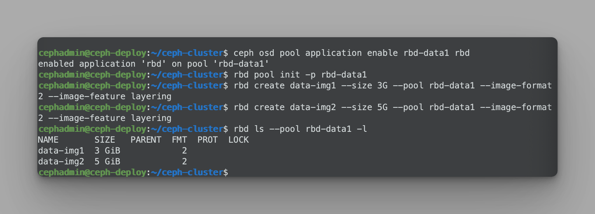

### 创建普通用户并授权

```bash
# 创建普通账户
ceph auth add client.zhanghui mon 'allow r' osd 'allow rwx pool=rbd-data1'

# 验证用户信息
ceph auth get client.zhanghui

# 创建空白的用户keyring文件
ceph-authtool --create-keyring ceph.client.zhanghui.keyring

# 导出用户keyring
ceph auth get client.zhanghui -o ceph.client.zhanghui.keyring

# 查看
cat ceph.client.zhanghui.keyring
# 预期输出
[client.zhanghui]
        key = AQAdqq5jnvXaHxAAleJoe+H5PxY2tL8HTzyFzg==
        caps mon = "allow r"
        caps osd = "allow rwx pool=rbd-data1"
```

### 安装ceph客户端

```bash
# 172.16.17.1
# 安装客户端
apt install ceph-common

# ceph-deploy
# 同步认证文件
scp ceph.conf ceph.client.zhanghui.keyring root@172.16.17.1:/etc/ceph/

# 使用普通用户
ceph --user zhanghui -s

# 映射rbd
rbd --user zhanghui -p rbd-data1 map data-img2

# 格式化
fdisk -l /dev/rbd0
mkfs.ext4 /dev/rbd0
mkdir /data
mount /dev/rbd0 /data/
cp /var/log/syslog /data/
ll /data/
df -TH

# ceph-deploy节点
# 验证镜像状态
rbd ls -p rbd-data1 -l
```

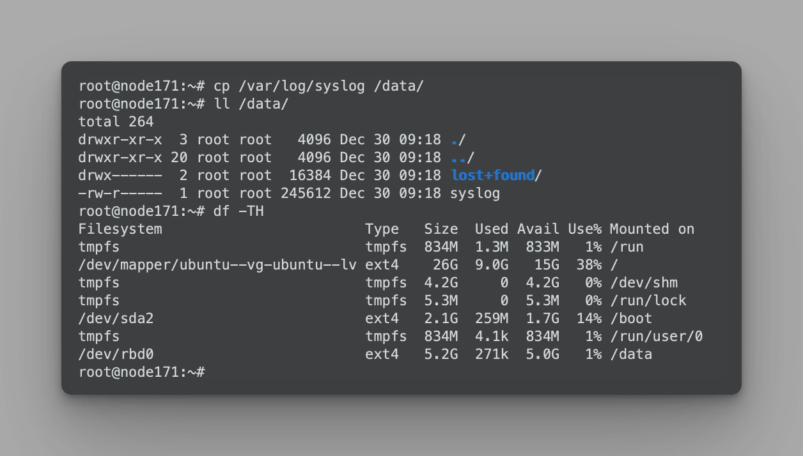


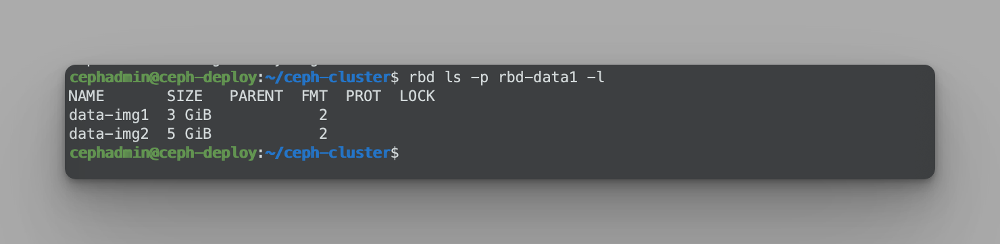

### rbd镜像空间拉伸

```bash
# ceph-deploy节点
# 空间拉伸
rbd resize --pool rbd-data1 --image data-img2 --size 8G

# 172.16.17.1
# 扩展空间
fdisk -l /dev/rbd0
# 刷新文件系统
resize2fs /dev/rbd0
df -TH
```

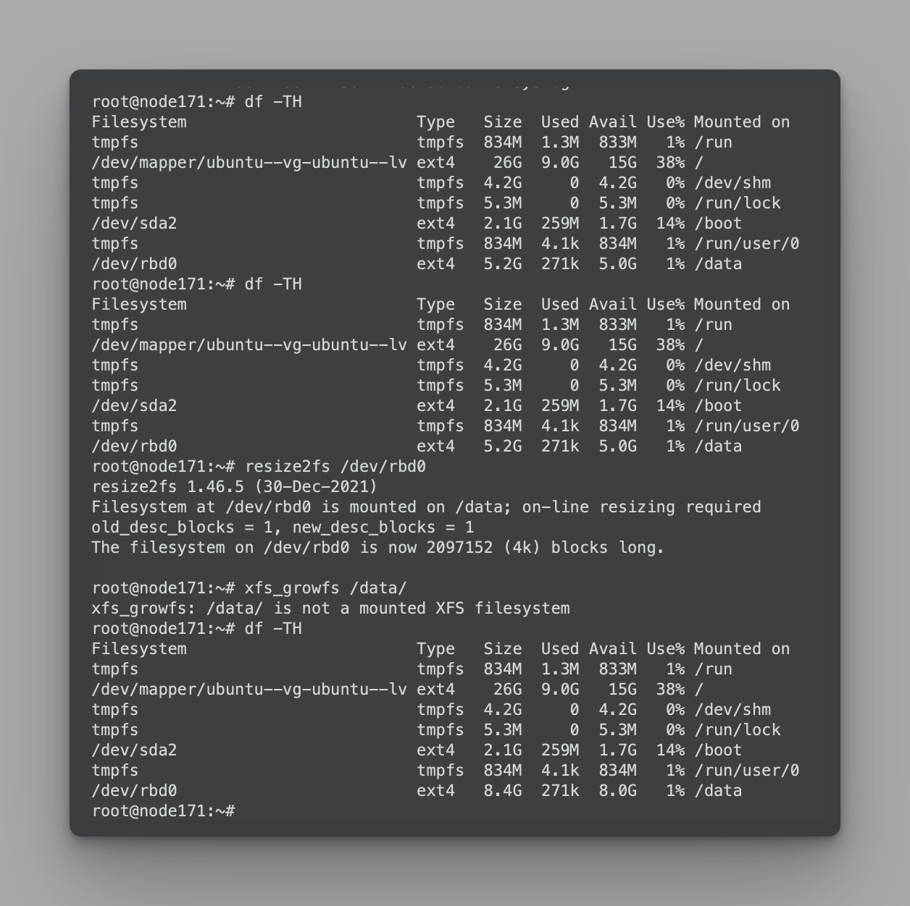

### 客户端卸载rbd镜像

```bash
# 客户端卸载
umount /data
rbd --user zhanghui -p rbd-data1 unmap data-img2

# ceph-deploy
# 删除镜像
rbd rm --pool rbd-data1 --image data-img1

# 查看回收站并删除
rbd trash list --pool rbd-data1
rbd trash remove --pool rbd-data1 8659a3691aec

# 列出镜像
rbd ls --pool rbd-data1 -l
```

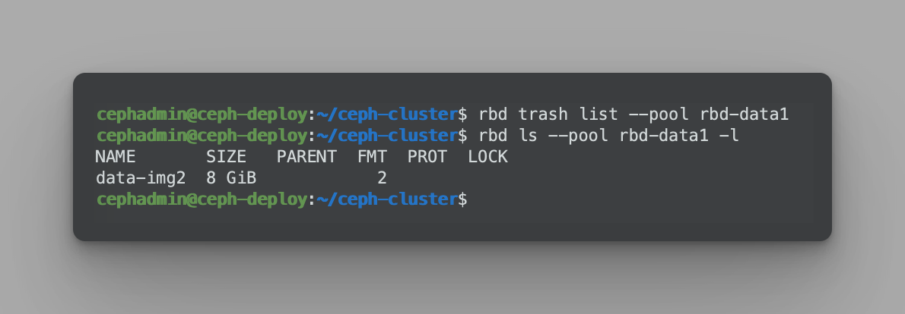


## 4. 使用普通用户挂载cephfs（可以通过secret或者secretfile的形式多主机同时挂载）

### 安装MDS服务

```bash
# ceph-mgr1节点
apt install ceph-mds

# ceph-deploy节点
# 创建metadata和data存储池
ceph osd pool create cephfs-metadata 32 32
ceph osd pool create cephfs-data 64 64

# 创建cephfs
ceph fs new mycephfs cephfs-metadata cephfs-data
ceph fs ls
ceph fs status mycephfs

# 检查cephfs服务状态
ceph mds stat
```

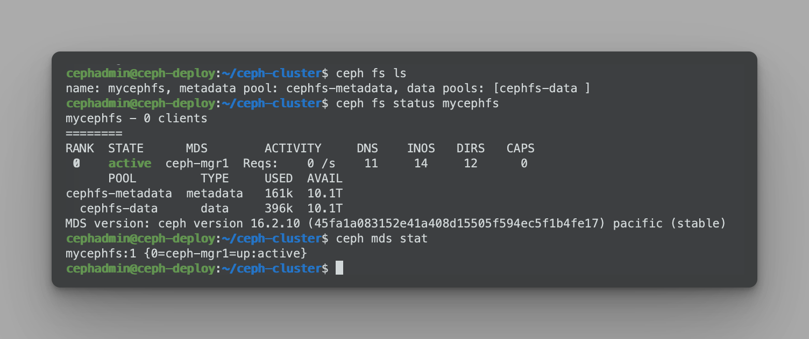

### 创建普通账户

```bash
# 创建普通账户
ceph auth add client.david mon 'allow r' mds 'allow rw' osd 'allow rwx pool=cephfs-data'

# 验证用户信息
ceph auth get client.david

# 创建用户keyring文件
ceph auth get client.david -o ceph.client.david.keyring

# 验证用户的 keyring 文件
cat ceph.client.david.keyring
# 预期输出
[client.david]
        key = AQCms65jggVnKxAAL6geK1ba86LJbdQsveSurA==
        caps mds = "allow rw"
        caps mon = "allow r"
        caps osd = "allow rwx pool=cephfs-data"
```

### centos客户端挂载

```bash
# centos节点172.16.17.21
# 配置octopus源
yum install epel-release -y
yum install https://mirrors.aliyun.com/ceph/rpm-octopus/el7/noarch/ceph-release-1-1.el7.noarch.rpm -y
# 安装ceph-common
yum install ceph-common -y

# ceph-deploy节点
# 拷贝etc目录下的认证文件到centos节点
scp ceph.conf ceph.client.david.keyring root@172.16.17.21:/etc/ceph/

# 172.16.17.21
ceph --user david -s

# 查看key
cat /etc/ceph/ceph.client.david.keyring 
# 预期输出
[client.david]
        key = AQCms65jggVnKxAAL6geK1ba86LJbdQsveSurA==
        caps mds = "allow rw"
        caps mon = "allow r"
        caps osd = "allow rwx pool=cephfs-data"

# 通过key挂载
# 通过secretfile挂载报secret is not valid base64: Invalid argument，经查询需要修改keyring文件，以后再补充
mkdir /data
mount -t ceph 172.16.17.11:6789,172.16.17.12:6789,172.16.17.13:6789:/ /data -o name=david,secret=AQCms65jggVnKxAAL6geK1ba86LJbdQsveSurA==

# 验证数据写入
cp /etc/issue /data/
dd if=/dev/zero of=/data/testfile bs=1M count=100
```

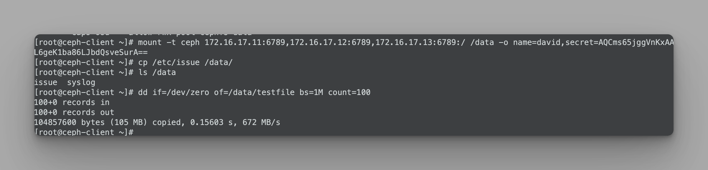

### ubuntu客户端挂载

```bash
# ceph-deploy节点
scp ceph.conf ceph.client.david.keyring root@172.16.17.1:/etc/ceph/

# 172.16.17.1
ceph --user david -s

# 172.16.17.1
# 客户端通过key挂载mgr1上的文件系统
mkdir /data
# 注意地址需写mon节点的地址，需要mon做认证
mount -t ceph 172.16.17.11:6789,172.16.17.12:6789,172.16.17.13:6789:/ /data -o name=david,secret=AQCms65jggVnKxAAL6geK1ba86LJbdQsveSurA==

# 检查已写入的数据
ls /data/
df -TH
```

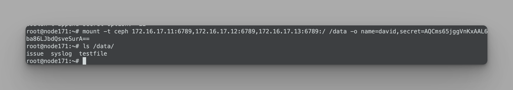


## 5. 实现MDS服务的多主一备高可用架构

### 添加mds服务器

```bash
# 查看mds服务器
ceph mds stat

# mgr2节点
apt install ceph-mds

# mon2节点
apt install ceph-mds

# mon3节点
apt install ceph-mds

# ceph-deploy节点
# 添加mds服务器
ceph-deploy mds create ceph-mgr2
ceph-deploy mds create ceph-mon2
ceph-deploy mds create ceph-mon3

# 验证服务
ceph mds stat
# 预期输出
mycephfs:1 {0=ceph-mgr1=up:active} 3 up:standby

# 验证集群状态
# 显示有1主3备
ceph fs status

# 当前文件系统状态
ceph fs get mycephfs
```

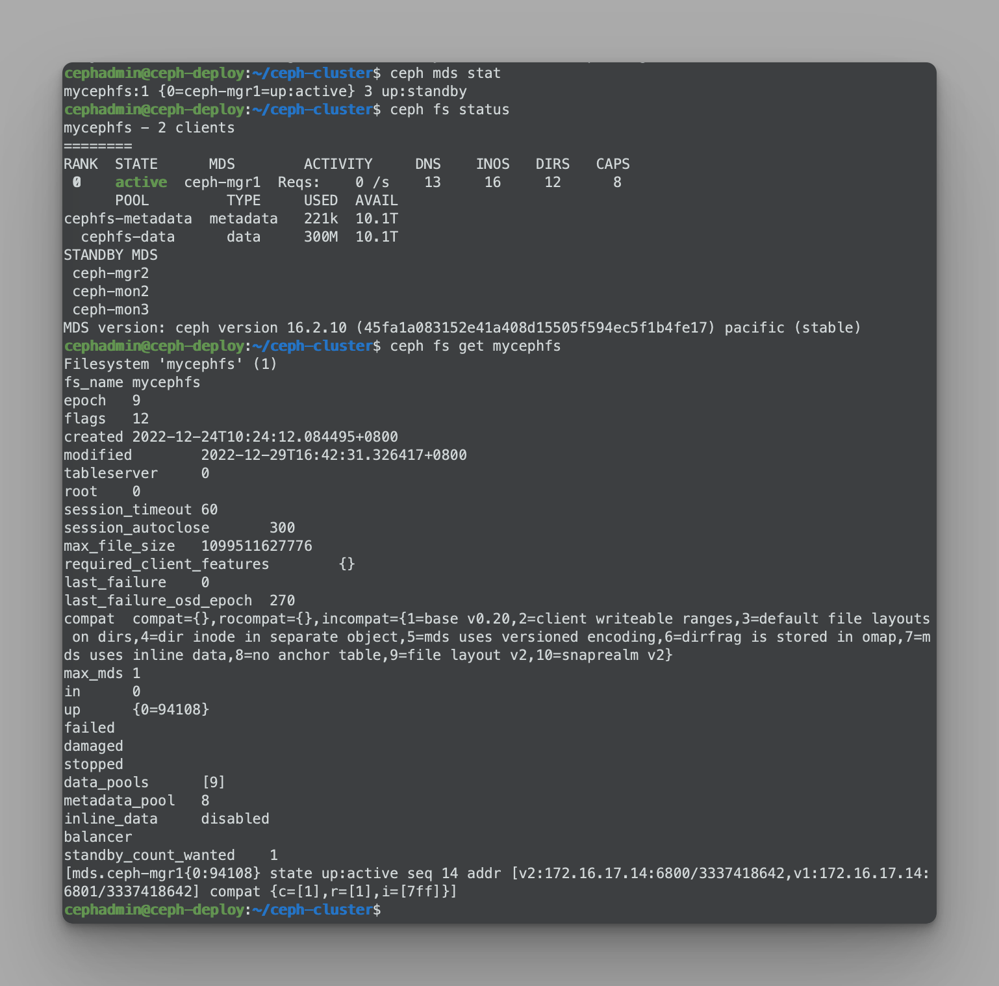

### 调整高可用架构

```bash
# 设置同时活跃的主mds最大值为3
ceph fs set mycephfs max_mds 3

# 显示集群状态
ceph fs status
```

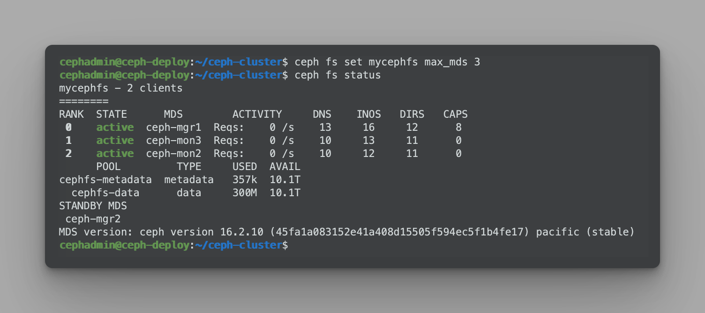
