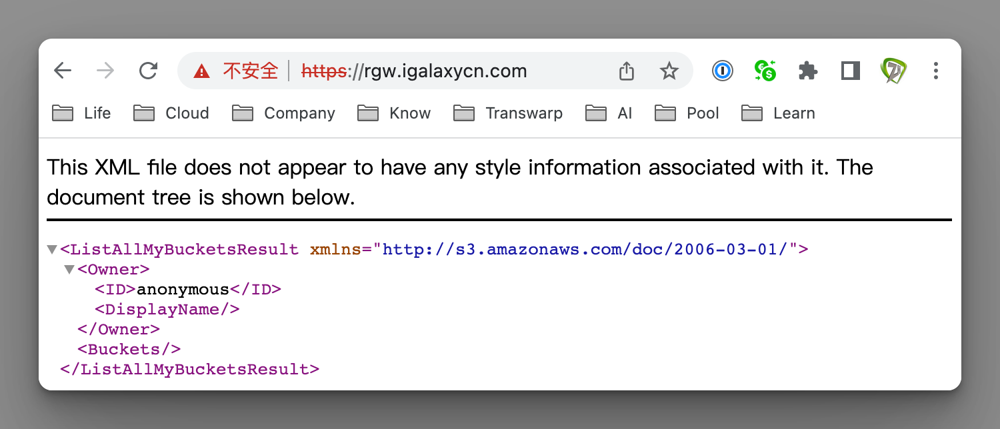
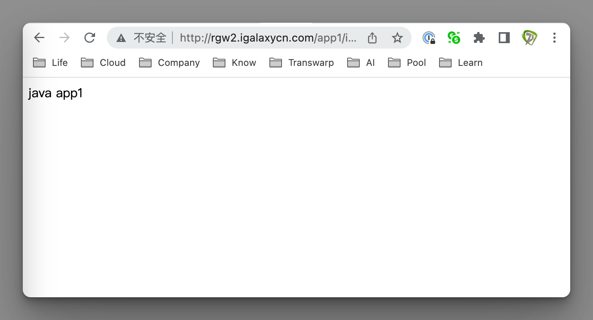
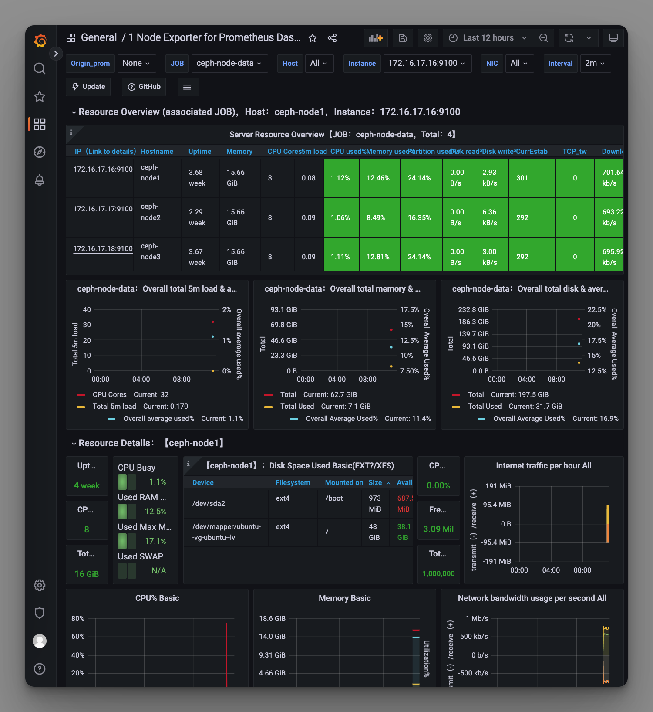

# 极客时间运维进阶训练营第十一周作业


## 作业要求

1. 掌握对象存储的特点及使用场景
2. 在两台主机部署radowsgw存储网关以实现高可用环境
3. 基于s3cmd实现bucket的管理及数据的上传和下载
4. 基于Nginx+RGW的动静分离及短视频案例
5. 启用ceph dashboard并基于prometheus监控ceph集群运行状态

扩展：

1. 自定义ceph crush运行图实现基于HDD和SSD磁盘实现数据冷热数据分类存储


## 1. 掌握对象存储的特点及使用场景

### 1.1 存储特点

数据不需要放置在目录层次结构中，而是存在于平面地址空间内的同一级别

应用通过唯一地址来识别每个单独的数据对象

通过对象存储网关将数据存储为对象，每个对象除了包含数据，还包含数据自身的元数据。

通过RESTful API在应用级别（而非用户级别）进行访问

对象的存储不是垂直的目录树结构，而是存储在扁平的命名空间中

无论是bucket还是容器，都不能再嵌套（在bucket不能再包含 bucket）

bucket需要被授权才能访问到，一个帐户可以对多个bucket授权，而权限可以不同，有读、写、读写、全部控制权限

### 使用场景


对象存储只能通过Object ID来检索，无法通过普通文件系统的挂载方式来直接访问，只能通过 API 来访问，更多适用于开发场景

适用于横向扩展、快速检索数据

不支持客户端挂载，且需要客户端在访问的时候指定文件名称

不是很适用于文件过于频繁修改及删除的场景


## 2. 在两台主机部署radosGW存储网关以实现高可用环境

### 2.1 节点

```bash
# mgr1
172.16.17.14

# mgr2
172.16.17.15

# ubuntu-client
172.16.17.1
```

### 安装radosgw

```bash
# ceph-mgr1节点
apt install radosgw

# ceph-mgr2节点
apt install radosgw

# ceph-deploy节点
# 将mgr1和mgr2均初始化radosGW服务
su - cephadmin
cd ceph-cluster/
ceph-deploy rgw create ceph-mgr2
ceph-deploy rgw create ceph-mgr1

# 浏览器访问mgr1和mgr2验证
172.16.17.14:7480
172.16.17.15:7480

# 验证radosgw服务状态
ceph -s

# ceph-mgr1节点
# ceph-mgr2节点
# 验证radosgw服务进程
ps -ef|grep radosgw

# ceph-deploy节点
# 查看radosgw存储池类型
ceph osd pool ls

# 查看radosgw存储池信息
radosgw-admin zone get --rgw-zone=default --rgw-zonegroup=default

# 查看副本池规则
ceph osd pool get default.rgw.log crush_rule

# 默认副本数
ceph osd pool get default.rgw.log size

# 默认的pgp数量
ceph osd pool get default.rgw.log pgp_num

# 默认的pg数量
ceph osd pool get default.rgw.log pg_num
```


### 修改默认的radosgw端口

```bash
# ceph-deploy节点
su - cephadmin
cd ceph-cluster/
vim ceph.conf

[client.rgw.ceph-mgr1]
rgw_host = ceph-mgr1
rgw_frontends = civetweb port=9900

[client.rgw.ceph-mgr2]
rgw_host = ceph-mgr2
rgw_frontends = civetweb port=9900

# 覆盖etc下面的ceph.conf
sudo cp ceph.conf /etc/ceph/ceph.conf

# 推送
ceph-deploy --overwrite-conf config push ceph-mgr{1,2}
ceph-deploy --overwrite-conf config push ceph-mon{1..3}
ceph-deploy --overwrite-conf config push ceph-node{1..4}

# 各mgr节点
systemctl restart ceph-radosgw@rgw.ceph-mgr1
systemctl restart ceph-radosgw@rgw.ceph-mgr2

# 检查端口侦听
lsof -i:9900

# 浏览器访问mgr2验证
172.16.17.15:9900
```


### 2.4 高可用配置

```bash
# ubuntu-client节点
# 安装配置vip
apt install keepalived

# 复制并修改配置文件
cp /usr/share/doc/keepalived/samples/keepalived.conf.vrrp /etc/keepalived/keepalived.conf

# 删除其它内容只保留如下内容
# 设备名须与当前系统中的物理网卡名称保持一致
# 创建VIP虚拟地址172.16.17.254，绑定到子接口0上
vim /etc/keepalived/keepalived.conf

vrrp_instance VI_1 {
    state MASTER
    interface ens160
    garp_master_delay 10
    virtual_router_id 51
    priority 100
    advert_int 1
    authentication {
        auth_type PASS
        auth_pass 1111
    }
    virtual_ipaddress {
        172.16.17.254 dev ens160 label ens160:0
    }
}

# 启动服务
systemctl restart keepalived

# 查看子接口
ifconfig

# 测试虚拟地址
ping 172.16.17.254


# ubuntu-client节点
# 安装haproxy
apt install haproxy

# 修改配置文件
vim /etc/haproxy/haproxy.cfg

# 配置反向代理
# 监听在vip地址的80端口
listen ceph-rgw-80
  bind 172.16.17.254:80
  mode tcp
  server 172.16.17.14 172.16.17.14:9900 check inter 3s fall 3 rise 5
  server 172.16.17.15 172.16.17.15:9900 check inter 3s fall 3 rise 5

# 检查配置文件是否正确
haproxy -f /etc/haproxy/haproxy.cfg

# 重启服务
systemctl restart haproxy

# 检查是否监听在80端口
ss -tnl

# 浏览器测试反向代理
http://172.16.17.254
```

### 2.5 配置radosgw https

```bash
# mgr2节点
# 生成自签名证书civetweb.key
cd /etc/ceph/
mkdir certs
cd certs/
openssl genrsa -out civetweb.key 2048

# 签发证书civetweb.crt
openssl req -new -x509 -key civetweb.key -out civetweb.crt -subj "/CN=rgw.igalaxycn.com"

# 把公钥和私钥合并到pem文件
cat civetweb.key civetweb.crt > civetweb.pem

# 修改为ssl配置
vim /etc/ceph/ceph.conf

# http端口为9900
# https端口为9443
[client.rgw.ceph-mgr1]
rgw_host = ceph-mgr1
rgw_frontends = "civetweb port=9900+9443s ssl_certificate=/etc/ceph/certs/civetweb.pem error_log_file=/var/log/radosgw/civetweb.acccess.log request_timeout_ms=3000 num_threads=200"

[client.rgw.ceph-mgr2]
rgw_host = ceph-mgr2
rgw_frontends = "civetweb port=9900+9443s ssl_certificate=/etc/ceph/certs/civetweb.pem error_log_file=/var/log/radosgw/civetweb.acccess.log request_timeout_ms=3000 num_threads=200"

# 创建日志目录
mkdir /var/log/radosgw

# 查看进程是哪个程序在启动
ps -ef|grep rgw
# 输出
ceph      108340       1  0 18:15 ?        00:00:09 /usr/bin/radosgw -f --cluster ceph --name clientrgw.ceph-mgr2 --setuser ceph --setgroup ceph

# 修改权限给上面的ceph账户
chown ceph.ceph /var/log/radosgw -R

# 重启服务
systemctl restart ceph-radosgw@rgw.ceph-mgr2.service

# 验证https端口
ss -tnl
lsof -i:9443
# 输出
radosgw 109182 ceph   72u  IPv4 3837810      0t0  TCP *:9443 (LISTEN)

# 访问测试
curl -k https://172.16.17.15:9443

# 验证日志
tail /var/log/radosgw/civetweb.access.log


# ceph-mgr1节点
mkdir -p /etc/ceph/certs
cd /etc/ceph/certs

# 拷贝mgr2的证书
scp 172.16.17.15:/etc/ceph/certs/* .

# 修改为ssl配置
vim /etc/ceph/ceph.conf

# http端口为9900
# https端口为9443
[client.rgw.ceph-mgr1]
rgw_host = ceph-mgr1
rgw_frontends = "civetweb port=9900+9443s ssl_certificate=/etc/ceph/certs/civetweb.pem error_log_file=/var/log/radosgw/civetweb.acccess.log request_timeout_ms=3000 num_threads=200"

[client.rgw.ceph-mgr2]
rgw_host = ceph-mgr2
rgw_frontends = "civetweb port=9900+9443s ssl_certificate=/etc/ceph/certs/civetweb.pem error_log_file=/var/log/radosgw/civetweb.acccess.log request_timeout_ms=3000 num_threads=200"

# 重启服务
systemctl restart ceph-radosgw@rgw.ceph-mgr1.service

# 验证https端口
ss -tnl
lsof -i:9443
# 输出
radosgw 108540 ceph   72u  IPv4 3700743      0t0  TCP *:9443 (LISTEN)

# ubuntu-client节点
# 修改配置文件
vim /etc/haproxy/haproxy.cfg

# 监听在vip地址的80端口
listen ceph-rgw-80
  bind 172.16.17.254:80
  mode tcp
  server rgw1 172.16.17.14:9900 check inter 3s fall 3 rise 5
  server rgw2 172.16.17.15:9900 check inter 3s fall 3 rise 5

# 监听在vip地址的443端口
listen ceph-rgw-443
  bind 172.16.17.254:443
  mode tcp
  server rgw1 172.16.17.14:9443 check inter 3s fall 3 rise 5
  server rgw2 172.16.17.15:9443 check inter 3s fall 3 rise 5

# 检查配置文件
haproxy -f /etc/haproxy/haproxy.cfg

# 重启服务
systemctl restart haproxy

# 设置dns域名指向
172.16.17.254 rgw.igalaxycn.com

# 浏览主页测试
# 点击浏览器查看证书
https://rgw.igalaxycn.com
```




## 3. 基于s3cmd实现bucket的管理及数据的上传和下载

### 修改rgw配置

```bash
# mgr1和mgr2节点
# 修改ceph.conf，去掉上面的pem配置，加上客户端配置
vim /etc/ceph/ceph.conf

[client.rgw.ceph-mgr1]
rgw_host = ceph-mgr1
rgw_frontends = civetweb port=9900
rgw_dns_name = rgw.igalaxycn.com

[client.rgw.ceph-mgr2]
rgw_host = ceph-mgr2
rgw_frontends = civetweb port=9900
rgw_dns_name = rgw.igalaxycn.com

# mgr1节点重启服务
systemctl restart ceph-radosgw@rgw.ceph-mgr1.service

# mgr2节点重启服务
systemctl restart ceph-radosgw@rgw.ceph-mgr2.service
```

### 3.2 创建rgw账户

```bash
# ceph-deploy节点
# 创建user1
radosgw-admin user create --uid=”user1” --display-name="user1"

# 保存key
"access_key": "WANZ4YHJZUSI4DEQVID8"
"secret_key": "vi7ar6ZWeJDw1ZnBqNxowWMs7eyRLfU5Xt5KWlOg"
```

### 安装s3cmd客户端

```bash
# ceph-deploy节点
apt-cache madison s3cmd
apt install s3cmd
s3cmd --help

# 访问vip地址测试
telnet rgw.igalaxycn.com 80
```

### 配置命令执行环境

```bash
sudo su - root
s3cmd --help
s3cmd --configure

# 输入上面记录的access key和secret key
# S3 Endpoint为负载均衡的vip地址rgw.igalaxycn.com
# bucket格式为rgw.igalaxycn.com/%(bucket)
# 密码处为空
# https为No

# 验证认证文件
cat /root/.s3cfg
```

### 3.5 管理bucket

```bash
# 创建bucket
s3cmd mb s3://mybucket
s3cmd mb s3://images

# 查看bucket
s3cmd ls

# 上传图片
wget https://img1.jcloudcs.com/portal/brand/2021/fl1-2.jpg
s3cmd put fl1-2.jpg s3://images/
s3cmd put fl1-2.jpg s3://images/jpg/

# 查看bucket内的资源
s3cmd ls s3://images/

# 下载资源
s3cmd get s3://images/fl1-2.jpg /opt/

# 删除资源再删除bucket
s3cmd rm s3://images/fl1-2.jpg
s3cmd rm -r s3://images/jpg
s3cmd rb s3://images/

# 查看权限
s3cmd info s3://images/
```


### 3.6 设置匿名用户访问权限

```bash
# 匿名用户浏览器访问测试
# 通过vip地址或直接访问mgr节点
http://rgw.igalaxycn.com/images/fl1-2.jpg
http://172.16.17.14:9900/images/fl1-2.jpg
# 输出无权限
<Error>
<Code>AccessDenied</Code>
<BucketName>images</BucketName>
<RequestId>tx0000099a106e94f17e51f-0063d1a4b1-1e6c2-default</RequestId>
<HostId>1e6c2-default-default</HostId>
</Error>

# 编写policy文件
# 版本2012-10-17不能修改，是AWS指定
# 对images bucket下所有文件赋予匿名用户只读权限
vim images-single_policy

{
  "Version": "2012-10-17",
  "Statement": [{
    "Effect": "Allow",
    "Principal": "*",
    "Action": "s3:GetObject",
    "Resource": [
      "arn:aws:s3:::images/*"
    ]
  }]
}

# 赋权
s3cmd setpolicy images-single_policy s3://images

# 再刷新测试访问
http://rgw.igalaxycn.com/images/fl1-2.jpg
http://172.16.17.14:9900/images/fl1-2.jpg
```


## 4. 基于Nginx+RGW的动静分离及短视频案例

### 节点

```bash
# mgr1
172.16.17.14

# mgr2
172.16.17.15

# ubuntu节点
172.16.17.2

# centos节点
172.16.17.252
```

### 4.2 创建bucket并赋予权限

```bash
# 创建bucket
s3cmd mb s3://videos

# 上传文件
s3cmd put netease2022.mp4 s3://videos

# 查看bucket
s3cmd ls s3://videos

# 编写policy文件
# 赋予匿名用户只读权限
vim videos-single_policy

{
  "Version": "2012-10-17",
  "Statement": [{
    "Effect": "Allow",
    "Principal": "*",
    "Action": "s3:GetObject",
    "Resource": [
      "arn:aws:s3:::videos/*"
    ]
  }]
}

# 赋权
s3cmd setpolicy videos-single_policy s3://videos

# 匿名用户浏览器测试
http://rgw.igalaxycn.com/videos/netease2022.mp4
```


### 安装nginx

```bash
# ubuntu节点
# 安装必备软件
apt install iproute2  ntpdate  tcpdump telnet traceroute nfs-kernel-server nfs-common  lrzsz tree  openssl libssl-dev libpcre3 libpcre3-dev zlib1g-dev ntpdate tcpdump telnet traceroute  gcc openssh-server lrzsz tree  openssl libssl-dev libpcre3 libpcre3-dev zlib1g-dev ntpdate tcpdump telnet traceroute iotop unzip zip

# 下载nginx
cd /usr/local/src/
scp 172.16.8.93:/data/common/nginx-1.22.1.tar.gz .

# 编译
tar xvf nginx-1.22.1.tar.gz
cd nginx-1.22.1/

./configure --prefix=/apps/nginx \
--user=nginx  \
--group=nginx \
--with-http_ssl_module \
--with-http_v2_module \
--with-http_realip_module \
--with-http_stub_status_module  \
--with-http_gzip_static_module \
--with-pcre \
--with-stream \
--with-stream_ssl_module \
--with-stream_realip_module

make && make install

# 修改nginx配置
cd /apps/nginx/conf
vim nginx.conf

# 为方便直接使用root用户
user root;
worker_processes 1;

server{
  listen 80;
  server_name rgw2.igalaxycn.com;
  # 透传客户端请求的host
  #proxy_buffering off;
  #proxy_set_header Host $host;
  #proxy_set_header X-Forwarded-For $remote_addr;
  #charset koi8-r;
  #access_log logs/host. Access. Log main;
  location / {
    root html;
    index index.html index.htm;
  }
  
  # 匹配后缀转发到定义的后端服务器处理
  location ~* \.(mp4|avi)$ {
    proxy_pass http://172.16.17.14:9900;
  }

# 检查配置文件
/apps/nginx/sbin/nginx -t

# 运行nginx
/apps/nginx/sbin/nginx

# ceph-deploy节点测试
curl http://rgw2.igalaxycn.com/videos/netease2022.mp4

# 浏览器访问测试
http://rgw2.igalaxycn.com/videos/netease2022.mp4

# 查看nginx访问日志
tail -f /apps/nginx/logs/*.log
```


### 部署java服务

```bash
# centos节点
# 安装tomcat
yum install tomcat

# 启动tomcat
systemctl restart tomcat
ss -tnl
# 检查是否侦听在8080端口

# 创建应用
cd /usr/share/tomcat/webapps
mkdir app1
cd app1
vim index.jsp

java app1

# 重启tomcat
systemctl restart tomcat

# 访问测试
http://172.16.17.252:8080/app1

# ubuntu节点
# 修改nginx配置追加服务器组指向
cd /apps/nginx/conf
vim nginx.conf

# 定义服务器组
upstream tomcat {
  server 172.16.17.252:8080;
}

server{
  listen 80;
  server_name rgw2.igalaxycn.com;
  # 透传客户端请求的host
  #proxy_buffering off;
  proxy_set_header Host $host;
  #proxy_set_header X-Forwarded-For $remote_addr;
  #charset koi8-r;
  #access_log logs/host. Access. Log main;
  location / {
    root html;
    index index.html index.htm;
  }
  
  # 匹配后缀转发到定义的后端服务器处理
  location ~* \.(mp4|avi)$ {
    proxy_pass http://172.16.17.14:9900;
  }
  
  # 匹配tomcat
  location /app1 {
    proxy_pass http://tomcat;
  }

# 检查配置文件
/apps/nginx/sbin/nginx -t

# 运行nginx
/apps/nginx/sbin/nginx -s reload

# 浏览器访问测试
http://rgw2.igalaxycn.com/app1/index.jsp
```




## 5. 启用ceph dashboard并基于prometheus监控ceph集群运行状态

### 5.1 节点

```bash
# mgr1
172.16.17.14

# mgr2
172.16.17.15

# ubuntu-client
172.16.17.1

# centos节点
172.16.17.252

# node节点
172.16.17.16
172.16.17.17
172.16.17.18
172.16.17.19
```

### 安装dashboard

```bash
# ceph-mgr1节点
# 安装dashboard
apt-cache madison ceph-mgr-dashboard
apt install ceph-mgr-dashboard

# ceph-deploy节点
# 查询模块
ceph mgr module ls

# 启用dashboard
ceph mgr module enable dashboard

# 关闭SSL
ceph config set mgr mgr/dashboard/ssl false

# 指定dashboard监听在ceph-mgr1节点
ceph config set mgr mgr/dashboard/ceph-mgr1/server_addr 172.16.17.14

# 指定dashboard监听的端口
ceph config set mgr mgr/dashboard/ceph-mgr1/server_port 9009

# 验证集群状态
ceph -s
# 确保ceph状态为HEALTH_OK

# ceph-mgr1节点
# 重启mgr服务
systemctl restart ceph-mgr@ceph-mgr1.service

# 需等待一会验证端口
ss -tnl
lsof -i:9009

# ceph-deploy节点
# 创建账户
touch pass.txt
echo "123456" > pass.txt
ceph dashboard set-login-credentials jerry -i pass.txt

# 访问dashboard
http://172.16.17.14:9009
输入上面创建的用户jerry/123456
```

登录画面


主界面


主机信息


### 5.3 部署prometheus

```bash
# ceph-mgr1节点
cd /usr/local/src
scp 172.16.8.93:/data/common/prometheus-server-2.40.5-onekey-install.tar.gz .
tar xvf prometheus-server-2.40.5-onekey-install.tar.gz

# 安装
bash prometheus-install.sh
systemctl status prometheus

# 访问prometheus
http://172.16.17.14:9090
```


### 部署node_exporter

```bash
# 各node节点安装
cd /usr/local/src
scp 172.16.8.93:/data/common/node-exporter-1.5.0-onekey-install.tar.gz .
tar xvf node-exporter-1.5.0-onekey-install.tar.gz

# 启动服务
bash node-exporter-1.5.0-onekey-install.sh 
systemctl status node-exporter

# 验证
http://172.16.17.16:9100
http://172.16.17.17:9100
http://172.16.17.18:9100
http://172.16.17.19:9100

# 其它节点类似步骤
```


### 配置prometheus server数据

```bash
# ceph-deploy节点
# 启用prometheus监控模块
ceph mgr module enable prometheus

# ceph-mgr各节点
ss -tnl
# 检查9283端口

# ubuntu-client节点
# 配置监控mgr高可用
vim /etc/haproxy/haproxy.cfg

# 配置反向代理
# 添加prometheus监听在vip地址的9283端口
listen ceph-prometheus-9283
  bind 172.16.17.254:9283
  mode tcp
  server rgw1 172.16.17.14:9283 check inter 3s fall 3 rise 5
  server rgw2 172.16.17.15:9283 check inter 3s fall 3 rise 5

# 检查配置文件是否正确
haproxy -f /etc/haproxy/haproxy.cfg

# 重启服务
systemctl restart haproxy


# ceph-mgr1节点
# 配置监控各node节点
cd /apps/prometheus
vim prometheus.yml

- job_name: 'ceph-node-data'
  static_configs:
    - targets: ['172.16.17.16:9100','172.16.17.17:9100','172.16.17.18:9100','172.16.17.19:9100']
     
- job_name: 'ceph-cluster-data'
  static_configs:
    - targets: ['172.16.17.254:9283']
    
# 重启服务
systemctl restart prometheus

# 访问prometheus
http://172.16.17.14:9090
进入targets，可查看被监测节点
```


### 5.6 安装grafana

```bash
# ceph-mgr1节点
# 安装grafana
cd /usr/local/src
scp 172.16.8.93:/data/common/grafana-enterprise_9.3.1_amd64.deb .
dpkg -i grafana-enterprise_9.3.1_amd64.deb 

# 启动服务
systemctl restart grafana-server
systemctl status grafana-server

# 登录grafana
http://172.16.17.14:3000
登录账户admin/admin，需修改默认密码

# 添加prometheus数据源
点击左下角Configuration-->data sources-->add datasource-->prometheus，选择添加prometheus数据源，名称为prometheus，URL为http://172.16.17.14:9090，点击Save&test

# 导入模板
在grafana中，选择Dashboards-->import，输入以下模板id，选择上面定义的数据源prometheus，点击import可在线导入以下模板

# ceph osd
https://grafana.com/grafana/dashboards/5336-ceph-osd-single/

# ceph pools
https://grafana.com/grafana/dashboards/5342-ceph-pools/

# ceph cluster
https://grafana.com/grafana/dashboards/2842-ceph-cluster/

# ceph node
https://grafana.com/grafana/dashboards/11074-node-exporter-for-prometheus-dashboard-en-v20201010/
```

ceph osd


ceph pools


ceph cluster


ceph node




## 扩展1. 自定义ceph crush运行图实现基于HDD和SSD磁盘实现数据冷热数据分类存储

### 6.1 虚机添加nvme硬盘

```bash
# 各node节点
编辑虚机设置，选择添加新设备-->NVme控制器，虚机配置中出现新建NVMe控制器
选择添加新设备-->硬盘，修改硬盘容量为1.5T，磁盘置备为精简置备，虚拟设备节点为新建NVMe控制器-NVME(0:0)新硬盘

# 进入虚机
lsblk
# 可看到增加了nvme01 disk，容量为1.5T
```

### 6.2 擦除nvme硬盘

```bash
# ceph-deploy节点
# 列出磁盘
ceph-deploy disk list ceph-node1
ceph-deploy disk list ceph-node2
ceph-deploy disk list ceph-node3
ceph-deploy disk list ceph-node4

# 擦除磁盘
ceph-deploy disk zap ceph-node1 /dev/nvme0n1
ceph-deploy disk zap ceph-node2 /dev/nvme0n1
ceph-deploy disk zap ceph-node3 /dev/nvme0n1
ceph-deploy disk zap ceph-node4 /dev/nvme0n1
```

### 6.3 各节点添加固态盘

```bash
# ceph-deploy节点
# 添加固态盘，并替换掉配置文件
ceph-deploy --overwrite-conf osd create ceph-node1 --data /dev/nvme0n1
ceph-deploy --overwrite-conf osd create ceph-node2 --data /dev/nvme0n1
ceph-deploy --overwrite-conf osd create ceph-node3 --data /dev/nvme0n1
ceph-deploy --overwrite-conf osd create ceph-node4 --data /dev/nvme0n1

# 查看磁盘
ceph osd tree
# osd16、17、18、19为ssd盘
```


### 6.4 导出crush运行图

```bash
# ceph-deploy节点
# 导出cursh运行图
mkdir data
cd data
ceph osd getcrushmap -o ./crushmap-v1

# 安装crushtool
sudo apt install ceph-base

# 将运行图转换为文本
crushtool -d crushmap-v1 > crushmap-v1.txt
```

### 6.5 修改crush配置

```bash
# 修改crush配置
vim crushmap-v1.txt

# begin crush map
tunable choose_local_tries 0
tunable choose_local_fallback_tries 0
tunable choose_total_tries 50
tunable chooseleaf_descend_once 1
tunable chooseleaf_vary_r 1
tunable chooseleaf_stable 1
tunable straw_calc_version 1
tunable allowed_bucket_algs 54

# devices
device 0 osd.0 class hdd
device 1 osd.1 class hdd
device 2 osd.2 class hdd
device 3 osd.3 class hdd
device 4 osd.4 class hdd
device 5 osd.5 class hdd
device 6 osd.6 class hdd
device 7 osd.7 class hdd
device 8 osd.8 class hdd
device 9 osd.9 class hdd
device 10 osd.10 class hdd
device 11 osd.11 class hdd
device 12 osd.12 class hdd
device 13 osd.13 class hdd
device 14 osd.14 class hdd
device 15 osd.15 class hdd
device 16 osd.16 class ssd
device 17 osd.17 class ssd
device 18 osd.18 class ssd
device 19 osd.19 class ssd

# types
type 0 osd
type 1 host
type 2 chassis
type 3 rack
type 4 row
type 5 pdu
type 6 pod
type 7 room
type 8 datacenter
type 9 zone
type 10 region
type 11 root

# buckets
host ceph-node1 {
        id -3           # do not change unnecessarily
        id -4 class hdd         # do not change unnecessarily
        id -11 class ssd                # do not change unnecessarily
        # weight 9.500
        alg straw2
        hash 0  # rjenkins1
        item osd.0 weight 2.000
        item osd.1 weight 2.000
        item osd.2 weight 2.000
        item osd.3 weight 2.000
        item osd.16 weight 1.500
}
host ceph-node2 {
        id -5           # do not change unnecessarily
        id -6 class hdd         # do not change unnecessarily
        id -12 class ssd                # do not change unnecessarily
        # weight 9.500
        alg straw2
        hash 0  # rjenkins1
        item osd.4 weight 2.000
        item osd.5 weight 2.000
        item osd.6 weight 2.000
        item osd.7 weight 2.000
        item osd.17 weight 1.500
}
host ceph-node3 {
        id -7           # do not change unnecessarily
        id -8 class hdd         # do not change unnecessarily
        id -13 class ssd                # do not change unnecessarily
        # weight 9.500
        alg straw2
        hash 0  # rjenkins1
        item osd.8 weight 2.000
        item osd.9 weight 2.000
        item osd.10 weight 2.000
        item osd.11 weight 2.000
        item osd.18 weight 1.500
}
host ceph-node4 {
        id -9           # do not change unnecessarily
        id -10 class hdd                # do not change unnecessarily
        id -14 class ssd                # do not change unnecessarily
        # weight 9.500
        alg straw2
        hash 0  # rjenkins1
        item osd.12 weight 2.000
        item osd.13 weight 2.000
        item osd.14 weight 2.000
        item osd.15 weight 2.000
        item osd.19 weight 1.500
}
root default {
        id -1           # do not change unnecessarily
        id -2 class hdd         # do not change unnecessarily
        id -15 class ssd                # do not change unnecessarily
        # weight 38.000
        alg straw2
        hash 0  # rjenkins1
        item ceph-node1 weight 9.500
        item ceph-node2 weight 9.500
        item ceph-node3 weight 9.500
        item ceph-node4 weight 9.500
}

#my hdd node
host ceph-hddnode1 {
        id -103           # do not change unnecessarily
        id -104 class hdd         # do not change unnecessarily
        id -105 class ssd                # do not change unnecessarily
        # weight 16.465
        alg straw2
        hash 0  # rjenkins1
        item osd.0 weight 2.000
        item osd.1 weight 2.000
        item osd.2 weight 2.000
        item osd.3 weight 2.000
}

host ceph-hddnode2 {
        id -106           # do not change unnecessarily
        id -107 class hdd         # do not change unnecessarily
        id -108 class ssd                # do not change unnecessarily
        # weight 16.465
        alg straw2
        hash 0  # rjenkins1
        item osd.4 weight 2.000
        item osd.5 weight 2.000
        item osd.6 weight 2.000
        item osd.7 weight 2.000
}

host ceph-hddnode3 {
        id -109           # do not change unnecessarily
        id -110 class hdd         # do not change unnecessarily
        id -111 class ssd                # do not change unnecessarily
        # weight 16.465
        alg straw2
        hash 0  # rjenkins1
        item osd.8 weight 2.000
        item osd.9 weight 2.000
        item osd.10 weight 2.000
        item osd.11 weight 2.000
}

host ceph-hddnode4 {
        id -112           # do not change unnecessarily
        id -113 class hdd                # do not change unnecessarily
        id -114 class ssd                # do not change unnecessarily
        # weight 15.965
        alg straw2
        hash 0  # rjenkins1
        item osd.12 weight 2.000
        item osd.13 weight 2.000
        item osd.14 weight 2.000
        item osd.15 weight 2.000
}

#my ssd node
host ceph-ssdnode1 {
        id -201           # do not change unnecessarily
        id -202 class hdd         # do not change unnecessarily
        id -203 class ssd                # do not change unnecessarily
        # weight 16.465
        alg straw2
        hash 0  # rjenkins1
        item osd.16 weight 1.500
}

host ceph-ssdnode2 {
        id -204           # do not change unnecessarily
        id -205 class hdd         # do not change unnecessarily
        id -206 class ssd                # do not change unnecessarily
        # weight 16.465
        alg straw2
        hash 0  # rjenkins1
        item osd.17 weight 1.500
}

host ceph-ssdnode3 {
        id -207           # do not change unnecessarily
        id -208 class hdd         # do not change unnecessarily
        id -209 class ssd                # do not change unnecessarily
        # weight 16.465
        alg straw2
        hash 0  # rjenkins1
        item osd.18 weight 1.500
}

host ceph-ssdnode4 {
        id -210           # do not change unnecessarily
        id -211 class hdd         # do not change unnecessarily
        id -212 class ssd                # do not change unnecessarily
        # weight 16.465
        alg straw2
        hash 0  # rjenkins1
        item osd.19 weight 1.500
}

#my hdd bucket
root hdd {
        id -213           # do not change unnecessarily
        id -214 class hdd         # do not change unnecessarily
        id -215 class ssd                # do not change unnecessarily
        # weight 65.360
        alg straw2
        hash 0  # rjenkins1
        item ceph-hddnode1 weight 9.500
        item ceph-hddnode2 weight 9.500
        item ceph-hddnode3 weight 9.500
        item ceph-hddnode4 weight 9.500
}

#my ssd bucket
root ssd {
        id -216           # do not change unnecessarily
        id -217 class hdd         # do not change unnecessarily
        id -218 class ssd                # do not change unnecessarily
        # weight 65.360
        alg straw2
        hash 0  # rjenkins1
        item ceph-ssdnode1 weight 9.500
        item ceph-ssdnode2 weight 9.500
        item ceph-ssdnode3 weight 9.500
        item ceph-ssdnode4 weight 9.500
}

#my hdd rules
rule my_hdd_rule {
        id 88
        type replicated
        min_size 1
        max_size 10
        step take hdd
        step chooseleaf firstn 0 type host
        step emit
}

#my ssd rules
rule my_ssd_rule {
        id 89
        type replicated
        min_size 1
        max_size 10
        step take ssd
        step chooseleaf firstn 0 type host
        step emit
}

# rules
rule replicated_rule {
        id 0
        type replicated
        min_size 1
        max_size 10
        step take default
        step chooseleaf firstn 0 type host
        step emit
}

# end crush map

# 转换为crush二进制格式
crushtool -c crushmap-v1.txt -o crushmap-v2

# 检验规则
crushtool -d crushmap-v2

# 导入运行图
ceph osd setcrushmap -i crushmap-v2

# 验证运行图
ceph osd crush rule dump
# 检查是否已有ssd rule和hdd rule
```


### 6.6 创建不同类别的存储池

```bash
# ceph-deploy节点
# 指定rule为ssd，保存热数据
ceph osd pool create my-ssdpool 32 32 my_ssd_rule

# 指定rule为hdd，保存冷数据
ceph osd pool create my-hddpool 32 32 my_hdd_rule

# 不指定rule
# 采用default规则
ceph osd pool create my-pool 32 32

# 上传文件测试
sudo rados put msg1 /var/log/syslog --pool=my-ssdpool
rados ls --pool=my-ssdpool
```

### 6.7 验证状态

#### 检查ssd存储池的保存情况

```bash
# 检查ssd存储池的保存情况
# 只有ssd硬盘
ceph pg ls-by-pool my-ssdpool | awk '{print $1,$2,$15}'
```


#### 检查hdd存储池的保存情况

```bash
# 检查hdd存储池的保存情况
# 只有hdd硬盘
ceph pg ls-by-pool my-hddpool | awk '{print $1,$2,$15}'
```


#### 检查混合存储池的保存情况

```bash
# 检查default规则的存储池
# hdd和ssd混合硬盘
ceph pg ls-by-pool my-pool | awk '{print $1,$2,$15}'
```


### Q&A

#### 节点硬盘扩容后，如何删除osd重新创建

```bash
# 检查要删除osd的编号
ceph osd tree

# 提出osd
ceph osd out osd.16

# 标识为down
ceph osd down osd.16

# 删除
ceph osd rm osd.16

# 如果报错osd.16 is still up; must be down before removal
# osd所在ceph节点
systemctl stop ceph-osd@16

# 再进行删除
ceph osd rm osd.16

# 从运行图上删除
ceph osd crush rm osd.16

# 删除编号
ceph auth del osd.16

# 重新擦除磁盘
ceph-deploy disk zap ceph-node1 /dev/nvme0n1
# 如果报错Failed to execute command: /usr/sbin/ceph-volume lvm zap /dev/nvme0n1

# osd所在ceph节点
ceph-volume lvm zap /dev/nvme0n1 --destroy
# 如果报错Device or resource busy，说明卷被锁定

# 扫描缓存
pvscan --cache

# 检查设备编号，为259:0
ls -la /dev/nvme0n1

brw-rw---- 1 root disk 259, 0 Jan 27 14:55 /dev/nvme0n1

# 检查device mapper是否被锁定
dmsetup ls --tree
# 发现仍然被映射
ceph--a2a56dd3--b507--4a49--a2a6--d5aca918f3a4-osd--block--c9dd36de--a838--4e22--8403--69bb90e130...
 └─ (259:0)

# 找到完整的设备编号
lsblk

# 删除该设备
dmsetup remove ceph--a2a56dd3--b507--4a49--a2a6--d5aca918f3a4-osd--block--c9dd36de--a838--4e22--8403--69bb90e1304c

# 确认该卷已删除
pvs

# 再到ceph-deploy节点进行擦除
ceph-deploy disk zap ceph-node1 /dev/nvme0n1
```
