# 极客时间运维进阶训练营第十二周作业


## 作业要求

1、使用 kubeadm 部署一个分布式的 Kubernetes 集群。

2、扩展作业：使用 kubeasz 部署一个分布式的 Kubernetes 集群。

3、在集群上编排运行 demoapp，并使用 Service 完成 Pod 发现和服务发布。

4、要求以配置文件的方式，在集群上编排运行 nginx，并使用 Service 完成 Pod 发现和服务发布。

5、扩展作业：要求以配置文件的方式，在集群上编排运行 wordpress 和 mysql，并使用 Service 完成 Pod 发现和服务发布。

提示：使用变量的方式的为 wordpress 指定要使用 mysql 服务器地址、数据库名称、用户名称和用户密码。

## 1. 使用 kubeadm 部署一个分布式的 Kubernetes 集群

### 节点配置

```bash
# k8s-master01
172.16.17.21

# k8s-node01
172.16.17.24

# k8s-node02
172.16.17.25

# k8s-node03
172.16.17.26

# 环境
Ubuntu：20.04.5 LTS
Docker：20.10.8
k8s：1.26.0
节点网络：172.16.0.0/21
Pod网络：10.244.0.0/16
Service网络：10.96.0.0/12
```

### 各节点系统准备

```bash
# 设置主机名
hostnamectl set-hostname k8s-master01
hostnamectl set-hostname k8s-node01
hostnamectl set-hostname k8s-node02
hostnamectl set-hostname k8s-node03

# 时钟同步
# 安装chrony
apt install chrony -y
# 修改时区
timedatectl set-timezone Asia/Shanghai

# 各节点修改时间配置
vim /etc/chrony/chrony.conf

# pool ntp.ubuntu.com iburst
# pool 0.ubuntu.pool.ntp.org iburst
# pool 1.ubuntu.pool.ntp.org iburst
# pool 2.ubuntu.pool.ntp.org iburst
server ntp1.aliyun.com iburst

# 重启服务
systemctl restart chrony.service
systemctl status chrony.service

# 强制同步
chronyc -a makestep
chronyc sourcestats
chronyc sources -v


# 添加主机名解析
# master01同时做api入口
cat >>/etc/hosts<<EOF
> 172.16.17.21 k8s-master01.igalaxycn.com k8s-master01 kubeapi.igalaxycn.com k8sapi.igalaxycn.com kubeapi
> 172.16.17.22 k8s-master02.igalaxycn.com k8s-master02
> 172.16.17.23 k8s-master03.igalaxycn.com k8s-master03
> 172.16.17.24 k8s-node01.igalaxycn.com k8s-node01
> 172.16.17.25 k8s-node02.igalaxycn.com k8s-node02
> 172.16.17.26 k8s-node03.igalaxycn.com k8s-node03
> EOF


# 关闭swap
# 列出启用swap的设备
systemctl --type swap
# 如下针对列出的设备禁用swap
systemctl mask swap.img.swap


# 禁用防火墙
ufw disable
ufw status
```

### 各节点安装docker

```bash
# 阿里源
curl -fsSL http://mirrors.aliyun.com/docker-ce/linux/ubuntu/gpg | apt-key add -

add-apt-repository "deb [arch=amd64] http://mirrors.aliyun.com/docker-ce/linux/ubuntu $(lsb_release -cs) stable"

apt update

# 安装
apt install docker-ce -y

# kubelet要求使用CGroup驱动
vim /etc/docker/daemon.json

{
 "registry-mirrors": [
   "https://registry.docker-cn.com",
   "https://hub-mirror.c.163.com",
   "https://mirror.baidubce.com"
 ],
 "insecure-registries": ["harbor.igalaxycn.com"],
 "exec-opts": ["native.cgroupdriver=systemd"],
 "log-driver": "json-file",
 "log-opts": {
   "max-size": "200m"
 },
 "storage-driver": "overlay2"  
}

# 重启docker
systemctl daemon-reload
systemctl restart docker.service
systemctl enable docker.service

docker info
```

### 各节点安装cri-dockerd

k8s只支持CRI接口，所以须安装cri-dockerd，与docker-ce对接

```bash
# 下载包
curl -LO https://github.com/Mirantis/cri-dockerd/releases/download/v0.3.0/cri-dockerd_0.3.0.3-0.ubuntu-focal_amd64.deb

# 安装
dpkg -i ./cri-dockerd_0.3.0.3-0.ubuntu-focal_amd64.deb

# 检查服务启动情况
systemctl status cri-docker.service
```

### 各节点安装kubelet、kubeadm和kubectl

```bash
apt update && apt install -y apt-transport-https curl

# 阿里源
curl -fsSL https://mirrors.aliyun.com/kubernetes/apt/doc/apt-key.gpg | apt-key add -

# 生成阿里云仓库配置
cat <<EOF >/etc/apt/sources.list.d/kubernetes.list
deb https://mirrors.aliyun.com/kubernetes/apt/ kubernetes-xenial main
EOF

# 安装最新版kubelet kubeadm kubectl
apt update
apt install -y kubelet kubeadm kubectl
systemctl enable kubelet

# 如需安装指定版本如1.26.0
apt purge -y kubelet kubeadm kubectl
apt-get install -y kubelet=1.26.0-00 kubeadm=1.26.0-00 kubectl=1.26.0-00
systemctl enable kubelet
# 避免被更新升级
apt-mark hold kubelet kubeadm kubectl
```

### 整合cri-dockerd和kubelet

```bash
# 配置cri-dockerd
vim /usr/lib/systemd/system/cri-docker.service

[Service]
ExecStart=/usr/bin/cri-dockerd --container-runtime-endpoint fd:// --network-plugin=cni --cni-bin-dir=/opt/cni/bin --cni-cache-dir=/var/lib/cni/cache --cni-conf-dir=/etc/cni/net.d

# 重启cri-docker.service服务
systemctl daemon-reload
systemctl restart cri-docker

# 配置kubelet指定cri-dockerd
mkdir /etc/sysconfig
vim /etc/sysconfig/kubelet

KUBELET_KUBEADM_ARGS="--container-runtime=remote --container-runtime-endpoint=/run/cri-dockerd.sock"
```

### 初始化master节点

```bash
# 查看所需镜像列表
kubeadm config images list --image-repository=registry.aliyuncs.com/google_containers

# 提前下载镜像到本地
kubeadm config images pull --cri-socket unix:///run/cri-dockerd.sock --image-repository=registry.aliyuncs.com/google_containers

# 查询kubeadm版本，kubeadm init时的版本须与此版本对应
kubeadm version

# 为避免kubeadm初始化时拉取国外pause:3.6镜像
# 上述kubeadm config images pull命令拉取的是pause:3.9镜像，kubeadm init时需调用pause:3.6
docker pull registry.aliyuncs.com/google_containers/pause:3.6
docker tag registry.aliyuncs.com/google_containers/pause:3.6 registry.k8s.io/pause:3.6

# 初始化master节点
# k8s版本需与上面的kubeadm版本保持一致，如果kubeadm安装为1.26.0，则--kubernetes-version=v1.26.0
# token-ttl=0表示token永远有效
# 加上--v=6可输出详细日志
kubeadm init \
  --control-plane-endpoint="kubeapi.igalaxycn.com" \
  --kubernetes-version=v1.26.1 \
  --pod-network-cidr=10.244.0.0/16 \
  --service-cidr=10.96.0.0/12 \
  --token-ttl=0 \
  --cri-socket unix:///run/cri-dockerd.sock \
  --upload-certs \
  --image-repository=registry.aliyuncs.com/google_containers

# 输出
# Your Kubernetes control-plane has initialized successfully!

# You can now join any number of the control-plane node running the following command on each as root:
# kubeadm join kubeapi.igalaxycn.com:6443 --token 6ptrew.ho7gyv0zqwaanw3m --discovery-token-ca-cert-hash sha256:4d594ca5a2fd6f8eb19e68baff104ecb9ea5c9ac2754a5c66011fc7a11027f50 --control-plane --certificate-key a7a3900450628dfe54dfeac58fc0d340b59c0d559d29b4d47b4a7ec0d509ab1f

# Then you can join any number of worker nodes by running the following on each as root:
# kubeadm join kubeapi.igalaxycn.com:6443 --token 6ptrew.ho7gyv0zqwaanw3m --discovery-token-ca-cert-hash sha256:4d594ca5a2fd6f8eb19e68baff104ecb9ea5c9ac2754a5c66011fc7a11027f50 

# 初始化失败后如何卸载重做
kubeadm reset --cri-socket unix:///run/cri-dockerd.sock && rm -rf /etc/kubernetes/ /var/lib/kubelet /var/lib/dockershim /var/run/kubernetes /var/lib/cni /etc/cni/net.d && rm -rf /var/lib/etcd
# 删除已启动的容器
docker rm -f $(docker ps -aq)
```

### 设定kubectl

```bash
# master节点
# 复制认证文件到配置目录
mkdir -p ~/.kube
cp /etc/kubernetes/admin.conf ~/.kube/config

# 测试
kubectl get nodes
# 输出
此时节点还是NotReady，安装网络插件后才能Ready
```

### 各节点部署网络插件

```bash
# 各节点安装flannel插件
mkdir /opt/bin/

# 下载上传
https://github.com/flannel-io/flannel/releases/download/v0.20.2/flanneld-amd64 

# 移动到指定目录
mv flanneld-amd64 /opt/bin/flanneld
chmod +x /opt/bin/flanneld

# master节点部署kube-flannel
# 下载并上传
https://github.com/flannel-io/flannel/releases/download/v0.20.2/kube-flannel.yml
# 启动
kubectl apply -f kube-flannel.yml
# 输出
namespace/kube-flannel created
clusterrole.rbac.authorization.k8s.io/flannel created
clusterrolebinding.rbac.authorization.k8s.io/flannel created
serviceaccount/flannel created
configmap/kube-flannel-cfg created
daemonset.apps/kube-flannel-ds created

# 确认flannel是否启动
kubectl get pods -n kube-flannel

# 验证master节点
kubectl get nodes

# 如果flannel有问题，可查看指定的flannel pod日志
kubectl -n kube-flannel describe pod kube-flannel-ds-q7tgv
```

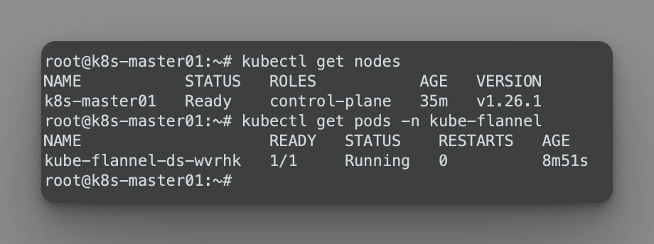

### 各节点添加到集群

```bash
# 如忘记添加命令，可通过如下命令生成
kubeadm token create --print-join-command

# 加入集群
kubeadm join kubeapi.igalaxycn.com:6443 --token ym89np.94oklfp5b2mbot28 --discovery-token-ca-cert-hash sha256:4d594ca5a2fd6f8eb19e68baff104ecb9ea5c9ac2754a5c66011fc7a11027f50 --cri-socket unix:///run/cri-dockerd.sock

# 验证节点
kubectl get nodes
kubectl get pods -n kube-system
```

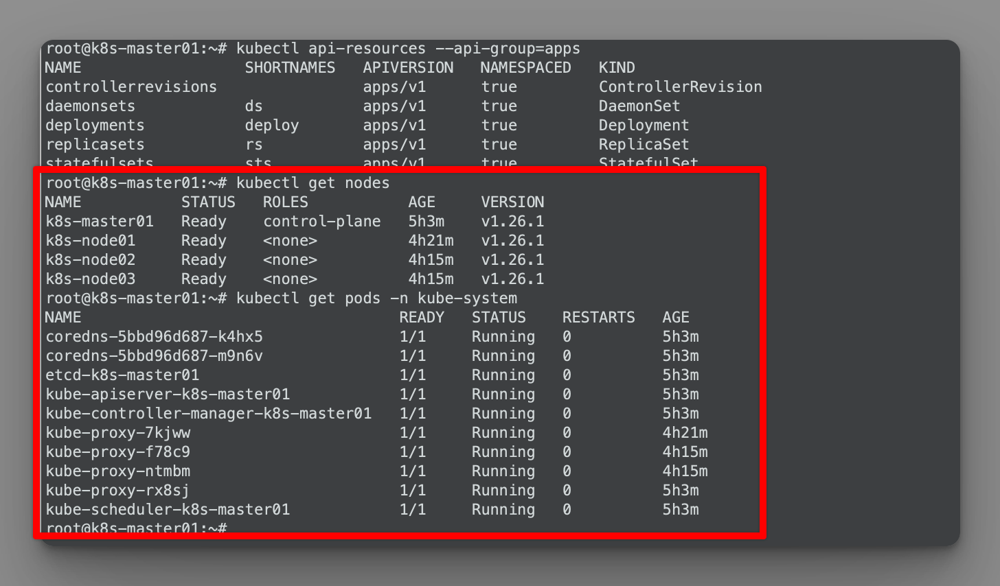

### API资源类型

```bash
# 查看有哪些api组
kubectl api-versions

# 获取apps组内包含的资源类型
kubectl api-resources --api-group=apps
```


## 2. 扩展作业：使用 kubeasz 部署一个分布式的 Kubernetes 集群

### 节点规划

```bash
# k8s-ansible
172.16.17.30

# k8s-master01
172.16.17.31

# k8s-node01
172.16.17.34

# k8s-node02
172.16.17.35

# k8s-node03
172.16.17.36
```

### 各节点环境准备

```bash
# 设置主机名
hostnamectl set-hostname k8s-ansible-1730
hostnamectl set-hostname k8s-master-1731
hostnamectl set-hostname k8s-node-1734
hostnamectl set-hostname k8s-node-1735
hostnamectl set-hostname k8s-node-1736

# 时钟同步
apt install chrony -y
timedatectl set-timezone Asia/Shanghai
vim /etc/chrony/chrony.conf

server ntp1.aliyun.com iburst

systemctl restart chrony.service
systemctl status chrony.service

chronyc -a makestep
chronyc sources -v

# 关闭swap
systemctl --type swap
systemctl mask swap.img.swap

# 禁用防火墙
ufw disable
ufw status
```

### ssh多机互信

```bash
# ansible节点
ssh-keygen -t rsa

# ssh免密登录设置，包括本机
ssh-copy-id 172.16.17.30
ssh-copy-id 172.16.17.31
ssh-copy-id 172.16.17.34
ssh-copy-id 172.16.17.35
ssh-copy-id 172.16.17.36
```

### 安装ansible

```bash
# ansible节点
# pip 21.0以后不再支持python2和python3.5
curl -O https://bootstrap.pypa.io/pip/2.7/get-pip.py
python3 get-pip.py
python3 -m pip install --upgrade "pip < 21.0"
 
# pip安装ansible
pip install ansible -i https://mirrors.aliyun.com/pypi/simple/
```

### 安装kubeasz

```bash
# 下载工具脚本ezdown，举例使用kubeasz版本3.1.1
export release=3.5.0
wget https://github.com/easzlab/kubeasz/releases/download/${release}/ezdown
chmod +x ./ezdown

# 安装docker 20.10.18，下载k8s、kubeasz等
./ezdown -D

# 下载离线系统包
./ezdown -P

# 下载harbor
./ezdown -R

# 下载额外容器镜像
./ezdown -X


# 下载完毕后
所有文件在目录/etc/kubeasz中
/etc/kubeasz/bin：运行文件
/etc/kubeasz/down：集群安装时需要的离线镜像
/etc/kubeasz/down/packages：集群安装时需要的系统基础软件

# 容器化运行kubeasz
./ezdown -S

# 创建新集群
docker exec -it kubeasz ezctl new mycluster
```

### 修改配置文件

```bash
# ansible节点
# 容器化运行kubeasz
./ezdown -S

# 创建新集群
docker exec -it kubeasz ezctl new mycluster

# 配置hosts
vim /etc/kubeasz/clusters/mycluster/hosts

[etcd]
172.16.17.31

[kube_master]
172.16.17.31

[kube_node]
172.16.17.34
172.16.17.35
172.16.17.36

[harbor]
[ex_lb]
[chrony]
[all:vars]
SECURE_PORT="6443"
CONTAINER_RUNTIME="containerd"
CLUSTER_NETWORK="calico"
PROXY_MODE="ipvs"
SERVICE_CIDR="10.96.0.0/16"
CLUSTER_CIDR="10.244.0.0/16"
NODE_PORT_RANGE="30000-32767"
CLUSTER_DNS_DOMAIN="cluster.local"
bin_dir="/opt/kube/bin"
base_dir="/etc/kubeasz"
cluster_dir="{{ base_dir }}/clusters/mycluster"
ca_dir="/etc/kubernetes/ssl"


# 修改config.yml
vim /etc/kubeasz/clusters/mycluster/config.yml

# k8s version
K8S_VER: "1.25.5"
# calico
CALICO_IPV4POOL_IPIP: "always"
IP_AUTODETECTION_METHOD: "interface=ens.*"
# containerd
CONTAINERD_STORAGE_DIR: "/var/lib/containerd"
# docker
DOCKER_STORAGE_DIR: "/var/lib/docker"
INSECURE_REG: '["http://easzlab.io.local:5000"]'
# etcd
ETCD_DATA_DIR: "/var/lib/etcd"
# Kubelet 根目录
KUBELET_ROOT_DIR: "/var/lib/kubelet"
# coredns 自动安装
dns_install: "yes"
# metric server 自动安装
metricsserver_install: "yes"
# dashboard 自动安装
dashboard_install: "yes"
ingress_install: "no"
# prometheus 自动安装
prom_install: "no"
# nfs-provisioner 自动安装
nfs_provisioner_install: "no"
```

### 一键安装

```bash
# 环境变量生效
# alias dk='docker exec -it kubeasz'
source ~/.bashrc

# 一键安装
dk ezctl setup mycluster all
```

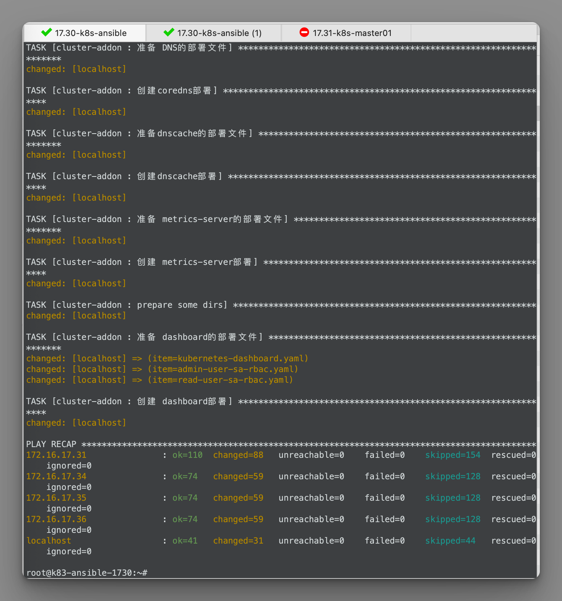

### 验证集群

```bash
/etc/kubeasz/bin/kubectl get nodes -o wide
/etc/kubeasz/bin/kubectl get cs
/etc/kubeasz/bin/kubectl cluster-info
```

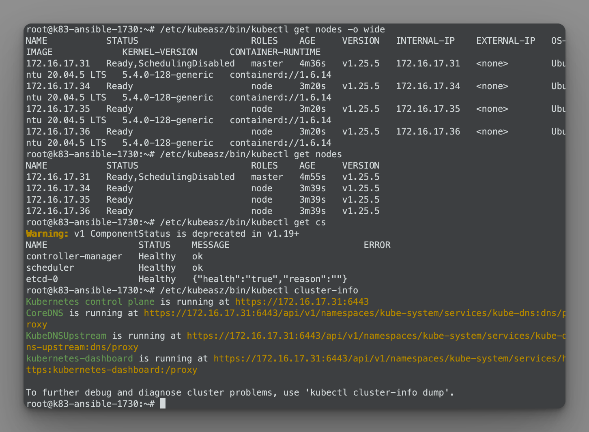

### 如何回退

```bash
# 摧毁集群
dk ezctl destroy mycluster

# 如果需要删除集群配置
rm -rf /etc/kubeasz/clusters/mycluster
```

## 3. 在集群上编排运行 demoapp，并使用 Service 完成 Pod 发现和服务发布

### 编排demoapp

```bash
# --dry-run=client只测试运行
# -o yaml输出yaml文件
kubectl create deployment demoapp --image=ikubernetes/demoapp:v1.0 --replicas=3 --dry-run=client -o yaml

# 请求apiserver以服务方式编排
kubectl create deployment demoapp --image=ikubernetes/demoapp:v1.0 --replicas=3

# 显示deployments类型下的对象情况
kubectl get deployments
```

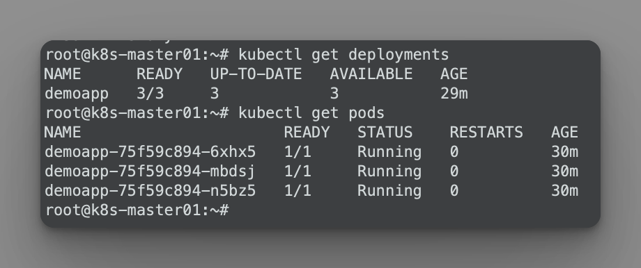

### pod删除测试

```bash
# 删除其中一个pod
kubectl delete pods demoapp-75f59c894-6xhx5

# 删除完成后pods会自动再创建一个
kubectl get pods -o wide

# curl测试该pod
curl 10.244.1.6
```

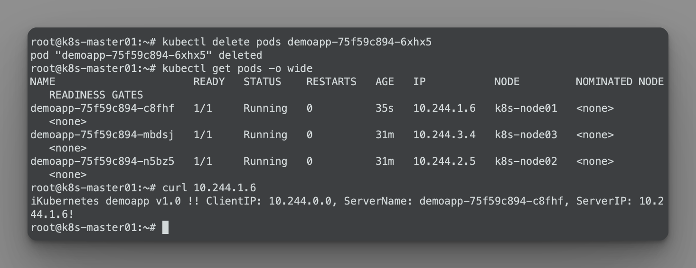

### 创建service便于外部访问

```bash
# 测试创建nodeport service便于集群外访问
# 把端口80映射到上游负载均衡器的80端口
kubectl create service nodeport demoapp --tcp=80:80 --dry-run=client -o yaml

# 查看pod资源的标签
kubectl get pods --show-labels

# 创建Service资源对象
kubectl create service nodeport demoapp --tcp=80:80

# 查看外部访问端口
kubectl get services
kubectl get services -l app=demoapp

# 查看对应自动创建的服务发现endpoint
kubectl get endpoints

# curl测试service地址
curl 10.96.217.131
```

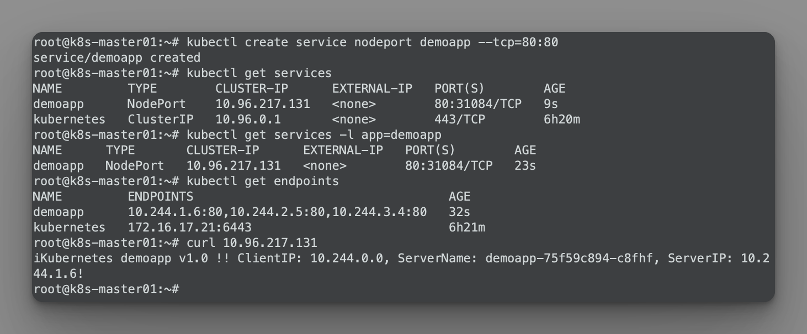


## 4. 要求以配置文件的方式，在集群上编排运行 nginx，并使用 Service 完成 Pod 发现和服务发布

### 编排nginx

```bash
# 生成yaml
kubectl create deployment nginx --image=nginx:alpine --replicas=2 --dry-run=client -o yaml

# 输出
apiVersion: apps/v1
kind: Deployment
metadata:
  creationTimestamp: null
  labels:
    app: nginx
  name: nginx
spec:
  replicas: 2
  selector:
    matchLabels:
      app: nginx
  strategy: {}
  template:
    metadata:
      creationTimestamp: null
      labels:
        app: nginx
    spec:
      containers:
      - image: nginx:alpine
        name: nginx
        resources: {}
status: {}

# 复制粘帖，修改为deployment-nginx.yaml
apiVersion: apps/v1
kind: Deployment
metadata:
  labels:
    app: nginx
  name: nginx
spec:
  replicas: 2
  selector:
    matchLabels:
      app: nginx
  template:
    metadata:
      labels:
        app: nginx
    spec:
      containers:
      - image: nginx:alpine
        name: nginx


# 创建deployment
kubectl create -f deployment-nginx.yaml
kubectl get deploy
kubectl get pods -o wide

# 访问nginx pod地址测试
curl 10.244.2.8
```

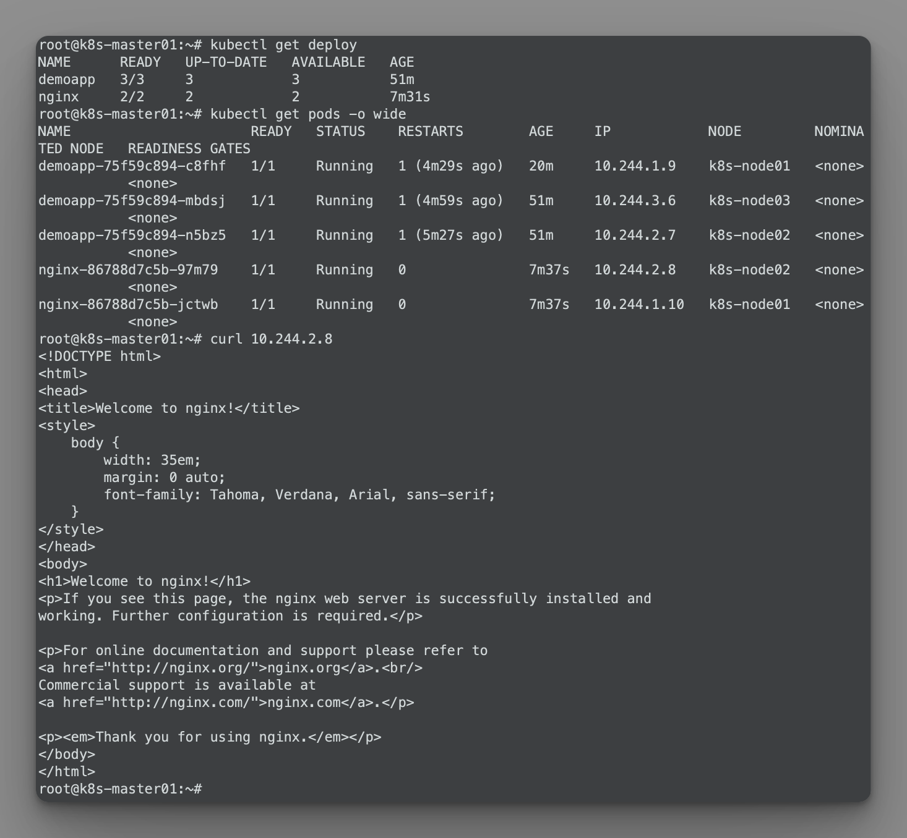

### 创建service

```bash
# service-nginx.yaml
apiVersion: v1
kind: Service
metadata:
  labels:
    app: nginx
  name: nginx
spec:
  ports:
  - name: 80-80
    port: 80
    protocol: TCP
    targetPort: 80
  selector:
    app: nginx
  type: NodePort

# 创建服务
kubectl create -f service-nginx.yaml
kubectl get services

# curl测试service地址
curl 10.101.29.74

# 根据port在集群外节点测试
http://172.16.17.21:30492

# 查看日志，检查被访问情况
kubectl get pods
kubectl logs nginx-86788d7c5b-97m79
```

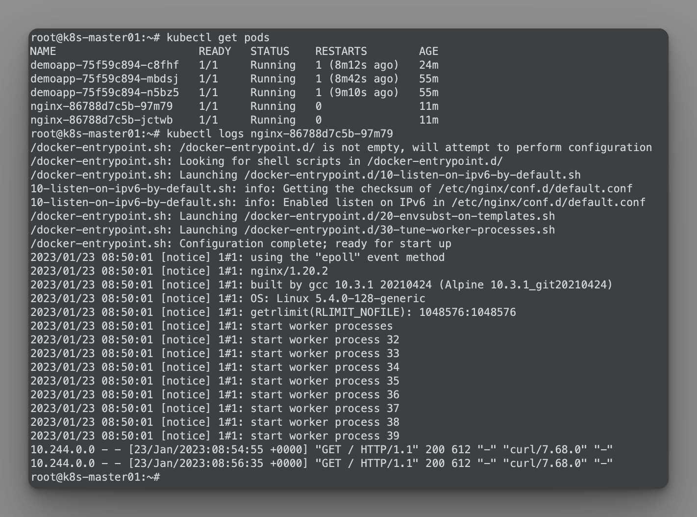


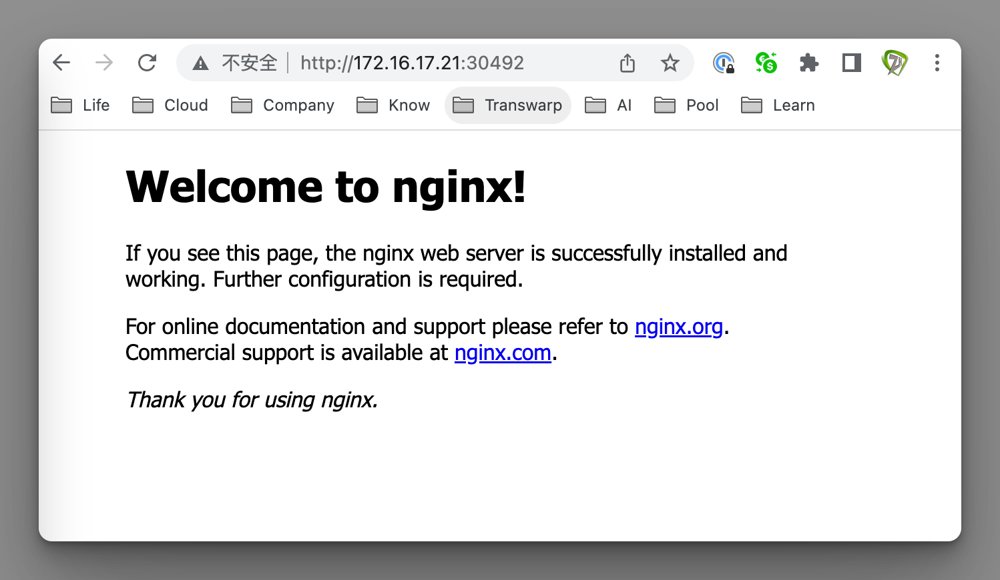


### pod扩容

```bash
# 检查目前pod数量
kubectl get deployment

# master01节点，持续监控nginx的集群ip变化
while true; do curl 10.101.29.74; sleep 0.5; done

# master01新建会话窗口
# 扩容为6个副本
kubectl scale deployment nginx --replicas=6
kubectl get pods

# 缩小为4个副本
kubectl scale deployment nginx --replicas=4
kubectl get pods
```

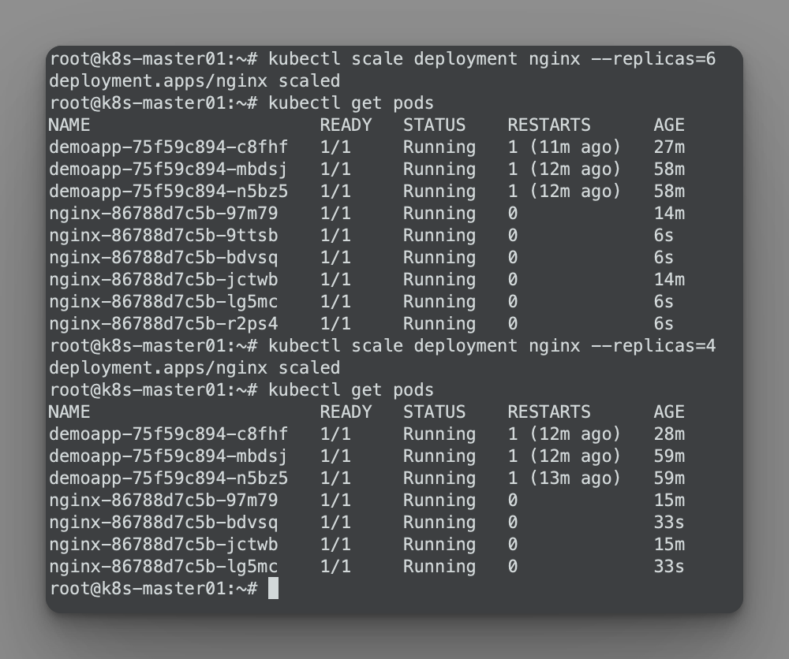


## 5. 扩展作业：要求以配置文件的方式，在集群上编排运行 wordpress 和 mysql，并使用 Service 完成 Pod 发现和服务发布

### 创建namespace

```bash
kubectl create namespace myblog
```

### 创建mysql

```bash
# deployment-service-mysql.yaml
# 数据库用户名、密码、库名均为变量
apiVersion: apps/v1
kind: Deployment
metadata:
  labels:
    app: mysql
  name: mysql
  namespace: myblog
spec:
  replicas: 1
  selector:
    matchLabels:
      app: mysql
  template:
    metadata:
      labels:
        app: mysql
    spec:
      containers:
      - name: mysql
        image: harbor.igalaxycn.com/public/mysql:5.7.38
        ports:
        - containerPort: 3306
        env:
        - name: MYSQL_ROOT_PASSWORD
          value: password
        - name: MYSQL_DATABASE
          value: wpdb
        - name: MYSQL_USER
          value: wordpress
        - name: MYSQL_PASSWORD
          value: password
        volumeMounts:
        - name: db
          mountPath: /var/lib/mysql
      volumes:
      - name: db
        hostPath:
          path: /var/lib/mysql

---
apiVersion: v1
kind: Service
metadata:
  name: mysql
  namespace: myblog
spec:
  ports:
  - name: 3306-3306
    port: 3306
    protocol: TCP
    targetPort: 3306
  selector:
    app: mysql
  type: NodePort


# 创建deployment
kubectl create -f deployment-service-mysql.yaml
kubectl get deployment -n myblog
kubectl get pods -n myblog
kubectl get services -n myblog
kubectl describe svc mysql -n myblog

# 创建数据库
kubectl -n myblog exec mysql-546645ccd9-wq2d6 -it -- mysql -uroot -ppassword

mysql> CREATE DATABASE IF NOT EXISTS `wpdb`;
mysql> SHOW DATABASES;
```

### 创建wordpress

```bash
# deployment-service-wordpress.yaml
# 与上面mysql定义的变量值保持一致
apiVersion: apps/v1
kind: Deployment
metadata:
  labels:
    app: wordpress
  name: wordpress
  namespace: myblog
spec:
  selector:
    matchLabels:
      app: wordpress
  replicas: 2
  template:
    metadata:
      labels:
        app: wordpress
    spec:
      containers:
      - name: wordpress
        image: harbor.igalaxycn.com/public/wordpress:latest
        ports:
        - containerPort: 80
        env:
        - name: WORDPRESS_DB_HOST
          value: mysql #与mysql service的meta name定义一致
        - name: WORDPRESS_DB_NAME
          value: wpdb
        - name: WORDPRESS_DB_USER
          value: wordpress
        - name: WORDPRESS_DB_PASSWORD
          value: password

---
apiVersion: v1
kind: Service
metadata:
  name: wordpress
  namespace: myblog
spec:
  ports:
  - name: 80-80
    port: 80
    protocol: TCP
    targetPort: 80
  selector:
    app: wordpress
  type: NodePort


# 创建服务
kubectl create -f deployment-service-wordpress.yaml
kubectl get pods -n myblog
kubectl get svc -n myblog

# 根据port在集群外节点测试
http://172.16.17.21:32689
```

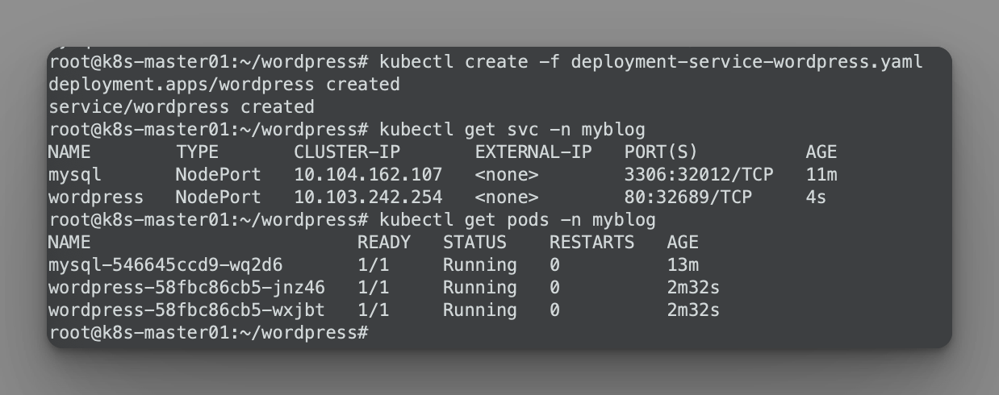


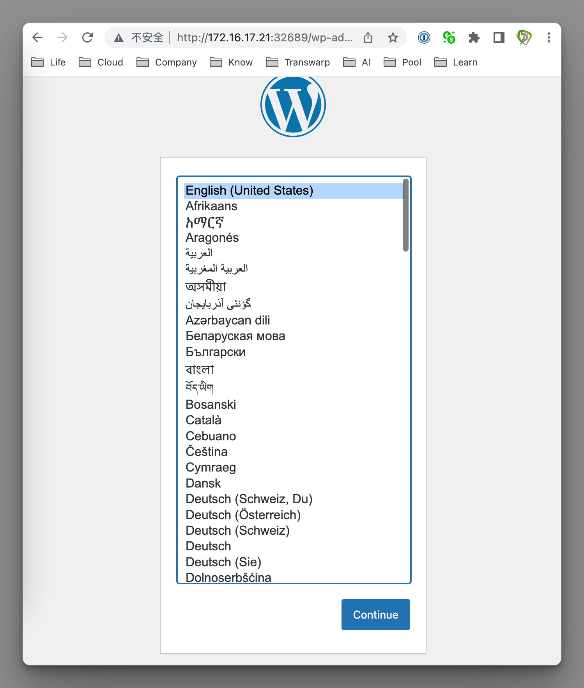


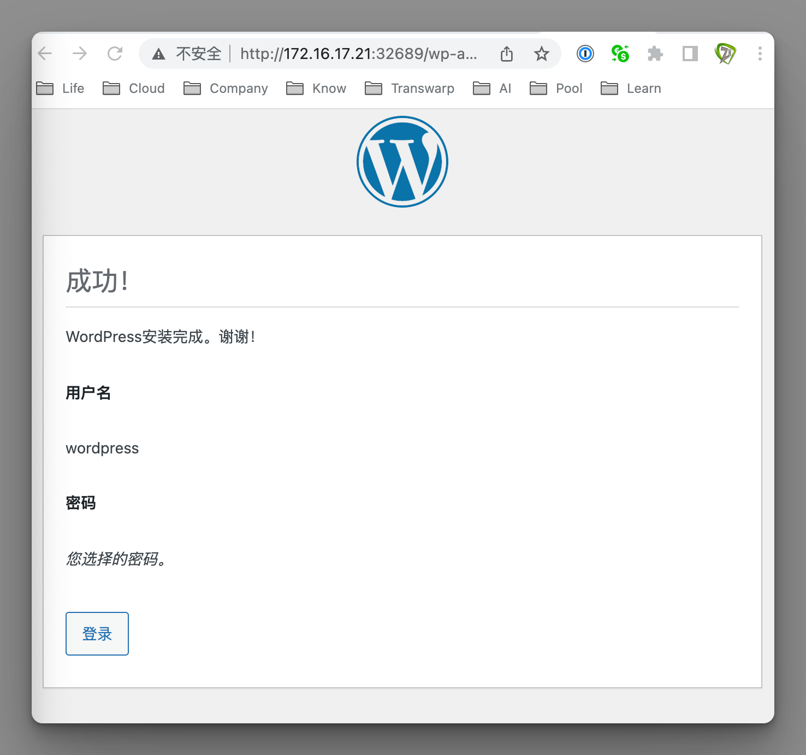


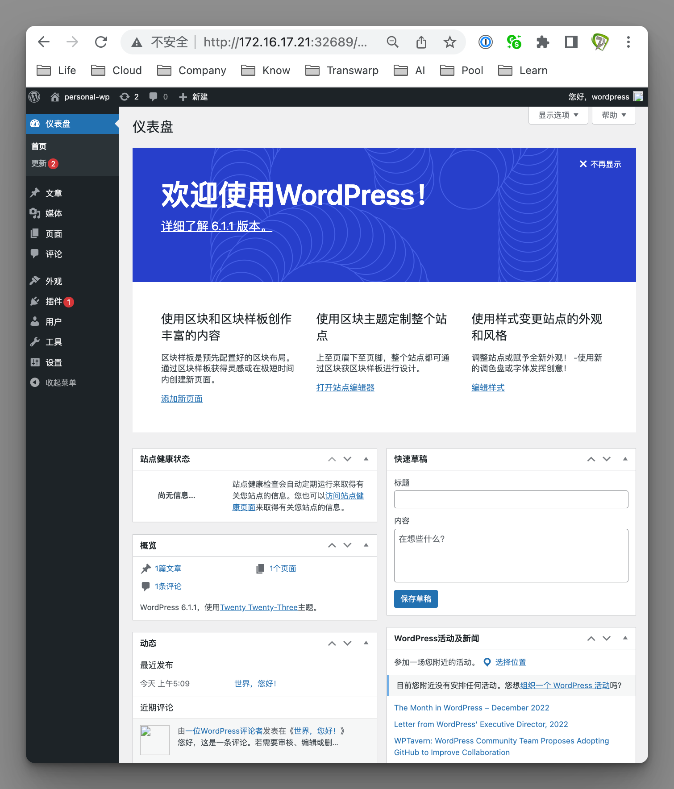


## Q&A

### deploy长时间not ready

```bash
# 检查deployment状态
kubectl get deploy

NAME      READY   UP-TO-DATE   AVAILABLE   AGE
demoapp   0/3     3            3           2m

# 检查pod状态
kubectl get pods -n default
```

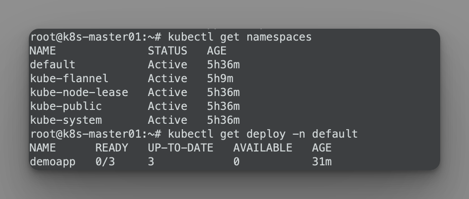

```bash
# 检查某个pod的细节与消息
kubectl describe pod demoapp-75f59c894-g25h8
```

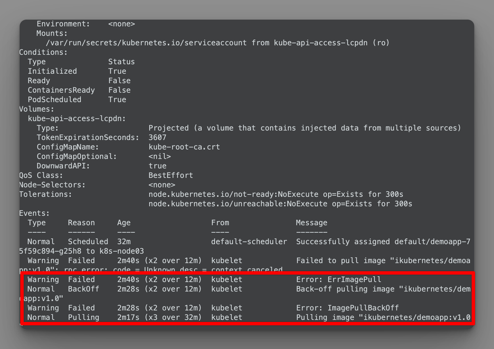

```bash
# 设置镜像加速
vim /etc/docker/daemon.json

{
 "registry-mirrors": [
   "https://registry.docker-cn.com",
   "https://hub-mirror.c.163.com",
   "https://mirror.baidubce.com"
 ],
 "exec-opts": ["native.cgroupdriver=systemd"],
 "log-driver": "json-file",
 "log-opts": {
   "max-size": "200m"
 },
 "storage-driver": "overlay2"  
}

# 重启docker
systemctl daemon-reload
systemctl restart docker.service

# 节点手动拉取测试
docker pull ikubernetes/demoapp:v1.0
```
