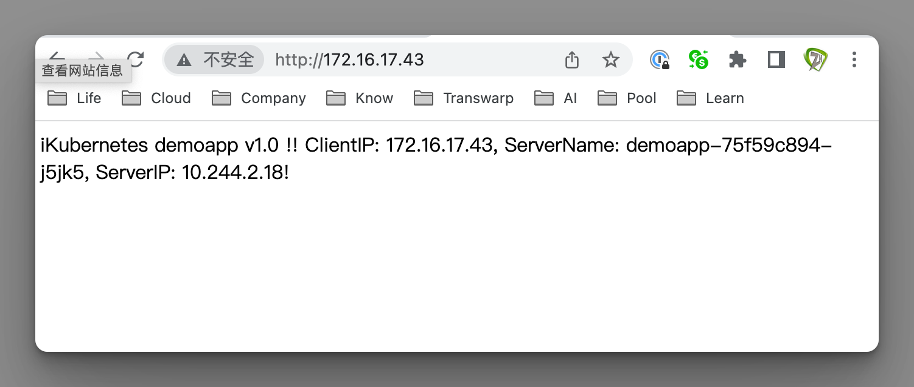

# 极客时间运维进阶训练营第十三周作业

## 作业要求

1、在集群上使用资源配置文件编排运行demoapp，并使用Service完成Pod发现和服务发布；

2、要求以配置文件的方式，在集群上编排运行nginx、wordpress和mysql，并使用Service完成Pod发现和服务发布；

提示：使用Secret的方式的为wordpress指定要使用mysql服务器地址、数据库名称、用户名称和用户密码；

nginx Service：定义为NodePort类型 

nginx的配置文件：要通过ConfigMap提供

wordpress和mysql的数据要保存于PVC上

3、扩展作业：pvc依赖的pv要动态置备；

4、扩展作业：定义一个NodePort类型的Service，在集群外部手动配置一个LoadBalancer，为该Service接入外部客户端访问该Service流量，并转发给各各节点上的该Service注册使用的NodePort


## 1. 在集群上使用资源配置文件编排运行demoapp，并使用Service完成Pod发现和服务发布

### 1.1 创建demoapp.yaml

```bash
cd demoapp
vim demoapp.yaml

apiVersion: apps/v1
kind: Deployment
metadata:
  labels:
    app: demoapp
  name: demoapp
  namespace: test
spec:
  replicas: 3
  selector:
    matchLabels:
      app: demoapp
  template:
    metadata:
      labels:
        app: demoapp
    spec:
      containers:
      - image: ikubernetes/demoapp:v1.0
        name: demoapp
        imagePullPolicy: IfNotPresent


---
apiVersion: v1
kind: Service
metadata:
  labels:
    app: demoapp
  name: demoapp
  namespace: test
spec:
  ports:
  - name: 80-80
    port: 80
    protocol: TCP
    targetPort: 80
  selector:
    app: demoapp
  type: NodePort
  
# 运行
kubectl apply -f demoapp.yaml
```

### 测试

```bash
# 查看pod
kubectl get pods -n test

# 查看deployment
kubectl get deployment -n test

# 查看外部访问端口
kubectl get svc -n test

# 查看对应自动创建的服务发现endpoint
kubectl get endpoints -n test

# curl测试service地址
curl 10.102.230.111

# 浏览器访问
http://172.16.17.21:30463/
```


## 2. 要求以配置文件的方式，在集群上编排运行nginx、wordpress和mysql，并使用Service完成Pod发现和服务发布

- 使用Secret的方式的为wordpress指定要使用mysql服务器地址、数据库名称、用户名称和用户密码；

- nginx Service：定义为NodePort类型 

- nginx的配置文件：要通过ConfigMap提供

- wordpress和mysql的数据要保存于PVC上

### 部署NFS服务

```bash
# 节点172.16.17.41
# 安装nfs-kernel-server
apt search ^nfs
apt install nfs-kernel-server

# 创建输出目录
mkdir -p /data/mysql01
mkdir -p /data/wp01

# 输出卷
vim /etc/exports

# no_root_sqush表示非root用户也可以访问
/data/mysql01   172.16.16.0/21(rw,sync,subtree_check,no_root_squash)
/data/wp01   172.16.16.0/21(rw,sync,subtree_check,no_root_squash)

# 启动服务
systemctl start nfs-server

# 检查端口2049是否侦听
ss -tnl

# 检查防火墙规则是否被阻断
iptables -vnL

# k8s所有节点安装客户端
apt-get install nfs-common

# 挂载测试
mount -t nfs 172.16.17.41:/data/mysql01 /mnt

# 写入测试
cd /mnt
touch a.txt
ls /mnt
rm a.txt

# 卸载
umount /mnt
```

### 2.2 创建mysql

```bash
# 创建目录
mkdir wordpress-nfs
cd wordpress-nfs

# 创建secret
vim secret-mysql.yaml

apiVersion: v1
kind: Secret
metadata:
  creationTimestamp: null
  name: mysql-secrets
data:
  database.host: bXlzcWwuZGVmYXVsdC5zdmM6MzMwNg==
  database.name: d3BkYg==
  root.password: cGFzc3dvcmQ=
  user.name: d29yZHByZXNz
  user.password: cGFzc3dvcmQ=
  
# 运行
kubectl apply -f secret-mysql.yaml
kubectl get secret
# 输出
NAME            TYPE     DATA   AGE
mysql-secrets   Opaque   5      7s

# 创建pv
vim pv-mysql-data.yaml

apiVersion: v1
kind: PersistentVolume
metadata:
  name: pv-mysql
spec:
  capacity:
    storage: 10Gi
  accessModes:
    - ReadWriteMany
  nfs:
    path: "/data/mysql01"
    server: 172.16.17.41
    
# 运行
kubectl apply -f pv-mysql-data.yaml
kubectl get pv
# 输出
NAME       CAPACITY   ACCESS MODES   RECLAIM POLICY   STATUS      CLAIM   STORAGECLASS   REASON   AGE
pv-mysql   10Gi       RWX            Retain           Available                                   6s
  
# 创建pvc
vim pvc-mysql-data.yaml

apiVersion: v1
kind: PersistentVolumeClaim
metadata:
  name: pvc-mysql
spec:
  volumeMode: Filesystem
  accessModes:
    - ReadWriteMany
  resources:
    requests:
      storage: 5Gi
    limits:
      storage: 10Gi
  
# 运行
kubectl apply -f pvc-mysql-data.yaml
kubectl get pvc
# 输出
NAME        STATUS   VOLUME     CAPACITY   ACCESS MODES   STORAGECLASS   AGE
pvc-mysql   Bound    pv-mysql   10Gi       RWX                           12s


# 创建service
vim service-mysql.yaml

apiVersion: v1
kind: Service
metadata:
  labels:
    app: mysql
  name: mysql
spec:
  ports:
  - name: mysql
    port: 3306
    protocol: TCP
    targetPort: 3306
  selector:
    app: mysql
  type: ClusterIP
  
# 运行
kubectl apply -f service-mysql.yaml
kubectl get svc
# 输出
NAME         TYPE        CLUSTER-IP      EXTERNAL-IP   PORT(S)    AGE
kubernetes   ClusterIP   10.96.0.1       <none>        443/TCP    19d
mysql        ClusterIP   10.111.226.67   <none>        3306/TCP   6s

# 创建deployment
vim deploy-mysql.yaml

apiVersion: apps/v1
kind: Deployment
metadata:
  labels:
    app: mysql
  name: mysql
spec:
  replicas: 1
  selector:
    matchLabels:
      app: mysql
  template:
    metadata:
      labels:
        app: mysql
    spec:
      containers:
      - image: mysql:8.0
        name: mysql
        imagePullPolicy: IfNotPresent
        env:
        - name: MYSQL_ROOT_PASSWORD
          valueFrom:
            secretKeyRef:
              name: mysql-secrets
              key: root.password
        - name: MYSQL_USER
          valueFrom:
            secretKeyRef:
              name: mysql-secrets
              key: user.name
        - name: MYSQL_PASSWORD
          valueFrom:
            secretKeyRef:
              name: mysql-secrets
              key: user.password
        - name: MYSQL_DATABASE
          valueFrom:
            secretKeyRef:
              name: mysql-secrets
              key: database.name
        volumeMounts:
        - name: mysql-data
          mountPath: /var/lib/mysql/
      volumes:
      - name: mysql-data
        persistentVolumeClaim:
          claimName: pvc-mysql
          
# 运行
kubectl apply -f deploy-mysql.yaml

# 检查
kubectl get deployment
# 输出
NAME    READY   UP-TO-DATE   AVAILABLE   AGE
mysql   1/1     1            1           2m12s

kubectl get pod
# 输出
NAME                     READY   STATUS    RESTARTS   AGE
mysql-7bc96768d5-vqcsg   1/1     Running   0          2m42s

kubectl get svc
# 输出
NAME         TYPE        CLUSTER-IP      EXTERNAL-IP   PORT(S)    AGE
kubernetes   ClusterIP   10.96.0.1       <none>        443/TCP    19d
mysql        ClusterIP   10.111.226.67   <none>        3306/TCP   3m57s
```

### 创建wordpress

```bash
# 创建pv
vim pv-wordpress-app-data.yaml

apiVersion: v1
kind: PersistentVolume
metadata:
  name: pv-wordpress
spec:
  capacity:
    storage: 10Gi
  accessModes:
    - ReadWriteMany
  nfs:
    path: "/data/wp01"
    server: 172.16.17.41
    
# 运行
kubectl apply -f pv-wordpress-app-data.yaml
kubectl get pv
# 输出
NAME           CAPACITY   ACCESS MODES   RECLAIM POLICY   STATUS      CLAIM               STORAGECLASS   REASON   AGE
pv-mysql       10Gi       RWX            Retain           Bound       default/pvc-mysql                           6m37s
pv-wordpress   10Gi       RWX            Retain           Available                                               6s

# 创建pvc
vim pvc-wordpress-app-data.yaml

apiVersion: v1
kind: PersistentVolumeClaim
metadata:
  name: pvc-wordpress
spec:
  volumeMode: Filesystem
  accessModes:
    - ReadWriteMany
  resources:
    requests:
      storage: 5Gi
    limits:
      storage: 10Gi
  
# 运行
kubectl apply -f pvc-wordpress-app-data.yaml
kubectl get pvc
# 输出
NAME            STATUS   VOLUME         CAPACITY   ACCESS MODES   STORAGECLASS   AGE
pvc-mysql       Bound    pv-mysql       10Gi       RWX                           6m32s
pvc-wordpress   Bound    pv-wordpress   10Gi       RWX                           5s
  
# 创建service
vim service-wordpress.yaml

apiVersion: v1
kind: Service
metadata:
  labels:
    app: wordpress
  name: wordpress
spec:
  ports:
  - name: fpm 
    port: 9000
    protocol: TCP
    targetPort: 9000
  selector:
    app: wordpress
    
# 运行
kubectl apply -f service-wordpress.yaml
    
# 创建Deployment
vim deployment-wordpress.yaml

apiVersion: apps/v1
kind: Deployment
metadata:
  labels:
    app: wordpress
  name: wordpress
spec:
  replicas: 1
  selector:
    matchLabels:
      app: wordpress
  template:
    metadata:
      labels:
        app: wordpress
    spec:
      containers:
      - image: wordpress:5.8-fpm
        name: wordpress
        env:
        - name: WORDPRESS_DB_HOST
          valueFrom:
            secretKeyRef:
              name: mysql-secrets
              key: database.host
        - name: WORDPRESS_DB_USER
          valueFrom:
            secretKeyRef:
              name: mysql-secrets
              key: user.name
        - name: WORDPRESS_DB_PASSWORD
          valueFrom:
            secretKeyRef:
              name: mysql-secrets
              key: user.password
        - name: WORDPRESS_DB_NAME
          valueFrom:
            secretKeyRef:
              name: mysql-secrets
              key: database.name
        volumeMounts:
        - name: wordpress-app-data
          mountPath: /var/www/html/
      volumes:
      - name: wordpress-app-data
        persistentVolumeClaim:
          claimName: pvc-wordpress
          
# 运行
kubectl apply -f deployment-wordpress.yaml

# 检查
kubectl get pod
kubectl get svc
kubectl get deploy
```


### 2.4 创建nginx configmap

```bash
# 创建configmap
vim configmaps-nginx.yaml

apiVersion: v1
data:
  nginx.conf: |
    server {
            listen 80;
            listen [::]:80;
            server_name nginx.igalaxycn.com;
            index index.php index.html index.htm;
            root /var/www/html;
            location ~ /.well-known/acme-challenge {
                    allow all;
                    root /var/www/html;
            }
            location / {
                    try_files $uri $uri/ /index.php$is_args$args;
            }
            location ~ \.php$ {
                    try_files $uri =404;
                    fastcgi_split_path_info ^(.+\.php)(/.+)$;
                    fastcgi_pass wordpress:9000;
                    fastcgi_index index.php;
                    include fastcgi_params;
                    fastcgi_param SCRIPT_FILENAME $document_root$fastcgi_script_name;
                    fastcgi_param PATH_INFO $fastcgi_path_info;
            }
            location ~ /\.ht {
                    deny all;
            }
            location = /favicon.ico {
                    log_not_found off; access_log off;
            }
            location = /robots.txt {
                    log_not_found off; access_log off; allow all;
            }
            location ~* \.(css|gif|ico|jpeg|jpg|js|png)$ {
                    expires max;
                    log_not_found off;
            }
    }
kind: ConfigMap
metadata:
  name: nginx-conf
  
# 运行
kubectl apply -f configmaps-nginx.yaml
kubectl get cm
# 输出
NAME               DATA   AGE
kube-root-ca.crt   1      19d
nginx-conf         1      6s
```

### 2.5 创建nginx

```bash
# 创建service
vim service-nginx.yaml

apiVersion: v1
kind: Service
metadata:
  labels:
    app: nginx
  name: nginx
spec:
  ports:
  - name: http-80
    port: 80
    protocol: TCP
    targetPort: 80
  selector:
    app: nginx
  type: NodePort

# 运行
kubectl apply -f service-nginx.yaml

# 创建nginx deployment
vim deployment-nginx.yaml

apiVersion: apps/v1
kind: Deployment
metadata:
  labels:
    app: nginx
  name: nginx
spec:
  replicas: 1
  selector:
    matchLabels:
      app: nginx
  template:
    metadata:
      labels:
        app: nginx
    spec:
      volumes:
      - name: ngxconf
        configMap:
          name: nginx-conf
      - name: wordpress-app-data
        persistentVolumeClaim:
          claimName: pvc-wordpress
      containers:
      - image: nginx:1.20-alpine
        name: nginx
        volumeMounts:
        - name: ngxconf
          mountPath: /etc/nginx/conf.d/
        - name: wordpress-app-data
          mountPath: /var/www/html/
          
# 运行
kubectl apply -f deployment-nginx.yaml
kubectl get pods
kubectl get deployment
kubectl get svc
kubectl get endpoint

# 访问nginx安装WordPress
http://172.16.17.24:30707
```


## 3. 扩展作业：pvc依赖的pv要动态置备

### k8s集群部署NFS服务

```bash
# 创建目录
mkdir wordpress-dynamic
cd wordpress-dynamic

# 创建命名空间
kubectl create namespace nfs

# 在该空间下部署NFS服务
kubectl create -f https://raw.githubusercontent.com/kubernetes-csi/csi-driver-nfs/master/deploy/example/nfs-provisioner/nfs-server.yaml -n nfs

# 查看资源
kubectl get pods -n nfs
kubectl get svc -n nfs
```


### 3.2 部署NFS CSI Driver

```bash
# 安装NFS CSI Driver
git clone https://github.com/iKubernetes/learning-k8s.git

# 在各节点下载所需镜像
docker pull registry.aliyuncs.com/google_containers/csi-provisioner:v3.2.0
docker pull registry.cn-hangzhou.aliyuncs.com/kubelibrary/nfsplugin:v4.1.0
docker pull registry.aliyuncs.com/google_containers/livenessprobe:v2.7.0
docker pull registry.aliyuncs.com/google_containers/csi-node-driver-registrar:v2.5.1

# 各节点修改tag
docker tag registry.aliyuncs.com/google_containers/csi-provisioner:v3.2.0 registry.k8s.io/sig-storage/csi-provisioner:v3.2.0
docker tag registry.cn-hangzhou.aliyuncs.com/kubelibrary/nfsplugin:v4.1.0 registry.k8s.io/sig-storage/nfsplugin:v4.1.0
docker tag registry.aliyuncs.com/google_containers/livenessprobe:v2.7.0 registry.k8s.io/sig-storage/livenessprobe:v2.7.0
docker tag registry.aliyuncs.com/google_containers/csi-node-driver-registrar:v2.5.1 registry.k8s.io/sig-storage/csi-node-driver-registrar:v2.5.1

# 启动
cd learning-k8s
kubectl apply -f csi-driver-nfs/deploy/02-csi-driver-nfs-4.1/

# 输出
serviceaccount/csi-nfs-controller-sa created
serviceaccount/csi-nfs-node-sa created
clusterrole.rbac.authorization.k8s.io/nfs-external-provisioner-role created
clusterrolebinding.rbac.authorization.k8s.io/nfs-csi-provisioner-binding created
csidriver.storage.k8s.io/nfs.csi.k8s.io created
deployment.apps/csi-nfs-controller created
daemonset.apps/csi-nfs-node created

# 检查csi-driver pod状态
kubectl -n kube-system get pod -o wide -l 'app in (csi-nfs-node,csi-nfs-controller)'

# 获取服务ip地址
kubectl get service -n nfs
```


### 3.3 创建Storageclass

```bash
# 创建storageclass
vim nfs-csi-storageclass.yaml
---
apiVersion: storage.k8s.io/v1
kind: StorageClass
metadata:
  name: nfs-csi
provisioner: nfs.csi.k8s.io
parameters:
  server: nfs-server.nfs.svc.cluster.local
  share: /
reclaimPolicy: Delete
volumeBindingMode: Immediate
mountOptions:
  - hard
  - nfsvers=4.1

# 启动
kubectl apply -f nfs-csi-storageclass.yaml
kubectl get sc
# 输出
NAME      PROVISIONER      RECLAIMPOLICY   VOLUMEBINDINGMODE   ALLOWVOLUMEEXPANSION   AGE
nfs-csi   nfs.csi.k8s.io   Delete          Immediate           false                  17s

# 创建pvc测试
vim pvc-nfs-csi-dynamic.yaml

apiVersion: v1
kind: PersistentVolumeClaim
metadata:
  name: pvc-nfs-dynamic
spec:
  accessModes:
    - ReadWriteMany
  resources:
    requests:
      storage: 10Gi
  storageClassName: nfs-csi

# 启动
kubectl apply -f pvc-nfs-csi-dynamic.yaml
kubectl get pvc
kubectl get pv
```


### 3.4 创建mysql

```bash
# 创建secret
vim secret-mysql.yaml

apiVersion: v1
kind: Secret
metadata:
  creationTimestamp: null
  name: mysql-secrets
data:
  database.host: bXlzcWwuZGVmYXVsdC5zdmM6MzMwNg==
  database.name: d3BkYg==
  root.password: cGFzc3dvcmQ=
  user.name: d29yZHByZXNz
  user.password: cGFzc3dvcmQ=
  
# 运行
kubectl apply -f secret-mysql.yaml
kubectl get secret
# 输出
NAME            TYPE     DATA   AGE
mysql-secrets   Opaque   5      6s
  
# 创建pvc
vim pvc-mysql-data.yaml

apiVersion: v1
kind: PersistentVolumeClaim
metadata:
  name: mysql-data
spec:
  volumeMode: Filesystem
  accessModes:
    - ReadWriteMany
  resources:
    requests:
      storage: 10Gi
  storageClassName: nfs-csi
  
# 运行
kubectl apply -f pvc-mysql-data.yaml
kubectl get pvc
# 输出
NAME              STATUS   VOLUME                                     CAPACITY   ACCESS MODES   STORAGECLASS   AGE
mysql-data        Bound    pvc-d90c0ca7-f482-4af9-a9de-9acf4a44966b   10Gi       RWX            nfs-csi        7s
pvc-nfs-dynamic   Bound    pvc-f83beee0-f165-4ccf-a56c-f0bdad92e465   10Gi       RWX            nfs-csi        110s
  
# 创建service
vim service-mysql.yaml

apiVersion: v1
kind: Service
metadata:
  labels:
    app: mysql
  name: mysql
spec:
  ports:
  - name: mysql
    port: 3306
    protocol: TCP
    targetPort: 3306
  selector:
    app: mysql
  type: ClusterIP
  
# 运行
kubectl apply -f service-mysql.yaml
kubectl get svc

# 创建deployment
vim deploy-mysql.yaml

apiVersion: apps/v1
kind: Deployment
metadata:
  labels:
    app: mysql
  name: mysql
spec:
  replicas: 1
  selector:
    matchLabels:
      app: mysql
  template:
    metadata:
      labels:
        app: mysql
    spec:
      containers:
      - image: mysql:8.0
        name: mysql
        imagePullPolicy: IfNotPresent
        env:
        - name: MYSQL_ROOT_PASSWORD
          valueFrom:
            secretKeyRef:
              name: mysql-secrets
              key: root.password
        - name: MYSQL_USER
          valueFrom:
            secretKeyRef:
              name: mysql-secrets
              key: user.name
        - name: MYSQL_PASSWORD
          valueFrom:
            secretKeyRef:
              name: mysql-secrets
              key: user.password
        - name: MYSQL_DATABASE
          valueFrom:
            secretKeyRef:
              name: mysql-secrets
              key: database.name
        volumeMounts:
        - name: mysql-data
          mountPath: /var/lib/mysql/
      volumes:
      - name: mysql-data
        persistentVolumeClaim:
          claimName: mysql-data
          
# 运行
kubectl apply -f deploy-mysql.yaml
kubectl get deployment
kubectl get pod
kubectl get svc
```


### 3.5 创建wordpress

```bash
# 创建pvc
vim pvc-wordpress-app-data.yaml

apiVersion: v1
kind: PersistentVolumeClaim
metadata:
  name: wordpress-app-data
spec:
  volumeMode: Filesystem
  accessModes:
    - ReadWriteMany
  resources:
    requests:
      storage: 10Gi
  storageClassName: nfs-csi
  
# 运行
kubectl apply -f pvc-wordpress-app-data.yaml
kubectl get pvc
# 输出
NAME                 STATUS   VOLUME                                     CAPACITY   ACCESS MODES   STORAGECLASS   AGE
mysql-data           Bound    pvc-d90c0ca7-f482-4af9-a9de-9acf4a44966b   10Gi       RWX            nfs-csi        3m56s
pvc-nfs-dynamic      Bound    pvc-f83beee0-f165-4ccf-a56c-f0bdad92e465   10Gi       RWX            nfs-csi        5m39s
wordpress-app-data   Bound    pvc-7711cd38-1323-42c8-8ceb-40cadacb78ef   10Gi       RWX            nfs-csi        7s
  
# 创建service
vim service-wordpress.yaml

apiVersion: v1
kind: Service
metadata:
  labels:
    app: wordpress
  name: wordpress
spec:
  ports:
  - name: fpm 
    port: 9000
    protocol: TCP
    targetPort: 9000
  selector:
    app: wordpress
    
# 运行
kubectl apply -f service-wordpress.yaml
    
# 创建Deployment
vim deployment-wordpress.yaml

apiVersion: apps/v1
kind: Deployment
metadata:
  labels:
    app: wordpress
  name: wordpress
spec:
  replicas: 1
  selector:
    matchLabels:
      app: wordpress
  template:
    metadata:
      labels:
        app: wordpress
    spec:
      containers:
      - image: wordpress:5.8-fpm
        name: wordpress
        env:
        - name: WORDPRESS_DB_HOST
          valueFrom:
            secretKeyRef:
              name: mysql-secrets
              key: database.host
        - name: WORDPRESS_DB_USER
          valueFrom:
            secretKeyRef:
              name: mysql-secrets
              key: user.name
        - name: WORDPRESS_DB_PASSWORD
          valueFrom:
            secretKeyRef:
              name: mysql-secrets
              key: user.password
        - name: WORDPRESS_DB_NAME
          valueFrom:
            secretKeyRef:
              name: mysql-secrets
              key: database.name
        volumeMounts:
        - name: wordpress-app-data
          mountPath: /var/www/html/
      volumes:
      - name: wordpress-app-data
        persistentVolumeClaim:
          claimName: wordpress-app-data
          
# 运行
kubectl apply -f deployment-wordpress.yaml
kubectl get pod
kubectl get svc
kubectl get deploy
```


### 3.6 创建nginx configmap

```bash
# 创建configmap
vim configmaps-nginx.yaml

apiVersion: v1
data:
  nginx.conf: |
    server {
            listen 80;
            listen [::]:80;
            server_name nginx.igalaxycn.com;
            index index.php index.html index.htm;
            root /var/www/html;
            location ~ /.well-known/acme-challenge {
                    allow all;
                    root /var/www/html;
            }
            location / {
                    try_files $uri $uri/ /index.php$is_args$args;
            }
            location ~ \.php$ {
                    try_files $uri =404;
                    fastcgi_split_path_info ^(.+\.php)(/.+)$;
                    fastcgi_pass wordpress:9000;
                    fastcgi_index index.php;
                    include fastcgi_params;
                    fastcgi_param SCRIPT_FILENAME $document_root$fastcgi_script_name;
                    fastcgi_param PATH_INFO $fastcgi_path_info;
            }
            location ~ /\.ht {
                    deny all;
            }
            location = /favicon.ico {
                    log_not_found off; access_log off;
            }
            location = /robots.txt {
                    log_not_found off; access_log off; allow all;
            }
            location ~* \.(css|gif|ico|jpeg|jpg|js|png)$ {
                    expires max;
                    log_not_found off;
            }
    }
kind: ConfigMap
metadata:
  name: nginx-conf
  
# 运行
kubectl apply -f configmaps-nginx.yaml
kubectl get cm
# 输出
NAME               DATA   AGE
kube-root-ca.crt   1      19d
nginx-conf         1      6s
```

### 创建nginx

```bash
# 创建service
vim service-nginx.yaml

apiVersion: v1
kind: Service
metadata:
  labels:
    app: nginx
  name: nginx
spec:
  ports:
  - name: http-80
    port: 80
    protocol: TCP
    targetPort: 80
  selector:
    app: nginx
  type: NodePort

# 运行
kubectl apply -f service-nginx.yaml

# 创建nginx deployment
vim deployment-nginx.yaml

apiVersion: apps/v1
kind: Deployment
metadata:
  labels:
    app: nginx
  name: nginx
spec:
  replicas: 1
  selector:
    matchLabels:
      app: nginx
  template:
    metadata:
      labels:
        app: nginx
    spec:
      volumes:
      - name: ngxconf
        configMap:
          name: nginx-conf
      - name: wordpress-app-data
        persistentVolumeClaim:
          claimName: wordpress-app-data
      containers:
      - image: nginx:1.20-alpine
        name: nginx
        volumeMounts:
        - name: ngxconf
          mountPath: /etc/nginx/conf.d/
        - name: wordpress-app-data
          mountPath: /var/www/html/
          
# 运行
kubectl apply -f deployment-nginx.yaml
kubectl get pod
kubectl get deployment
kubectl get svc
kubectl get ep

# 访问nginx
http://172.16.17.24:32757
```


## 4. 扩展作业：定义一个NodePort类型的Service

- 定义一个NodePort类型的Service
- 在集群外部手动配置一个LoadBalancer，为该Service接入外部客户端访问该Service流量，并转发给各节点上的该Service注册使用的NodePort

### 4.1 部署demoapp

```bash
# 创建Deployment
kubectl create deployment demoapp --image=ikubernetes/demoapp:v1.0 --replicas=3

# 创建Service
vim demoapp-service-nodeport.yaml

apiVersion: v1
kind: Service
metadata:
  name: demoapp-nodeport
spec:
  ports:
  - name: 80-80
    port: 80
    protocol: TCP
    targetPort: 80
  selector:
    app: demoapp
  type: NodePort
  externalTrafficPolicy: Local
  
# 运行
kubectl apply -f demoapp-service-nodeport.yaml

# 找到外部自动映射的端口如32029
kubectl get svc
```


### 4.2 部署LoadBalancer

```bash
# 172.16.17.43
# 安装haproxy
apt install haproxy -y

# 修改配置在末尾添加如下行
vim /etc/haproxy/haproxy.cfg

listen loadbalancer
  bind *:80
  mode tcp
  server k8s-master01 172.16.17.21:32029 check inter 3s fall 3 rise 5
  server k8s-node1 172.16.17.24:32029 check inter 3s fall 3 rise 5
  server k8s-node2 172.16.17.25:32029 check inter 3s fall 3 rise 5
  server k8s-node3 172.16.17.26:32029 check inter 3s fall 3 rise 5
  
# 重启服务
systemctl restart haproxy
systemctl status haproxy

# 访问haproxy节点
http://172.16.17.43
```


