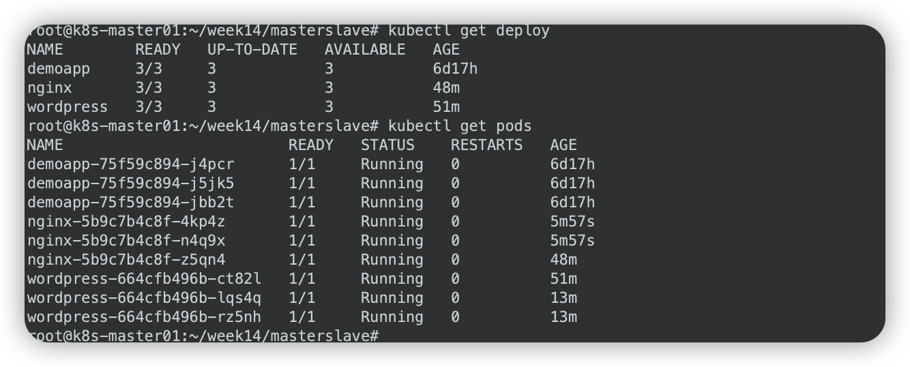

# 极客时间运维进阶训练营第十四周作业

## 作业要求

1. wordpress 示例中：
   - 使用 statefulset 编排运行 mysql，实例数为 1；
   - 换成使用 Operator 编排运行 mysql，实例数为 1+；
   - 将 mysql 以传统模型的主从复制的形式运行于 Kubernetes 外部，让运行在 Kubernetes 集群上的 wordpress 去访问外部的 MySQL 服务。

2. wordpress 实例扩展至多个，测试应用是否工作正常。

3. Nginx 实例扩展至多个，测试应用是否工作正常；额外为 nginx 添加 https 虚拟主机。

   

## 1. 修改wordpress示例

- 使用 statefulset 编排运行 mysql，实例数为 1；
- 换成使用 Operator 编排运行 mysql，实例数为 1+；
- 将 mysql 以传统模型的主从复制的形式运行于 Kubernetes 外部，让运行在 Kubernetes 集群上的 wordpress 去访问外部的 MySQL 服务。

### 1.1 使用 statefulset 编排运行 mysql，实例数为 1

#### 配置网卡上的第二个ip地址

```bash
# master01节点
# 添加172.16.17.100地址
vim /etc/netplan/00-installer-config.yaml

# This is the network config written by 'subiquity'
network:
  ethernets:
    ens160:
      addresses:
      - 172.16.17.21/21
      - 172.16.17.100/21
      gateway4: 172.16.16.1
      nameservers:
        addresses:
        - 172.16.5.1
        - 223.5.5.5
        search: []
  version: 2
  
# 生效
netplan apply

# 检查
ip a
```

#### 部署nfs-csi

```bash
# 利用week13创建的nfs-server
# 创建storageclass
mkdir nfs-csi
cd nfs-csi
vim nfs-csi-storageclass.yaml
---
apiVersion: storage.k8s.io/v1
kind: StorageClass
metadata:
  name: nfs-csi
provisioner: nfs.csi.k8s.io
parameters:
  server: nfs-server.nfs.svc.cluster.local
  share: /
reclaimPolicy: Delete
volumeBindingMode: Immediate
mountOptions:
  - hard
  - nfsvers=4.1

# 启动
kubectl apply -f nfs-csi-storageclass.yaml
kubectl get sc

NAME      PROVISIONER      RECLAIMPOLICY   VOLUMEBINDINGMODE   ALLOWVOLUMEEXPANSION   AGE
nfs-csi   nfs.csi.k8s.io   Delete          Immediate           false                  10s
```

#### 部署mysql

```bash
# 创建工作目录
mkdir -p statefulset/mysql
cd statefulset/mysql

# 创建secret-mysql
# database.name: wpdb
# root.password: password
# user.password: password
# user.name: wordpress
vim secret-mysql.yaml

apiVersion: v1
kind: Secret
metadata:
  creationTimestamp: null
  name: mysql-user-pass
data:
  database.name: d3BkYg==
  root.password: cGFzc3dvcmQ=
  user.name: d29yZHByZXNz
  user.password: cGFzc3dvcmQ=

# 创建pvc-mysql
vim pvc-mysql-data.yaml

apiVersion: v1
kind: PersistentVolumeClaim
metadata:
  name: mysql-data
spec:
  volumeMode: Filesystem
  accessModes:
    - ReadWriteOnce
  resources:
    requests:
      storage: 10Gi
  storageClassName: nfs-csi
  
# 创建service-mysql
# headless类型
vim service-mysql.yaml

apiVersion: v1
kind: Service
metadata:
  labels:
    app: mysql
  name: mysql
spec:
  ports:
  - name: mysql
    port: 3306
    protocol: TCP
    targetPort: 3306
  selector:
    app: mysql
  clusterIP: None
  type: ClusterIP
  
# 创建StatefulSet
vim statefulset-mysql.yaml

apiVersion: apps/v1
kind: StatefulSet
metadata:
  labels:
    app: mysql
  name: mysql
spec:
  serviceName: mysql
  replicas: 1
  selector:
    matchLabels:
      app: mysql
  template:
    metadata:
      labels:
        app: mysql
    spec:
      containers:
      - image: mysql:8.0
        name: mysql
        env:
        - name: MYSQL_ROOT_PASSWORD
          valueFrom:
            secretKeyRef:
              name: mysql-user-pass
              key: root.password
        - name: MYSQL_USER
          valueFrom:
            secretKeyRef:
              name: mysql-user-pass
              key: user.name
        - name: MYSQL_PASSWORD
          valueFrom:
            secretKeyRef:
              name: mysql-user-pass
              key: user.password
        - name: MYSQL_DATABASE
          valueFrom:
            secretKeyRef:
              name: mysql-user-pass
              key: database.name
        volumeMounts:
        - name: mysql-data
          mountPath: /var/lib/mysql/
      volumes:
      - name: mysql-data
        persistentVolumeClaim:
          claimName: mysql-data


# 运行
cd ..
kubectl apply -f mysql/

# 检查
kubectl get pods
kubectl get svc
```


#### 部署wordpress

```bash
mkdir -p statefulset/wordpress
cd statefulset/wordpress

# 创建service-wordpress
vim service-wordpress.yaml

apiVersion: v1
kind: Service
metadata:
  labels:
    app: wordpress
  name: wordpress
spec:
  ports:
  - name: fpm 
    port: 9000
    protocol: TCP
    targetPort: 9000
  selector:
    app: wordpress
    
# 创建pvc-wordpress
vim pvc-wordpress-app-data.yaml

apiVersion: v1
kind: PersistentVolumeClaim
metadata:
  name: wordpress-app-data
spec:
  volumeMode: Filesystem
  accessModes:
    - ReadWriteMany
  resources:
    requests:
      storage: 10Gi
  storageClassName: nfs-csi
  
# 创建deployment-wordpress
vim deployment-wordpress.yaml

apiVersion: apps/v1
kind: Deployment
metadata:
  labels:
    app: wordpress
  name: wordpress
spec:
  replicas: 1
  selector:
    matchLabels:
      app: wordpress
  template:
    metadata:
      labels:
        app: wordpress
    spec:
      containers:
      - image: wordpress:5.8-fpm
        name: wordpress
        env:
        - name: WORDPRESS_DB_HOST
          value: mysql
        - name: WORDPRESS_DB_USER
          valueFrom:
            secretKeyRef:
              name: mysql-user-pass
              key: user.name
        - name: WORDPRESS_DB_PASSWORD
          valueFrom:
            secretKeyRef:
              name: mysql-user-pass
              key: user.password
        - name: WORDPRESS_DB_NAME
          valueFrom:
            secretKeyRef:
              name: mysql-user-pass
              key: database.name
        volumeMounts:
        - name: wordpress-app-data
          mountPath: /var/www/html/
      volumes:
      - name: wordpress-app-data
        persistentVolumeClaim:
          claimName: wordpress-app-data

# 运行
cd ..
kubectl apply -f wordpress/

# 检查
kubectl get pods
kubectl get svc
```


#### 部署nginx

```bash
mkdir -p statefulset/nginx
cd statefulset/nginx

# 创建configmap-nginx
vim configmap-nginx-conf.yaml

apiVersion: v1
data:
  nginx.conf: |
    server {
            listen 80;
            listen [::]:80;
            server_name 172.16.17.100;
            index index.php index.html index.htm;
            root /var/www/html;
            location ~ /.well-known/acme-challenge {
                    allow all;
                    root /var/www/html;
            }
            location / {
                    try_files $uri $uri/ /index.php$is_args$args;
            }
            location ~ \.php$ {
                    try_files $uri =404;
                    fastcgi_split_path_info ^(.+\.php)(/.+)$;
                    fastcgi_pass wordpress:9000;
                    fastcgi_index index.php;
                    include fastcgi_params;
                    fastcgi_param SCRIPT_FILENAME $document_root$fastcgi_script_name;
                    fastcgi_param PATH_INFO $fastcgi_path_info;
            }
            location ~ /\.ht {
                    deny all;
            }
            location = /favicon.ico {
                    log_not_found off; access_log off;
            }
            location = /robots.txt {
                    log_not_found off; access_log off; allow all;
            }
            location ~* \.(css|gif|ico|jpeg|jpg|js|png)$ {
                    expires max;
                    log_not_found off;
            }
    }
kind: ConfigMap
metadata:
  creationTimestamp: null
  name: nginx-conf
  
# 创建service-nginx
vim service-nginx.yaml

apiVersion: v1
kind: Service
metadata:
  labels:
    app: nginx
  name: nginx
spec:
  ports:
  - name: http-80
    port: 80
    protocol: TCP
    targetPort: 80
  selector:
    app: nginx
  type: NodePort
  externalIPs:
  - 172.16.17.100
  
# 创建deployment-nginx
vim deployment-nginx.yaml

apiVersion: apps/v1
kind: Deployment
metadata:
  labels:
    app: nginx
  name: nginx
spec:
  replicas: 1
  selector:
    matchLabels:
      app: nginx
  strategy:
    rollingUpdate:
      maxSurge: 1
      maxUnavailable: 0
  template:
    metadata:
      labels:
        app: nginx
    spec:
      volumes:
      - name: ngxconf
        configMap:
          name: nginx-conf
      - name: wordpress-app-data
        persistentVolumeClaim:
          claimName: wordpress-app-data
      containers:
      - image: nginx:1.20-alpine
        name: nginx
        volumeMounts:
        - name: ngxconf
          mountPath: /etc/nginx/conf.d/
        - name: wordpress-app-data
          mountPath: /var/www/html/
          
# 运行
cd ..
kubectl apply -f nginx/

# 检查
kubectl get pods
kubectl get svc
```

#### 访问wordpress测试

```bash
http://172.16.17.100

# 测试完毕后卸载
kubectl delete -f nginx/
kubectl delete -f wordpress/
kubectl delete -f mysql/
```

欢迎页面


配置页面


### 1.2 换成使用Operator编排运行mysql，实例数为 1+

#### 部署helm

```bash
# 下载最新版helm
wget https://get.helm.sh/helm-v3.11.1-linux-amd64.tar.gz

# 解压
tar -xzvf helm-v3.11.1-linux-amd64.tar.gz 
mv -f linux-amd64/helm /usr/local/bin
```

#### 部署mysql-operator

```bash
# 添加Helm存储库
helm repo add mysql-operator https://mysql.github.io/mysql-operator/
helm repo update

# 安装mysql-operator
# 采用命名空间mysql-operator
helm search repo mysql-operator
helm install mysql-operator mysql-operator/mysql-operator --namespace mysql-operator --create-namespace

# 创建mysql-secret
kubectl create secret generic mysql-oper-passwd --from-literal=rootUser=root --from-literal=rootHost=% --from-literal=rootPassword="password"

# 创建mysql-secret
mkdir -p operator/mysql
cd operator/mysql

vim mysql-oper-passwd.yaml

apiVersion: v1
kind: Secret
metadata:
  name: mysql-oper-passwd
stringData:
  rootUser: root
  rootHost: '%'
  rootPassword: "password"
  
# 生效
kubectl apply -f mysql-oper-passwd.yaml

# 创建mysql-cluster
vim mysql-cluster.yaml

apiVersion: mysql.oracle.com/v2
kind: InnoDBCluster
metadata:
  name: mysql-cluster
spec:
  secretName: mysql-oper-passwd
  tlsUseSelfSigned: true
  instances: 3
  router:
    instances: 1
  datadirVolumeClaimTemplate:
    accessModes: 
      - ReadWriteOnce
    resources:
      requests:
        storage: 10Gi
    storageClassName: nfs-csi
    
# 运行
kubectl apply -f mysql-cluster.yaml

# 持续检查资源创建情况，直至全部online
kubectl get innodbcluster --watch

NAME            STATUS    ONLINE   INSTANCES   ROUTERS   AGE
mysql-cluster   PENDING   0        3           1         6s
mysql-cluster   PENDING   0        3           1         3m5s
mysql-cluster   PENDING   0        3           1         3m5s
mysql-cluster   INITIALIZING   0        3           1         3m6s
mysql-cluster   INITIALIZING   0        3           1         3m6s
mysql-cluster   INITIALIZING   0        3           1         3m6s
mysql-cluster   INITIALIZING   0        3           1         3m10s
mysql-cluster   ONLINE_PARTIAL   1        3           1         3m10s
mysql-cluster   ONLINE_PARTIAL   1        3           1         3m37s
mysql-cluster   ONLINE_PARTIAL   2        3           1         3m43s
mysql-cluster   ONLINE           2        3           1         4m8s
mysql-cluster   ONLINE           3        3           1         4m15s


# 连接mysql
kubectl run --rm -it myshell --image=mysql/mysql-operator -- mysqlsh root@mysql-cluster --sql --password=password

# 创建数据库
mysql> show databases;
mysql> create database wpdb;
mysql> create user 'wordpress'@'%' identified with mysql_native_password by 'password';
mysql> grant all privileges on wpdb.* to 'wordpress'@'%' with grant option;
mysql> flush privileges;
mysql> \q
```


#### 部署wordpress

```bash
mkdir -p operator/wordpress
cd operator/wordpress

# 创建mysql-secret
vim secret-mysql.yaml

apiVersion: v1
kind: Secret
metadata:
  creationTimestamp: null
  name: mysql-user-pass
data:
  database.name: d3BkYg==
  root.password: cGFzc3dvcmQ=
  user.name: d29yZHByZXNz
  user.password: cGFzc3dvcmQ=

# 创建service-wordpress
vim service-wordpress.yaml

apiVersion: v1
kind: Service
metadata:
  labels:
    app: wordpress
  name: wordpress
spec:
  ports:
  - name: fpm 
    port: 9000
    protocol: TCP
    targetPort: 9000
  selector:
    app: wordpress
    
# 创建pvc-wordpress
vim pvc-wordpress-app-data.yaml

apiVersion: v1
kind: PersistentVolumeClaim
metadata:
  name: wordpress-app-data
spec:
  volumeMode: Filesystem
  accessModes:
    - ReadWriteMany
  resources:
    requests:
      storage: 10Gi
  storageClassName: nfs-csi
  
# 创建deployment-wordpress
vim deployment-wordpress.yaml

apiVersion: apps/v1
kind: Deployment
metadata:
  labels:
    app: wordpress
  name: wordpress
spec:
  replicas: 1
  selector:
    matchLabels:
      app: wordpress
  template:
    metadata:
      labels:
        app: wordpress
    spec:
      containers:
      - image: wordpress:5.8-fpm
        name: wordpress
        env:
        - name: WORDPRESS_DB_HOST
          value: mysql-cluster
        - name: WORDPRESS_DB_USER
          valueFrom:
            secretKeyRef:
              name: mysql-user-pass
              key: user.name
        - name: WORDPRESS_DB_PASSWORD
          valueFrom:
            secretKeyRef:
              name: mysql-user-pass
              key: user.password
        - name: WORDPRESS_DB_NAME
          valueFrom:
            secretKeyRef:
              name: mysql-user-pass
              key: database.name
        volumeMounts:
        - name: wordpress-app-data
          mountPath: /var/www/html/
      volumes:
      - name: wordpress-app-data
        persistentVolumeClaim:
          claimName: wordpress-app-data

# 运行
cd ..
kubectl apply -f wordpress/

# 检查
kubectl get pods
kubectl get svc
```


#### 部署nginx

```bash
mkdir -p operator/nginx
cd operator/nginx

# 创建configmap-nginx
vim configmap-nginx-conf.yaml

apiVersion: v1
data:
  nginx.conf: |
    server {
            listen 80;
            listen [::]:80;
            server_name 172.16.17.100;
            index index.php index.html index.htm;
            root /var/www/html;
            location ~ /.well-known/acme-challenge {
                    allow all;
                    root /var/www/html;
            }
            location / {
                    try_files $uri $uri/ /index.php$is_args$args;
            }
            location ~ \.php$ {
                    try_files $uri =404;
                    fastcgi_split_path_info ^(.+\.php)(/.+)$;
                    fastcgi_pass wordpress:9000;
                    fastcgi_index index.php;
                    include fastcgi_params;
                    fastcgi_param SCRIPT_FILENAME $document_root$fastcgi_script_name;
                    fastcgi_param PATH_INFO $fastcgi_path_info;
            }
            location ~ /\.ht {
                    deny all;
            }
            location = /favicon.ico {
                    log_not_found off; access_log off;
            }
            location = /robots.txt {
                    log_not_found off; access_log off; allow all;
            }
            location ~* \.(css|gif|ico|jpeg|jpg|js|png)$ {
                    expires max;
                    log_not_found off;
            }
    }
kind: ConfigMap
metadata:
  creationTimestamp: null
  name: nginx-conf
  
# 创建service-nginx
vim service-nginx.yaml

apiVersion: v1
kind: Service
metadata:
  labels:
    app: nginx
  name: nginx
spec:
  ports:
  - name: http-80
    port: 80
    protocol: TCP
    targetPort: 80
  selector:
    app: nginx
  type: NodePort
  externalIPs:
  - 172.16.17.100
  
# 创建deployment-nginx
vim deployment-nginx.yaml

apiVersion: apps/v1
kind: Deployment
metadata:
  labels:
    app: nginx
  name: nginx
spec:
  replicas: 1
  selector:
    matchLabels:
      app: nginx
  strategy:
    rollingUpdate:
      maxSurge: 1
      maxUnavailable: 0
  template:
    metadata:
      labels:
        app: nginx
    spec:
      volumes:
      - name: ngxconf
        configMap:
          name: nginx-conf
      - name: wordpress-app-data
        persistentVolumeClaim:
          claimName: wordpress-app-data
      containers:
      - image: nginx:1.20-alpine
        name: nginx
        volumeMounts:
        - name: ngxconf
          mountPath: /etc/nginx/conf.d/
        - name: wordpress-app-data
          mountPath: /var/www/html/
          
# 运行
cd ..
kubectl apply -f nginx/

# 检查
kubectl get pods
kubectl get svc
kubectl get cm
```

#### 访问wordpress测试

```bash
http://172.16.17.100

# 测试完毕后卸载
kubectl delete -f nginx/
kubectl delete -f wordpress/
kubectl delete -f mysql/
```

配置页面


登录后页面


### 1.3 将mysql以传统模型的主从复制的形式运行于 Kubernetes外部，让运行在Kubernetes集群上的 wordpress去访问外部的MySQL服务

#### 部署外部主从mysql

```bash
# 节点
master：172.16.17.3
slave：172.16.17.4

## master节点
# 拉取镜像
docker pull mysql:latest

# 启动主库容器
docker run \
        --restart=always \
        -p 3306:3306 --name mysql-master \
        -v /opt/mysql-master/log:/var/log/mysql \
        -v /opt/mysql-master/data:/var/lib/mysql \
        -v /opt/mysql-master/conf/my.cnf:/etc/mysql/my.cnf \
        -v /opt/mysql-master/conf.d:/etc/mysql/conf.d \
        -e MYSQL_ROOT_PASSWORD=password \
        -d mysql:latest --server-id=1 --character-set-server=utf8mb4 --collation-server=utf8mb4_unicode_ci --log-bin=mysql-bin --sync_binlog=1

# 主库操作
docker exec -it mysql-master /bin/bash
mysql -uroot -ppassword

# 修改mysql身份验证插件为mysql_native_password
ALTER USER 'root'@'%' IDENTIFIED WITH mysql_native_password BY 'password';
# 创建从库数据同步用户slave;
CREATE USER slave IDENTIFIED WITH mysql_native_password BY 'password';
# 授权
GRANT SELECT, REPLICATION SLAVE, REPLICATION CLIENT ON *.* TO 'slave'@'%';
GRANT ALL PRIVILEGES ON *.* TO 'slave'@'%';
# 生效
FLUSH PRIVILEGES;
# 查看主库状态
show master status;

+------------------+----------+--------------+------------------+-------------------+
| File             | Position | Binlog_Do_DB | Binlog_Ignore_DB | Executed_Gtid_Set |
+------------------+----------+--------------+------------------+-------------------+
| mysql-bin.000003 |     1356 |              |                  |                   |
+------------------+----------+--------------+------------------+-------------------+
1 row in set (0.00 sec)


## slave节点
# 拉取镜像
docker pull mysql:latest

# 启动主库容器
docker run \
        --restart=always \
        -p 3306:3306 --name mysql-slave \
        -v /opt/mysql-slave1/log:/var/log/mysql \
        -v /opt/mysql-slave1/data:/var/lib/mysql \
        -v /opt/mysql-slave1/conf.d:/etc/mysql/conf.d \
        -e MYSQL_ROOT_PASSWORD=password \
        -d mysql:latest --server-id=2 --character-set-server=utf8mb4 --collation-server=utf8mb4_unicode_ci

# 从库操作
docker exec -it mysql-slave /bin/bash
mysql -uroot -ppassword

# 采用主库的bin position
CHANGE MASTER TO MASTER_HOST='172.16.17.3',MASTER_PORT=3306,MASTER_USER='slave',MASTER_PASSWORD='password',MASTER_LOG_FILE='mysql-bin.000003',MASTER_LOG_POS=1356;

# 开启主从复制
start slave;

# 查看从库状态
show slave status\G

*************************** 1. row ***************************
               Slave_IO_State: Waiting for source to send event
                  Master_Host: 172.16.17.3
                  Master_User: slave
                  Master_Port: 3306
                Connect_Retry: 60
              Master_Log_File: mysql-bin.000003
          Read_Master_Log_Pos: 1356


## master节点
# 创建wordpress数据库
mysql -uroot -ppassword
mysql> CREATE DATABASE wpdb;
mysql> SHOW DATABASES;
+--------------------+
| Database           |
+--------------------+
| information_schema |
| mysql              |
| performance_schema |
| sys                |
| wpdb               |
+--------------------+
5 rows in set (0.01 sec)

## slave节点
mysql -uroot -ppassword
mysql> SHOW DATABASES;
+--------------------+
| Database           |
+--------------------+
| information_schema |
| mysql              |
| performance_schema |
| sys                |
| wpdb               |
+--------------------+
5 rows in set (0.01 sec)

## master节点
# 创建数据库账号
mysql -uroot -ppassword
mysql> create user 'wordpress'@'%' identified with mysql_native_password BY 'password';
mysql> grant all privileges on wpdb.* to 'wordpress'@'%' with grant option;
```

#### 部署mysql服务

```bash
# 创建工作目录
mkdir -p masterslave/mysql
cd masterslave/mysql

# 创建secret-mysql
vim secret-mysql.yaml

apiVersion: v1
kind: Secret
metadata:
  creationTimestamp: null
  name: mysql-user-pass
data:
  database.name: d3BkYg==
  root.password: cGFzc3dvcmQ=
  user.name: d29yZHByZXNz
  user.password: cGFzc3dvcmQ=
  
# 创建service-mysql
# headless类型
vim service-mysql.yaml

apiVersion: v1
kind: Endpoints
metadata:
  name: mysql
subsets:
- addresses:
  - ip: 172.16.17.3
  ports:
  - name: mysql
    port: 3306
    protocol: TCP

---
apiVersion: v1
kind: Service
metadata:
  labels:
    app: mysql
  name: mysql
spec:
  ports:
  - name: mysql
    port: 3306
    protocol: TCP
    targetPort: 3306
  type: ClusterIP
  
# 运行
cd ..
kubectl apply -f mysql/

# 检查
kubectl get svc
kubectl get ep
```


#### 部署wordpress

```bash
# master01节点
mkdir -p masterslave/wordpress
cd masterslave/wordpress

# 创建service-wordpress
vim service-wordpress.yaml

apiVersion: v1
kind: Service
metadata:
  labels:
    app: wordpress
  name: wordpress
spec:
  ports:
  - name: fpm 
    port: 9000
    protocol: TCP
    targetPort: 9000
  selector:
    app: wordpress
    
# 创建pvc-wordpress
vim pvc-wordpress-app-data.yaml

apiVersion: v1
kind: PersistentVolumeClaim
metadata:
  name: wordpress-app-data
spec:
  volumeMode: Filesystem
  accessModes:
    - ReadWriteMany
  resources:
    requests:
      storage: 10Gi
  storageClassName: nfs-csi
  
# 创建deployment-wordpress
vim deployment-wordpress.yaml

apiVersion: apps/v1
kind: Deployment
metadata:
  labels:
    app: wordpress
  name: wordpress
spec:
  replicas: 1
  selector:
    matchLabels:
      app: wordpress
  template:
    metadata:
      labels:
        app: wordpress
    spec:
      containers:
      - image: wordpress:5.8-fpm
        name: wordpress
        env:
        - name: WORDPRESS_DB_HOST
          value: mysql
        - name: WORDPRESS_DB_USER
          valueFrom:
            secretKeyRef:
              name: mysql-user-pass
              key: user.name
        - name: WORDPRESS_DB_PASSWORD
          valueFrom:
            secretKeyRef:
              name: mysql-user-pass
              key: user.password
        - name: WORDPRESS_DB_NAME
          valueFrom:
            secretKeyRef:
              name: mysql-user-pass
              key: database.name
        volumeMounts:
        - name: wordpress-app-data
          mountPath: /var/www/html/
      volumes:
      - name: wordpress-app-data
        persistentVolumeClaim:
          claimName: wordpress-app-data

# 运行
cd ..
kubectl apply -f wordpress/

# 检查
kubectl get pods
kubectl get svc
kubectl get pvc
```


#### 部署nginx

```bash
mkdir -p masterslave/nginx
cd masterslave/nginx

# 创建configmap-nginx
vim configmap-nginx-conf.yaml

apiVersion: v1
data:
  nginx.conf: |
    server {
            listen 80;
            listen [::]:80;
            server_name 172.16.17.100;
            index index.php index.html index.htm;
            root /var/www/html;
            location ~ /.well-known/acme-challenge {
                    allow all;
                    root /var/www/html;
            }
            location / {
                    try_files $uri $uri/ /index.php$is_args$args;
            }
            location ~ \.php$ {
                    try_files $uri =404;
                    fastcgi_split_path_info ^(.+\.php)(/.+)$;
                    fastcgi_pass wordpress:9000;
                    fastcgi_index index.php;
                    include fastcgi_params;
                    fastcgi_param SCRIPT_FILENAME $document_root$fastcgi_script_name;
                    fastcgi_param PATH_INFO $fastcgi_path_info;
            }
            location ~ /\.ht {
                    deny all;
            }
            location = /favicon.ico {
                    log_not_found off; access_log off;
            }
            location = /robots.txt {
                    log_not_found off; access_log off; allow all;
            }
            location ~* \.(css|gif|ico|jpeg|jpg|js|png)$ {
                    expires max;
                    log_not_found off;
            }
    }
kind: ConfigMap
metadata:
  creationTimestamp: null
  name: nginx-conf
  
# 创建service-nginx
vim service-nginx.yaml

apiVersion: v1
kind: Service
metadata:
  labels:
    app: nginx
  name: nginx
spec:
  ports:
  - name: http-80
    port: 80
    protocol: TCP
    targetPort: 80
  selector:
    app: nginx
  type: NodePort
  externalIPs:
  - 172.16.17.100
  
# 创建deployment-nginx
vim deployment-nginx.yaml

apiVersion: apps/v1
kind: Deployment
metadata:
  labels:
    app: nginx
  name: nginx
spec:
  replicas: 1
  selector:
    matchLabels:
      app: nginx
  strategy:
    rollingUpdate:
      maxSurge: 1
      maxUnavailable: 0
  template:
    metadata:
      labels:
        app: nginx
    spec:
      volumes:
      - name: ngxconf
        configMap:
          name: nginx-conf
      - name: wordpress-app-data
        persistentVolumeClaim:
          claimName: wordpress-app-data
      containers:
      - image: nginx:1.20-alpine
        name: nginx
        volumeMounts:
        - name: ngxconf
          mountPath: /etc/nginx/conf.d/
        - name: wordpress-app-data
          mountPath: /var/www/html/
          
# 运行
cd ..
kubectl apply -f nginx/

# 检查
kubectl get pods
kubectl get svc
kubectl get cm
```

#### 访问wordpress测试

```bash
http://172.16.17.100
```

登录后页面


## 2. wordpress 实例扩展至多个，测试应用是否工作正常

采用上面最后一步生成的环境

```bash
# master01节点
cd masterslave/wordpress

# 修改deployment-wordpress
# 修改wordpress副本数量为3
vim deployment-wordpress.yaml

apiVersion: apps/v1
kind: Deployment
metadata:
  labels:
    app: wordpress
  name: wordpress
spec:
  replicas: 3
  selector:
    matchLabels:
      app: wordpress
  template:
    metadata:
      labels:
        app: wordpress
    spec:
      containers:
      - image: wordpress:5.8-fpm
        name: wordpress
        env:
        - name: WORDPRESS_DB_HOST
          value: mysql
        - name: WORDPRESS_DB_USER
          valueFrom:
            secretKeyRef:
              name: mysql-user-pass
              key: user.name
        - name: WORDPRESS_DB_PASSWORD
          valueFrom:
            secretKeyRef:
              name: mysql-user-pass
              key: user.password
        - name: WORDPRESS_DB_NAME
          valueFrom:
            secretKeyRef:
              name: mysql-user-pass
              key: database.name
        volumeMounts:
        - name: wordpress-app-data
          mountPath: /var/www/html/
      volumes:
      - name: wordpress-app-data
        persistentVolumeClaim:
          claimName: wordpress-app-data

# 运行
cd ..
kubectl apply -f wordpress/

# 检查
kubectl get pods
kubectl get svc

# 访问wordpress
http://172.16.17.100

# 创建新文章并刷新页面
```


## 3. Nginx 实例扩展至多个，测试应用是否工作正常；额外为nginx添加https虚拟主机

### 3.1 扩展Nginx 实例扩展至多个，测试应用是否工作正常

```bash
cd masterslave/nginx

# 修改deployment-nginx
# 修改nginx副本为3
vim deployment-nginx.yaml

apiVersion: apps/v1
kind: Deployment
metadata:
  labels:
    app: nginx
  name: nginx
spec:
  replicas: 3
  selector:
    matchLabels:
      app: nginx
  strategy:
    rollingUpdate:
      maxSurge: 1
      maxUnavailable: 0
  template:
    metadata:
      labels:
        app: nginx
    spec:
      volumes:
      - name: ngxconf
        configMap:
          name: nginx-conf
      - name: wordpress-app-data
        persistentVolumeClaim:
          claimName: wordpress-app-data
      containers:
      - image: nginx:1.20-alpine
        name: nginx
        volumeMounts:
        - name: ngxconf
          mountPath: /etc/nginx/conf.d/
        - name: wordpress-app-data
          mountPath: /var/www/html/
          
# 运行
cd ..
kubectl apply -f nginx/

# 检查
kubectl get deploy
kubectl get pods

# 浏览测试
http://172.16.17.100
```




### 3.2 额外为nginx添加https虚拟主机

```bash
# 生成自签名证书
mkdir certs
cd certs/
openssl genrsa -out server.key 2048

# 签发证书
openssl req -new -x509 -key server.key -out server.crt -subj "/CN=172.16.17.100"

# 创建secret
kubectl create secret tls nginx-ssl --key server.key --cert server.crt

# 修改configmap-nginx
cd masterslave/nginx
vim configmap-nginx-conf.yaml

apiVersion: v1
data:
  nginx.conf: |
    server {
            listen 80;
            listen [::]:80;
            listen 443 ssl;

            server_name 172.16.17.100;
            ssl_certificate /etc/ssl/tls.crt;
            ssl_certificate_key /etc/ssl/tls.key;
            
            index index.php index.html index.htm;
            root /var/www/html;
            location ~ /.well-known/acme-challenge {
                    allow all;
                    root /var/www/html;
            }
            location / {
                    try_files $uri $uri/ /index.php$is_args$args;
            }
            location ~ \.php$ {
                    try_files $uri =404;
                    fastcgi_split_path_info ^(.+\.php)(/.+)$;
                    fastcgi_pass wordpress:9000;
                    fastcgi_index index.php;
                    include fastcgi_params;
                    fastcgi_param SCRIPT_FILENAME $document_root$fastcgi_script_name;
                    fastcgi_param PATH_INFO $fastcgi_path_info;
            }
            location ~ /\.ht {
                    deny all;
            }
            location = /favicon.ico {
                    log_not_found off; access_log off;
            }
            location = /robots.txt {
                    log_not_found off; access_log off; allow all;
            }
            location ~* \.(css|gif|ico|jpeg|jpg|js|png)$ {
                    expires max;
                    log_not_found off;
            }
    }
kind: ConfigMap
metadata:
  creationTimestamp: null
  name: nginx-conf
  
# 修改service-nginx
vim service-nginx.yaml

apiVersion: v1
kind: Service
metadata:
  labels:
    app: nginx
  name: nginx
spec:
  ports:
  - name: http-80
    port: 80
    protocol: TCP
    targetPort: 80
  - name: https-443
    port: 443
    protocol: TCP
    targetPort: 443
  selector:
    app: nginx
  type: NodePort
  externalIPs:
  - 172.16.17.100
  
# 创建deployment-nginx
vim deployment-nginx.yaml

apiVersion: apps/v1
kind: Deployment
metadata:
  labels:
    app: nginx
  name: nginx
spec:
  replicas: 1
  selector:
    matchLabels:
      app: nginx
  strategy:
    rollingUpdate:
      maxSurge: 1
      maxUnavailable: 0
  template:
    metadata:
      labels:
        app: nginx
    spec:
      volumes:
      - name: ngxconf
        configMap:
          name: nginx-conf
      - name: wordpress-app-data
        persistentVolumeClaim:
          claimName: wordpress-app-data
      - name: nginx-ssl
        secret:
          secretName: nginx-ssl
      containers:
      - image: nginx:1.20-alpine
        name: nginx
        volumeMounts:
        - name: ngxconf
          mountPath: /etc/nginx/conf.d/
        - name: wordpress-app-data
          mountPath: /var/www/html/
        - name: nginx-ssl
          mountPath: /etc/ssl/
          readOnly: true
          
# 运行
cd ..
kubectl apply -f nginx/

# 检查
kubectl get pods
kubectl get svc
kubectl get cm

# 访问测试
https://172.16.17.100
```


