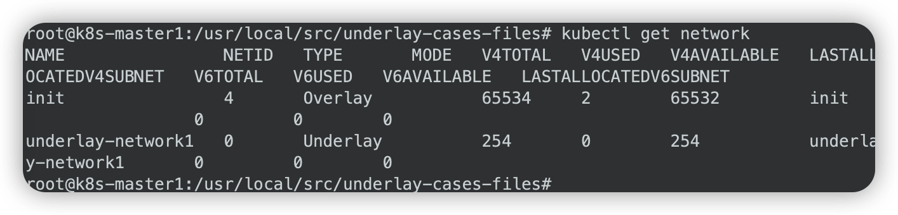
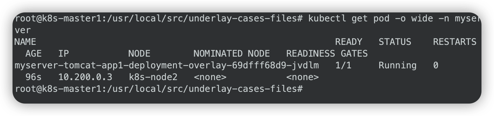

# 极客时间运维进阶训练营第十六周作业

## 作业要求

1、总结Underlay和Overlay网络的区别及优缺点

2、在kubernetes集群实现underlay网络

3、总结网络组件flannel vxlan模式的网络通信流程

4、总结网络组件calico IPIP模式的网络通信流程

扩展：基于二进制实现高可用的K8S集群环境


## 1. 总结Underlay和Overlay网络的区别及优缺点

### 1.1 Underlay和Overlay网络的区别

| 对比项       | Underlay                                                     | Overlay                                                      |
| ------------ | ------------------------------------------------------------ | ------------------------------------------------------------ |
| 数据传输     | 通过网络设备例如路由器、交换机进行传输                       | 沿着节点间的虚拟链路进行传输                                 |
| 包封装和开销 | 发生在网络的二层和三层                                       | 需要跨源和目的封装数据包，产生额外的开销                     |
| 报文控制     | 面向硬件                                                     | 面向软件                                                     |
| 部署时间     | 上线新服务涉及大量配置，耗时多                               | 只需更改虚拟网络中的拓扑结构，可快速部署                     |
| 多路径转发   | 因为可扩展性低，所以需要使用多路径转发，而这会产生更多的开销和网络复杂度 | 支持虚拟网络内的多路径转发                                   |
| 扩展性       | 底层网络一旦搭建好，新增设备较为困难，可扩展性差             | 扩展性强，例如VLAN最多可支持4096个标识符，而VXLAN则提供多达1600万个标识符 |
| 协议         | 以太网交换、VLAN、路由协议（OSPF、IS-IS、BGP 等）            | VXLAN、NVGRE、SST、GRE、NVO3、EVPN                           |
| 多租户管理   | 需要使用基于NAT或者VRF的隔离，这在大型网络中是个巨大的挑战   | 能够管理多个租户之间的重叠IP地址                             |

### 1.2 Underlay和Overlay网络的优缺点

#### Overlay网络简介

Overlay叫叠加网络也叫覆盖网络，指的是在物理网络的基础之上叠加实现新的虚拟网络，即可使网络的中的容器可以相互通信。

优点是对物理网络的兼容性比较好，可以实现pod的跨宿主机子网通信。

calico与flannel等网络插件都支持overlay网络。

缺点是有额外的封装与解封性能开销。

目前私有云使用比较多。

#### Overlay网络的设备

VTEP（VXLAN Tunnel Endpoint vxlan隧道端点）：VTEP是VXLAN网络的边缘设备，是VXLAN隧道的起点和终点，VXLAN对用户原始数据帧的封装和解封装均在VTEP上进行，用于VXLAN报文的封装和解封装，VTEP与物理网络相连，VXLAN报文中源IP地址为本节点的VTEP地址，VXLAN报文中目的IP地址为对端节点的VTEP地址，一对VTEP地址就对应着一个VXLAN隧道，服务器上的虚拟交换机（隧道flannel.1就是VTEP)，比如一个虚拟机网络中的多个vxlan就需要多个VTEP对不同网络的报文进行封装与解封装。

VNI（VXLAN Network Identifier）：VXLAN网络标识VNI类似VLAN ID，用于区分VXLAN段，不同VXLAN段的虚拟机不能直接二层相互通信，一个VNI表示一个租户，即使多个终端用户属于同一个VNI，也表示一个租户。

NVGRE：Network Virtualization using Generic Routing Encapsulation，主要支持者是Microsoft，与VXLAN不同的是，NVGRE没有采用标准传输协议（TCP/UDP），而是借助通用路由封装协议（GRE），NVGRE使用GRE头部的低24位作为租户网络标识符（TNI），与VXLAN一样可以支持1777216个vlan。

#### Overlay通信

1.VM A发送L2 帧与VM请求与VM B通信。

2.源宿主机VTEP添加或者封装VXLAN、UDP及IP头部报文。

3.网络层设备将封装后的报文通过标准的报文在三层网络进行转发到目标主机。

4.目标宿主机VTEP删除或者解封装VXLAN、UDP及IP头部。

5.将原始L2帧发送给目标VM。


#### Underlay网络简介

Underlay网络就是传统IT基础设施网络，由交换机和路由器等设备组成，借助以太网协议、路由协议和VLAN协议等驱动，它还是Overlay网络的底层网络，为Overlay网络提供数据通信服务。

容器网络中的Underlay网络是指借助驱动程序将宿主机的底层网络接口直接暴露给容器使用的一种网络构建技术，较为常见的解决方案有MAC VLAN、IP VLAN和直接路由等。

Underlay依赖于网络网络进行跨主机通信。

#### underlay实现模式

MAC VLAN模式：支持在同一个以太网接口上虚拟出多个网络接口（子接口），每个虚拟接口都拥有唯一的MAC地址并可配置网卡子接口IP。

IP VLAN模式：IP VLAN类似于MAC VLAN，它同样创建新的虚拟网络接口并为每个接口分配唯一的IP地址，不同之处在于，每个虚拟接口将共享使用物理接口的MAC地址。

#### Underlay网络架构


## 2. 在kubernetes集群实现underlay网络

### 2.1 节点及网络规划

```bash
# master1
172.16.17.31

# node1
172.16.17.34
# node2
172.16.17.35

# 网络规划
vpc: 172.16.16.0/21
- master: 172.16.17.0/24
- svc: 172.16.18.0/24
- pod: 172.16.19.0/24
```

### 2.2 各节点安装docker

```bash
# 定义hosts
vim /etc/hosts

172.16.17.31 k8s-master1 k8s-master1.igalaxycn.com
172.16.17.34 k8s-node1 k8s-node1.igalaxycn.com
172.16.17.35 k8s-node2 k8s-node2.igalaxycn.com

# 关闭swap并重启
# 列出启用swap的设备
systemctl --type swap
# 如下针对列出的设备禁用swap
systemctl mask swap.img.swap

# 安装依赖包
apt-get update
apt -y install apt-transport-https ca-certificates curl software-properties-common

# 安装GPG证书
curl -fsSL http://mirrors.aliyun.com/docker-ce/linux/ubuntu/gpg | sudo apt-key add -

# 写入软件源信息
add-apt-repository "deb [arch=amd64] http://mirrors.aliyun.com/docker-ce/linux/ubuntu $(lsb_release -cs) stable"

# 更新源
apt update

# 查看docker可安装的版本
apt-cache madison docker-ce docker-ce-cli

# 安装docker
apt install -y docker-ce=5:20.10.23~3-0~ubuntu-focal docker-ce-cli=5:20.10.23~3-0~ubuntu-focal

# 启动docker并加入开机自启动
systemctl start docker && systemctl enable docker

# 参数优化，配置镜像加速并使用systemd
mkdir -p /etc/docker
tee /etc/docker/daemon.json <<-'EOF'
{
"exec-opts": ["native.cgroupdriver=systemd"],
"registry-mirrors": ["https://9916w1ow.mirror.aliyuncs.com"]
}
EOF

# 重启docker使配置生效
systemctl daemon-reload && sudo systemctl restart docker

# 查看docker配置信息
docker info
```

### 2.3 各节点安装cri-dockerd

```bash
# 下载二进制安装包
cd /usr/local/src
scp 172.16.8.63:/home/zhanghui/common/cri-dockerd-0.3.1.amd64.tgz .

# 解压安装包
tar xvf cri-dockerd-0.3.1.amd64.tgz

# 拷贝二进制文件到可执行目录
cp cri-dockerd/cri-dockerd /usr/local/bin/

# 编写cri-docker.service
vim /lib/systemd/system/cri-docker.service

[Unit]
Description=CRI Interface for Docker Application Container Engine
Documentation=https://docs.mirantis.com
After=network-online.target firewalld.service docker.service
Wants=network-online.target
Requires=cri-docker.socket

[Service]
Type=notify
ExecStart=/usr/local/bin/cri-dockerd --network-plugin=cni --pod-infra-container-image=registry.aliyuncs.com/google_containers/pause:3.9
ExecReload=/bin/kill -s HUP $MAINPID
TimeoutSec=0
RestartSec=2
Restart=always
StartLimitBurst=3
StartLimitInterval=60s
LimitNOFILE=infinity
LimitNPROC=infinity
LimitCORE=infinity
TasksMax=infinity
Delegate=yes
KillMode=process

[Install]
WantedBy=multi-user.target

# 配置cri-docker.socket文件
vim /etc/systemd/system/cri-docker.socket

[Unit]
Description=CRI Docker Socket for the API
PartOf=cri-docker.service

[Socket]
ListenStream=%t/cri-dockerd.sock
SocketMode=0660
SocketUser=root
SocketGroup=docker

[Install]
WantedBy=sockets.target

# 下载基础镜像
docker pull registry.aliyuncs.com/google_containers/pause:3.9

# 启动服务
systemctl daemon-reload && systemctl restart cri-docker && systemctl enable cri-docker && systemctl enable --now cri-docker.socket

# 查看cri-docker启动状态
systemctl status cri-docker
```

### 2.4 各节点安装kubeadm

```bash
# 安装依赖包
apt-get update && apt-get install -y apt-transport-https

# 导入证书
curl https://mirrors.aliyun.com/kubernetes/apt/doc/apt-key.gpg | apt-key add -

# 使用阿里云源
cat <<EOF >/etc/apt/sources.list.d/kubernetes.list
deb https://mirrors.aliyun.com/kubernetes/apt/ kubernetes-xenial main
EOF

# 更新源
apt update

# 验证源
apt-cache madison kubeadm

# 安装kubeadm
apt-get install -y kubelet=1.24.10-00 kubeadm=1.24.10-00 kubectl=1.24.10-00

# 验证版本
kubeadm version

kubeadm version: &version.Info{Major:"1", Minor:"24", GitVersion:"v1.24.10", GitCommit:"5c1d2d4295f9b4eb12bfbf6429fdf989f2ca8a02", GitTreeState:"clean", BuildDate:"2023-01-18T19:13:52Z", GoVersion:"go1.19.5", Compiler:"gc", Platform:"linux/amd64"}
```

### 2.5 初始化集群

```bash
# 查看依赖镜像
kubeadm config images list --kubernetes-version v1.24.10

registry.k8s.io/kube-apiserver:v1.24.10
registry.k8s.io/kube-controller-manager:v1.24.10
registry.k8s.io/kube-scheduler:v1.24.10
registry.k8s.io/kube-proxy:v1.24.10
registry.k8s.io/pause:3.7
registry.k8s.io/etcd:3.5.6-0
registry.k8s.io/coredns/coredns:v1.8.6

# 各节点下载镜像
docker pull registry.cn-hangzhou.aliyuncs.com/google_containers/kube-apiserver:v1.24.10
docker pull registry.cn-hangzhou.aliyuncs.com/google_containers/kube-controller-manager:v1.24.10
docker pull registry.cn-hangzhou.aliyuncs.com/google_containers/kube-scheduler:v1.24.10
docker pull registry.cn-hangzhou.aliyuncs.com/google_containers/kube-proxy:v1.24.10
docker pull registry.cn-hangzhou.aliyuncs.com/google_containers/pause:3.7
docker pull registry.cn-hangzhou.aliyuncs.com/google_containers/etcd:3.5.6-0
docker pull registry.cn-hangzhou.aliyuncs.com/google_containers/coredns:1.8.6

# master节点初始化集群
# pod使用overlay
# svc不论pod是overlay还是underlay，均使用underlay网段172.16.19.*
kubeadm init --apiserver-advertise-address=172.16.17.31 \
--apiserver-bind-port=6443 \
--kubernetes-version=v1.24.10 \
--pod-network-cidr=10.200.0.0/16 \
--service-cidr=172.16.18.0/24 \
--service-dns-domain=cluster.local \
--image-repository=registry.cn-hangzhou.aliyuncs.com/google_containers \
--ignore-preflight-errors=swap \
--cri-socket unix:///var/run/cri-dockerd.sock

# 在各node节点进行添加，粘帖复制上面的运行结果
kubeadm join 172.16.17.31:6443 --token szv2tk.tm3ixqyd0nda359v \
        --discovery-token-ca-cert-hash sha256:55fa83a42136fe7cb0436696187cf925773f93a5b32789307df308ba5993f469 \
        --cri-socket unix:///var/run/cri-dockerd.sock

# master1节点配置kubectl
mkdir -p $HOME/.kube
cp -i /etc/kubernetes/admin.conf $HOME/.kube/config
chown $(id -u):$(id -g) $HOME/.kube/config

# 查询节点
kubectl get node

NAME          STATUS     ROLES           AGE   VERSION
k8s-master1   NotReady   control-plane   11m   v1.24.10
k8s-node1     NotReady   <none>          85s   v1.24.10
k8s-node2     NotReady   <none>          59s   v1.24.10

# 各节点分发kubeconfig认证文件
mkdir -p $HOME/.kube
scp /root/.kube/config 172.16.17.34:/root/.kube/
scp /root/.kube/config 172.16.17.35:/root/.kube/

# node节点执行kubectl命令验证
kubectl get node

# 初始化失败后如何卸载重做
kubeadm reset --cri-socket unix:///run/cri-dockerd.sock && rm -rf /etc/kubernetes/ /var/lib/kubelet /var/lib/dockershim /var/run/kubernetes /var/lib/cni /etc/cni/net.d && rm -rf /var/lib/etcd
# 删除已启动的容器
docker rm -f $(docker ps -aq)
```

### 2.6 安装helm

```bash
# master1节点
# 下载二进制安装包
cd /usr/local/src/
wget https://get.helm.sh/helm-v3.9.0-linux-amd64.tar.gz

# 解压
tar xvf helm-v3.9.0-linux-amd64.tar.gz

# 将二进制文件放到可执行目录
mv linux-amd64/helm /usr/local/bin/

# 检查helm命令
helm --help
```

### 2.7 部署网络组件hybridnet

```bash
# master1节点
# 添加helm源
helm repo add hybridnet https://alibaba.github.io/hybridnet/

# 更新源
helm repo update

# 配置overlay pod网络（使用kubeadm初始化时指定的pod网络），如果不指定--set init.cidr=10.200.0.0/16默认会使用100.64.0.0/16
helm install hybridnet hybridnet/hybridnet -n kube-system --set init.cidr=10.200.0.0/16

# 验证pod状态
kubectl get pod -A

# 查看pod事件
# pending有亲和错误
kubectl describe pod hybridnet-manager-6574dcc5fb-8mk8f -n kube-system

# 给各节点打标签
kubectl label node k8s-node1 node-role.kubernetes.io/master=

kubectl label node k8s-node2 node-role.kubernetes.io/master=

kubectl label node k8s-master1 node-role.kubernetes.io/master=

# 查看pod
# 确保都running
kubectl get pod -A
```


### 2.8 创建underlay网络并与node节点关联

```bash
# master节点
# 需要为各node节点打上underlay网络标签
kubectl label node k8s-node1 network=underlay-nethost
kubectl label node k8s-node2 network=underlay-nethost
kubectl label node k8s-master1 network=underlay-nethost

# 创建underlay网络
上传underlay-cases-files目录

# 修改yaml文件
cd underlay-cases-files/
vim 1.create-underlay-network.yaml 

range:
  version: "4"
  cidr: "172.16.16.0/21"
  gateway: "172.16.16.1" #默认网关
  start: "172.16.19.1" #分配给pod的起始地址
  end: "172.16.19.254"

# 创建underlay网络
kubectl apply -f 1.create-underlay-network.yaml 

# 验证网络
kubectl get network
```



### 2.9 创建pod并使用overlay网络

```bash
# 创建namaspace
kubectl create ns myserver

# 修改pod配置
# 默认是overlay网络
# 不指定创建在哪个节点
vim 2.tomcat-app1-overlay.yaml

spec:
  #nodeName: k8s-node2

# 创建
kubectl apply -f 2.tomcat-app1-overlay.yaml

# 查看pod
# 地址为10.200.*
kubectl get pod -o wide -n myserver

# 查看service
kubectl get svc -n myserver

# 浏览器访问
http://172.16.17.31:30003/myapp

# 验证overlay pod通信
kubectl exec -it myserver-tomcat-app1-deployment-overlay-69dfff68d9-jvdlm bash -n myserver

ping baidu.com
```




### 2.10 创建pod并使用underlay网络

```bash
# 修改pod配置
# 指定为underlay网络
# 不指定创建在哪个节点
vim 3.tomcat-app1-underlay.yaml

spec:
  template:
    metadata:
      annotations:
        networking.alibaba.com/network-type: Underlay
    #nodeName: k8s-node2

  
# 创建
kubectl apply -f 3.tomcat-app1-underlay.yaml 

# 查看pod
# 地址为172.16.18.*
kubectl get pod -o wide -n myserver

# 查看service
# 地址为172.16.19.*
kubectl get svc -n myserver

# 浏览器访问pod
http://172.16.19.1:8080/myapp
```


## 3. 总结网络组件flannel vxlan模式的网络通信流程

由CoreOS开源的针对k8s的网络服务，其目的为解决kubernetes集群中各主机上的pod相互通信的问题，其借助于etcd维护网络IP地址分配，并为每一个node服务器分配一个不同的IP地址段。

### 3.1 Flannel的工作原理

Flannel 实质上就是一种Overlay网络，也就是将TCP数据包装在另一种网络包里面进行路由转发和通信，目前已经支持UDP、VxLAN、AWS VPC和GCE路由等数据转发方式。

Flannel会在每一个宿主机上运行名为flanneld代理，其负责为宿主机预先分配一个子网，并为Pod分配IP地址。Flannel使用Kubernetes或etcd来存储网络配置、分配的子网和主机公共IP等信息。数据包则通过VXLAN、UDP或host-gw这些类型的后端机制进行转发。

Flannel规定宿主机下各个Pod属于同一个子网，不同宿主机下的Pod属于不同的子网。

### 3.2 Flannel 工作模式

UDP 模式：使用设备flannel.0进行封包解包，不是内核原生支持，频繁地内核态用户态切换，性能非常差；

VxLAN模式：使用flannel.1进行封包解包，内核原生支持，性能较强；

host-gw 模式：无需flannel.1这样的中间设备，直接宿主机当作子网的下一跳地址，性能最强；

host-gw的性能损失大约在10%左右，而其他所有基于VxLAN“隧道”机制的网络方案，性能损失在20%~30%左右。

### 3.3 Flannel vxlan通信流程


1、源pod发起请求，此时报文中源IP为pod的eth0的ip，源mac为pod的eth0的mac，目的Pod为目的Pod的IP，目的mac为网关(cni0)的MAC

2、数据报文通过veth peer发送给网关cni0，检查目的mac就是发给自己的，cni0进行目标IP检查，如果是同一个网桥的报文就直接转发，不是的话就发送给
flannel.1，此时报文被修改如下：

源IP：Pod IP，10.100.2.2

目的IP: Pod IP，10.100.1.6

源MAC： 源Pod MAC

目的MAC：cni MAC

3、到达flannel.1，检查目的mac就是发给自己的，开始匹配路由表，先实现overlay报文的内层封装（主要是修改目的Pod的对端flannel.1的MAC、源MAC为当
前宿主机flannel.1的MAC）

源IP：Pod IP，10.100.2.2

目的IP：Pod IP，10.100.1.6

源MAC：源Pod所在宿主机flannel.1的MAC

目的MAC：目的Pod所在主机flannel.1的MAC

4、源宿主机基于UDP封装Vxlan报文

VXLAN ID：1

UDP 源端口：随机

UDP 目的端口：8472

源IP：源Pod所在宿主机的物理网卡IP

目的IP：目的Pod所在宿主机的物理网卡IP

源MAC：源Pod所在宿主机的物理网卡

目的MAC：目的Pod所在宿主机的物理网卡

5、报文到达目的宿主机物理网卡，接开始解封装报文

6、报文到达目的宿主机flannel.1

目的IP：10.100.1.6 #目的Pod

源IP：   10.100.2.2 #源Pod

目的MAC：目的pod所在宿主机的flannel.1

源MAC：源pod所在宿主机flannel.1的MAC

7、报文到达目的宿主机cni0

源IP： 10.100.2.2  #源Pod

目的IP： 10.100.1.6 #目的Pod

源MAC：cni0的MAC

目的MAC: 目的Pod的MAC

8、报文到达目的宿主机pod

目的IP：目的pod IP 10.100.1.6

源IP：源Pod IP 10.200.2.2

目的MAC：目的pod MAC

源MAC：cni0的MAC


## 4. 总结网络组件calico IPIP模式的网络通信流程


1、源pod发起请求，报文到达宿主机与pod对应的网卡

2、报文到达在宿主机与pod对应的网卡

源IP为pod的eth0的ip

源mac为pod的eth0的mac

目的IP为10.200.151.205

下一跳为网关地址169.254.1.1

目的mac为ee:ee:ee:ee:ee:ee，默认网关169.254.1.1的MAC地
址

源端口随机产生目的端口80

3、报文到达源宿主机tun0

此时报文的源IP为源pod IP，目的IP为目的pod IP，没有MAC 地址

4、报文到达源宿主机eth0

此时报文为IPinIP格式，外层为源宿主机和目的宿主机的源MAC目的MAC、源IP及目的IP，内部为源pod IP及目的pod的IP，没有使用pod的MAC地址

5、报文到达目的宿主机eth0

此时收到的是源宿主机的IPinIP报文，外层为源宿主机和目的宿主机的源MAC目的MAC、源IP及目的IP，内部为源pod IP及目的pod的IP，没有使用MAC地址

6、报文到达目的宿主机tunl0

报文到达目的宿主机tunl0，此时源IP为源pod IP，目的IP为目的pod的IP，没有MAC地址

7、报文到达目的Pod与目的宿主机对应的网卡

报文到达目的宿主机网卡，此时源IP为源Pod IP，源MCA为tunl0 MAC，目的IP为目的Pod IP，目的MAC为目的Pod MAC，随后报文被转发到目的MAC（目的Pod）

8、报文到达目的Pod

报文到达目的pod，目的pod接受请求并构建响应报文并原路返回给源pod


## 5. 扩展：基于二进制实现高可用的K8S集群环境

### 5.1 节点

| 类型     | 主机IP       | 主机名      | VIP           |
| -------- | ------------ | ----------- | ------------- |
| ansible  | 172.16.17.30 | k8s-deploy  |               |
| master1  | 172.16.17.31 | k8s-master1 | 172.16.17.188 |
| master2  | 172.16.17.32 | k8s-master2 | 172.16.17.188 |
| master3  | 172.16.17.33 | k8s-master3 | 172.16.17.188 |
| node1    | 172.16.17.34 | k8s-node1   |               |
| node2    | 172.16.17.35 | k8s-node2   |               |
| node3    | 172.16.17.36 | k8s-node3   |               |
| etcd1    | 172.16.17.37 | k8s-etcd1   |               |
| etcd2    | 172.16.17.38 | k8s-etcd2   |               |
| etcd3    | 172.16.17.39 | k8s-etcd3   |               |
| haproxy1 | 172.16.17.40 | ha1         |               |
| harbor   | 172.16.17.42 | harbor      |               |
| client   | 172.16.17.43 | client1     |               |
| nfs      | 172.16.17.41 | nfs         |               |
| haproxy2 | 172.16.17.50 | ha2         |               |

### 5.2 安装harbor

```bash
# harbor节点
# 切换到docker安装目录
cd /usr/local/src/
scp 172.16.8.63:/home/zhanghui/common/docker-20.10.19-binary-install.tar.gz .

# 解压安装包
tar xvf docker-20.10.19-binary-install.tar.gz

# 安装docker
bash docker-install.sh
docker info
docker-compose version

# 创建harbor安装目录
mkdir /apps
cd /apps/
scp 172.16.8.63:/home/zhanghui/common/harbor-offline-installer-v2.7.1.tgz .
tar -xzf harbor-offline-installer-v2.7.1.tgz

# 上传已申请证书
# 阿里云控制台-->SSL证书-->下载-->Nginx pem/key
cd harbor/
mkdir certs
cd certs/
scp 172.16.8.63:/home/zhanghui/common/8095873__igalaxycn.com_nginx.zip .
unzip 8095873__igalaxycn.com_nginx.zip
mv 8095873__igalaxycn.com.pem harbor.igalaxycn.com.crt
mv 8095873__igalaxycn.com.key harbor.igalaxycn.com.key

# 挂载数据盘到/data/harbor
# 虚机单独挂载1000G数据盘
# 检查是否有该设备/dev/sdb
fdisk -l

# 格式化
mkfs.xfs /dev/sdb

# 创建挂载路径
mkdir /data/harbor -p
vim /etc/fstab

/dev/sdb /data/harbor xfs defaults 0 0

# 挂载
mount -a
df -h

# 修改harbor配置文件
cp harbor.yml.tmpl harbor.yml
vim harbor.yml

hostname: harbor.igalaxycn.com

http:
  port: 80

https:
  port: 443
  certificate: /apps/harbor/certs/harbor.igalaxycn.com.crt
  private_key: /apps/harbor/certs/harbor.igalaxycn.com.key

harbor_admin_password: password

data_volume: /data/harbor

# 安装harbor
# 打开安全扫描器及Helm chart
./install.sh --with-trivy --with-chartmuseum

# 添加dns解析
172.16.17.42 harbor.igalaxycn.com

# 浏览访问
https://harbor.igalaxycn.com
新建baseimages项目，访问级别公开


# client1节点
# 客户端公有证书同步
mkdir -p /etc/docker/certs.d/harbor.igalaxycn.com
scp 172.16.17.42:/apps/harbor/certs/harbor.igalaxycn.com.crt /etc/docker/certs.d/harbor.igalaxycn.com/

# 公有证书签发登录
docker login harbor.igalaxycn.com

# 检查生成的认证配置
cat /root/.docker/config.json

# 解密登录信息
echo YWRtaW46cGFzc3dvcmQ= | base64 -d

# 测试推送镜像
docker pull centos:centos7.9.2009
docker tag docker.io/library/centos:centos7.9.2009 harbor.igalaxycn.com/baseimages/centos:centos7.9.2009
docker push harbor.igalaxycn.com/baseimages/centos:centos7.9.2009
```


### 5.3 配置负载均衡器

```bash
# ha1
# 安装keepalived和haproxy
apt update
apt install keepalived haproxy -y

# 修改配置文件
cp /usr/share/doc/keepalived/samples/keepalived.conf.vrrp /etc/keepalived/keepalived.conf

# 修改配置文件
# 与实际网卡对应，把不需要的vrrp接口删掉
vim /etc/keepalived/keepalived.conf

! Configuration File for keepalived

global_defs {
   notification_email {
     acassen
   }
   notification_email_from Alexandre.Cassen@firewall.loc
   smtp_server 192.168.200.1
   smtp_connect_timeout 30
   router_id LVS_DEVEL
}

vrrp_instance VI_1 {
    state MASTER  #master表示主服务器
    interface ens160 #承载vip地址的物理接口
    garp_master_delay 10
    smtp_alert
    virtual_router_id 51 #虚拟路由器ID号，每个热备组一致
    priority 100 #优先级，数值越大优先级越高
    advert_int 1 #心跳频率
    authentication { #认证信息，每个热备组一致
        auth_type PASS #认证类型
        auth_pass 1111 #密码
    }
    virtual_ipaddress { #vip漂移地址，可以是多个
        172.16.17.188 dev ens160 label ens160:0
        172.16.17.189 dev ens160 label ens160:1
        172.16.17.190 dev ens160 label ens160:2
        172.16.17.191 dev ens160 label ens160:3
        172.16.17.192 dev ens160 label ens160:4
    }
}

# 重启keepalived
systemctl restart keepalived
systemctl enable keepalived

# 查看网卡
ip a show dev ens160

============>>out
...
2: ens160: <BROADCAST,MULTICAST,UP,LOWER_UP> mtu 1500 qdisc mq state UP group default qlen 1000
    link/ether 00:50:56:ae:e3:b8 brd ff:ff:ff:ff:ff:ff
    inet 172.16.17.40/21 brd 172.16.23.255 scope global ens160
       valid_lft forever preferred_lft forever
    inet 172.16.17.188/32 scope global ens160:0
       valid_lft forever preferred_lft forever
    inet 172.16.17.189/32 scope global ens160:1
       valid_lft forever preferred_lft forever
    inet 172.16.17.190/32 scope global ens160:2
       valid_lft forever preferred_lft forever
    inet 172.16.17.191/32 scope global ens160:3
       valid_lft forever preferred_lft forever
    inet 172.16.17.192/32 scope global ens160:4
       valid_lft forever preferred_lft forever
    inet6 fe80::250:56ff:feae:e3b8/64 scope link 
       valid_lft forever preferred_lft forever
============>>end


# ha2
# 安装keepalived和haproxy
apt update
apt install keepalived haproxy -y

# 修改配置文件
cp /usr/share/doc/keepalived/samples/keepalived.conf.vrrp /etc/keepalived/keepalived.conf

# 修改配置文件
# 与实际网卡对应，把不需要的vrrp接口删掉
vim /etc/keepalived/keepalived.conf

! Configuration File for keepalived

global_defs {
   notification_email {
     acassen
   }
   notification_email_from Alexandre.Cassen@firewall.loc
   smtp_server 192.168.200.1
   smtp_connect_timeout 30
   router_id LVS_DEVEL
}

vrrp_instance VI_1 {
    state BACKUP  #master表示主服务器
    interface ens160 #承载vip地址的物理接口
    garp_master_delay 10
    smtp_alert
    virtual_router_id 51 #虚拟路由器ID号，每个热备组一致
    priority 90 #优先级，数值越大优先级越高
    advert_int 1 #心跳频率
    authentication { #认证信息，每个热备组一致
        auth_type PASS #认证类型
        auth_pass 1111 #密码
    }
    virtual_ipaddress { #vip漂移地址，可以是多个
        172.16.17.188 dev ens160 label ens160:0
        172.16.17.189 dev ens160 label ens160:1
        172.16.17.190 dev ens160 label ens160:2
        172.16.17.191 dev ens160 label ens160:3
        172.16.17.192 dev ens160 label ens160:4
    }
}

# 重启keepalived
systemctl restart keepalived
systemctl enable keepalived

# 查看网卡
ip a show dev ens160

============>>out
...
2: ens160: <BROADCAST,MULTICAST,UP,LOWER_UP> mtu 1500 qdisc mq state UP group default qlen 1000
    link/ether 00:50:56:ae:6a:05 brd ff:ff:ff:ff:ff:ff
    inet 172.16.17.50/21 brd 172.16.23.255 scope global ens160
       valid_lft forever preferred_lft forever
    inet6 fe80::250:56ff:feae:6a05/64 scope link 
       valid_lft forever preferred_lft forever
============>>end


# 测试双机热备功能
# client1
# 持续ping vip地址观察中断情况
ping -t 172.16.17.188
# ha1
system stop keepalived
# ha1
system start keepalived


# ha1和ha2
# 配置haproxy
vim /etc/haproxy/haproxy.cfg

# 最后添加如下行
listen k8s_api_nodes_6443
    bind 172.16.17.188:6443
    mode tcp
    # 均衡到3个master
    server k8s-master1 172.16.17.31:6443 check inter 2000 fall 3 rise 5
    server k8s-master2 172.16.17.32:6443 check inter 2000 fall 3 rise 5
    server k8s-master3 172.16.17.33:6443 check inter 2000 fall 3 rise 5
    
# 开启内核参数，可监听不在本机的地址
echo net.ipv4.ip_nonlocal_bind = 1 >> /etc/sysctl.conf
# 内核参数生效
sysctl -p
# 查询
sysctl -a |grep local_bind

# 重启haproxy
systemctl restart haproxy.service
systemctl enable haproxy.service
systemctl status haproxy.service

# 检查端口
ss -tnlp
```

### 5.4 安装部署节点

```bash
# deploy节点
# 安装ansible
apt install python3-pip git -y
pip3 install ansible -i https://mirrors.aliyun.com/pypi/simple
ansible --version

# 生成密钥对
ssh-keygen

# 安装sshpass
apt install sshpass -y

# 创建分发公钥脚本
# 包括3个master、node、etcd节点
vim ssh-key-scp.sh

#!/bin/bash
#目标主机地址
IP="
172.16.17.31
172.16.17.32
172.16.17.33
172.16.17.34
172.16.17.35
172.16.17.36
172.16.17.37
172.16.17.38
172.16.17.39
"

read -p "input password:" PASSWORD

for node in ${IP};do
  sshpass -p "$PASSWORD" ssh-copy-id ${node} -o StrictHostKeyChecking=no #修改相应的root密码
  if [ $? -eq 0 ];then
      echo "${node} 秘钥copy完成"
  else
      echo "${node} 秘钥copy失败"
  fi
done

# 执行脚本
bash ssh-key-scp.sh

# 验证免密钥登录
ssh 172.16.17.31

# 下载kubeasz
export release=3.2.0
wget https://github.com/easzlab/kubeasz/releases/download/${release}/ezdown
chmod +x ./ezdown

# 修改脚本
vim ezdown

DOCKER_VER=20.10.23
KUBEASZ_VER=3.2.0
K8S_BIN_VER=v1.23.1
EXT_BIN_VER=1.0.0
SYS_PKG_VER=0.4.2
HARBOR_VER=v2.1.3
REGISTRY_MIRROR=CN

# 下载kubeasz代码、二进制、默认容器镜像
./ezdown -D
ll /etc/kubeasz/down/

# 下载系统包
# 可选，当无法使用yum/apt在线安装系统包时使用
./ezdown -P
# /etc/kubeasz包含kubeasz版本的发布代码
# /etc/kubeasz/bin包含kubernetes/etcd/docker/cni等二进制文件
# /etc/kubeasz/down包含集群安装时需要的离线容器镜像
# /etc/kubeasz/down/packages包含集群安装时需要的系统基础软件

# 定义集群k8s-01，生成ansible hosts文件
cd /etc/kubeasz/
./ezctl new k8s-01

# 编辑ansible hosts文件
# 先装2个master、2个node，后面再扩容
vim /etc/kubeasz/clusters/k8s-01/hosts

# etcd
[etcd]
172.16.17.37
172.16.17.38
172.16.17.39

# master node(s)
[kube_master]
172.16.17.31
172.16.17.32

# work node(s)
[kube_node]
172.16.17.34
172.16.17.35

[harbor]
#192.168.1.8 NEW_INSTALL=false

# loadbalance for accessing k8s from outside
[ex_lb]
#192.168.1.6 LB_ROLE=backup EX_APISERVER_VIP=192.168.1.250 EX_APISERVER_PORT=8443
#192.168.1.7 LB_ROLE=master EX_APISERVER_VIP=192.168.1.250 EX_APISERVER_PORT=8443

# [optional] ntp server for the cluster
[chrony]
#192.168.1.1

[all:vars]
# --------- Main Variables ---------------
# Secure port for apiservers
SECURE_PORT="6443"

# Cluster container-runtime supported: docker, containerd
CONTAINER_RUNTIME="docker"

# Network plugins supported: calico, flannel, kube-router, cilium, kube-ovn
CLUSTER_NETWORK="calico"

# Service proxy mode of kube-proxy: 'iptables' or 'ipvs'
PROXY_MODE="ipvs"

# K8S Service CIDR, not overlap with node(host) networking
SERVICE_CIDR="10.100.0.0/16"

# Cluster CIDR (Pod CIDR), not overlap with node(host) networking
CLUSTER_CIDR="10.200.0.0/16"

# NodePort Range
NODE_PORT_RANGE="30000-60000"

# Cluster DNS Domain
CLUSTER_DNS_DOMAIN="cluster.local"

# -------- Additional Variables (don't change the default value right now) ---
# Binaries Directory
bin_dir="/usr/local/bin"

# Deploy Directory (kubeasz workspace)
base_dir="/etc/kubeasz"

# Directory for a specific cluster
cluster_dir="{{ base_dir }}/clusters/k8s-01"

# CA and other components cert/key Directory
ca_dir="/etc/kubernetes/ssl"


# 编辑config.yml 文件
vim /etc/kubeasz/clusters/k8s-01/config.yml

############################
# prepare
############################
# 可选离线安装系统软件包 (offline|online)
INSTALL_SOURCE: "online"

# 可选进行系统安全加固 github.com/dev-sec/ansible-collection-hardening
OS_HARDEN: false

# 设置时间源服务器【重要：集群内机器时间必须同步】
ntp_servers:
  - "ntp1.aliyun.com"
  - "time1.cloud.tencent.com"
  - "0.cn.pool.ntp.org"

# 设置允许内部时间同步的网络段，比如"10.0.0.0/8"，默认全部允许
local_network: "0.0.0.0/0"


############################
# role:deploy
############################
# default: ca will expire in 100 years
# default: certs issued by the ca will expire in 50 years
CA_EXPIRY: "876000h"
CERT_EXPIRY: "438000h"

# kubeconfig 配置参数
CLUSTER_NAME: "cluster1"
CONTEXT_NAME: "context-{{ CLUSTER_NAME }}"

# k8s version
K8S_VER: "1.23.1"

############################
# role:etcd
############################
# 设置不同的wal目录，可以避免磁盘io竞争，提高性能
ETCD_DATA_DIR: "/var/lib/etcd"
ETCD_WAL_DIR: ""


############################
# role:runtime [containerd,docker]
############################
# ------------------------------------------- containerd
# [.]启用容器仓库镜像
ENABLE_MIRROR_REGISTRY: true

# [containerd]基础容器镜像
SANDBOX_IMAGE: "easzlab/pause:3.6"

# [containerd]容器持久化存储目录
CONTAINERD_STORAGE_DIR: "/var/lib/containerd"

# ------------------------------------------- docker
# [docker]容器存储目录
DOCKER_STORAGE_DIR: "/var/lib/docker"

# [docker]开启Restful API
ENABLE_REMOTE_API: false

# [docker]信任的HTTP仓库
INSECURE_REG: '["127.0.0.1/8","harbor.igalaxycn.com","172.16.17.42"]'


############################
# role:kube-master
############################
# k8s 集群 master 节点证书配置，可以添加多个ip和域名（比如增加公网ip和域名）
MASTER_CERT_HOSTS:
  - "172.16.17.188"
  - "api.igalaxycn.com"
  #- "www.test.com"

# node 节点上 pod 网段掩码长度（决定每个节点最多能分配的pod ip地址）
# 如果flannel 使用 --kube-subnet-mgr 参数，那么它将读取该设置为每个节点分配pod网段
# https://github.com/coreos/flannel/issues/847
NODE_CIDR_LEN: 24


############################
# role:kube-node
############################
# Kubelet 根目录
KUBELET_ROOT_DIR: "/var/lib/kubelet"

# node节点最大pod 数
MAX_PODS: 200

# 配置为kube组件（kubelet,kube-proxy,dockerd等）预留的资源量
# 数值设置详见templates/kubelet-config.yaml.j2
KUBE_RESERVED_ENABLED: "no"

# k8s 官方不建议草率开启 system-reserved, 除非你基于长期监控，了解系统的资源占用状况；
# 并且随着系统运行时间，需要适当增加资源预留，数值设置详见templates/kubelet-config.yaml.j2
# 系统预留设置基于 4c/8g 虚机，最小化安装系统服务，如果使用高性能物理机可以适当增加预留
# 另外，集群安装时候apiserver等资源占用会短时较大，建议至少预留1g内存
SYS_RESERVED_ENABLED: "no"

# haproxy balance mode
BALANCE_ALG: "roundrobin"


############################
# role:network [flannel,calico,cilium,kube-ovn,kube-router]
############################
# ------------------------------------------- flannel
# [flannel]设置flannel 后端"host-gw","vxlan"等
FLANNEL_BACKEND: "vxlan"
DIRECT_ROUTING: false

# [flannel] flanneld_image: "quay.io/coreos/flannel:v0.10.0-amd64"
flannelVer: "v0.15.1"
flanneld_image: "easzlab/flannel:{{ flannelVer }}"

# [flannel]离线镜像tar包
flannel_offline: "flannel_{{ flannelVer }}.tar"

# ------------------------------------------- calico
# [calico]设置 CALICO_IPV4POOL_IPIP=“off”,可以提高网络性能，条件限制详见 docs/setup/calico.md
CALICO_IPV4POOL_IPIP: "Always"

# [calico]设置 calico-node使用的host IP，bgp邻居通过该地址建立，可手工指定也可以自动发现
IP_AUTODETECTION_METHOD: "can-reach={{ groups['kube_master'][0] }}"

# [calico]设置calico 网络 backend: brid, vxlan, none
CALICO_NETWORKING_BACKEND: "brid"

# [calico]更新支持calico 版本: [v3.3.x] [v3.4.x] [v3.8.x] [v3.15.x]
calico_ver: "v3.19.3"

# [calico]calico 主版本
calico_ver_main: "{{ calico_ver.split('.')[0] }}.{{ calico_ver.split('.')[1] }}"

# [calico]离线镜像tar包
calico_offline: "calico_{{ calico_ver }}.tar"

# ------------------------------------------- cilium
# [cilium]CILIUM_ETCD_OPERATOR 创建的 etcd 集群节点数 1,3,5,7...
ETCD_CLUSTER_SIZE: 1

# [cilium]镜像版本
cilium_ver: "v1.4.1"

# [cilium]离线镜像tar包
cilium_offline: "cilium_{{ cilium_ver }}.tar"

# ------------------------------------------- kube-ovn
# [kube-ovn]选择 OVN DB and OVN Control Plane 节点，默认为第一个master节点
OVN_DB_NODE: "{{ groups['kube_master'][0] }}"

# [kube-ovn]离线镜像tar包
kube_ovn_ver: "v1.5.3"
kube_ovn_offline: "kube_ovn_{{ kube_ovn_ver }}.tar"

# ------------------------------------------- kube-router
# [kube-router]公有云上存在限制，一般需要始终开启 ipinip；自有环境可以设置为 "subnet"
OVERLAY_TYPE: "full"

# [kube-router]NetworkPolicy 支持开关
FIREWALL_ENABLE: "true"

# [kube-router]kube-router 镜像版本
kube_router_ver: "v0.3.1"
busybox_ver: "1.28.4"

# [kube-router]kube-router 离线镜像tar包
kuberouter_offline: "kube-router_{{ kube_router_ver }}.tar"
busybox_offline: "busybox_{{ busybox_ver }}.tar"


############################
# role:cluster-addon
############################
# coredns 自动安装
# 手动安装时安装coredns
dns_install: "yes"
corednsVer: "1.8.6"
ENABLE_LOCAL_DNS_CACHE: false
dnsNodeCacheVer: "1.21.1"
# 设置 local dns cache 地址
LOCAL_DNS_CACHE: "169.254.20.10"

# metric server 自动安装
metricsserver_install: "no"
metricsVer: "v0.5.2"

# dashboard 自动安装
dashboard_install: "no"
dashboardVer: "v2.4.0"
dashboardMetricsScraperVer: "v1.0.7"

# ingress 自动安装
ingress_install: "no"
ingress_backend: "traefik"
traefik_chart_ver: "10.3.0"

# prometheus 自动安装
prom_install: "no"
prom_namespace: "monitor"
prom_chart_ver: "12.10.6"

# nfs-provisioner 自动安装
nfs_provisioner_install: "no"
nfs_provisioner_namespace: "kube-system"
nfs_provisioner_ver: "v4.0.2"
nfs_storage_class: "managed-nfs-storage"
nfs_server: "192.168.1.10"
nfs_path: "/data/nfs"

############################
# role:harbor
############################
# harbor version，完整版本号
HARBOR_VER: "v2.1.3"
HARBOR_DOMAIN: "harbor.yourdomain.com"
HARBOR_TLS_PORT: 8443

# if set 'false', you need to put certs named harbor.pem and harbor-key.pem in directory 'down'
HARBOR_SELF_SIGNED_CERT: false

# install extra component
HARBOR_WITH_NOTARY: false
HARBOR_WITH_TRIVY: false
HARBOR_WITH_CLAIR: false
HARBOR_WITH_CHARTMUSEUM: true
```

### 5.5 部署k8s集群

```bash
# 172.16.17.39
# 第一步系统设置初始化
cd /etc/kubeasz/
./ezctl setup k8s-01 01

# 第二步部署etcd集群
./ezctl setup k8s-01 02

# etcd1节点
# 验证各etcd节点服务状态
export NODE_IPS="172.16.17.37 172.16.17.38 172.16.17.39"
for ip in ${NODE_IPS}; do ETCDCTL_API=3 /usr/local/bin/etcdctl --endpoints=https://${ip}:2379    --cacert=/etc/kubernetes/ssl/ca.pem   --cert=/etc/kubernetes/ssl/etcd.pem  --key=/etc/kubernetes/ssl/etcd-key.pem endpoint health; done

# deploy节点
# 修改自动分发
vim roles/docker/tasks/main.yml

# 约第30行
# 希望直接创建好certs目录
- block:
  - name: 准备docker相关目录
    file: name={{ item }} state=directory
    with_items:
    - "{{ bin_dir }}"
    - "/etc/docker"
    - "/etc/bash_completion.d"
    - "/etc/docker/certs.d/harbor.igalaxycn.com"
# 约第89行
- name: docker证书分发
  copy: src=harbor.igalaxycn.com.crt dest=/etc/docker/certs.d/harbor.igalaxycn.com/harbor.igalaxycn.com.crt mode=0644
# 约92行，由于公网dns已设置，此步可选
- name: 添加域名解析
  shell: "echo '172.16.17.42 harbor.igalaxycn.com' >>/etc/hosts"

# 手动将证书从harbor节点拷到deploy节点，从部署节点分发
mkdir -pv /etc/docker/certs.d/harbor.igalaxycn.com/

# 将证书放到任务执行的文件目录中
scp root@172.16.17.42:/apps/harbor/certs/harbor.igalaxycn.com.crt /etc/kubeasz/roles/docker/files

scp /etc/kubeasz/roles/docker/files/harbor.igalaxycn.com.crt /etc/docker/certs.d/harbor.igalaxycn.com/

# 第三步部署运行时
./ezctl setup k8s-01 03

# client1节点
# 推送pause镜像到内网的harbor
docker login harbor.igalaxycn.com
docker pull registry.cn-hangzhou.aliyuncs.com/zhangshijie/pause:3.9
docker tag registry.cn-hangzhou.aliyuncs.com/zhangshijie/pause:3.9 harbor.igalaxycn.com/baseimages/pause:3.9
docker push harbor.igalaxycn.com/baseimages/pause:3.9

# deploy节点
# 修改SANDBOX_IMAGE定义的pause镜像地址
vim clusters/k8s-01/config.yml

############################
# role:runtime [containerd,docker]
############################
# [containerd]基础容器镜像
SANDBOX_IMAGE: "harbor.igalaxycn.com/baseimages/pause:3.9"

# 第四步部署master节点
./ezctl setup k8s-01 04

# 检查master节点情况
kubectl get node

NAME           STATUS                     ROLES    AGE     VERSION
172.16.17.31   Ready,SchedulingDisabled   master   2m26s   v1.23.1
172.16.17.32   Ready,SchedulingDisabled   master   2m26s   v1.23.1

# 第五步部署node节点
./ezctl setup k8s-01 05

# 检查node节点情况
kubectl get node

NAME           STATUS                     ROLES    AGE     VERSION
172.16.17.31   Ready,SchedulingDisabled   master   13m     v1.23.1
172.16.17.32   Ready,SchedulingDisabled   master   13m     v1.23.1
172.16.17.34   Ready                      node     9m13s   v1.23.1
172.16.17.35   Ready                      node     9m13s   v1.23.1

# 第六步部署calico网络服务
./ezctl setup k8s-01 06

# 须在master或node节点上验证calico
calicoctl node status

============>>out
...
Calico process is running.

IPv4 BGP status
+--------------+-------------------+-------+----------+-------------+
| PEER ADDRESS |     PEER TYPE     | STATE |  SINCE   |    INFO     |
+--------------+-------------------+-------+----------+-------------+
| 172.16.17.32 | node-to-node mesh | up    | 02:58:09 | Established |
| 172.16.17.34 | node-to-node mesh | up    | 02:58:09 | Established |
| 172.16.17.35 | node-to-node mesh | up    | 02:58:11 | Established |
+--------------+-------------------+-------+----------+-------------+

IPv6 BGP status
No IPv6 peers found.
============>>end


# 检查路由
route -n

Kernel IP routing table
Destination     Gateway         Genmask         Flags Metric Ref    Use Iface
0.0.0.0         172.16.16.1     0.0.0.0         UG    0      0        0 ens160
10.200.36.64    172.16.17.34    255.255.255.192 UG    0      0        0 tunl0
10.200.159.128  0.0.0.0         255.255.255.192 U     0      0        0 *
10.200.169.128  172.16.17.35    255.255.255.192 UG    0      0        0 tunl0
10.200.224.0    172.16.17.32    255.255.255.192 UG    0      0        0 tunl0
172.16.16.0     0.0.0.0         255.255.248.0   U     0      0        0 ens160
172.17.0.0      0.0.0.0         255.255.0.0     U     0      0        0 docker0
```

### 5.6 集群节点伸缩

```bash
# deploy节点
# 添加master节点
cd /etc/kubeasz/
./ezctl add-master k8s-01 172.16.17.33

# 验证master节点
kubectl get node

# 添加node节点
./ezctl add-node k8s-01 172.16.17.36

# 验证node节点
kubectl get node
```


### 5.7 部署其它组件

```bash
# deploy节点
# 部署coredns
# 检查kubeasz配置
# 目前kubeasz已经自动集成安装coredns和nodelocaldns组件，参考地址https://github.com/easzlab/kubeasz/blob/master/docs/guide/kubedns.md
vim /etc/kubeasz/clusters/k8s-01/config.yml

...
############################
# role:cluster-addon
############################
# coredns 自动安装
dns_install: "yes"
corednsVer: "1.8.6"
ENABLE_LOCAL_DNS_CACHE: false
dnsNodeCacheVer: "1.21.1"
# 设置 local dns cache 地址
LOCAL_DNS_CACHE: "169.254.20.10"
...

# 如需要修改缺省域名cluster.local
/etc/kubeasz/clusters/k8s-01/yml/coredns.yaml

# 部署coredns
./ezctl setup k8s-01 07
kubectl get pod -A

# 为避免与其它pod端口冲突
# 修改nodelocaldns端口从8080变为18080
vim /etc/kubeasz/clusters/k8s-01/yml/nodelocaldns.yaml

# 第70行
bind 169.254.20.10
forward . 10.100.0.2 {
        force_tcp
}
prometheus :9253
health 169.254.20.10:18080
}
# 第164行
livenessProbe:
  httpGet:
    host: 169.254.20.10
    path: /health
    port: 18080

# 端口生效
kubectl apply -f nodelocaldns.yaml

# 测试dns
# 注：busybox内的nslookup程序有bug
# 创建nginx pod+svc
kubectl run nginx --image=nginx --expose --port=80
kubectl get pod,svc

NAME         TYPE        CLUSTER-IP       EXTERNAL-IP   PORT(S)   AGE
kubernetes   ClusterIP   10.100.0.1       <none>        443/TCP   5h28m
nginx        ClusterIP   10.100.182.214   <none>        80/TCP    34m

# 创建net-test1
kubectl run net-test1 --image=alpine sleep 10000000
kubectl exec -it net-test1 sh

/ # cat /etc/resolv.conf

nameserver 169.254.20.10
search default.svc.cluster.local svc.cluster.local cluster.local
options ndots:5

/ # ping kubernetes
PING kubernetes (10.100.0.1): 56 data bytes
64 bytes from 10.100.0.1: seq=0 ttl=64 time=0.081 ms

/ # ping nginx
PING nginx (10.100.182.214): 56 data bytes
64 bytes from 10.100.182.214: seq=0 ttl=64 time=0.168 ms


# 手动部署dashboard
# 在deploy节点上传镜像到本地harbor
docker pull kubernetesui/dashboard:v2.5.1
docker tag kubernetesui/dashboard:v2.5.1 harbor.igalaxycn.com/baseimages/dashboard:v2.5.1
docker push harbor.igalaxycn.com/baseimages/dashboard:v2.5.1

docker pull kubernetesui/metrics-scraper:v1.0.8
docker tag kubernetesui/metrics-scraper:v1.0.8 harbor.igalaxycn.com/baseimages/metrics-scraper:v1.0.8
docker push harbor.igalaxycn.com/baseimages/metrics-scraper:v1.0.8

# master1节点
# 修改yaml文件
cd dashboard-v2.5.1/
vim dashboard-v2.5.1.yaml

...
kind: Service
apiVersion: v1
metadata:
  labels:
    k8s-app: kubernetes-dashboard
  name: kubernetes-dashboard
  namespace: kubernetes-dashboard
spec:
  type: NodePort
  ports:
    - port: 443
      targetPort: 8443
      nodePort: 30002 #未来浏览器访问端口
  selector:
    k8s-app: kubernetes-dashboard
...
---
kind: Deployment
apiVersion: apps/v1
metadata:
  labels:
    k8s-app: kubernetes-dashboard
  name: kubernetes-dashboard
  namespace: kubernetes-dashboard
spec:
  replicas: 1
  revisionHistoryLimit: 10
  selector:
    matchLabels:
      k8s-app: kubernetes-dashboard
  template:
    metadata:
      labels:
        k8s-app: kubernetes-dashboard
    spec:
      securityContext:
        seccompProfile:
          type: RuntimeDefault
      containers:
        - name: kubernetes-dashboard
          image: harbor.igalaxycn.com/baseimages/dashboard:v2.5.1
          imagePullPolicy: Always
...
---
kind: Deployment
apiVersion: apps/v1
metadata:
  labels:
    k8s-app: dashboard-metrics-scraper
  name: dashboard-metrics-scraper
  namespace: kubernetes-dashboard
spec:
  replicas: 1
  revisionHistoryLimit: 10
  selector:
    matchLabels:
      k8s-app: dashboard-metrics-scraper
  template:
    metadata:
      labels:
        k8s-app: dashboard-metrics-scraper
    spec:
      securityContext:
        seccompProfile:
          type: RuntimeDefault
      containers:
        - name: dashboard-metrics-scraper
          image: harbor.igalaxycn.com/baseimages/metrics-scraper:v1.0.8  
...

# 部署dashboard
kubectl apply -f dashboard-v2.5.1.yaml
kubectl get pod -A

# 创建用户
kubectl apply -f admin-user.yaml

# 获取其token
kubectl get secret -n kubernetes-dashboard
kubectl describe secret admin-user-token-nr9mk -n kubernetes-dashboard

============>>out
...
token:      eyJhbGciOiJSUzI1NiIsImtpZCI6IjJ6Z2x0OXd6OEpVUFdSci04d2lraFQwMTcyamJ3Q082bmZiNWEteXZpRmMifQ.eyJpc3MiOiJrdWJlcm5ldGVzL3NlcnZpY2VhY2NvdW50Iiwia3ViZXJuZXRlcy5pby9zZXJ2aWNlYWNjb3VudC9uYW1lc3BhY2UiOiJrdWJlcm5ldGVzLWRhc2hib2FyZCIsImt1YmVybmV0ZXMuaW8vc2VydmljZWFjY291bnQvc2VjcmV0Lm5hbWUiOiJhZG1pbi11c2VyLXRva2VuLW5yOW1rIiwia3ViZXJuZXRlcy5pby9zZXJ2aWNlYWNjb3VudC9zZXJ2aWNlLWFjY291bnQubmFtZSI6ImFkbWluLXVzZXIiLCJrdWJlcm5ldGVzLmlvL3NlcnZpY2VhY2NvdW50L3NlcnZpY2UtYWNjb3VudC51aWQiOiJlMjkxMTRkNy1jZTJjLTQ1NzItOTkwMC04MzkyOWUwNzBhMzkiLCJzdWIiOiJzeXN0ZW06c2VydmljZWFjY291bnQ6a3ViZXJuZXRlcy1kYXNoYm9hcmQ6YWRtaW4tdXNlciJ9.R2_8gLMoXqAFVZOhpBI00Nfbf_IfqEba2lVjyovLA0_scA_c-a5ikj8FIXmqZQZeMe1Dge6Xbzj5ptbmDuotCuAWYZ8rHgiY9qkKnWSnPneRpk8pKKWrpsseom3BvnlVldsxI7jVSqwda3gqNlIBnRIJI7OlXf9CUbYnv7W-Kvchy8O_X66YozBkIhXIzP5HVqNrfkiI6lodFlsVEvc19erLALnGmhXyrhpVRfsj-OFJzoheatSTGMYZ3lHEBreueo9eBe4zJ-AMDHdEmGXbdewyYQiy95egyAUd1JJ8f1WZLXBi_qu0W5Qd682tR5pq4P0B0oYLZdU4QC7cvy4WWQ
============>>end

# 访问任意node节点dashboard
https://172.16.17.34:30002

# 选择Token方式
# 粘贴进入上面的Token
# 点击登录

# master1节点测试
kubectl run net-test1 --image=alpine sleep 10000000
kubectl run net-test2 --image=alpine sleep 10000000
kubectl run net-test3 --image=alpine sleep 10000000

# 检查pod
kubectk get pod -o wide

NAME        READY   STATUS    RESTARTS   AGE   IP               NODE           NOMINATED NODE   READINESS GATES
net-test1   1/1     Running   0          46s   10.200.36.65     172.16.17.34   <none>           <none>
net-test2   1/1     Running   0          39s   10.200.169.130   172.16.17.35   <none>           <none>
net-test3   1/1     Running   0          33s   10.200.107.195   172.16.17.36   <none>           <none>

# 进入net-test1
kubectl exec -it net-test1 sh

# ping外网是否连通
ping www.baidu.com

# ping其它pod
ping 10.200.107.194
ping 10.200.36.67
```


## 6. Q&A

### 6.1 如何删除集群

```bash
## kubeasz如何重置集群
# ezctl destroy <cluster>
ezctl destroy k8s-01
rm -rf /etc/kubeasz/clusters/k8s-01/

# 移除kubeasz容器
./ezdown -C

# 如需删除容器并清理容器镜像
docker system prune -a

# 停止docker服务
systemctl stop docker

# 删除docker文件
umount /var/run/docker/netns/default
umount /var/lib/docker/overlay
rm -rf /var/lib/docker /var/run/docker
# 重启节点，以确保清理残留的虚拟网卡、路由等信息

## kubeadm如何重置集群
kubeadm reset
# master和node节点重置完成后
# 清理iptables规则
iptables -F && iptables -t nat -F && iptables -t mangle -F && iptables -X
# 如使用了ipvs需清理ipvs规则
ipvsadm --clear
# 手工清理网络插件目录
rm -rf /etc/cni/net.d
# 重启各节点
```

### 6.2 如何备份与恢复集群

```bash
# 创建测试Deployment
kubectl create deployment nginx-a --image=nginx

# 备份
./ezctl backup k8s-01

# 检查备份数据
ls -l /etc/kubeasz/clusters/k8s-01/backup/

# 删除测试Deployment
kubectl delete deployments.apps nginx-a

# 恢复
./ezctl restore k8s-01

# 检查恢复情况
kubectl get deployments.apps
```
