# 极客时间运维进阶训练营第十七周作业

## 作业要求

1. 基于 NetworkPolicy 限制 magedu namespace 中的所有 pod 不能跨 namespace 访问 (只能访问当前 namespace 中的所有 pod)。
2. 在 kubernetes 环境部署 zookeeper 集群并基于 NFS 或 StorageClass 等方式实现创建持久化。
3. 在 Kubernetes 环境部署基于 StatefulSet 运行 MySQL 一主多从并基于 NFS 或 StorageClass 等方式实现数据持久化。
4. 在 Kubernetes 环境运行 java 单体服务 Jenkins(自己构建镜像或使用官方镜像)、以及实现单 Pod 中以多容器模式运行基于 LNMP 的 WordPress(自己构建镜像或使用官方镜像)，数据库使用上一步骤运行在 K8S 中的 MySQL。
5. 基于 LimitRange 限制 magedu namespace 中单个 container 最大 1C1G，单个 pod 最大 2C2G，并默认为 CPU limit 为 0.5 核、默认内存 limit 为 512M。
6. 基于 ResourceQuota 限制 magedu namespace 中最多可分配 CPU 192C，内存 512G。
7. 基于 Operator 在 Kubernetes 环境部署 prometheus 监控环境 (prometheus-server、cAdvisor、grafana、node-exporter 等)。

**扩展：**

1. 手动在 kubernetes 中部署 prometheus 监控环境 (prometheus-server、cAdvisor、grafana、node-exporter 等)。


## 1. 基于 NetworkPolicy 限制 magedu namespace 中的所有 pod 不能跨 namespace 访问（只能访问当前 namespace 中的所有 pod）

```bash
# master1节点
# 创建namespace
kubectl create namespace magedu

# 在default namespace创建一个nginx-default应用
kubectl run nginx-default --image=nginx:1.20.2-alpine sleep 10000000

# 在default namespace创建一个centos-default应用
kubectl run centos-default --image=centos:7.9.2009 sleep 10000000

# 在magedu namespace创建一个nginx-magedu应用
kubectl run nginx-magedu --image=nginx:1.20.2-alpine sleep 10000000 -n magedu

# 在magedu namespace创建一个centos-magedu应用
kubectl run centos-magedu --image=centos:7.9.2009 sleep 10000000 -n magedu

# 查看default namespace下的pod
kubectl get pod -o wide
============>>out
...
NAME             READY   STATUS    RESTARTS   AGE     IP               NODE           NOMINATED NODE   READINESS GATES
centos-default   1/1     Running   0          18m     10.200.169.136   172.16.17.35   <none>           <none>
net-test1        1/1     Running   0          2d20h   10.200.36.65     172.16.17.34   <none>           <none>
net-test2        1/1     Running   0          2d20h   10.200.169.130   172.16.17.35   <none>           <none>
net-test3        1/1     Running   0          2d20h   10.200.107.195   172.16.17.36   <none>           <none>
nginx-default    1/1     Running   0          15m     10.200.36.67     172.16.17.34   <none>           <none>
============>>end

# 查看magedu namespace下的pod
kubectl get pod -n magedu -o wide
============>>out
...
NAME            READY   STATUS    RESTARTS   AGE   IP               NODE           NOMINATED NODE   READINESS GATES
centos-magedu   1/1     Running   0          75s   10.200.169.137   172.16.17.35   <none>           <none>
nginx-magedu    1/1     Running   0          80s   10.200.107.197   172.16.17.36   <none>           <none>
============>>end


# default namespace访问magedu namespace应用
# 结果可通
kubectl exec -it centos-default bash

ping 10.200.169.137
ping 10.200.107.197

# magedu namespace访问default namespace服务
# 结果可通
kubectl exec -it centos-magedu bash -n magedu

ping 10.200.169.136
ping 10.200.36.67

# 创建NetworkPolicy yaml文件
mkdir week17
cd week17
vim Egress-policy-magedu.yaml

apiVersion: networking.k8s.io/v1
kind: NetworkPolicy
metadata:
  name: egress-access-networkpolicy
  namespace: magedu
spec:
  policyTypes:
  - Egress
  podSelector:
    matchLabels: {}
  egress:
    - to:
      - podSelector:
          matchLabels: {}

# 应用网络策略
kubectl apply -f Egress-policy-magedu.yaml
kubectl get networkpolicy -n magedu

# 在default namespace验证
# 结果仍可通
kubectl exec -it centos-default bash

ping 10.200.169.137
ping 10.200.107.197

# 在magedu namespace验证
# 结果不通
kubectl exec -it centos-magedu bash -n magedu

ping 10.200.169.136
ping 10.200.36.67

# 删除pod
kubectl delete -f Egress-policy-magedu.yaml
kubectl delete pod centos-magedu -n magedu
kubectl delete pod centos-magedu -n magedu
```


## 2. 在 kubernetes 环境部署 zookeeper 集群并基于 NFS 或 StorageClass 等方式实现创建持久化

```bash
# 配置nfs
# 172.16.17.41
# NFS服务器创建zookeeper的pv数据目录
mkdir -p /data/k8sdata/magedu/zookeeper-datadir-1
mkdir -p /data/k8sdata/magedu/zookeeper-datadir-2
mkdir -p /data/k8sdata/magedu/zookeeper-datadir-3

# NFS配置共享目录
vim /etc/exports

/data/k8sdata *(rw,no_root_squash,no_subtree_check)

# 生效NFS配置
exportfs -r

# master1节点
# 测试NFS服务
showmount -e 172.16.17.41


# master1节点
# 将k8s-data-20230303.zip传到/opt目录解压
unzip k8s-data-20230303.zip

# 拉取jdk8镜像
docker pull elevy/slim_java:8
docker tag elevy/slim_java:8 harbor.igalaxycn.com/baseimages/slim_java:8
docker push harbor.igalaxycn.com/baseimages/slim_java:8

# 修改dockerfile
cd /opt/k8s-data/dockerfile/web/magedu/zookeeper
vim Dockerfile

FROM harbor.igalaxycn.com/baseimages/slim_java:8

# 修改构建脚本
vim build-command.sh

docker build -t harbor.igalaxycn.com/baseimages/zookeeper:${TAG} .
docker push  harbor.igalaxycn.com/baseimages/zookeeper:${TAG}

# 构建v3.4.14版本zookeeper镜像
bash build-command.sh v3.4.14

# 容器单独运行测试需正常
docker run -it --rm harbor.igalaxycn.com/baseimages/zookeeper:v3.4.14

# 切换到zookeeper编排目录
cd /opt/k8s-data/yaml/magedu/zookeeper/pv

# 修改pv配置文件
vim zookeeper-persistentvolume.yaml

nfs:
    server: 172.16.17.41
    
# 启动pv与pvc
kubectl apply -f zookeeper-persistentvolume.yaml
kubectl apply -f zookeeper-persistentvolumeclaim.yaml

# 查看pvc状态
kubectl get pvc -n magedu

# 修改zookeeper镜像地址
cd /opt/k8s-data/yaml/magedu/zookeeper
vim zookeeper.yaml

harbor.igalaxycn.com/baseimages/zookeeper:v3.4.14

# 部署zookeeper
kubectl apply -f zookeeper.yaml

# 查看pod和service
kubectl get pod,svc -n magedu -o wide

# 查看zookeeper1
kubectl -n magedu exec -it zookeeper1-bcb8b6c9c-49khh -- /zookeeper/bin/zkServer.sh status

# 查看zookeeper2
kubectl -n magedu exec -it zookeeper2-67dd9c5444-w8ch2 -- /zookeeper/bin/zkServer.sh status

# 查看zookeeper3
kubectl -n magedu exec -it zookeeper3-764fc5d66c-7f25w -- /zookeeper/bin/zkServer.sh status
```

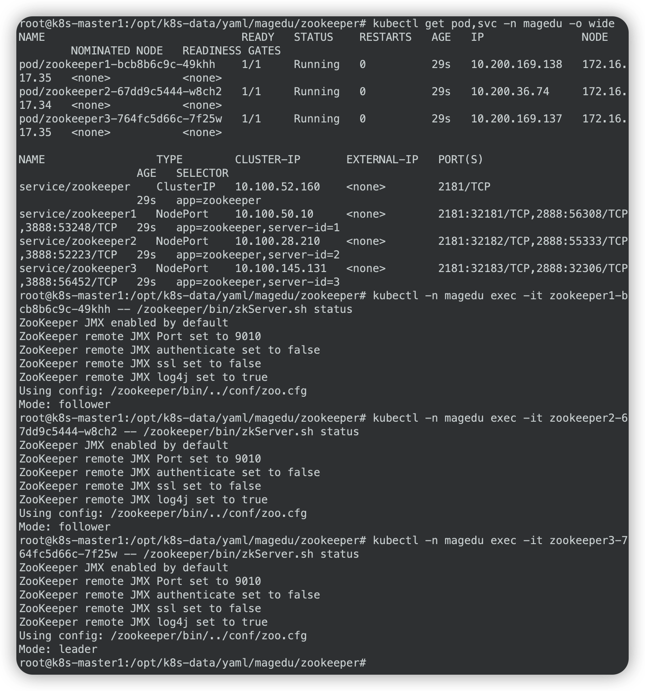


## 3. 在 Kubernetes 环境部署基于 StatefulSet 运行 MySQL 一主多从并基于 NFS 或 StorageClass 等方式实现数据持久化

```bash
# master1节点
# mysql镜像
docker pull mysql:5.7.36
docker tag mysql:5.7.36 harbor.igalaxycn.com/magedu/mysql:5.7.36
docker push harbor.igalaxycn.com/magedu/mysql:5.7.36

# xtrabackup镜像
docker pull zhangshijie/xtrabackup:1.0
docker tag zhangshijie/xtrabackup:1.0 harbor.igalaxycn.com/magedu/xtrabackup:1.0
docker push harbor.igalaxycn.com/magedu/xtrabackup:1.0

# nfs节点
# NFS服务器创建mysql存储目录
mkdir -p /data/k8sdata/magedu/mysql-datadir-{1..6}

# master1节点
# 修改pv配置文件
cd /opt/k8s-data/yaml/magedu/mysql/pv
vim mysql-persistentvolume.yaml

nfs:
    server: 172.16.17.41

# 创建pv
kubectl apply -f mysql-persistentvolume.yaml

## 查看pv
kubectl get pv

## 修改镜像地址
cd /opt/k8s-data/yaml/magedu/mysql
vim mysql-statefulset.yaml

# 第19行
image: harbor.igalaxycn.com/magedu/mysql:5.7.36
# 第43行
image: harbor.igalaxycn.com/magedu/xtrabackup:1.0
# 第67行
image: harbor.igalaxycn.com/magedu/mysql:5.7.36
# 第98行
image: harbor.igalaxycn.com/magedu/xtrabackup:1.0

# 部署mysql
cd /opt/k8s-data/yaml/magedu/mysql/
kubectl apply -f ./

# 查看pod
kubectl get pod -n magedu
# 输出结果
NAME                          READY   STATUS    RESTARTS      AGE
mysql-0                       2/2     Running   0             2m41s
mysql-1                       2/2     Running   1 (24s ago)   91s
zookeeper1-bcb8b6c9c-49khh    1/1     Running   0             12m
zookeeper2-67dd9c5444-w8ch2   1/1     Running   0             12m
zookeeper3-764fc5d66c-7f25w   1/1     Running   0             12m


# 修改副本为3
vim mysql-statefulset.yaml

...
spec:
  selector:
    matchLabels:
      app: mysql
  serviceName: mysql
  replicas: 3
...

# 重新生效
kubectl apply -f ./

# 查看pod 
kubectl get pod -n magedu
# 输出结果
NAME                          READY   STATUS    RESTARTS        AGE
mysql-0                       2/2     Running   0               13m
mysql-1                       2/2     Running   1 (10m ago)     11m
mysql-2                       2/2     Running   1 (7m58s ago)   9m8s
zookeeper1-bcb8b6c9c-49khh    1/1     Running   0               22m
zookeeper2-67dd9c5444-w8ch2   1/1     Running   0               22m
zookeeper3-764fc5d66c-7f25w   1/1     Running   0               22m

# 查看主节点状态
kubectl exec -it mysql-0 bash -n magedu
root@mysql-0:/# mysql
mysql> show master status\G;
# 输出结果
*************************** 1. row ***************************
             File: mysql-0-bin.000003
         Position: 154
     Binlog_Do_DB: 
 Binlog_Ignore_DB: 
Executed_Gtid_Set: 
1 row in set (0.00 sec)

ERROR: 
No query specified

# 查看第一从节点状态
kubectl exec -it mysql-1 bash -n magedu
root@mysql-1:/# mysql
mysql> show slave status\G;
# 输出结果
*************************** 1. row ***************************
               Slave_IO_State: Waiting for master to send event
                  Master_Host: mysql-0.mysql
                  Master_User: root
                  Master_Port: 3306
                Connect_Retry: 10
              Master_Log_File: mysql-0-bin.000003
          Read_Master_Log_Pos: 154
               Relay_Log_File: mysql-1-relay-bin.000002
                Relay_Log_Pos: 322
        Relay_Master_Log_File: mysql-0-bin.000003
             Slave_IO_Running: Yes
            Slave_SQL_Running: Yes
              Replicate_Do_DB: 
          Replicate_Ignore_DB: 
           Replicate_Do_Table: 
       Replicate_Ignore_Table: 
      Replicate_Wild_Do_Table: 
  Replicate_Wild_Ignore_Table: 
                   Last_Errno: 0
                   Last_Error: 
                 Skip_Counter: 0
          Exec_Master_Log_Pos: 154
              Relay_Log_Space: 531
              Until_Condition: None
               Until_Log_File: 
                Until_Log_Pos: 0
           Master_SSL_Allowed: No
           Master_SSL_CA_File: 
           Master_SSL_CA_Path: 
              Master_SSL_Cert: 
            Master_SSL_Cipher: 
               Master_SSL_Key: 
        Seconds_Behind_Master: 0
Master_SSL_Verify_Server_Cert: No
                Last_IO_Errno: 0
                Last_IO_Error: 
               Last_SQL_Errno: 0
               Last_SQL_Error: 
  Replicate_Ignore_Server_Ids: 
             Master_Server_Id: 100
                  Master_UUID: 58354f4f-c62d-11ed-b430-ced3a2f51589
             Master_Info_File: /var/lib/mysql/master.info
                    SQL_Delay: 0
          SQL_Remaining_Delay: NULL
      Slave_SQL_Running_State: Slave has read all relay log; waiting for more updates
           Master_Retry_Count: 86400
                  Master_Bind: 
      Last_IO_Error_Timestamp: 
     Last_SQL_Error_Timestamp: 
               Master_SSL_Crl: 
           Master_SSL_Crlpath: 
           Retrieved_Gtid_Set: 
            Executed_Gtid_Set: 
                Auto_Position: 0
         Replicate_Rewrite_DB: 
                 Channel_Name: 
           Master_TLS_Version: 
1 row in set (0.00 sec)

ERROR: 
No query specified

# 查看第二从节点状态
kubectl exec -it mysql-2 bash -n magedu
root@mysql-2:/# mysql
mysql> show slave status\G;
# 输出结果
*************************** 1. row ***************************
               Slave_IO_State: Waiting for master to send event
                  Master_Host: mysql-0.mysql
                  Master_User: root
                  Master_Port: 3306
                Connect_Retry: 10
              Master_Log_File: mysql-0-bin.000003
          Read_Master_Log_Pos: 154
               Relay_Log_File: mysql-2-relay-bin.000002
                Relay_Log_Pos: 322
        Relay_Master_Log_File: mysql-0-bin.000003
             Slave_IO_Running: Yes
            Slave_SQL_Running: Yes
              Replicate_Do_DB: 
          Replicate_Ignore_DB: 
           Replicate_Do_Table: 
       Replicate_Ignore_Table: 
      Replicate_Wild_Do_Table: 
  Replicate_Wild_Ignore_Table: 
                   Last_Errno: 0
                   Last_Error: 
                 Skip_Counter: 0
          Exec_Master_Log_Pos: 154
              Relay_Log_Space: 531
              Until_Condition: None
               Until_Log_File: 
                Until_Log_Pos: 0
           Master_SSL_Allowed: No
           Master_SSL_CA_File: 
           Master_SSL_CA_Path: 
              Master_SSL_Cert: 
            Master_SSL_Cipher: 
               Master_SSL_Key: 
        Seconds_Behind_Master: 0
Master_SSL_Verify_Server_Cert: No
                Last_IO_Errno: 0
                Last_IO_Error: 
               Last_SQL_Errno: 0
               Last_SQL_Error: 
  Replicate_Ignore_Server_Ids: 
             Master_Server_Id: 100
                  Master_UUID: 58354f4f-c62d-11ed-b430-ced3a2f51589
             Master_Info_File: /var/lib/mysql/master.info
                    SQL_Delay: 0
          SQL_Remaining_Delay: NULL
      Slave_SQL_Running_State: Slave has read all relay log; waiting for more updates
           Master_Retry_Count: 86400
                  Master_Bind: 
      Last_IO_Error_Timestamp: 
     Last_SQL_Error_Timestamp: 
               Master_SSL_Crl: 
           Master_SSL_Crlpath: 
           Retrieved_Gtid_Set: 
            Executed_Gtid_Set: 
                Auto_Position: 0
         Replicate_Rewrite_DB: 
                 Channel_Name: 
           Master_TLS_Version: 
1 row in set (0.00 sec)

ERROR: 
No query specified

# 测试复制
# 主节点创建test数据库
kubectl exec -it mysql-0 bash -n magedu
root@mysql-0:/# mysql
mysql> create database test;
mysql> show databases;
+------------------------+
| Database               |
+------------------------+
| information_schema     |
| mysql                  |
| performance_schema     |
| sys                    |
| test                   |
| xtrabackup_backupfiles |
+------------------------+
6 rows in set (0.04 sec)

# 第一从节点查看数据库同步
kubectl exec -it mysql-1 bash -n magedu
root@mysql-1:/# mysql
mysql> show databases;
+------------------------+
| Database               |
+------------------------+
| information_schema     |
| mysql                  |
| performance_schema     |
| sys                    |
| test                   |
| xtrabackup_backupfiles |
+------------------------+
6 rows in set (0.04 sec)

# 第二从节点查看数据库同步
kubectl exec -it mysql-2 bash -n magedu
root@mysql-1:/# mysql
mysql> show databases;
+------------------------+
| Database               |
+------------------------+
| information_schema     |
| mysql                  |
| performance_schema     |
| sys                    |
| test                   |
| xtrabackup_backupfiles |
+------------------------+
6 rows in set (0.04 sec)
```

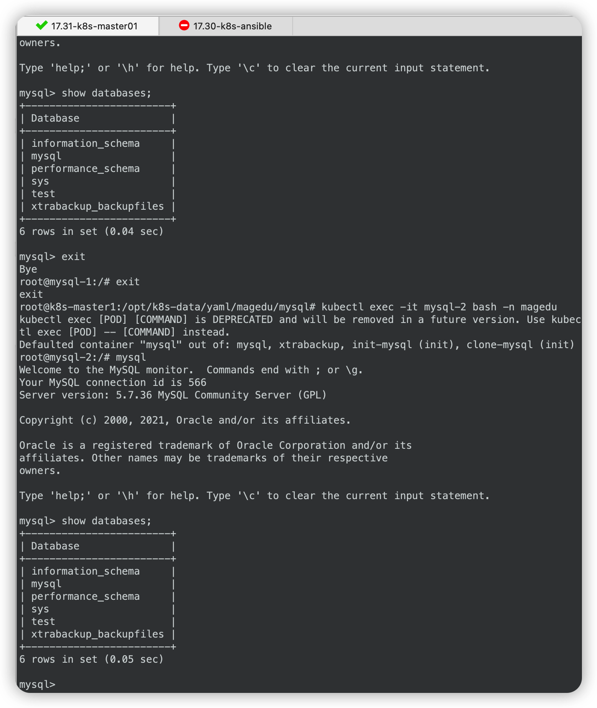


## 4. 在 Kubernetes 环境运行 java 单体服务 Jenkins(自己构建镜像或使用官方镜像)、以及实现单 Pod 中以多容器模式运行基于 LNMP 的 WordPress(自己构建镜像或使用官方镜像)，数据库使用上一步骤运行在 K8S 中的 MySQL

### 4.1 运行 java 单体服务 Jenkins

```bash
# master1节点
# 构建centos7基础镜像
cd /opt/k8s-data/dockerfile/system/centos/

# 修改构建脚本
vim build-command.sh

#!/bin/bash
docker build -t  harbor.igalaxycn.com/baseimages/magedu-centos-base:7.9.2009 .
docker push harbor.igalaxycn.com/baseimages/magedu-centos-base:7.9.2009

# 构建centos镜像并推送
bash build-command.sh


# ———————————-
# 构建jdk镜像
cd /opt/k8s-data/dockerfile/web/pub-images/jdk-1.8.212

# 修改构建脚本
vim build-command.sh

#!/bin/bash
docker build -t harbor.igalaxycn.com/pub-images/jdk-base:v8.212  .
#sleep 1
docker push harbor.igalaxycn.com/pub-images/jdk-base:v8.212

# 修改Dockerfile
vim Dockerfile

FROM harbor.igalaxycn.com/baseimages/magedu-centos-base:7.9.2009

# 构建jdk镜像并推送
bash build-command.sh


# ———————————-
# 构建tomcat镜像
cd /opt/k8s-data/dockerfile/web/pub-images/tomcat-base-8.5.43

# 修改构建脚本
vim build-command.sh

#!/bin/bash
docker build -t harbor.igalaxycn.com/pub-images/tomcat-base:v8.5.43  .
#sleep 3
docker push  harbor.igalaxycn.com/pub-images/tomcat-base:v8.5.43

# 修改Dockerfile
vim Dockerfile

FROM harbor.igalaxycn.com/pub-images/jdk-base:v8.212

# 构建tomcat镜像并推送
bash build-command.sh


# ———————————-
# 构建jenkins镜像
cd /opt/k8s-data/dockerfile/web/magedu/jenkins

# 修改构建脚本
vim build-command.sh

#!/bin/bash
echo "即将开始就像构建,请稍等!" && echo 3 && sleep 1 && echo 2 && sleep 1 && echo 1
#nerdctl build -t  harbor.linuxarchitect.io/jenkins:v2.319.2 .
docker build -t  harbor.igalaxycn.com/magedu/jenkins:v2.319.2 .
if [ $? -eq 0 ];then
  echo "即将开始镜像上传,请稍等!" && echo 3 && sleep 1 && echo 2 && sleep 1 && echo 1
  docker push harbor.igalaxycn.com/magedu/jenkins:v2.319.2    
  if [ $? -eq 0 ];then
    echo "镜像上传成功!"
  else
    echo "镜像上传失败"
  fi
else
  echo "镜像构建失败,请检查构建输出信息!"
fi

# 修改Dockerfile
vim Dockerfile

FROM harbor.igalaxycn.com/pub-images/jdk-base:v8.212

# 构建jenkins镜像并推送
bash build-command.sh


# 测试镜像
# 由于8080端口被nodednscache占用
docker run -it --rm -p 8081:8080 harbor.igalaxycn.com/magedu/jenkins:v2.319.2

# 172.16.17.41
# 创建nfs目录
mkdir -p /data/k8sdata/magedu/jenkins-data
mkdir -p /data/k8sdata/magedu/jenkins-root-data

# master1节点
# 修改pv配置文件
cd /opt/k8s-data/yaml/magedu/jenkins/
vim jenkins-persistentvolume.yaml

nfs:
    server: 172.16.17.41

# 创建pv和pvc
kubectl apply -f pv/

# 查看pvc
kubectl get pvc -n magedu

jenkins-datadir-pvc       Bound    jenkins-datadir-pv        100Gi      RWO                           50s
jenkins-root-data-pvc     Bound    jenkins-root-datadir-pv   100Gi      RWO 

# 部署jenkins
vim jenkins.yaml

spec:
      containers:
      - name: magedu-jenkins-container
        image: harbor.igalaxycn.com/magedu/jenkins:v2.319.2
        
# 启动
kubectl apply -f jenkins.yaml

# 查看
kubectl get pod -n magedu
kubectl get svc -n magedu
# 输出结果
NAME                     TYPE        CLUSTER-IP       EXTERNAL-IP   PORT(S)                                        AGE
magedu-jenkins-service   NodePort    10.100.205.225   <none>        80:38080/TCP 

# 查看jenkins初始密码
kubectl logs magedu-jenkins-deployment-5f8d5f585c-m2q2n -n magedu
# 输出结果
Jenkins initial setup is required. An admin user has been created and a password generated.
Please use the following password to proceed to installation:

7538d38144674f7c85efbb335248bf68

This may also be found at: /root/.jenkins/secrets/initialAdminPassword

# 浏览器访问jenkins
http://172.16.17.31:38080

# 测试完毕后销毁
cd /opt/k8s-data/yaml/magedu/jenkins/
kubectl delete -f jenkins.yaml
```

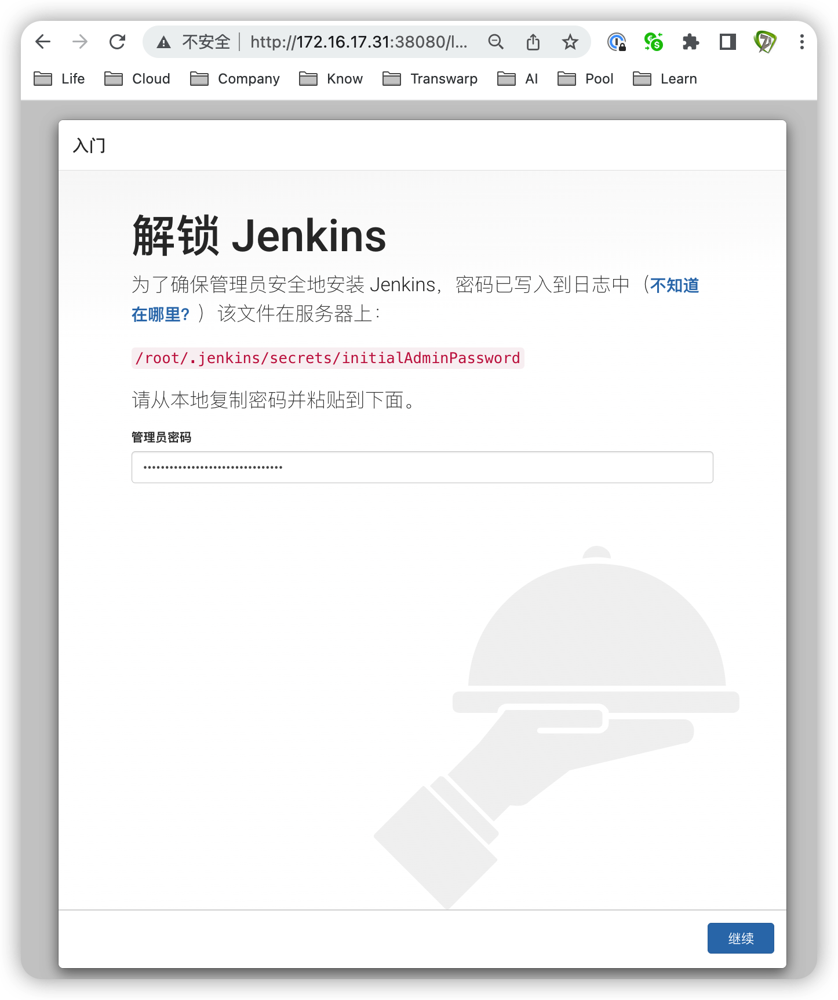


### 4.2 单Pod中以多容器模式运行基于LNMP的WordPress

```bash
# master1节点
# 构建nginx-base镜像
cd /opt/k8s-data/dockerfile/web/pub-images/nginx-base
sed -e 's/harbor.linuxarchitect.io/harbor.igalaxycn.com/g' -i build-command.sh Dockerfile
bash build-command.sh

# 构建nginx-base-wordpress镜像
cd /opt/k8s-data/dockerfile/web/pub-images/nginx-base-wordpress
sed -e 's/harbor.linuxarchitect.io/harbor.igalaxycn.com/g' -i build-command.sh Dockerfile
bash build-command.sh

## 构建wordpress镜像
cd /opt/k8s-data/dockerfile/web/magedu/wordpress/nginx
sed -e 's/harbor.linuxarchitect.io/harbor.igalaxycn.com/g' -i build-command.sh Dockerfile
bash build-command.sh v2

# 构建php镜像
cd /opt/k8s-data/dockerfile/web/magedu/wordpress/php
sed -e 's/harbor.linuxarchitect.io/harbor.igalaxycn.com/g' -i build-command.sh Dockerfile
bash build-command.sh v1

# 172.16.17.41
# 创建wordpress数据目录
mkdir -p /data/k8sdata/magedu/wordpress

# master1节点
cd /opt/k8s-data/yaml/magedu/wordpress/
sed -e 's/harbor.linuxarchitect.io/harbor.igalaxycn.com/g' -i wordpress.yaml

sed -e 's/172.31.7.109/172.16.17.41/g' -i wordpress.yaml

# 部署wordpress
kubectl apply -f wordpress.yaml
kubectl get pod,svc -n magedu

# ha1及ha2节点
# 采用vip地址172.16.17.189访问
vim /etc/haproxy/haproxy.cfg

# 添加如下行
listen wordpress_vip_80
    bind 172.16.17.189:80
    mode tcp
    server 172.16.17.31 172.16.17.31:30031  check inter 2000 fall 3 rise 5
    server 172.16.17.32 172.16.17.32:30031  check inter 2000 fall 3 rise 5
    server 172.16.17.33 172.16.17.33:30031  check inter 2000 fall 3 rise 5

# 重启服务
systemctl restart haproxy.service

# 浏览器访问
http://172.16.17.189

# 由于wordpress尚无内容显示403 Forbidden页面

# 172.16.17.41
cd ~
scp 172.16.17.31:/opt/wordpress-5.0.16-zh_CN.tar.gz .
tar xvf wordpress-5.0.16-zh_CN.tar.gz
cp -r wordpress/* /data/k8sdata/magedu/wordpress/

# master1节点
# 查看nginx和php的uid
kubectl -n magedu exec -it wordpress-app-deployment-8564d5fb6-qtzsx -c wordpress-app-php -- id nginx

uid=2088(nginx) gid=2088(nginx) groups=2088(nginx)

# 172.16.17.41
# 修改NFS服务器wordpress数据库目录权限
cd /data/k8sdata/magedu
chown -R 2088.2088 wordpress/

# master1节点
# 创建wordpress站点数据库
kubectl exec -it mysql-0 bash -n magedu
root@mysql-0:/# mysql
mysql> CREATE DATABASE wordpress;
mysql> GRANT ALL PRIVILEGES ON wordpress.* TO "wordpress"@"%" IDENTIFIED BY "password";

# 浏览
http://172.16.17.189
```

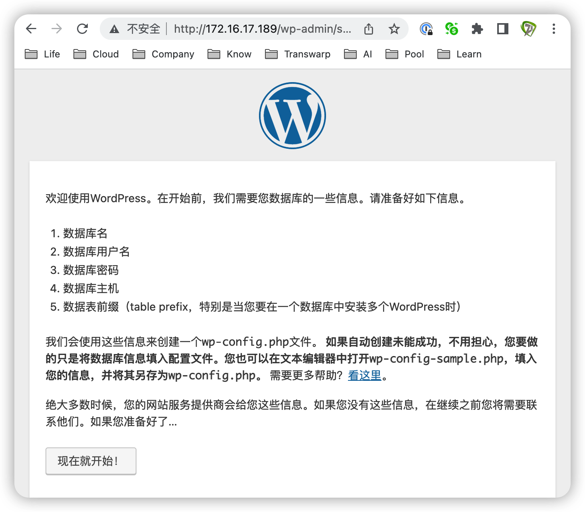

配置数据库

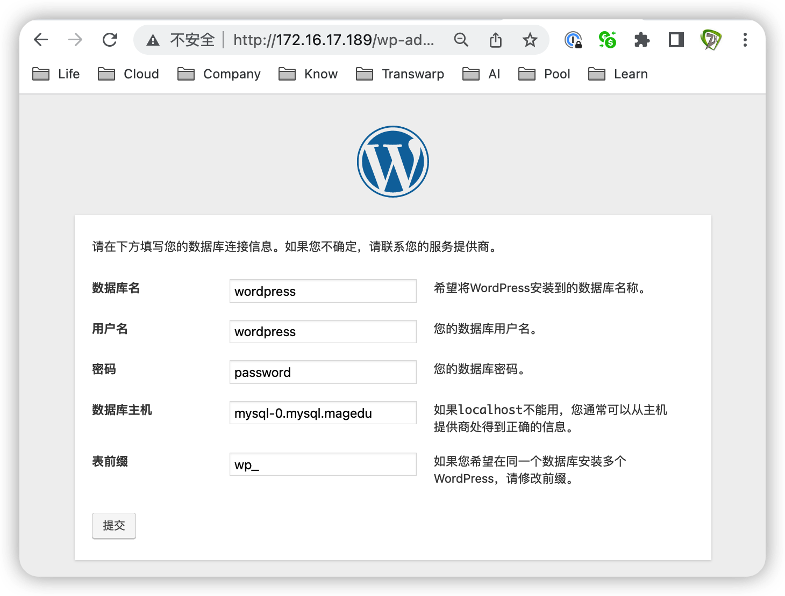

创建管理员

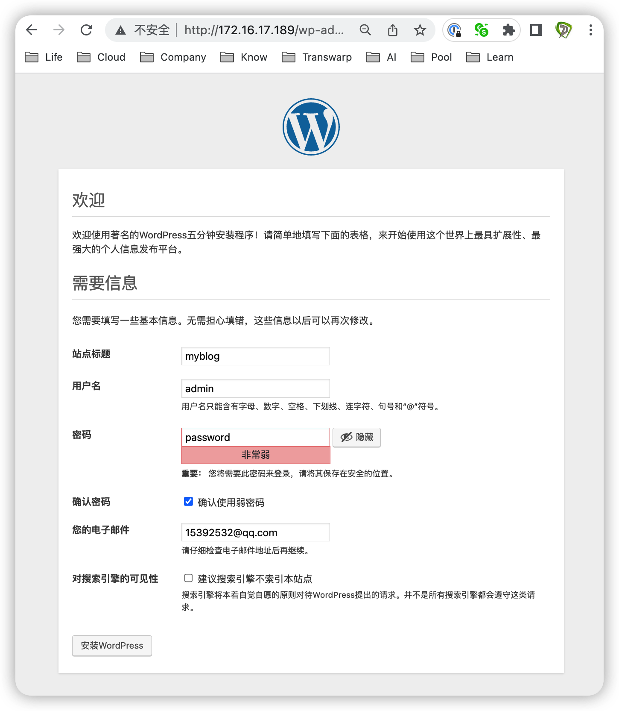

登录后主页

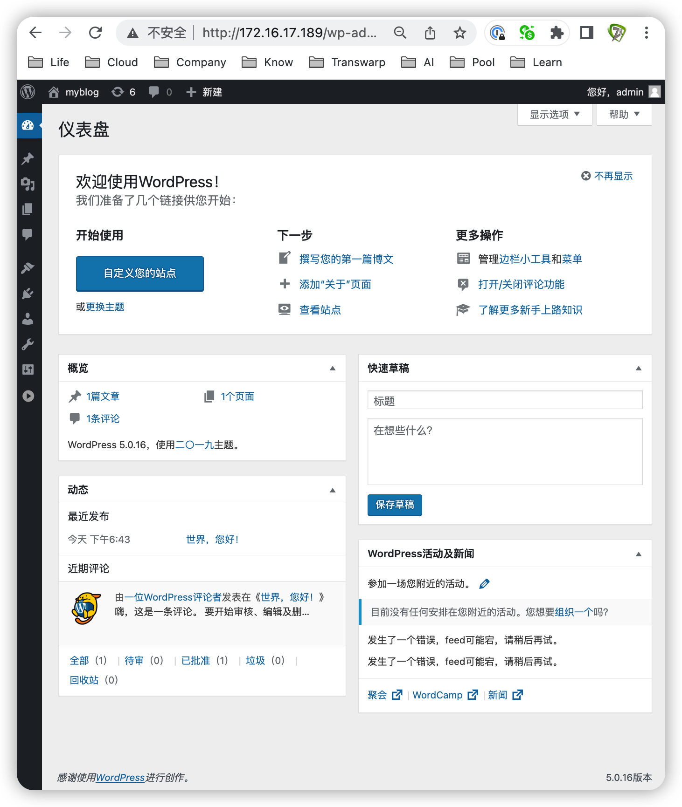


## 5. 基于 LimitRange 限制 magedu namespace 中单个container最大 1C1G，单个 pod 最大 2C2G，并默认为 CPU limit 为 0.5 核、默认内存 limit 为 512M

```bash
# master1节点
# 编写LimitRange配置文件
cd ~/week17
vim LimitRange-magedu.yaml

apiVersion: v1
kind: LimitRange
metadata:
  name: limitrange-magedu
  namespace: magedu
spec:
  limits:
  - type: Container       #限制的资源类型
    max:
      cpu: "1"            #限制单个容器的最大CPU
      memory: "1Gi"       #限制单个容器的最大内存
    default:
      cpu: "500m"         #默认单个容器的CPU限制
      memory: "512Mi"     #默认单个容器的内存限制
    defaultRequest:
      cpu: "500m"         #默认单个容器的CPU创建请求
      memory: "512Mi"     #默认单个容器的内存创建请求
  - type: Pod
    max:
      cpu: "2"            #限制单个Pod的最大CPU
      memory: "2Gi"       #限制单个Pod最大内存

# 生效
kubectl apply -f LimitRange-magedu.yaml
kubectl get limitranges -n magedu

# 生成一个nginx编排的yaml文件
kubectl create deploy nginx --image=nginx -n magedu --dry-run=client -o yaml > nginx1-deployment.yaml

# 修改yaml文件
vim nginx.yaml

apiVersion: apps/v1
kind: Deployment
metadata:
  labels:
    app: nginx1
  name: nginx1
  namespace: magedu
spec:
  replicas: 1
  selector:
    matchLabels:
      app: nginx1
  template:
    metadata:
      labels:
        app: nginx1
    spec:
      containers:
      - image: nginx
        name: nginx1

# 部署修改后的nginx编排文件
kubectl apply -f nginx1-deployment.yaml
kubectl get pod -n magedu

# 查看pod的资源限制
# 与LimitRange相匹配
kubectl describe pod nginx1-84b6c7bf9d-j8mtm -n magedu

Limits:
  cpu:     500m
  memory:  512Mi
Requests:
  cpu:        500m
  memory:     512Mi

# 修改配置，超出LimitRange
vim nginx1-deployment.yaml

apiVersion: apps/v1
kind: Deployment
metadata:
  labels:
    app: nginx1
  name: nginx1
  namespace: magedu
spec:
  replicas: 1
  selector:
    matchLabels:
      app: nginx1
  template:
    metadata:
      labels:
        app: nginx1
    spec:
      containers:
      - image: nginx
        name: nginx1
        resources:
          requests:
            cpu: "500m"
            memory: "512Mi"
          limits:
            cpu: "1"
            memory: "2Gi"

# 应用配置
kubectl apply -f nginx1-deployment.yaml

# 查看deployment
kubectl get deploy -n magedu
kubectl get deploy nginx1 -n magedu -o yaml
```

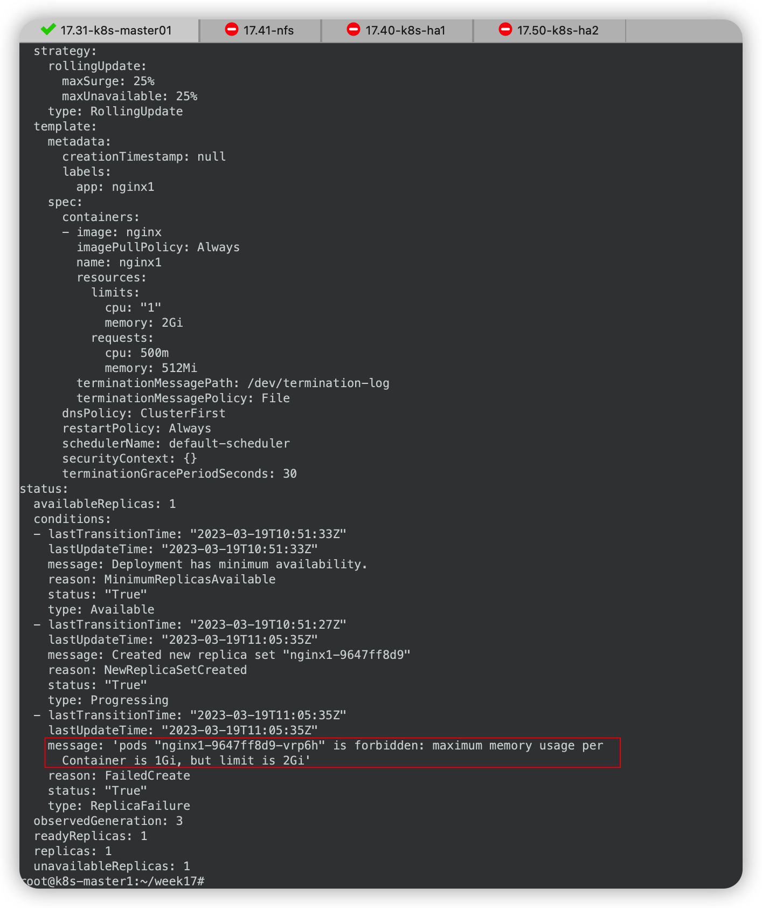


## 6. 基于ResourceQuota限制magedu namespace中最多可分配CPU 192C，内存512G

```bash
# master1节点
# 编写ResourceQuota配置文件
cd ~/week17
vim ResourceQuota-magedu.yaml

apiVersion: v1
kind: ResourceQuota
metadata:
  name: quota-magedu
  namespace: magedu
spec:
  hard:
    limits.cpu: "192"
    limits.memory: 512Gi

# 应用ResourceQuota配置文件
kubectl apply -f ResourceQuota-magedu.yaml
kubectl get resourcequotas -n magedu

# 创建nginx2
cp nginx1-deployment.yaml nginx2-deployment.yaml
vim nginx2-deployment.yaml

apiVersion: apps/v1
kind: Deployment
metadata:
  labels:
    app: nginx2
  name: nginx2
  namespace: magedu
spec:
  replicas: 1
  selector:
    matchLabels:
      app: nginx2
  template:
    metadata:
      labels:
        app: nginx2
    spec:
      containers:
      - image: nginx
        name: nginx2
        resources:
          requests:
            cpu: "500m"
            memory: "512Mi"
          limits:
            cpu: "256"
            memory: "512Gi"

# 部署应用
kubectl apply -f nginx2-deployment.yaml

# 查看deployment
kubectl get deploy -n magedu
kubectl get deploy nginx2 -n magedu -o yaml

# 测试完毕后销毁
kubectl delete -f nginx2-deployment.yaml 
kubectl delete -f nginx1-deployment.yaml
kubectl delete -f ResourceQuota-magedu.yaml 
ubectl delete -f LimitRange-magedu.yaml 
```

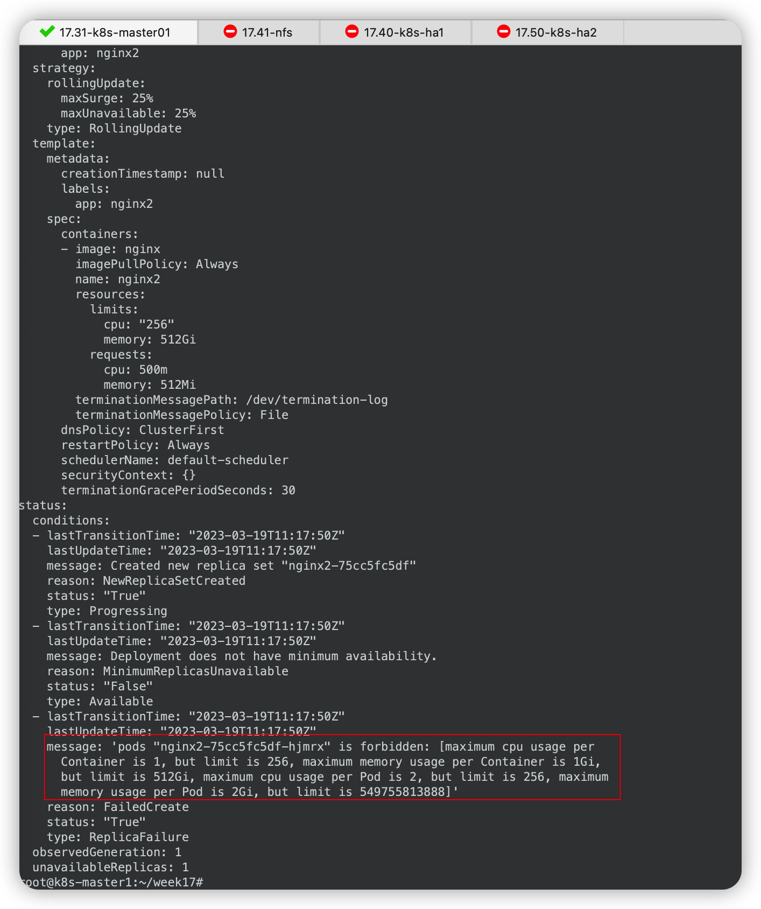


## 7. 基于 Operator 在 Kubernetes 环境部署 prometheus 监控环境 (prometheus-server、cAdvisor、grafana、node-exporter 等)

```bash
# master1节点
# 下载prometheus operator代码
cd week17
git clone -b release-0.11 https://github.com/prometheus-operator/kube-prometheus.git

# 查找需从k8s.gcr.io下载的镜像
cd ~/week17/kube-prometheus/
grep image: manifests/ -R | grep "k8s.gcr.io"
# 输出结果
manifests/prometheusAdapter-deployment.yaml:        image: k8s.gcr.io/prometheus-adapter/prometheus-adapter:v0.9.1
manifests/kubeStateMetrics-deployment.yaml:        image: k8s.gcr.io/kube-state-metrics/kube-state-metrics:v2.5.0

# 准备kube-state-metrics镜像
docker pull bitnami/kube-state-metrics:2.5.0
docker tag bitnami/kube-state-metrics:2.5.0 harbor.igalaxycn.com/baseimages/kube-state-metrics:2.5.0
docker push harbor.igalaxycn.com/baseimages/kube-state-metrics:2.5.0

# 修改yaml配置文件
vim manifests/kubeStateMetrics-deployment.yaml

...
spec:
      automountServiceAccountToken: true
      containers:
      - args:
        - --host=127.0.0.1
        - --port=8081
        - --telemetry-host=127.0.0.1
        - --telemetry-port=8082
        image: harbor.igalaxycn.com/baseimages/kube-state-metrics:2.5.0
...

# 准备prometheus-adapter镜像
docker pull willdockerhub/prometheus-adapter:v0.9.1
docker tag willdockerhub/prometheus-adapter:v0.9.1 harbor.igalaxycn.com/baseimages/prometheus-adapter:v0.9.1
docker push harbor.igalaxycn.com/baseimages/prometheus-adapter:v0.9.1

# 修改yaml配置文件
vim manifests/prometheusAdapter-deployment.yaml

...
image: harbor.igalaxycn.com/baseimages/prometheus-adapter:v0.9.1
        livenessProbe:
          failureThreshold: 5
          httpGet:
            path: /livez
            port: https
            scheme: HTTPS
          initialDelaySeconds: 30
          periodSeconds: 5
        name: prometheus-adapter
...

# 部署crd资源
kubectl apply --server-side -f manifests/setup
kubectl get crd -n monitoring

# 部署prometheus operator
kubectl apply -f manifests/
kubectl get pod -n monitoring -o wide

# 修改网络策略及svc实现从外网访问prometheus server
cd ~/week17/kube-prometheus/
mkdir networkPolicy
mv manifests/*networkPolicy* networkPolicy/
kubectl delete -f networkPolicy/

# 修改prometheus-service.yaml
vim manifests/prometheus-service.yaml

apiVersion: v1
kind: Service
metadata:
  labels:
    app.kubernetes.io/component: prometheus
    app.kubernetes.io/instance: k8s
    app.kubernetes.io/name: prometheus
    app.kubernetes.io/part-of: kube-prometheus
    app.kubernetes.io/version: 2.36.1
  name: prometheus-k8s
  namespace: monitoring
spec:
  type: NodePort
  ports:
  - name: web
    port: 9090
    targetPort: web
    nodePort: 39090
  - name: reloader-web
    port: 8080
    targetPort: reloader-web
    nodePort: 38080
  selector:
    app.kubernetes.io/component: prometheus
    app.kubernetes.io/instance: k8s
    app.kubernetes.io/name: prometheus
    app.kubernetes.io/part-of: kube-prometheus
  sessionAffinity: ClientIP

# 生效
kubectl apply -f manifests/prometheus-service.yaml

# 修改grafana svc实现从外网访问grafana server
vim manifests/grafana-service.yaml

apiVersion: v1
kind: Service
metadata:
  labels:
    app.kubernetes.io/component: grafana
    app.kubernetes.io/name: grafana
    app.kubernetes.io/part-of: kube-prometheus
    app.kubernetes.io/version: 8.5.5
  name: grafana
  namespace: monitoring
spec:
  type: NodePort
  ports:
  - name: http
    port: 3000
    targetPort: http
    nodePort: 33000
  selector:
    app.kubernetes.io/component: grafana
    app.kubernetes.io/name: grafana
    app.kubernetes.io/part-of: kube-prometheus

# 生效
kubectl apply -f manifests/grafana-service.yaml

# 访问prometheus
http://172.16.17.31:39090

# 访问grafana
http://172.16.17.31:33000
默认用户名及密码：admin/admin

# 测试完毕后销毁资源
kubectl delete -f manifests/
kubectl delete -f manifests/setup/
```

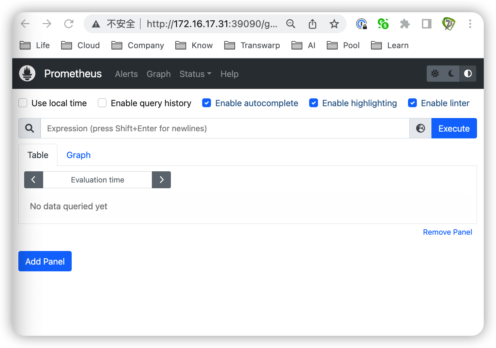


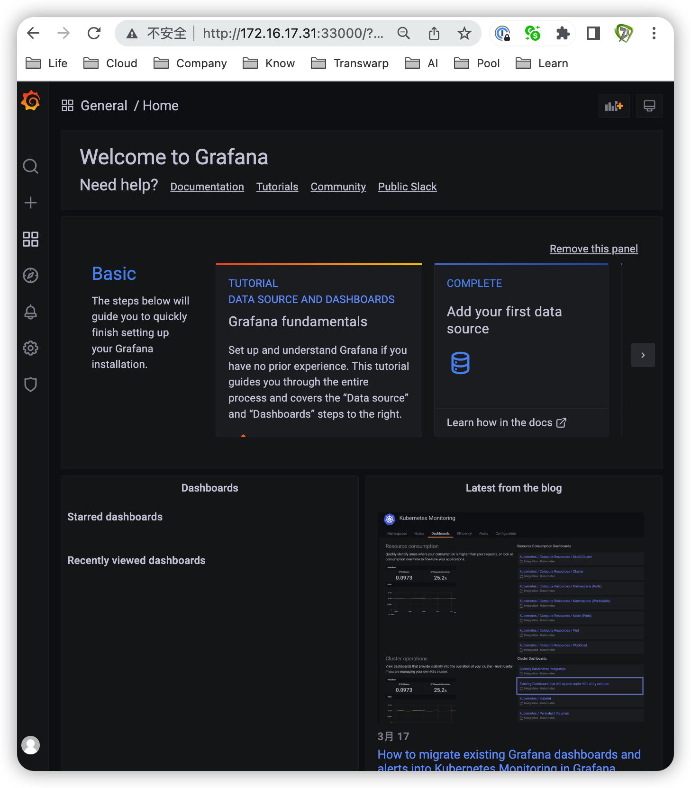


## 8. 扩展：手动在 kubernetes 中部署 prometheus 监控环境 (prometheus-server、cAdvisor、grafana、node-exporter 等)

```bash
# master1节点
# 上传prometheus-case-files.zip到~/week17目录
cd ~/week17
unzip prometheus-case-files.zip

# 部署cadvisor
cd prometheus-case-files/
kubectl create ns monitoring
kubectl apply -f case1-daemonset-deploy-cadvisor.yaml

# 查看pod
kubectl get pod -n monitoring

# 访问cadvisor
http://172.16.17.31:8080

# master1节点
# 部署node_exporter
cd prometheus-case-files
kubectl apply -f case2-daemonset-deploy-node-exporter.yaml

# 查看pod
kubectl get pod,svc -n monitoring

# 访问node_exporter
http://172.16.17.31:9100

# 部署prometheus server
# 172.16.17.41
# 创建prometheus server数据目录
mkdir -p /data/k8sdata/prometheusdata
chown 65534.65534 /data/k8sdata/prometheusdata -R

# master1节点
# 创建监控账户
cd prometheus-case-files
kubectl create serviceaccount monitor -n monitoring

# 对monitor账户授权，cluster-admin权限
kubectl create clusterrolebinding monitor-clusterrolebinding -n monitoring --clusterrole=cluster-admin --serviceaccount=monitoring:monitor

# 部署prometheus server
sed -e 's/172.31.7.111/172.16.17.31/g' -i case3-1-prometheus-cfg.yaml
sed -e 's/172.31.7.109/172.16.17.41/g' -i case3-2-prometheus-deployment.yaml
kubectl apply -f case3-1-prometheus-cfg.yaml
kubectl apply -f case3-2-prometheus-deployment.yaml
kubectl apply -f case3-3-prometheus-svc.yaml

# 查看部署的资源
kubectl get pod,svc -n monitoring

# 访问prometheus
http://172.16.17.31:30090

# 部署grafana server
# 172.16.17.41
# 创建grafana server数据目录
mkdir -p /data/k8sdata/grafana
chown 472.0 /data/k8sdata/grafana/ -R

# master1节点
# 部署grafana server
cd prometheus-case-files
sed -e 's/172.31.7.109/172.16.17.41/g' -i case4-grafana.yaml
kubectl apply -f case4-grafana.yaml

# 查看创建的资源
kubectl get pod,svc -n monitoring

# 访问grafana server
http://172.16.17.31:33000
缺省用户名及密码：admin/admin
```

访问cadvisor

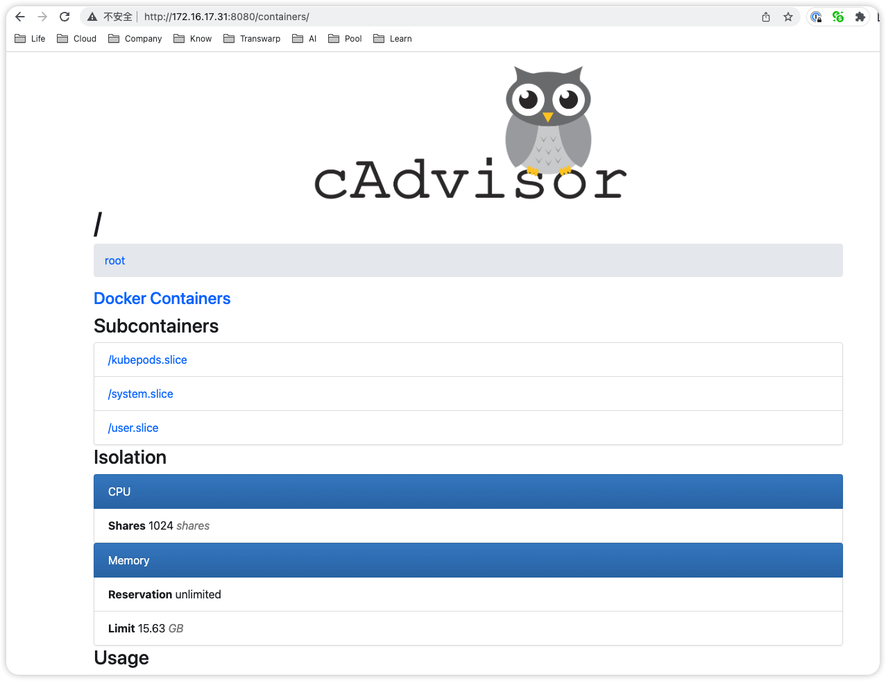

访问node_exporter

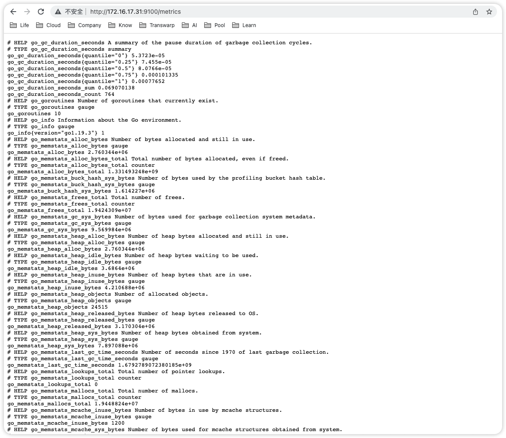

访问prometheus

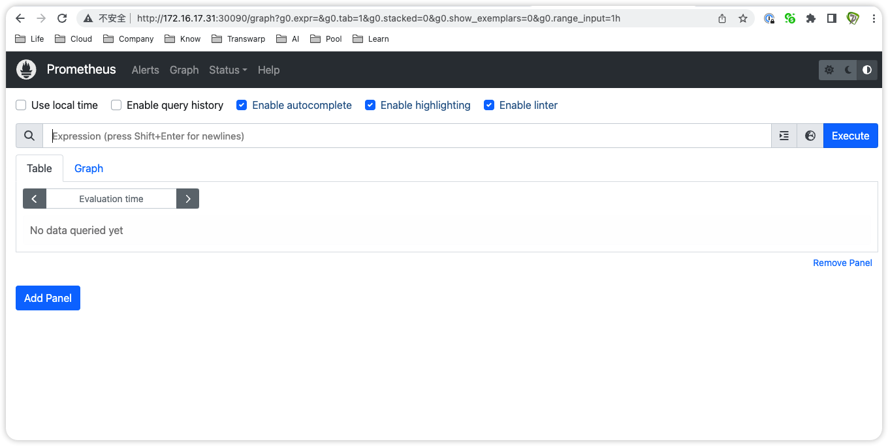

grafana添加prome数据源

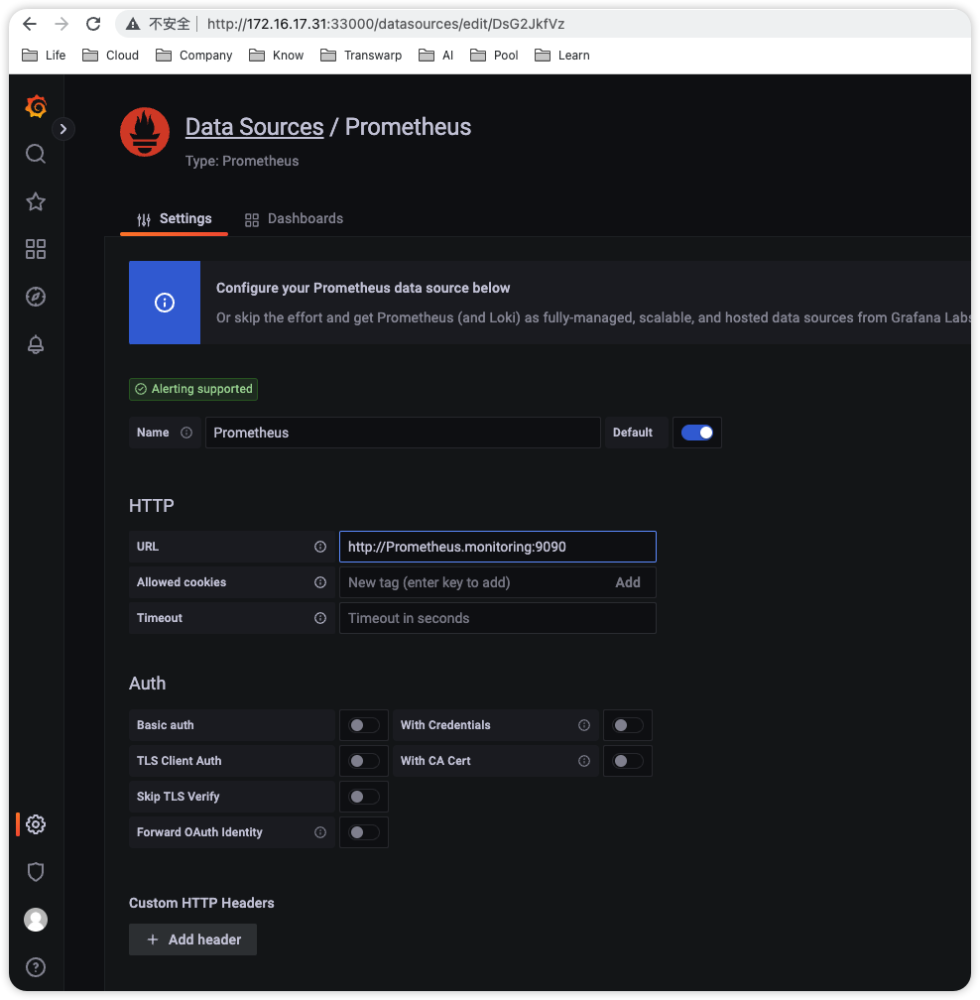

grafana导入node模板11074并验证数据

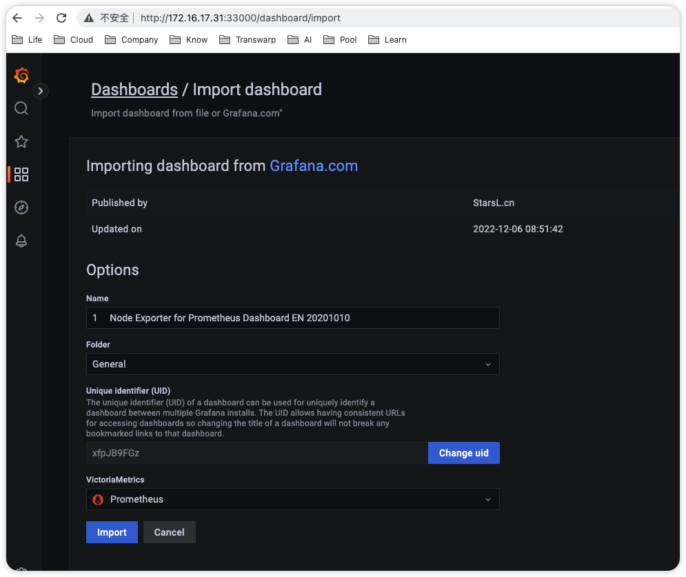

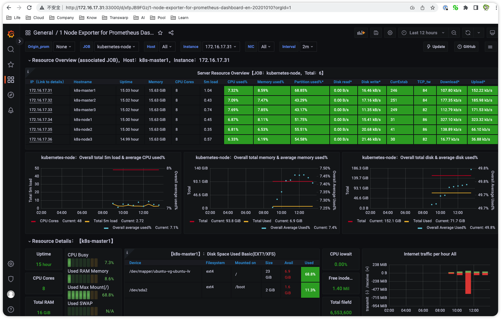

grafana导入pod模板893并验证数据

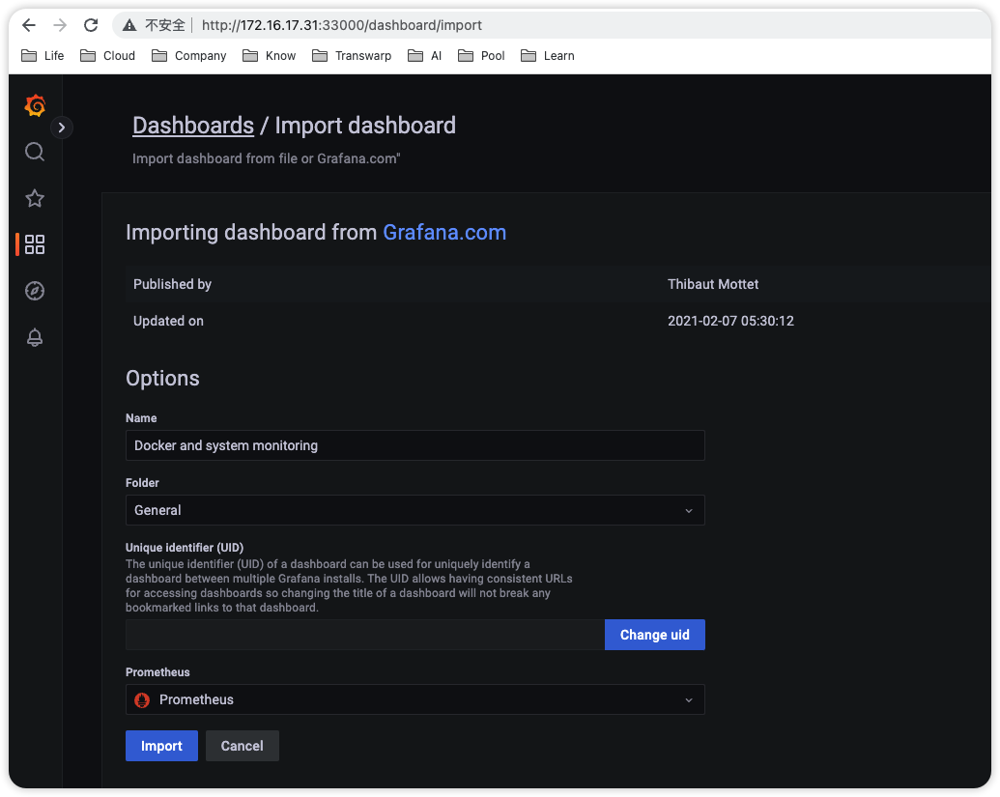

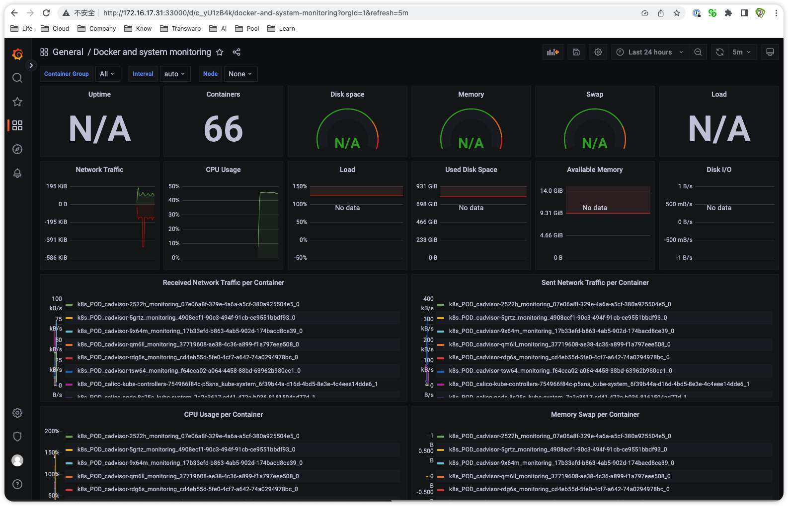

部署kube-state-metrics

```bash
# master1节点
# 部署kube-state-metrics
cd prometheus-case-files
kubectl apply -f case5-kube-state-metrics-deploy.yaml

# 查看pod
kubectl get pod -n kube-system

# 查看prometheus server是否预留端口
vim case3-1-prometheus-cfg.yaml

scrape_configs:
- job_name: 'kube-state-metrics'
  static_configs:
  - targets: ['172.16.17.31:31666']

# 访问kube-state-metrics
http://172.16.17.31:31666
```

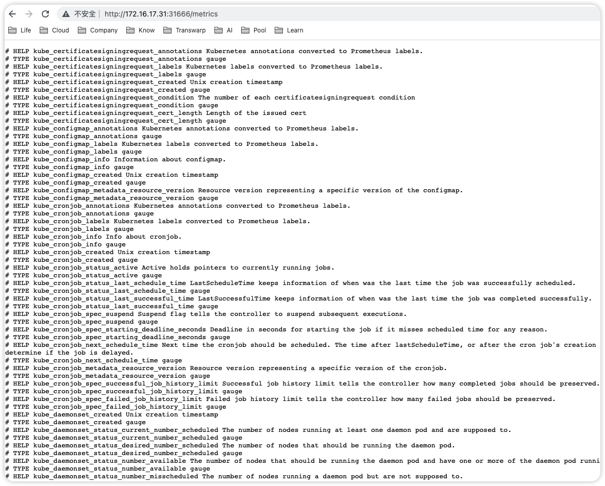

prometheus查看kube-state-metrics抓取状态

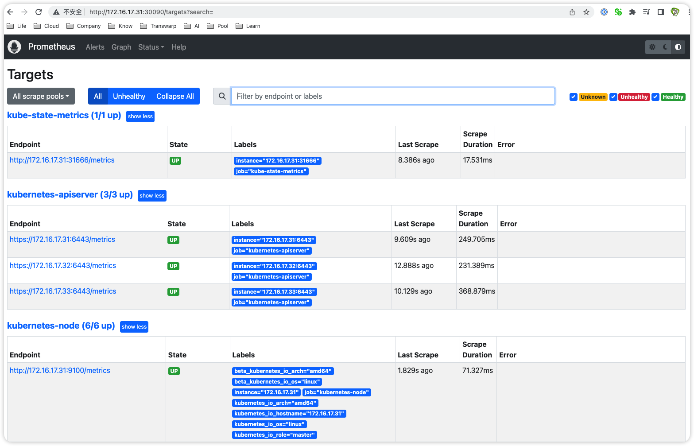

导入kube-state-metrics模板10856并验证数据

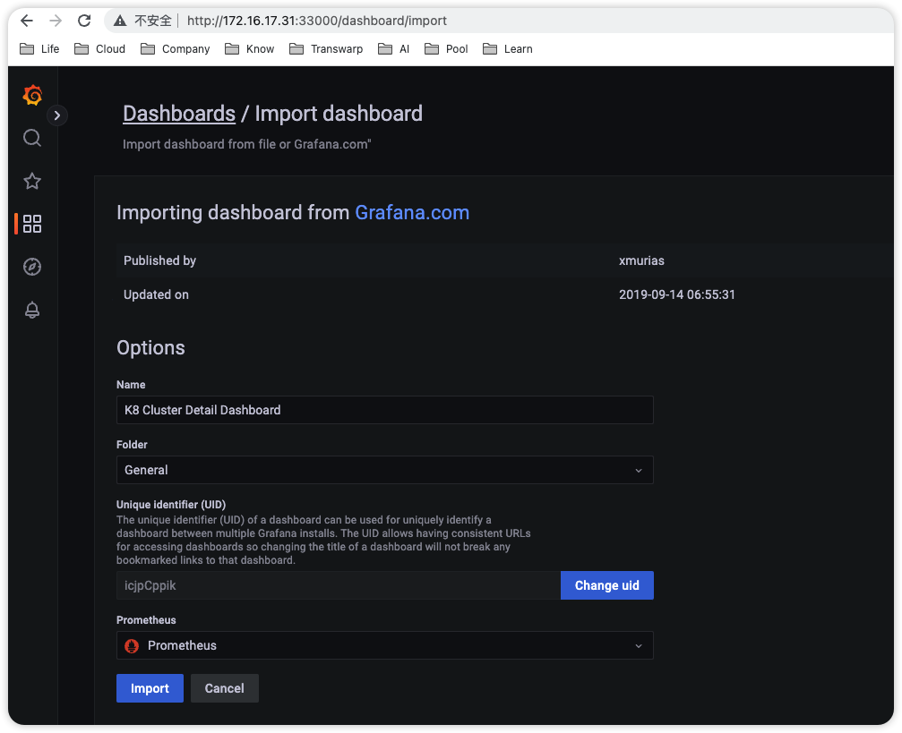

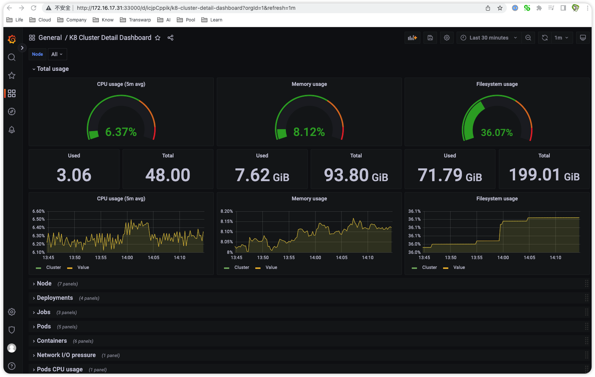
