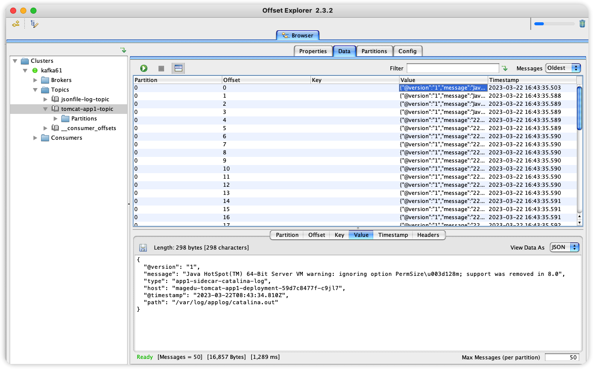
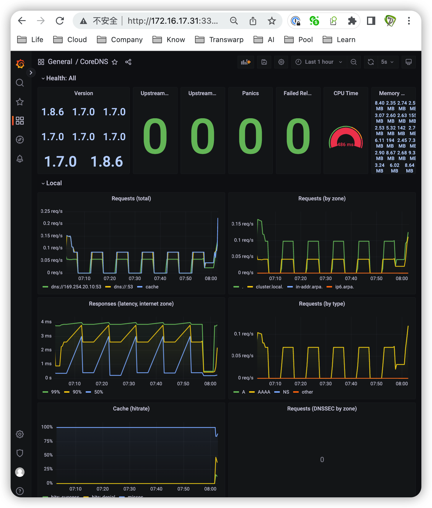

# 极客时间运维进阶训练营第十八周作业

## 作业要求

1. 在 K8s 环境基于 daemonset 部署日志收集组件实现 pod 日志收集
2. 在 K8s 环境对 pod 添加 sidecar 容器实现业务日志收集
3. 在 K8s 环境容器中启动日志收集进程实现业务日志收集
4. 通过 prometheus 对 CoreDNS 进行监控并在 grafana 显示监控图形
5. 对 K8s 集群进行 master 节点扩容、node 节点扩容
6. 对 K8s 集群进行小版本升级
7. 基于 ceph rbd 及 cephfs 持久化 K8s 中 pod 的业务数据


## 1. 在K8s环境基于daemonset部署日志收集组件实现pod日志收集

### 1.1 部署kafka

```bash
# 172.16.17.61
# 安装docker
cd /usr/local/src/
scp 172.16.8.63:/home/zhanghui/common/docker-20.10.19-binary-install.tar.gz .

# 解压安装包
tar xvf docker-20.10.19-binary-install.tar.gz

# 安装docker
bash docker-install.sh
docker info
docker-compose version

# 创建kafka部署目录
mkdir -pv /apps/kafka
cd /apps/kafka/
vim docker-compose.yml

version: "3.6"
services:
  kafka1:
    container_name: kafka1
    image: 'bitnami/kafka:3.3.1'
    user: root
    ports:
      - '19092:9092'
      - '19093:9093'
    environment:
      # 允许使用Kraft
      - KAFKA_ENABLE_KRAFT=yes
      - KAFKA_CFG_PROCESS_ROLES=broker,controller
      - KAFKA_CFG_CONTROLLER_LISTENER_NAMES=CONTROLLER
      # 定义kafka服务端socket监听端口（Docker内部的ip地址和端口）
      - KAFKA_CFG_LISTENERS=PLAINTEXT://:9092,CONTROLLER://:9093
      # 定义安全协议
      - KAFKA_CFG_LISTENER_SECURITY_PROTOCOL_MAP=CONTROLLER:PLAINTEXT,PLAINTEXT:PLAINTEXT
      #定义外网访问地址（宿主机ip地址和端口）
      - KAFKA_CFG_ADVERTISED_LISTENERS=PLAINTEXT://172.16.17.61:19092
      - KAFKA_BROKER_ID=1
      - KAFKA_KRAFT_CLUSTER_ID=iZWRiSqjZAlYwlKEqHFQWI
      - KAFKA_CFG_CONTROLLER_QUORUM_VOTERS=1@172.23.0.11:9093,2@172.23.0.12:9093,3@172.23.0.13:9093
      - ALLOW_PLAINTEXT_LISTENER=yes
      # 设置broker最大内存，和初始内存
      - KAFKA_HEAP_OPTS=-Xmx4g -Xms4g
    volumes:
      - /apps/kafka/broker01:/bitnami/kafka:rw
    networks:
      netkafka:
        ipv4_address: 172.23.0.11
  kafka2:
    container_name: kafka2
    image: 'bitnami/kafka:3.3.1'
    user: root
    ports:
      - '29092:9092'
      - '29093:9093'
    environment:
      - KAFKA_ENABLE_KRAFT=yes
      - KAFKA_CFG_PROCESS_ROLES=broker,controller
      - KAFKA_CFG_CONTROLLER_LISTENER_NAMES=CONTROLLER
      - KAFKA_CFG_LISTENERS=PLAINTEXT://:9092,CONTROLLER://:9093
      - KAFKA_CFG_LISTENER_SECURITY_PROTOCOL_MAP=CONTROLLER:PLAINTEXT,PLAINTEXT:PLAINTEXT
      - KAFKA_CFG_ADVERTISED_LISTENERS=PLAINTEXT://172.16.17.61:29092  #修改宿主机ip
      - KAFKA_BROKER_ID=2
      - KAFKA_KRAFT_CLUSTER_ID=iZWRiSqjZAlYwlKEqHFQWI #哪一，三个节点保持一致
      - KAFKA_CFG_CONTROLLER_QUORUM_VOTERS=1@172.23.0.11:9093,2@172.23.0.12:9093,3@172.23.0.13:9093
      - ALLOW_PLAINTEXT_LISTENER=yes
      - KAFKA_HEAP_OPTS=-Xmx4g -Xms4g
    volumes:
      - /apps/kafka/broker02:/bitnami/kafka:rw
    networks:
      netkafka:
        ipv4_address: 172.23.0.12
  kafka3:
    container_name: kafka3
    image: 'bitnami/kafka:3.3.1'
    user: root
    ports:
      - '39092:9092'
      - '39093:9093'
    environment:
      - KAFKA_ENABLE_KRAFT=yes
      - KAFKA_CFG_PROCESS_ROLES=broker,controller
      - KAFKA_CFG_CONTROLLER_LISTENER_NAMES=CONTROLLER
      - KAFKA_CFG_LISTENERS=PLAINTEXT://:9092,CONTROLLER://:9093
      - KAFKA_CFG_LISTENER_SECURITY_PROTOCOL_MAP=CONTROLLER:PLAINTEXT,PLAINTEXT:PLAINTEXT
      - KAFKA_CFG_ADVERTISED_LISTENERS=PLAINTEXT://172.16.17.61:39092  #修改宿主机ip
      - KAFKA_BROKER_ID=3
      - KAFKA_KRAFT_CLUSTER_ID=iZWRiSqjZAlYwlKEqHFQWI
      - KAFKA_CFG_CONTROLLER_QUORUM_VOTERS=1@172.23.0.11:9093,2@172.23.0.12:9093,3@172.23.0.13:9093
      - ALLOW_PLAINTEXT_LISTENER=yes
      - KAFKA_HEAP_OPTS=-Xmx4g -Xms4g
    volumes:
      - /apps/kafka/broker03:/bitnami/kafka:rw
    networks:
      netkafka:
        ipv4_address: 172.23.0.13
networks:
  name:
  netkafka:
    driver: bridge
    name: netkafka
    ipam:
      driver: default
      config:
        - subnet: 172.23.0.0/25
          gateway: 172.23.0.1


# 下载yml文件中所需镜像
docker-compose pull

# 启动
docker-compose up -d
docker-compose ps

# 命令行测试
# kafka1
# 创建topic
docker exec -it kafka1 bash
cd /opt/bitnami/kafka/bin
kafka-topics.sh --create --topic foo --partitions 5 --replication-factor 3 --bootstrap-server kafka1:9092,kafka2:9092,kafka3:9092

# 查看topic
kafka-topics.sh --describe --topic foo --bootstrap-server kafka1:9092, kafka2:9092, kafka3:9092

# kafka1上生产
kafka-console-producer.sh --broker-list kafka1:9092, kafka2:9092, kafka3:9092 --topic foo
# 输入
>Hello
>kafka

# kafka2上消费
docker exec -it kafka2 bash
cd /opt/bitnami/kafka/bin
kafka-console-consumer.sh --bootstrap-server kafka1:9092, kafka2:9092, kafka3:9092 --topic foo
# 输出结果
hello
kafka

# 删除topic
kafka-topics.sh --delete --topic foo --bootstrap-server kafka1:9092,kafka2:9092,kafka3:9092

# 客户端
# 下载Offset Explorer并安装
https://www.kafkatool.com/download.html
Cluster name命名为kafka61
Bootstrap servers为172.16.17.61:19092,172.16.17.61:29092,172.16.17.61:39092
```

命名集群


输入Zookeeper或者Broker地址以找到相应集群，本集群无ZooKeeper


为避免乱码，设置topic为string格式


### 1.2 部署elasticsearch

```bash
# 172.16.17.62
# 安装docker
cd /usr/local/src/
scp 172.16.8.63:/home/zhanghui/common/docker-20.10.19-binary-install.tar.gz .

# 解压安装包
tar xvf docker-20.10.19-binary-install.tar.gz

# 安装docker
bash docker-install.sh
docker info
docker-compose version

# 创建es+kibana部署目录
mkdir -pv /apps/elasticsearch
cd /apps/elasticsearch/
vim docker-compose.yml

version: "3.9"
services:
  elasticsearch:
    image: elasticsearch:8.6.0
    environment:
      - discovery.type=single-node
      - ES_JAVA_OPTS=-Xms1g -Xmx1g
      - xpack.security.enabled=false
    volumes:
      - /apps/elasticsearch/data:/usr/share/elasticsearch/data
    ports:
      - target: 9200
        published: 9200
    networks:
      - elastic
 
  kibana:
    image: kibana:8.6.0
    ports:
      - target: 5601
        published: 5601
    depends_on:
      - elasticsearch
    networks:
      - elastic      
    
networks:
  elastic:
    name: elastic
    driver: bridge

# 下载yml文件中所需镜像
docker-compose pull

# es镜像的用户id是1000，持久化时需在宿主机对数据目录赋权
chown -R 1000:1000 /apps/elasticsearch/data
chmod -R 777 /apps/elasticsearch/data

# 启动
docker-compose up -d
docker-compose ps

# 访问kibana
http://172.16.17.62:5601
```


### 1.3 在k8s环境中daemonset部署logstash

```bash
# master1节点
上传ELK cases目录到/root/week18目录
mv ELK\ cases/ elkcases

# 修改镜像构建脚本
cd elkcases/1.daemonset-logstash/1.logstash-image-Dockerfile
mv build-commond.sh build-command.sh
sed -e 's/harbor.linuxarchitect.io/harbor.igalaxycn.com/g' -i build-command.sh

# 构建logstash镜像并上传
bash build-command.sh

# 修改logstash配置文件
cd elkcases/1.daemonset-logstash/
sed -e 's/harbor.linuxarchitect.io/harbor.igalaxycn.com/g' -i 2.DaemonSet-logstash.yaml
sed -e 's/172.31.2.107:9092,172.31.2.108:9092,172.31.2.109:9092/172.16.17.61:19092,172.16.17.61:29092,172.16.17.61:39092,/g' -i 2.DaemonSet-logstash.yaml

# 启动logstash
kubectl apply -f 2.DaemonSet-logstash.yaml

# 查看pod
kubectl get pod -l name=logstash-elasticsearch -n kube-system

# 查看kafka日志收集情况
运行客户端Offset EXplorer
打开Topics-->jsonfile-log-topic中的日志
```


### 1.4 部署logstash取kafka日志到ES

```bash
# 172.16.17.61
# 下载logstash
cd /usr/local/src
wget https://mirrors.tuna.tsinghua.edu.cn/elasticstack/apt/7.x/pool/main/l/logstash/logstash-7.17.9-amd64.deb

# 安装
dpkg -i logstash-7.17.9-amd64.deb

# 创建输入输出配置文件
cd /etc/logstash/conf.d/
vim kafka-to-es.conf

input {
  kafka {
    bootstrap_servers => "172.16.17.61:19092,172.16.17.61:29092,172.16.17.61:39092"
    topics => ["jsonfile-log-topic"]
    codec => "json"
  }
}

output {
  #if [fields][type] == "app1-access-log" {
  if [type] == "jsonfile-daemonset-applog" {
    elasticsearch {
      hosts => ["172.16.17.62:9200"]
      index => "jsonfile-daemonset-applog-%{+YYYY.MM.dd}"
    }}

  if [type] == "jsonfile-daemonset-syslog" {
    elasticsearch {
      hosts => ["172.16.17.62:9200"]
      index => "jsonfile-daemonset-syslog-%{+YYYY.MM.dd}"
    }}

}

# 验证配置文件
/usr/share/logstash/bin/logstash -f ./kafka-to-es.conf -t

[INFO ] 2023-03-21 22:28:47.189 [LogStash::Runner] runner - Using config.test_and_exit mode. Config Validation Result: OK. Exiting Logstash

# 启动服务
systemctl start logstash
systemctl enable logstash
systemctl status logstash

# 在node1节点写入测试日志至系统日志中
echo "auth node1" >> /var/log/auth.log
echo "auth k8s-node1" >> /var/log/auth.log

# 通过插件访问es
连接http://172.16.17.62:9200

# 访问kibana
http://172.16.17.62:5601
```

访问es查看日志写入情况


访问kibana，在Home-->Stack Management-->Index Management中，查看在es中的数据


在Home-->Discover中，点击Create Data View添加数据视图，Name为jsonfile-damonset-applog，Index pattern为jsonfile-daemonset-applog-*，timestamp字段为@timestamp


同理创建jsonfile-daemonset-syslog数据视图


## 2. 在K8s环境对pod添加sidecar容器实现业务日志收集


### 2.1 Sidecar采集业务日志到kafka

```bash
# master1节点
cd /root/week18/elkcases/2.sidecar-logstash/1.logstash-image-Dockerfile/
mv build-commond.sh build-command.sh

# 构建并推送镜像
sed -e 's/harbor.linuxarchitect.io/harbor.igalaxycn.com/g' -i build-command.sh
bash build-command.sh

# 修改tomcat+sidecar的yaml文件
cd /root/week18/elkcases/2.sidecar-logstash
sed -e 's/harbor.linuxarchitect.io/harbor.igalaxycn.com/g' -i 2.tomcat-app1.yaml
sed -e 's/172.31.2.107:9092,172.31.2.108:9092,172.31.2.109:9092/172.16.17.61:19092,172.16.17.61:29092,172.16.17.61:39092/g' -i 2.tomcat-app1.yaml

# 先测试单独容器运行
docker run -it --rm -p 8081:8080 registry.cn-hangzhou.aliyuncs.com/zhangshijie/tomcat-app1:v1

# 访问测试
http://172.16.17.31:8081/myapp/

# 启动应用
kubectl create ns magedu
kubectl apply -f 2.tomcat-app1.yaml
kubectl get pod -n magedu

# 启动服务
kubectl apply -f 3.tomcat-service.yaml
kubectl get svc -n magedu

# 浏览器访问测试
http://172.16.17.31:40080/myapp/

# 查看kafka日志收集情况
运行客户端Offset EXplorer
打开Topics-->tomcat-app1-topic中的日志
```





### 2.2 部署logstash收集kafka日志到ES

```bash
# 172.16.17.63
# 添加配置文件
cd /etc/logstash/conf.d
mv kafka-to-es.conf /opt/
vim kafka-to-es.conf

input {
  kafka {
    bootstrap_servers => "172.16.17.61:19092,172.16.17.61:29092,172.16.17.61:39092"
    topics => ["tomcat-app1-topic"]
    codec => "json"
  }
}


output {
  if [type] == "app1-sidecar-access-log" {
    elasticsearch {
      hosts => ["172.16.17.62:9200"]
      index => "sidecar-app1-accesslog-%{+YYYY.MM.dd}"
    }
  }

  if [type] == "app1-sidecar-catalina-log" {
    elasticsearch {
      hosts => ["172.16.17.62:9200"]
      index => "sidecar-app1-catalinalog-%{+YYYY.MM.dd}"
    }
  }

}

# 验证配置文件
/usr/share/logstash/bin/logstash -f ./kafka-to-es.conf -t

# 重启服务
systemctl restart logstash
systemctl status logstash
tail -f /var/log/logstash/logstash-plain.log

# 手动产生access日志
while true;do curl 172.16.17.31:40080/myapp/index.html;sleep 0.5;sleep 0.5;done

# master1修改副本数生成catalina日志
cd /root/week18/elkcases/2.sidecar-logstash
vim 2.tomcat-app1.yaml

replicas: 3

# 生效
kubectl apply -f 2.tomcat-app1.yaml
kubectl get pod -n magedu
```

es中查看数据


添加数据视图sidecar-app1-accesslog


添加数据视图sidecar-app1-catalinalog


## 3. 在K8s环境容器中启动日志收集进程实现业务日志收集

### 3.1 filebeat采集容器内日志到kafka

```bash
# master1节点
# 进入到filebeat收集容器日志镜像编译目录
cd /root/week18/elkcases/3.container-filebeat-process/1.webapp-filebeat-image-Dockerfile/

# 修改harbor地址
sed -e 's/harbor.linuxarchitect.io/harbor.igalaxycn.com/g' -i build-command.sh

# 修改kafka地址
sed -e 's/172.31.2.107:9092/172.16.17.61:19092/g' -i filebeat.yml

# 修改Dockerfile
FROM harbor.igalaxycn.com/pub-images/tomcat-base:v8.5.43

ADD catalina.sh /apps/tomcat/bin/catalina.sh
ADD server.xml /apps/tomcat/conf/server.xml
#ADD myapp/* /data/tomcat/webapps/myapp/
ADD myapp.tar.gz /data/tomcat/webapps/myapp/
ADD run_tomcat.sh /apps/tomcat/bin/run_tomcat.sh
ADD filebeat.yml /etc/filebeat/filebeat.yml 
RUN chown -R tomcat.tomcat /data/* /apps/*
RUN chmod +x /apps/tomcat/bin/run_tomcat.sh

#ADD filebeat-7.5.1-x86_64.rpm /tmp/
#RUN cd /tmp && yum localinstall -y filebeat-7.5.1-amd64.deb
EXPOSE 8080 8443

CMD ["/apps/tomcat/bin/run_tomcat.sh"]


# 修改脚本权限
chmod +x *.sh

# 构建镜像并上传
bash build-command.sh v1

# 如果修改了Dockerfile，重新构建后建议采用新的TAG，或在各节点删除原镜像，容易导致版本未替换

# 检验镜像运行
docker run --name tom1 -it -d -p 8801:8080  harbor.igalaxycn.com/magedu/tomcat-app1:v1

# 浏览测试
http://172.16.17.31:8801/myapp/

# 容器内检查是否有普通用户
id tomcat
# 检查filebeat
filebeat version

# 修改tomcat镜像地址
cd /root/week18/elkcases/3.container-filebeat-process
sed -e 's/harbor.linuxarchitect.io/harbor.igalaxycn.com/g' -i 3.tomcat-app1.yaml

# 部署tomcat
kubectl apply -f 3.tomcat-app1.yaml
kubectl get pod -n magedu

# 部署服务
kubectl apply -f 4.tomcat-service.yaml
kubectl get svc -n magedu

# 查看pod进程
kubectl exec -it magedu-tomcat-app1-filebeat-deployment-59894d8f4-2w2nz bash -n magedu

ps aux

# 浏览测试
http://172.16.17.31:30092/myapp/
```


### 3.2 部署logstash收集kafka日志到ES

```bash
# 172.16.17.63
# 添加配置文件
cd /etc/logstash/conf.d
mv kafka-to-es.conf /opt/
vim kafka-to-es.conf

input {
  kafka {
    bootstrap_servers => "172.16.17.61:19092,172.16.17.61:29092,172.16.17.61:39092"
    topics => ["filebeat-magedu-app1"]
    codec => "json"
  }
}


output {
  if [fields][type] == "filebeat-tomcat-catalina" {
    elasticsearch {
      hosts => ["172.16.17.62:9200"]
      index => "filebeat-tomcat-catalina-%{+YYYY.MM.dd}"
    }
  }

  if [fields][type] == "filebeat-tomcat-accesslog" {
    elasticsearch {
      hosts => ["172.16.17.62:9200"]
      index => "filebeat-tomcat-accesslog-%{+YYYY.MM.dd}"
    }
  }

}

# 验证配置文件
/usr/share/logstash/bin/logstash -f ./kafka-to-es.conf -t

# 重启服务
systemctl restart logstash
systemctl status logstash
tail -f /var/log/logstash/logstash-plain.log

# 手动产生access日志
while true;do curl 172.16.17.31:30092/myapp/;sleep 0.5;sleep 0.5;done

# master1节点
# 修改副本数生成catalina日志
cd /root/week18/elkcases/3.container-filebeat-process
vim 3.tomcat-app1.yaml

replicas: 3

# 生效
kubectl apply -f 3.tomcat-app1.yaml
kubectl get pod -n magedu
```

es中查看数据


添加数据视图filebeat-tomcat-accesslog


添加数据视图filebeat-tomcat-catalina


## 4. 通过prometheus对CoreDNS进行监控并在grafana显示监控图形

```bash
# master1节点
# 删除已有prometheus
cd /root/week17/prometheus-case-files
kubectl get pod -n monitoring
kubectl delete -f case3-1-prometheus-cfg.yaml 
kubectl delete -f case3-2-prometheus-deployment.yaml
kubectl delete -f case3-3-prometheus-svc.yaml 


# 修改coredns配置文件
cd /root/coredns-v1.8.6
vim coredns-v1.8.6.yaml

# __MACHINE_GENERATED_WARNING__

apiVersion: v1
kind: ServiceAccount
metadata:
  name: coredns
  namespace: kube-system
  labels:
      kubernetes.io/cluster-service: "true"
      addonmanager.kubernetes.io/mode: Reconcile
---
apiVersion: rbac.authorization.k8s.io/v1
kind: ClusterRole
metadata:
  labels:
    kubernetes.io/bootstrapping: rbac-defaults
    addonmanager.kubernetes.io/mode: Reconcile
  name: system:coredns
rules:
- apiGroups:
  - ""
  resources:
  - endpoints
  - services
  - pods
  - namespaces
  verbs:
  - list
  - watch
- apiGroups:
  - ""
  resources:
  - nodes
  verbs:
  - get

- apiGroups:
  - discovery.k8s.io
  resources:
  - endpointslices
  verbs:
  - list
  - watch
---
apiVersion: rbac.authorization.k8s.io/v1
kind: ClusterRoleBinding
metadata:
  annotations:
    rbac.authorization.kubernetes.io/autoupdate: "true"
  labels:
    kubernetes.io/bootstrapping: rbac-defaults
    addonmanager.kubernetes.io/mode: EnsureExists
  name: system:coredns
roleRef:
  apiGroup: rbac.authorization.k8s.io
  kind: ClusterRole
  name: system:coredns
subjects:
- kind: ServiceAccount
  name: coredns
  namespace: kube-system
---
apiVersion: v1
kind: ConfigMap
metadata:
  name: coredns
  namespace: kube-system
  labels:
      addonmanager.kubernetes.io/mode: EnsureExists
data:
  Corefile: |
    .:53 {
        errors
        health {
            lameduck 5s
        }
        ready
        kubernetes cluster.local. in-addr.arpa ip6.arpa {
            pods insecure
            fallthrough in-addr.arpa ip6.arpa
            ttl 30
        }
        prometheus :9153
        # 修改转发时指向外部dns服务器223.6.6.6
        forward . 223.6.6.6 {
            max_concurrent 1000
        }
        cache 30
        loop
        reload
        loadbalance
    }
---
apiVersion: apps/v1
kind: Deployment
metadata:
  name: coredns
  namespace: kube-system
  labels:
    k8s-app: kube-dns
    kubernetes.io/cluster-service: "true"
    addonmanager.kubernetes.io/mode: Reconcile
    kubernetes.io/name: "CoreDNS"
spec:
  # replicas: not specified here:
  # 1. In order to make Addon Manager do not reconcile this replicas parameter.
  # 2. Default is 1.
  # 3. Will be tuned in real time if DNS horizontal auto-scaling is turned on.
  strategy:
    type: RollingUpdate
    rollingUpdate:
      maxUnavailable: 1
  selector:
    matchLabels:
      k8s-app: kube-dns
  template:
    metadata:
      labels:
        k8s-app: kube-dns
    spec:
      securityContext:
        seccompProfile:
          type: RuntimeDefault
      priorityClassName: system-cluster-critical
      serviceAccountName: coredns
      affinity:
        podAntiAffinity:
          preferredDuringSchedulingIgnoredDuringExecution:
          - weight: 100
            podAffinityTerm:
              labelSelector:
                matchExpressions:
                  - key: k8s-app
                    operator: In
                    values: ["kube-dns"]
              topologyKey: kubernetes.io/hostname
      tolerations:
        - key: "CriticalAddonsOnly"
          operator: "Exists"
      nodeSelector:
        kubernetes.io/os: linux
      containers:
      - name: coredns
        #image: k8s.gcr.io/coredns/coredns:v1.8.0
        image: coredns/coredns:1.8.6 
        imagePullPolicy: IfNotPresent
        resources:
          limits:
            memory: 512Mi
          requests:
            cpu: 100m
            memory: 70Mi
        args: [ "-conf", "/etc/coredns/Corefile" ]
        volumeMounts:
        - name: config-volume
          mountPath: /etc/coredns
          readOnly: true
        ports:
        - containerPort: 53
          name: dns
          protocol: UDP
        - containerPort: 53
          name: dns-tcp
          protocol: TCP
        - containerPort: 9153
          name: metrics
          protocol: TCP
        livenessProbe:
          httpGet:
            path: /health
            port: 8080
            scheme: HTTP
          initialDelaySeconds: 60
          timeoutSeconds: 5
          successThreshold: 1
          failureThreshold: 5
        readinessProbe:
          httpGet:
            path: /ready
            port: 8181
            scheme: HTTP
        securityContext:
          allowPrivilegeEscalation: false
          capabilities:
            add:
            - NET_BIND_SERVICE
            drop:
            - all
          readOnlyRootFilesystem: true
      dnsPolicy: Default
      volumes:
        - name: config-volume
          configMap:
            name: coredns
            items:
            - key: Corefile
              path: Corefile
---
apiVersion: v1
kind: Service
metadata:
  name: kube-dns
  namespace: kube-system
  annotations:
    prometheus.io/port: "9153"
    prometheus.io/scrape: "true"
  labels:
    k8s-app: kube-dns
    kubernetes.io/cluster-service: "true"
    addonmanager.kubernetes.io/mode: Reconcile
    kubernetes.io/name: "CoreDNS"
spec:
  type: NodePort
  selector:
    k8s-app: kube-dns
  clusterIP: 10.100.0.2 
  ports:
  - name: dns
    port: 53
    protocol: UDP
  - name: dns-tcp
    port: 53
    protocol: TCP
  # 修改Prometheus metrics端口映射到30009
  - name: metrics
    port: 9153
    protocol: TCP
    nodePort: 30009
    
  
# 应用配置
kubectl apply -f coredns-v1.8.6.yaml
kubectl get pod,svc -n kube-system

# 测试coredns metrics
http://172.16.17.31:30009/metrics


# 修改Prometheus配置文件
# 文件末尾添加coredns服务
vim case3-1-prometheus-cfg.yaml

    - job_name: kube-dns
      honor_labels: true
      kubernetes_sd_configs:
      - role: pod
      relabel_configs:
      - action: keep
        source_labels:
        - __meta_kubernetes_namespace
        - __meta_kubernetes_pod_name
        separator: '/'
        regex: 'kube-system/coredns.+'
      - source_labels:
        - __meta_kubernetes_pod_container_port_name
        action: keep
        regex: metrics
      - source_labels:
        - __meta_kubernetes_pod_name
        action: replace
        target_label: instance
      - action: labelmap
        regex: __meta_kubernetes_pod_label_(.+)


# 修改prometheus deployment配置
vim case3-2-prometheus-deployment.yaml

---
apiVersion: apps/v1
kind: Deployment
metadata:
  name: prometheus-server
  namespace: monitoring
  labels:
    app: prometheus
spec:
  replicas: 1
  selector:
    matchLabels:
      app: prometheus
      component: server
    #matchExpressions:
    #- {key: app, operator: In, values: [prometheus]}
    #- {key: component, operator: In, values: [server]}
  template:
    metadata:
      labels:
        app: prometheus
        component: server
      annotations:
        prometheus.io/scrape: 'false'
    spec:
      #nodeName: 172.31.7.113
      serviceAccountName: monitor
      containers:
      - name: prometheus
        image: registry.cn-hangzhou.aliyuncs.com/zhangshijie/prometheus:v2.42.0 
        imagePullPolicy: IfNotPresent
        command:
          - prometheus
          - --config.file=/etc/prometheus/prometheus.yml
          - --storage.tsdb.path=/prometheus
          - --storage.tsdb.retention=720h
          - --web.enable-lifecycle
        resources:
          limits:
            memory: "1024Mi"
            cpu: "2"
          requests:
            memory: "512Mi"
            cpu: "500m"
        ports:
        - containerPort: 9090
          protocol: TCP
        volumeMounts:
        - mountPath: /etc/prometheus/prometheus.yml
          name: prometheus-config
          subPath: prometheus.yml
        - mountPath: /prometheus/
          name: prometheus-storage-volume
      volumes:
        - name: prometheus-config
          configMap:
            name: prometheus-config
            items:
              - key: prometheus.yml
                path: prometheus.yml
                mode: 0644
        - name: prometheus-storage-volume
          nfs:
           server: 172.16.17.41
           path: /data/k8sdata/prometheusdata

# 应用修改后的配置
kubectl apply -f case3-1-prometheus-cfg.yaml
kubectl apply -f case3-2-prometheus-deployment.yaml
kubectl apply -f case3-3-prometheus-svc.yaml 

# 登录prometheus pod查看配置
kubectl get pod -n monitoring

# 在宿主机调用prometheus热更新接口
curl -X POST http://172.16.17.31:30090/-/reload
```

查看prometheus targets，访问http://172.16.17.31:30090


grafana导入模板14981并验证coredns监控数据，访问http://172.16.17.31:33000




## 5. 对K8s集群进行master节点扩容、node节点扩容

```bash
# deploy节点
# 查看目前节点
kubectl get node

NAME           STATUS                     ROLES    AGE   VERSION
172.16.17.31   Ready,SchedulingDisabled   master   12d   v1.23.1
172.16.17.32   Ready,SchedulingDisabled   master   12d   v1.23.1
172.16.17.33   Ready,SchedulingDisabled   master   12d   v1.23.1
172.16.17.34   Ready                      node     12d   v1.23.1
172.16.17.35   Ready                      node     12d   v1.23.1
172.16.17.36   Ready                      node     12d   v1.23.1

# 删除再扩容一个master节点
cd /etc/kubeasz
./ezctl del-master k8s-01 172.16.17.33
./ezctl add-master k8s-01 172.16.17.33
kubectl get node

# 删除再扩容一个node节点
./ezctl del-node k8s-01 172.16.17.36
./ezctl add-node k8s-01 172.16.17.36
kubectl get node
```


## 6. 对 K8s 集群进行小版本升级

```bash
# deploy节点
# 查看集群版本
kubectl version

Client Version: version.Info{Major:"1", Minor:"23", GitVersion:"v1.23.1", GitCommit:"86ec240af8cbd1b60bcc4c03c20da9b98005b92e", GitTreeState:"clean", BuildDate:"2021-12-16T11:41:01Z", GoVersion:"go1.17.5", Compiler:"gc", Platform:"linux/amd64"}
Server Version: version.Info{Major:"1", Minor:"23", GitVersion:"v1.23.1", GitCommit:"86ec240af8cbd1b60bcc4c03c20da9b98005b92e", GitTreeState:"clean", BuildDate:"2021-12-16T11:34:54Z", GoVersion:"go1.17.5", Compiler:"gc", Platform:"linux/amd64"}

# 下载升级包
cd /usr/local/src/
wget https://dl.k8s.io/v1.23.17/kubernetes.tar.gz
wget https://dl.k8s.io/v1.23.17/kubernetes-client-linux-amd64.tar.gz
wget https://dl.k8s.io/v1.23.17/kubernetes-server-linux-amd64.tar.gz
wget https://dl.k8s.io/v1.23.17/kubernetes-node-linux-amd64.tar.gz

# 解压升级包
tar xf kubernetes.tar.gz
tar xf kubernetes-server-linux-amd64.tar.gz
tar xf kubernetes-client-linux-amd64.tar.gz
tar xf kubernetes-node-linux-amd64.tar.gz

# 备份旧版本二级制文件
cd /etc/kubeasz/
cp -r bin bin-1.23.1-bak

# 拷贝新版本二进制文件到部署目录
cd /usr/local/src/kubernetes/server/bin
cp kube-apiserver kube-controller-manager kube-scheduler kubelet kube-proxy kubectl /etc/kubeasz/bin/

# 升级集群
cd /etc/kubeasz/
./ezctl list
./ezctl upgrade k8s-01

# 升级完成验证
kubectl get node
kubectl version
```


## 7. 基于ceph rbd及cephfs持久化K8s中pod的业务数据

### 7.1 创建初始化rbd

```bash
# ceph-deploy节点
# 检查ceph状态
su - cephadmin
ceph -s

# 删除原有测试pool
ceph osd pool ls
ceph tell mon.* injectargs --mon-allow-pool-delete=true
ceph osd pool rm mypool2 mypool2 --yes-i-really-really-mean-it
ceph osd pool rm my-hddpool my-hddpool --yes-i-really-really-mean-it
ceph osd pool rm my-ssdpool my-ssdpool --yes-i-really-really-mean-it
ceph tell mon.* injectargs --mon-allow-pool-delete=false

# 创建新的rbd
ceph osd pool create hui-rbd-pool1 32 32

# 验证存储池
ceph osd pool ls

# 该存储池启用rbd
ceph osd pool application enable hui-rbd-pool1 rbd

# 初始化rbd
rbd pool init -p hui-rbd-pool1
```

### 7.2 创建image

```bash
# 创建镜像
rbd create hui-img-img1 --size 3G --pool hui-rbd-pool1 --image-format 2 --image-feature layering

# 验证镜像
rbd ls --pool hui-rbd-pool1

# 验证镜像信息
rbd --image hui-img-img1 --pool hui-rbd-pool1 info
```


### 7.3 客户端安装ceph-common

```bash
# master1及node节点
wget -q -O- 'https://download.ceph.com/keys/release.asc' | sudo apt-key add -

# 查看系统版本
lsb_release -a

No LSB modules are available.
Distributor ID: Ubuntu
Description:    Ubuntu 20.04.5 LTS
Release:        20.04
Codename:       focal

# 添加对应的源
echo "deb https://mirrors.tuna.tsinghua.edu.cn/ceph/debian-pacific focal main" >> /etc/apt/sources.list

# 更新源
apt update

# 安装ceph-common
apt-cache madison ceph-common
apt install ceph-common=16.2.11-1focal -y
```

### 7.4 创建ceph用户与授权

```bash
# ceph-deploy节点
# 创建用户并授权
su - cephadmin
cd ceph-cluster
ceph auth get-or-create client.zhanghui mon 'allow r' osd 'allow * pool=hui-rbd-pool1'

[client.zhanghui]
        key = AQBtOyhkiMJsChAAJgWByuVOWfV92FI14NHLAA==

# 验证用户
ceph auth get client.zhanghui

# 导出用户信息至keyring 文件
ceph auth get client.zhanghui -o ceph.client.zhanghui.keyring

# 同步认证文件到各k8s master及node节点
scp ceph.client.zhanghui.keyring ceph.conf root@172.16.17.31:/etc/ceph/
scp ceph.client.zhanghui.keyring ceph.conf  root@172.16.17.32:/etc/ceph/
scp ceph.client.zhanghui.keyring ceph.conf root@172.16.17.33:/etc/ceph/
scp ceph.client.zhanghui.keyring ceph.conf  root@172.16.17.34:/etc/ceph/
scp ceph.client.zhanghui.keyring ceph.conf  root@172.16.17.35:/etc/ceph/
scp ceph.client.zhanghui.keyring ceph.conf  root@172.16.17.36:/etc/ceph/

# 任一k8s node节点
# 验证用户权限
ceph --user zhanghui -s

# 验证镜像访问权限
rbd --id zhanghui ls --pool=hui-rbd-pool1
```


### 7.5 配置域名解析

```bash
# 各k8s master及node节点
vim /etc/hosts

172.16.17.16 ceph-node1.igalaxycn.com ceph-node1
172.16.17.17 ceph-node2.igalaxycn.com ceph-node2
172.16.17.18 ceph-node3.igalaxycn.com ceph-node3
172.16.17.19 ceph-node4.igalaxycn.com ceph-node4
172.16.17.11 ceph-mon1.igalaxycn.com ceph-mon1
172.16.17.12 ceph-mon2.igalaxycn.com ceph-mon2
172.16.17.13 ceph-mon3.igalaxycn.com ceph-mon3
172.16.17.14 ceph-mgr1.igalaxycn.com ceph-mgr1
172.16.17.15 ceph-mgr2.igalaxycn.com ceph-mgr2
172.16.17.20 ceph-deploy.igalaxycn.com ceph-deploy
```

### 7.6 通过keyring文件挂载busybox

```bash
# master1节点
# pod配置文件
cd /root/week18/ceph-case
vim case1-busybox-keyring.yaml 

apiVersion: v1
kind: Pod
metadata:
  name: busybox
  namespace: default
spec:
  containers:
  - image: busybox 
    command:
      - sleep
      - "3600"
    imagePullPolicy: Always 
    name: busybox
    #restartPolicy: Always
    volumeMounts:
    - name: rbd-data1
      mountPath: /data
  volumes:
    - name: rbd-data1
      rbd:
        monitors:
        - '172.16.17.11:6789'
        - '172.16.17.12:6789'
        - '172.16.17.13:6789'
        pool: hui-rbd-pool1
        image: hui-img-img1
        fsType: ext4
        readOnly: false
        user: zhanghui
        keyring: /etc/ceph/ceph.client.zhanghui.keyring
        
# 创建pod
kubectl apply -f case1-busybox-keyring.yaml 
kubectl get pod

# 进入pod，验证rbd是否挂载成功
kubectl exec -it busybox sh

# 检查/dev/rbd0是挂载到/data目录
df -h

# 读写测试
echo "data test1" >> /data/1.log
cat /data/1.log

# 测试完毕后删除pod
kubectl delete -f case1-busybox-keyring.yaml 
```


### 7.7 通过keyring文件挂载nginx

```bash
# pod配置文件
cd /root/week18/ceph-case
vim case2-1-nginx-keyring-deployment.yaml

apiVersion: apps/v1
kind: Deployment
metadata:
  name: nginx-deployment
spec:
  replicas: 1
  selector:
    matchLabels: #rs or deployment
      app: ng-deploy-80
  template:
    metadata:
      labels:
        app: ng-deploy-80
    spec:
      containers:
      - name: ng-deploy-80
        image: nginx
        #image: mysql:5.6.46 
        env:
          # Use secret in real usage
        - name: MYSQL_ROOT_PASSWORD
          value: password
        ports:
        - containerPort: 80

        volumeMounts:
        - name: rbd-data1
          mountPath: /usr/share/nginx/html/jike
          #mountPath: /var/lib/mysql
      volumes:
        - name: rbd-data1
          rbd:
            monitors:
            - '172.16.17.11:6789'
            - '172.16.17.12:6789'
            - '172.16.17.13:6789'
            pool: hui-rbd-pool1
            image: hui-img-img1
            fsType: ext4
            readOnly: false
            user: zhanghui
            keyring: /etc/ceph/ceph.client.zhanghui.keyring

# 启动pod
kubectl apply -f case2-1-nginx-keyring-deployment.yaml
kubectl get pod

# 进入pod验证rbd是否挂载成功
kubectl exec -it nginx-deployment-b6f84d848-48tjc bash

# 容器内检查/dev/rbd0是挂载到/usr/share/nginx/html/jike目录
df -h
# 创建文件
cd /usr/share/nginx/html/jike/
echo "<h1>data test</h1>" >> index.html

# service配置文件
cd /root/week18/ceph-case
vim case2-2-nginx-service.yaml 

---
kind: Service
apiVersion: v1
metadata:
  labels:
    app: ng-deploy-80-label
  name: ng-deploy-80
spec:
  type: NodePort
  ports:
  - name: http
    port: 80
    protocol: TCP
    targetPort: 80
    nodePort: 40081
  selector:
    app: ng-deploy-80

# 启动service
kubectl apply -f case2-2-nginx-service.yaml 
kubectl get svc
kubectl get ep

# 浏览器访问
http://172.16.17.31:40081/jike/

# 查看pod所在节点
kubectl get pod -o wide

nginx-deployment-b6f84d848-48tjc   1/1     Running   0             4m41s   10.200.107.194   172.16.17.36   <none>           <none>

# node3节点检查挂载
rbd showmapped

id  pool           namespace  image         snap  device   
0   hui-rbd-pool1             hui-img-img1  -     /dev/rbd0

# 删除
kubectl delete -f case2-2-nginx-service.yaml 
kubectl delete -f case2-1-nginx-keyring-deployment.yaml
```

### 7.8 通过secret挂载rbd

```bash
# ceph-deploy节点
# 将普通用户的key进行编码
ceph auth print-key client.zhanghui
ceph auth print-key client.zhanghui | base64

QVFCdE95aGtpTUpzQ2hBQUpnV0J5dVZPV2ZWOTJGSTE0TkhMQUE9PQ==

# master1节点
# 普通用户的secret配置文件，替换key
cd /root/week18/ceph-case
vim case3-secret-client-zhanghui.yaml 

apiVersion: v1
kind: Secret
metadata:
  name: ceph-secret-zhanghui
type: "kubernetes.io/rbd"
data:
  key: QVFCdE95aGtpTUpzQ2hBQUpnV0J5dVZPV2ZWOTJGSTE0TkhMQUE9PQ==

# 创建secret
kubectl apply -f case3-secret-client-zhanghui.yaml

# 查看secret
kubectl get secrets ceph-secret-zhanghui -o json

# deployment配置文件
vim case4-nginx-secret.yaml 

apiVersion: apps/v1
kind: Deployment
metadata:
  name: nginx-deployment
spec:
  replicas: 1
  selector:
    matchLabels: #rs or deployment
      app: ng-deploy-80
  template:
    metadata:
      labels:
        app: ng-deploy-80
    spec:
      containers:
      - name: ng-deploy-80
        image: nginx
        ports:
        - containerPort: 80

        volumeMounts:
        - name: rbd-data1
          mountPath: /usr/share/nginx/html/rbd
      volumes:
        - name: rbd-data1
          rbd:
            monitors:
            - '172.16.17.11:6789'
            - '172.16.17.12:6789'
            - '172.16.17.13:6789'
            pool: hui-rbd-pool1
            image: hui-img-img1
            fsType: ext4
            readOnly: false
            user: zhanghui
            secretRef:
              name: ceph-secret-zhanghui

# 启动deployment
kubectl apply -f case4-nginx-secret.yaml
kubectl get pod -o wide

# pod验证挂载
kubectl exec -it nginx-deployment-67f47fb6d4-kfh4g bash

# 容器内检查/dev/rbd0是挂载到/usr/share/nginx/html/rbd目录
df -h

# 根据查询发现已调度到node3节点
rbd showmapped

id  pool           namespace  image         snap  device   
0   hui-rbd-pool1             hui-img-img1  -     /dev/rbd0

# 清除环境
kubectl delete -f .
```

### 7.9 创建管理员及普通账户的secret

```bash
# ceph-deploy节点
# 将admin用户的key进行编码
cd ceph-cluster
cat ceph.client.admin.keyring
ceph auth print-key client.admin | base64

QVFCZUpLWmpLL2puR1JBQTFIK1JHUHBoeFNRbERQTmtYazVIdnc9PQ==

# master1节点
# admin的secret配置文件，替换key
cd /root/week18/ceph-case
vim case5-secret-admin.yaml 

apiVersion: v1
kind: Secret
metadata:
  name: ceph-secret-admin
type: "kubernetes.io/rbd"
data:
  key: QVFCZUpLWmpLL2puR1JBQTFIK1JHUHBoeFNRbERQTmtYazVIdnc9PQ==

# 创建admin的secret
kubectl apply -f case5-secret-admin.yaml

# 创建普通用户的secret
kubectl apply -f case3-secret-client-zhanghui.yaml

# 检查secret
kubectl get secrets
```


### 7.10 动态存储卷供给

```bash
# master1节点
# 存储类配置文件
vim case6-ceph-storage-class.yaml

apiVersion: storage.k8s.io/v1
kind: StorageClass
metadata:
  name: ceph-storage-class-hui
  annotations:
    storageclass.kubernetes.io/is-default-class: "false" #设置为默认存储类
provisioner: kubernetes.io/rbd
parameters:
  monitors: 172.16.17.11:6789,172.16.17.12:6789,172.16.17.13:6789
  adminId: admin
  adminSecretName: ceph-secret-admin
  adminSecretNamespace: default 
  pool: hui-rbd-pool1
  userId: zhanghui
  userSecretName: ceph-secret-zhanghui
  
# 创建存储类
kubectl apply -f case6-ceph-storage-class.yaml
kubectl get storageclass
  
# 创建pvc配置文件
vim case7-mysql-pvc.yaml 

apiVersion: v1
kind: PersistentVolumeClaim
metadata:
  name: mysql-data-pvc
spec:
  accessModes:
    - ReadWriteOnce
  storageClassName: ceph-storage-class-hui
  resources:
    requests:
      storage: '5Gi'

# 创建pvc
kubectl apply -f case7-mysql-pvc.yaml 
kubectl get pvc

# ceph-deploy节点
# ceph验证是否自动创建image
rbd ls --pool hui-rbd-pool1


# master1节点
# 单机mysql配置文件
cd /root/week18/ceph-case
vim case8-mysql-single.yaml 

apiVersion: apps/v1
kind: Deployment
metadata:
  name: mysql
spec:
  selector:
    matchLabels:
      app: mysql
  strategy:
    type: Recreate
  template:
    metadata:
      labels:
        app: mysql
    spec:
      containers:
      - image: mysql:5.6.46
        name: mysql
        env:
          # Use secret in real usage
        - name: MYSQL_ROOT_PASSWORD
          value: password
        ports:
        - containerPort: 3306
          name: mysql
        volumeMounts:
        - name: mysql-persistent-storage
          mountPath: /var/lib/mysql
      volumes:
      - name: mysql-persistent-storage
        persistentVolumeClaim:
          claimName: mysql-data-pvc 


---
kind: Service
apiVersion: v1
metadata:
  labels:
    app: mysql-service-label 
  name: mysql-service
spec:
  type: NodePort
  ports:
  - name: http
    port: 3306
    protocol: TCP
    targetPort: 3306
    nodePort: 33306
  selector:
    app: mysql


# 启动
kubectl apply -f case8-mysql-single.yaml

# 检查
kubectl get pod
kubectl get svc

# master1节点
# 访问mysql
apt install mysql-client -y

mysql -h172.16.17.31 -P33306 -uroot -ppassword
mysql> show databases;
mysql> create database jike;
```


### 7.11 cephfs使用

```bash
# ceph-deploy节点
# 检查cephfs
ceph mds stat

mycephfs:3 {0=ceph-mgr1=up:active,1=ceph-mon3=up:active,2=ceph-mgr2=up:active} 1 up:standby

# master1节点
# 采用上一步创建的secret
# 创建单副本配置文件
vim case9-nginx-cephfs.yaml

apiVersion: apps/v1
kind: Deployment
metadata:
  name: nginx-deployment
spec:
  replicas: 1
  selector:
    matchLabels: #rs or deployment
      app: ng-deploy-80
  template:
    metadata:
      labels:
        app: ng-deploy-80
    spec:
      containers:
      - name: ng-deploy-80
        image: nginx
        ports:
        - containerPort: 80

        volumeMounts:
        - name: magedu-staticdata-cephfs 
          mountPath: /usr/share/nginx/html/cephfs
      volumes:
        - name: magedu-staticdata-cephfs
          cephfs:
            monitors:
            - '172.16.17.11:6789'
            - '172.16.17.12:6789'
            - '172.16.17.13:6789'
            path: /
            user: admin
            secretRef:
              name: ceph-secret-admin

---
kind: Service
apiVersion: v1
metadata:
  labels:
    app: ng-deploy-80-service-label
  name: ng-deploy-80-service
spec:
  type: NodePort
  ports:
  - name: http
    port: 80
    protocol: TCP
    targetPort: 80
    nodePort: 33380
  selector:
    app: ng-deploy-80


# 启用
kubectl apply -f case9-nginx-cephfs.yaml
kubectl get pod
kubectl get svc

# 进入pod内检查挂载
kubectl exec -it nginx-deployment-7d87f5f57d-dwg8l bash

df -h
cd /usr/share/nginx/html/cephfs
echo "nginx web v1 cephfs" >> index.html

# 浏览测试
http://172.16.17.31:33380/cephfs/index.html


# 修改为多副本
vim case9-nginx-cephfs.yaml

replicas: 3

# 启动
kubectl apply -f case9-nginx-cephfs.yaml 
kubectl get pod -o wide

# 进入任一容器内修改
kubectl exec -it nginx-deployment-7d87f5f57d-972tk bash

# 修改index.html
cd /usr/share/nginx/html/cephfs
echo "nginx web v2 cephfs" >> index.html

# 浏览测试
http://172.16.17.31:33380/cephfs/index.html

# 访问每个pod的nginx
curl 10.200.36.97/cephfs/
curl 10.200.107.197/cephfs/
curl 10.200.169.180/cephfs/
```


