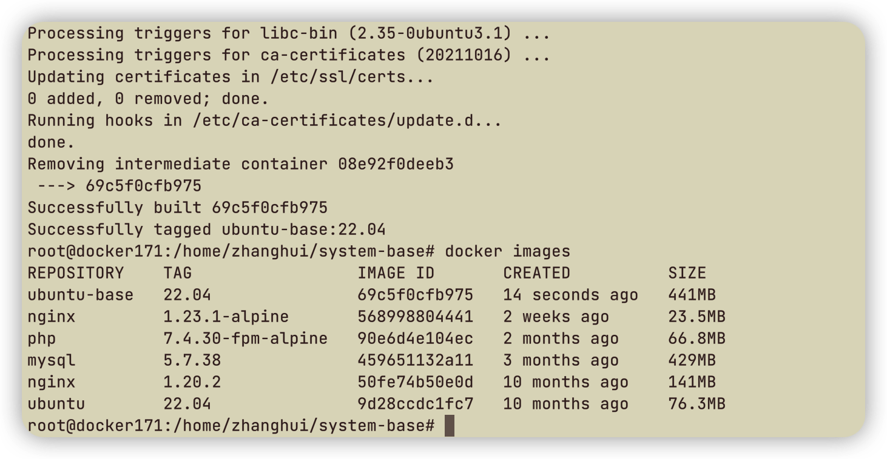
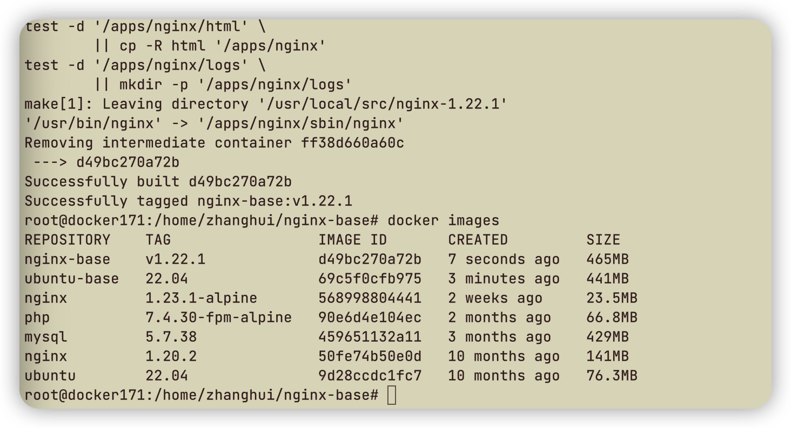
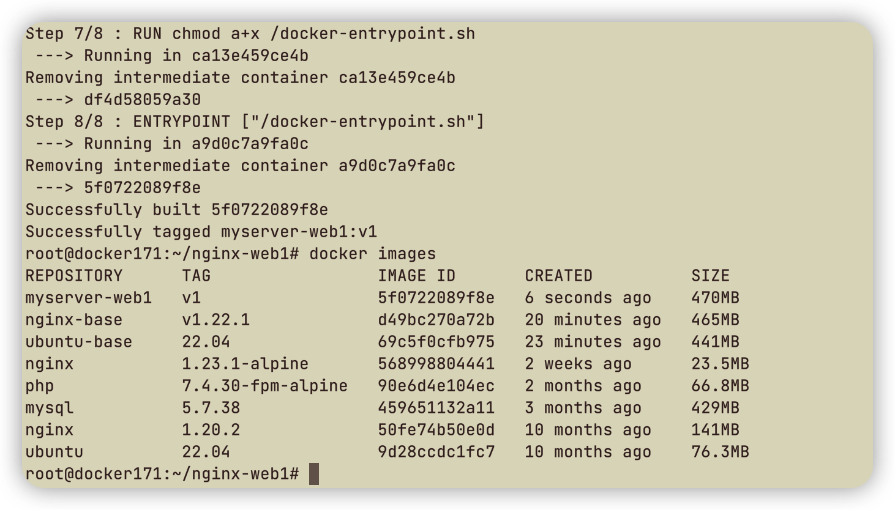
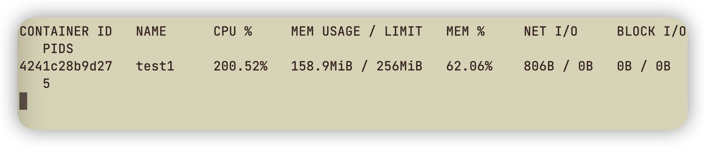
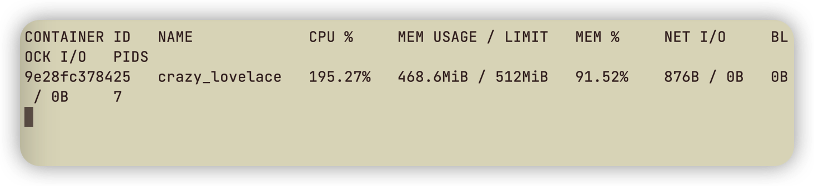
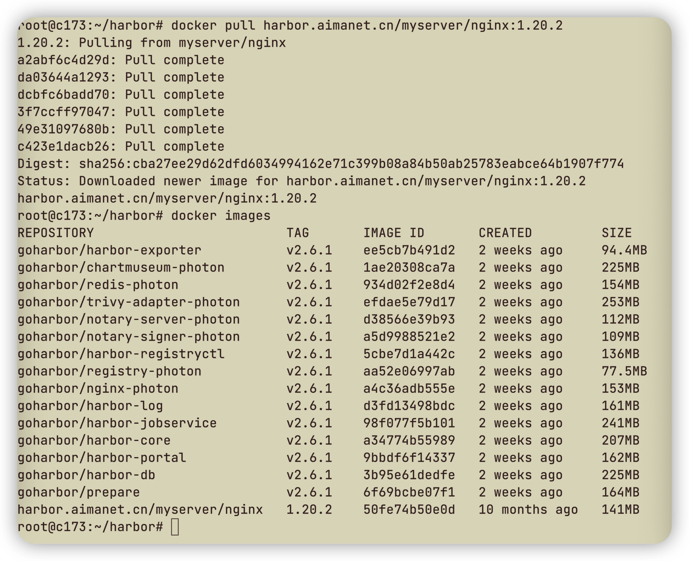
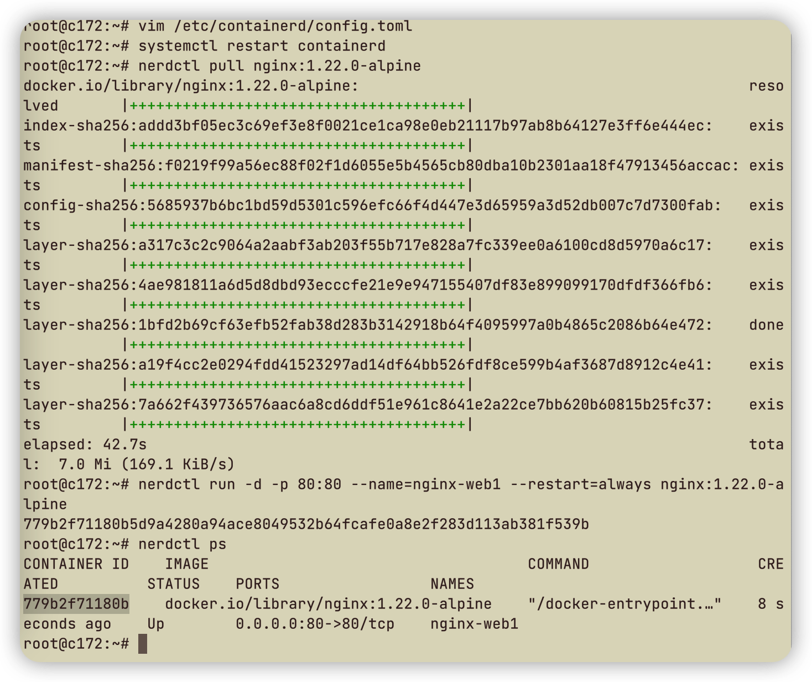

## 作业要求

1. 基于dockerfile实现分层构建的nginx业务镜像
2. 基于docker实现对容器的CPU和内存的资源限制
3. 部署http协议的harbor镜像仓库
4. 掌握containerd的安装（扩展作业）
5. 基于nerdctl拉取镜像和创建容器（扩展作业）

## 1. 基于dockerfile实现分层构建的nginx业务镜像

创建基础镜像

```bash
mkdir system-base
cd system-base

# 创建Dockerfile
vim Dockerfile

FROM ubuntu:22.04
MAINTAINER "zhanghui 15392532@qq.com"

# ADD sources.list /etc/apt/sources.list

# RUN apt update && apt-get -y install apt-transport-https ca-certificates curl software-properties-common

RUN apt update && apt install -y iproute2  ntpdate  tcpdump telnet traceroute nfs-kernel-server nfs-common lrzsz tree openssl libssl-dev libpcre3 libpcre3-dev zlib1g-dev ntpdate tcpdump telnet traceroute  gcc openssh-server lrzsz tree openssl libssl-dev libpcre3 libpcre3-dev zlib1g-dev ntpdate tcpdump telnet traceroute iotop unzip zip make

# 构建
docker build -t ubuntu-base:22.04 .
```



创建nginx基础镜像镜像

```bash
mkdir nginx-base
cd nginx-base

# 下载所需文件
wget https://nginx.org/download/nginx-1.22.1.tar.gz

# 创建Dockerfile
vim Dockerfile

FROM ubuntu-base:22.04

ADD nginx-1.22.1.tar.gz /usr/local/src/
RUN cd /usr/local/src/nginx-1.22.1 && ./configure --prefix=/apps/nginx && make && make install  && ln -sv /apps/nginx/sbin/nginx /usr/bin

# 构建
docker build -t nginx-base:v1.22.1 .
```



构建项目镜像

```bash
mkdir nginx-web1
cd nginx-web1

# 准备相关文件
nginx.conf
frontend.tar.gz
docker-entrypoint.sh

# 创建Dockerfile
vim Dockerfile

FROM nginx-base:v1.22.1

RUN groupadd  -g 2088 nginx && useradd  -g nginx -s /usr/sbin/nologin -u 2088 nginx && chown -R nginx.nginx /apps/nginx
ADD nginx.conf /apps/nginx/conf/
ADD frontend.tar.gz /apps/nginx/html/

EXPOSE 80 443

COPY docker-entrypoint.sh /docker-entrypoint.sh
RUN chmod a+x /docker-entrypoint.sh
ENTRYPOINT ["/docker-entrypoint.sh"]

# 构建
docker build -t myserver-web1:v1 .
```



运行容器

```
docker run -it -d -p 80:80 myserver-web1:v1
```

浏览测试

```
http://172.16.17.1
```


## 2. 基于docker实现对容器的CPU和内存的资源限制

内存限制

```bash
# 申请2个线程，每个线程256M内存，但宿主机限制为256M
docker run -it --rm  --name test1 -m 256m  lorel/docker-stress-ng --vm 2 --vm-bytes 256M

# 观察使用内存情况
docker stats

# 参看cpu占用
top
```


CPU限制

```bash
# 限制CPU占用200%，内存512M
docker run -it -d -m 512m --cpus 2  -p 80:80  lorel/docker-stress-ng --cpu 2 --vm 2

# 检查占用
docker stats
```



资源限制查看

```bash
docker info
# 会发现Cgroup Driver: systemd

# 运行容器
docker run -it -d -m 512m --cpus 2  -p 80:80  nginx:1.23.1-alpine

# 查找该进程
ps -ef|grep nginx
# 进程id为20731

# 查看具体的进程资源限制
cat /proc/20754/cpuset
# /system.slice/docker-8772d26420810e181f0b23ac42563896d482249d1e7591aa00f5776a9c77d2f8.scope

cat /sys/fs/cgroup/system.slice/docker-8772d26420810e181f0b23ac42563896d482249d1e7591aa00f5776a9c77d2f8.scope/cpu.max
# 200000 100000
# 200000/100000=2

cat /sys/fs/cgroup/system.slice/docker-8772d26420810e181f0b23ac42563896d482249d1e7591aa00f5776a9c77d2f8.scope/memory.max
# 536870912
# 536870912/1024/1024=512M
```


## 3. 部署http协议的harbor镜像仓库

安装docker

```bash
# 解压
tar xvf docker-20.10.19-binary-install.tar.gz 

# 修改脚本docker-install.sh
PACKAGE_NAME="docker-20.10.19.tgz"

# 运行脚本
bash docker-install.sh

# 检查
docker version
docker info
docker-compose version
```

安装harbor

```bash
# 下载上传
https://github.com/goharbor/harbor/releases/download/v2.6.1/harbor-offline-installer-v2.6.1.tgz

# 解压
tar xvf harbor-offline-installer-v2.6.1.tgz

# 创建配置文件
cd harbor
cp harbor.yml.tmpl harbor.yml

vim harbor.yml

hostname: harbor.aimanet.cn
注释掉https及下面所有选项
修改harbor admin密码及数据库密码

# 安装
./install.sh --with-trivy --with-chartmuseum
```

在域名服务器上定义harbor.aimanet.cn

浏览器登录harbor.aimanet.cn，账户为admin，新建项目myserver，勾选公开

客户端上传及拉取镜像

```bash
# 172.16.17.1
# 配置仓库信任
vim /etc/docker/daemon.json

"insecure-registries": ["harbor.aimanet.cn"]

# 重启docker
systemctl restart docker

# 登录
docker login harbor.aimanet.cn

# 上传镜像
docker tag nginx:1.20.2 harbor.aimanet.cn/myserver/nginx:1.20.2
docker push harbor.aimanet.cn/myserver/nginx:1.20.2

# 172.16.17.3
# 配置仓库信任
vim /etc/docker/daemon.json

"insecure-registries": ["harbor.aimanet.cn"]

# 重启docker
systemctl restart docker

# 验证镜像下载
docker pull harbor.aimanet.cn/myserver/nginx:1.20.2
```


## 4. 掌握containerd的安装（扩展作业）

安装containerd

```bash
# 更新仓库安装依赖包
apt update
sudo apt-get install apt-transport-https ca-certificates curl gnupg2 software-properties-common

# 导入公钥
curl -fsSL https://download.docker.com/linux/ubuntu/gpg | sudo gpg --dearmor -o /etc/apt/keyrings/docker.gpg

# 添加镜像源
echo \
  "deb [arch=$(dpkg --print-architecture) signed-by=/etc/apt/keyrings/docker.gpg] https://download.docker.com/linux/ubuntu \
  $(lsb_release -cs) stable" | sudo tee /etc/apt/sources.list.d/docker.list > /dev/null

# 更新仓库
apt update

# 验证containerd版本
apt-cache madison containerd.io

# 安装containerd
apt install containerd.io=1.6.8-1
systemctl status containerd.service
containerd --version
```

配置container

```bash
# 显示默认配置参数
containerd config default

# 自定义配置
containerd config default > /etc/containerd/config.toml

# 修改配置
vim /etc/containerd/config.toml

# 61行沙箱国内镜像
sandbox_image = "registry.aliyuncs.com/google_containers/pause:3.7"
# 153行配置阿里源
[plugins."io.containerd.grpc.v1.cri".registry.mirrors]
# 154行缩进          
[plugins."io.containerd.grpc.v1.cri".registry.mirrors."docker.io"]
# 155行再缩进
endpoint = ["https://9916w1ow.mirror.aliyuncs.com"]

# 重启
systemctl restart containerd && systemctl  enable containerd

# 手动安装runc
wget https://github.com/opencontainers/runc/releases/download/v1.1.4/runc.amd64
cp runc.amd64 /usr/bin/runc
chmod a+x /usr/bin/runc

# 检查版本
runc -v
```

安装cni网络

```bash
wget https://github.com/containernetworking/plugins/releases/download/v1.1.1/cni-plugins-linux-amd64-v1.1.1.tgz
mkdir /opt/cni/bin -pv
tar xvf cni-plugins-linux-amd64-v1.1.1.tgz -C  /opt/cni/bin/

# 确认配置
vim /etc/containerd/config.toml

[plugins."io.containerd.grpc.v1.cri".cni]
bin_dir = "/opt/cni/bin"

# 重启服务
sudo systemctl daemon-reload
sudo systemctl restart containerd
```

## 5. 基于nerdctl拉取镜像和创建容器（扩展作业）

安装nerdctl

```bash
wget https://github.com/containerd/nerdctl/releases/download/v0.23.0/nerdctl-0.23.0-linux-amd64.tar.gz
tar xvf nerdctl-0.23.0-linux-amd64.tar.gz  -C /usr/bin/
```

创建容器

```bash
# 启动容器
nerdctl run -d -p 80:80 --name=nginx-web1 --restart=always nginx:1.22.0-alpine

nerdctl ps
nerdctl exec -it 779b2f71180b sh
nerdctl run -d -p 8080:8080 --name=tomcat-web1 --restart=always tomcat:7.0.88-alpine
```

浏览测试

```
http://172.16.17.2
```


