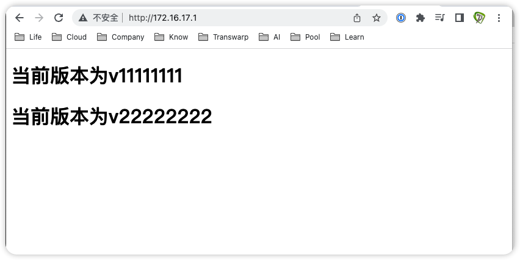

# 极客时间运维进阶训练营第三周作业


## 作业要求

1. 基于docker-compose实现对nginx+tomcat web服务的单机编排
2. 安装gitlab、创建group、user和project并授权
3. 熟练git命令的基本使用，通过git命令实现源代码的clone、push等基本操作
4. 熟练掌握对gitlab服务的数据备份与恢复

5. 部署jenkins服务器并安装gitlab插件、实现代码免秘钥代码clone

## 1. 基于docker-compose实现对nginx+tomcat web服务的单机编排

#### 服务器节点选择

```bash
172.16.17.1
```

#### 下载docker-compose

```bash
wget https://github.com/docker/compose/releases/download/v2.12.2/docker-compose-linux-x86_64
mv docker-compose-Linux-x86_64 /usr/local/bin/docker-compose
chmod a+x /usr/local/bin/docker-compose
docker-compose version
# Docker Compose version v2.12.2
```

#### 创建docker-compose.yml

```bash
version: '3.6'
services:
  nginx-server:
    image: nginx:1.23.0-alpine
    container_name: nginx-web1
    expose:
      - 80
      - 443
    ports:
      - "80:80"
      - "443:443"
    networks:
      - front
      - app
    links:
      - tomcat-server
      
  tomcat-server:
    image: tomcat:7.0.93-alpine
    container_name: tomcat-app1
    networks:
      - app
      
networks:
  front:
    driver: bridge
  app:
    driver: bridge
  default:
    external:
      name: bridge
```

#### 启动容器

```bash
docker-compose up -d

# 检索服务
docker-compose ps --services
# nginx-server
# tomcat-server

# 测试服务连通性
docker-compose exec -it nginx-server sh
ping tomcat-server
```

#### 修改nginx容器内页面及配置文件

```bash
# 进入容器
docker-compose exec -it nginx-server sh

# 修改nginx页面
vi /usr/share/nginx/html/index.html

# 添加如下行
<h2>Hello nginx</h2>

# 修改nginx配置文件
# 指向tomcat-server服务
vi /etc/nginx/conf.d/default.conf

# 添加如下行
location /myapp {
  proxy_pass http://tomcat-server:8080;
}

# 重新加载nginx
nginx -s reload
```

#### 修改tomcat容器内页面

 ```bash
# 进入容器
docker-compose exec -it tomcat-server bash

# 创建index.jsp
cd /usr/local/tomcat/webapps
mkdir myapp
cd myapp
vi index.jsp

<%@page import="java.util.Enumeration"%>
<br />
host: <%try{out.println(""+java.net.InetAddress.getLocalHost().getHostName());}catch(Exception e){}%>
<br />
remoteAddr: <%=request.getRemoteAddr()%>
<br />
remoteHost: <%=request.getRemoteHost()%>
<br />
sessionId: <%=request.getSession().getId()%>
<br />
serverName:<%=request.getServerName()%>
<br />
scheme:<%=request.getScheme()%>
<br />
<%request.getSession().setAttribute("t1","t2");%>
<%
        Enumeration en = request.getHeaderNames();
        while(en.hasMoreElements()){
        String hd = en.nextElement().toString();
                out.println(hd+" : "+request.getHeader(hd));
                out.println("<br />");
        }
%>
 ```

#### 容器内测试联通性

```bash
# 进入容器
docker-compose exec -it nginx-server sh

# 测试
curl tomcat-server:8080/myapp/index.jsp
```

#### 访问nginx

```bash
http://172.16.17.1
```

#### 访问tomcat

```bash
# 通过nginx访问tomcat
http://172.16.17.1/myapp/index.jsp
```


## 2. 安装gitlab、创建group、user和project并授权

#### 服务器节点选择

```bash
172.16.17.5
```

#### 下载gitlab

```bash
# 清华大学源
wget https://mirrors.tuna.tsinghua.edu.cn/gitlab-ce/ubuntu/pool/focal/main/g/gitlab-ce/gitlab-ce_15.5.1-ce.0_amd64.deb
```
#### 安装gitlab

```bash
# 如果需外挂存储，建议安装目录挂在/opt/gitlab，数据目录挂载/var/opt/gitlab，且提前挂载好再安装gitlab
dpkg -i gitlab-ce_15.5.1-ce.0_amd64.deb
```

修改配置

```bash
# 修改配置文件
vim /etc/gitlab/gitlab.rb

external_url 'http://172.16.17.5'
gitlab_rails['smtp_enable'] = true
gitlab_rails['smtp_address'] = "smtp.qq.com"
gitlab_rails['smtp_port'] = 465
gitlab_rails['smtp_user_name'] = "15392532@qq.com"
gitlab_rails['smtp_password'] = "<password>"
gitlab_rails['smtp_domain'] = "qq.com"
gitlab_rails['smtp_authentication'] = :login
gitlab_rails['smtp_enable_starttls_auto'] = true
gitlab_rails['smtp_tls'] = true
gitlab_rails['gitlab_email_from'] = "15392532@qq.com"
user["git_user_email"] = "15392532@qq.com"

# 重新配置服务
gitlab-ctl reconfigure
```

#### 修改root密码

浏览主页`http://172.16.17.5`，输入登录账号root，密码需从以下文件获取

```bash
cat /etc/gitlab/initial_root_password
```

登录后，在root> Preference> Password进行密码修改

#### 修改为中文

在root> Preference中，修改Localization> Language为简体中文

#### 设置通知邮件

在账户> 偏好设置> 电子邮件处，填入root的电子邮件`15392532@qq.com`，点击重新发送确认邮件，验证邮箱

在账户> 偏好设置> 通知里，将邮件通知的默认邮件修改为`15392532@qq.com`

#### 关闭注册

在管理员>设置>  通用中，在注册限制中关闭已启用注册功能，避免任何人都能自助注册账号

#### 新建群组

在管理员> 概览> 群组中，选择新建群组，输入群组名称为develop，群组URL为`http://172.16.17.5/develop`，级别为私有，点击创建群组

#### 创建用户

在管理员> 概览> 用户中，创建一个新用户，账户名称为user1，用户名为user1，邮件为`zhanghui@igalaxycn.com`，级别是普通，保存

再编辑用户user1，设置初始密码

同样道理创建用户user2，邮箱地址唯一，采用`freecow29@126.com`


#### 用户首次登录

上述账号均需登录一次gitlab主页，并修改密码

#### 创建项目

以root身份登录，点击新建项目，创建空白项目，项目名称为app1，项目URL为`http://172.16.17.5/develop/app1`，项目为私有


#### 对账户授权

在app1项目中，点击在管理中心查看项目，点击管理权限，点击邀请成员，输入user1，选择角色为Owner，点击邀请；user2选择角色为Developer


## 3. 熟练git命令的基本使用，通过git命令实现源代码的clone、push等基本操作

#### 操作节点选择

```bash
172.16.17.1
```

#### 安装git

```bash
apt install git
```

#### clone操作

```bash
git clone http://172.16.17.5/develop/app1.git
http://172.16.17.5/develop/app1.git
Username: user1
```

#### 创建程序文件

进入app1目录，创建文件index.html

```html
<!DOCTYPE html>
<html lang='en'>
  <head>
    <meta charset="UTF-8">
    <title>网页测试</title>
  </head>
  <body>
    <h1>当前版本为v11111111</h1>
  </body>
</html>
```

#### push操作

```bash
# 配置全局用户名
git config --global user.email "zhanghui@igalaxycn.com"
git config --global user.name "user1"

# 添加当前目录下所有变化内容到暂存区
cd app1
git add .

# 提交本地仓库
git commit -m "add index.html"

# 上传到gitlab服务器
git push

# 刷新gitlab主页，查看已推送文件
```


## 4. 熟练掌握对gitlab服务的数据备份与恢复

#### 服务器节点选择

```bash
172.16.17.5
```

#### 备份

```bash
# 停止服务
gitlab-ctl stop unicorn sidekiq

# 在任意目录执行备份创建
gitlab-rake gitlab:backup:create

# 同时需压缩备份以下目录及文件
/var/opt/gitlab/nginx/conf
/etc/gitlab

# 如果要查时间戳
http://tool.lu/timestamp
```


#### 删除数据

恢复服务

```bash
gitlab-ctl start unicorn sidekiq
```

在gitlab主页删除用户user2，修改app1项目的index.html文件内容

#### 恢复

```bash
# 查看备份目录
ll /var/opt/gitlab/backups/
# 1668033652_2022_11_09_15.5.1_gitlab_backup.tar

# 停止服务
gitlab-ctl stop unicorn sidekiq

# 恢复，只写到时间戳及时间
gitlab-rake gitlab:backup:restore BACKUP=1668033652_2022_11_09_15.5.1

# 启动服务
gitlab-ctl start unicorn sidekiq
```


#### 检查恢复情况

登录gitlab检查user2用户及app1项目是否完整


## 5. 部署jenkins服务器并安装gitlab插件、实现代码免秘钥代码clone

#### 服务器节点选择

```bash
172.16.17.6
```

#### 下载

```bash
# 地址
wget http://mirrors.tuna.tsinghua.edu.cn/jenkins/debian-stable/jenkins_2.361.3_all.deb
```

#### 安装jdk

```bash
# jenkins 2.361.1以上要求java 11
apt install openjdk-11-jdk
java -version

# 安装依存包
apt install net-tools
```

#### 安装jenkins

```bash
# 安装
dpkg -i jenkins_2.361.3_all.deb && systemctl stop jenkins

# 修改配置文件
vim /etc/default/jenkins

JENKINS_USER=root
JENKINS_GROUP=root

# 修改服务配置文件
vim /lib/systemd/system/jenkins.service

User=root
Group=root
# 修改JAVA参数，关闭跨站请求伪造保护CSRF保护
Environment="JAVA_ARGS=-Djava.awt.headless=true -Dhudson.security.csrf.GlobalCrumbIssuerConfiguration.DISABLE_CSRF_PROTECTION=true"

# 重启服务
systemctl daemon-reload && systemctl restart jenkins.service

# 检查java参数是否生效
ps -ef |grep jenkins
```

#### 初始化配置

登录并解锁

```bash
http://172.16.17.6:8080

# 输入解锁密码
cat /var/lib/jenkins/secrets/initialAdminPassword
```

选择安装推荐的插件，等待安装完毕，等待插件安装完毕

通过以下命令可以随时检查已安装的插件文件数

```bash
ll -l /var/lib/jenkins/plugins/ | wc -l
```

创建管理员账户，用户名称及全名均为jenkinsadmin，邮件为`15392532@qq.com`

实例配置无需修改`http://172.16.17.6:8080/`

重启服务以加载插件

```bash
systemctl restart jenkins.service
```

#### 安装gitlab插件

在系统管理> 插件管理中，选择可选插件，搜索gitlab并勾选，点击install without restart，等待安装完毕后重启服务

```bash
systemctl restart jenkins.service
```


修改升级站点

```bash
https://mirrors.tuna.tsinghua.edu.cn/jenkins/updates/update-center.json
```

#### 设置通知

系统管理> 系统配置中，修改如下

```bash
系统管理员邮件：15392532@qq.com
SMTP服务器：smtp.qq.com
邮件后缀：@qq.com
勾选使用SMTP认证
用户名：15392532@qq.com
密码：<password>
勾选使用SSL协议及Use TLS
SMTP端口：465
Reply地址：15392532@qq.com
字符集：UTF-8
```

点击发送测试邮件测试配置，检查是否可以发送成功

#### 配置ssh密钥认证

```bash
# 生成密钥
ssh-keygen

# 拷贝公钥至gitlab服务器
ssh-copy-id 172.16.17.5

# 测试无密码登录
ssh 172.16.17.5
exit

# 复制公钥内容
cat /root/.ssh/id_rsa.pub

# 以root身份登录gitlab
# http://172.16.17.5
在root> 偏好设置> SSH密钥中，把复制的公钥放到密钥中，延长有效期，点击添加密钥

# 在Jenkins主机测试是否可以无交互式克隆
git clone git@172.16.17.5:develop/app1.git
```


#### 新建web服务器

```bash
# 在172.16.17.1节点系统层安装nginx
apt install nginx
ss -tnl

# 检查nginx页面
ll /var/www/html

# 测试浏览
http://172.16.17.1
```

#### 创建任务脚本

```bash
# 在jenkins节点172.16.17.6
# 配置到web服务器的ssh免密登录
ssh-copy-id 172.16.17.1
ssh 172.16.17.1

# 创建目录
mkdir -p /data/script
mkdir -p /data/gitdata/develop

cd /data/script

# 创建脚本test.sh
#!/bin/bash
cd /data/gitdata/develop
rm -rf app1
git clone git@172.16.17.5:develop/app1.git
cd app1
scp index.html 172.16.17.1:/var/www/html/

# 修改权限
chmod a+x test.sh

# 脚本反复多次运行测试
bash test.sh
```

#### 创建任务

在jenkins的dashboard> 新建任务，名称test-job1，选择构建一个自由风格的软件项目

在Build Steps选择执行shell，在出现的命令框中输入如下代码，保存

```bash
/bin/bash /data/script/test.sh
```

点击立即构建；执行完毕后，点击结果状态码，点击控制台输出，检查运行日志是否成功

浏览web服务器`http://172.16.17.1`的主页


#### 修改代码测试

在节点172.16.17.1修改代码

```bash
# 拉取最新代码
git pull

# 修改index.html
<!DOCTYPE html>
<html lang='en'>
  <head>
    <meta charset="UTF-8">
    <title>网页测试</title>
  </head>
  <body>
    <h1>当前版本为v11111111</h1>
    <h1>当前版本为v22222222</h1>
  </body>
</html>

# 推送
git add .
git commit -m "Modify index.html"
git push
```

在Jenkins服务器上再次执行test-job1


浏览web服务器`http://172.16.17.1`是否主页已变更


