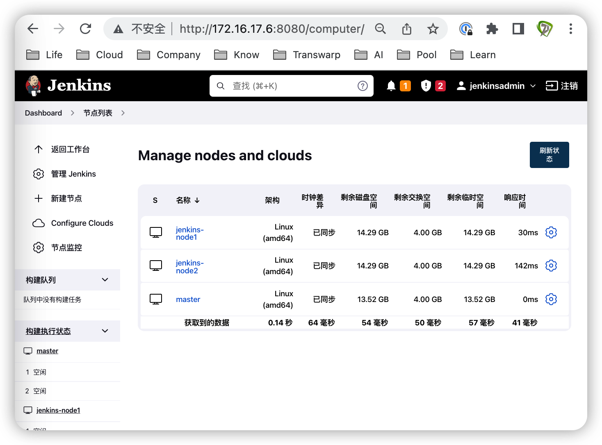
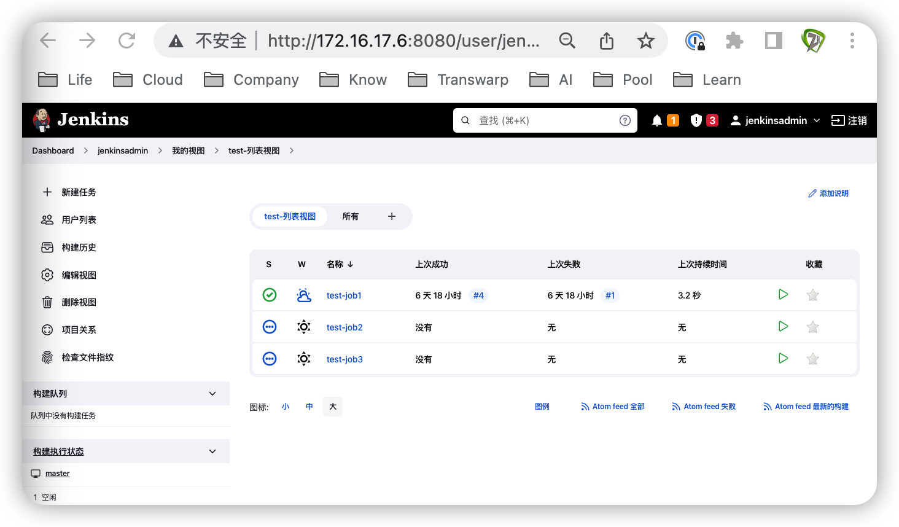
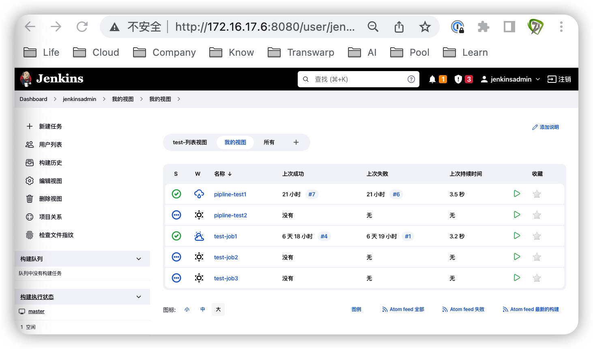
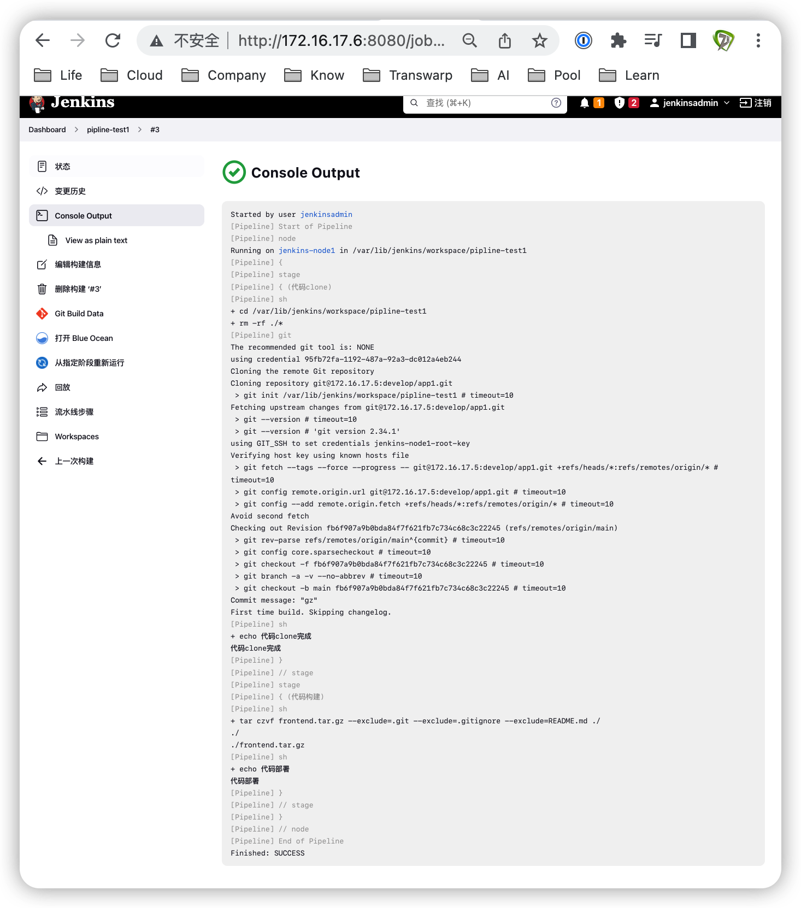
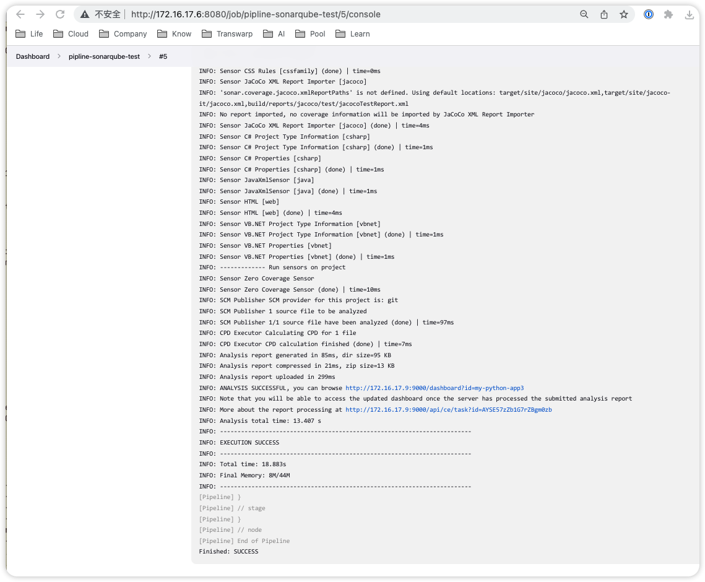
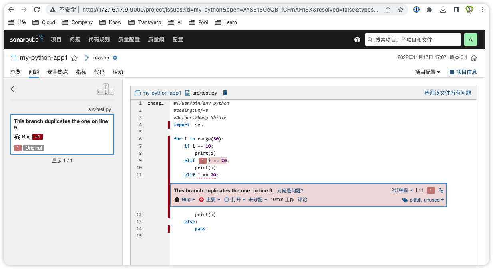
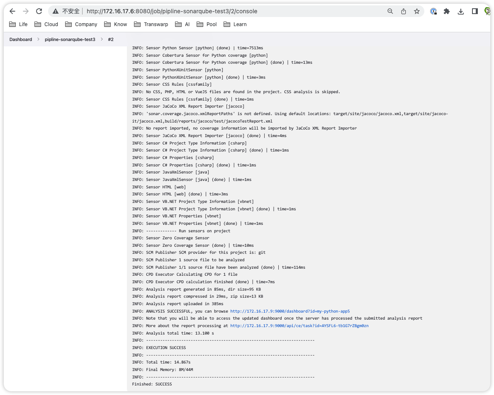
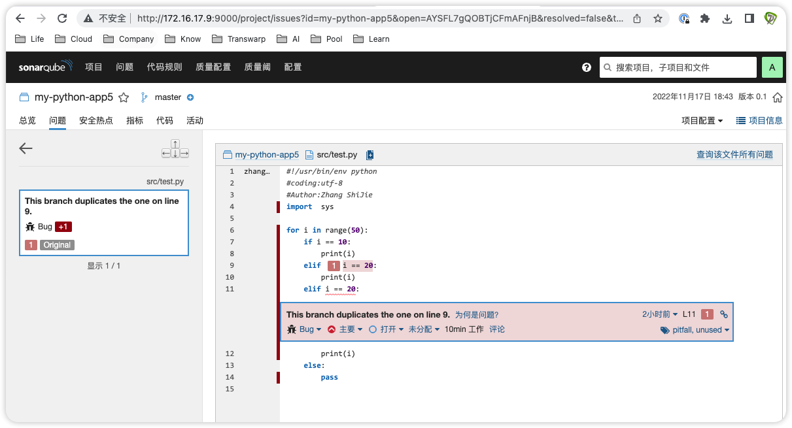

# 极客时间运维进阶训练营第四周作业


## 作业要求

1. 部署jenkins master及多slave环境
2. 基于jenkins视图对jenkins job进行分类
3. 总结jenkins pipline基本语法
4. 部署代码质量检测服务sonarqube
5. 基于命令、shell脚本和pipline实现代码质量检测

扩展：
jenkins安装Sonarqube Scanner插件、配置sonarqube server地址、基于jenkins配置代码扫描参数实现代码质量扫描

Execute SonarQube Scanner


## 1. 部署jenkins master及多slave环境

### 各节点安排

```bash
# master
# 采用上节课已经装好的jenkins
172.16.17.6

# slave
172.16.17.7
172.16.17.8
```

### 各节点配置时间同步计划

```bash
# 创建任务
crontab -e

# 每5分钟更新一次时间
*/5 * * * * /usr/sbin/ntpdate time1.aliyun.com &> /dev/null && /usr/bin/hwclock -w

# 打开日志
vim /etc/rsyslog.d/50-default.conf

cron.*   /var/log/cron.log

# 重启
cron restart
```

### 准备slave节点环境

```bash
# 创建工作目录
mkdir -p /var/lib/jenkins

# 安装必备组件
apt update
apt install openjdk-11-jdk -y
apt install git -y
```

### master节点安装插件

登录`http://172.16.17.6:8080/`，在系统管理> 插件管理中，选择可选插件，搜索Blueocean并勾选，点击install without restart，等待安装完毕后重启服务

```bash
systemctl restart jenkins.service
```

### master添加各slave节点

在dashboard-->系统管理-->节点管理中，点击新建节点，节点名称为jenkins-node1，勾选固定节点，点击create

描述为jenkins-node1，标签为jenkins-node1，用于对服务器进行筛选；executors为8，工作目录为/var/lib/jenkins

用法选择“只允许运行绑定到这台机器的job”，启动方式为“Launch agents via SSH”，主机为jenkins-node1的ip地址172.16.17.7，凭据点击添加Jenkins（有时候会出现Jenkins无法点击，可保存后再进行编辑）

在弹出的添加凭据中，类型选择Username with Password，用户名为root，输入密码，描述为root-ssh-password-for-jenkins_slave，点击添加

回到凭据，选择刚添加的root-ssh-password-for-jenkins_slave，Host key Verification选择Non Verifying，可用性选择“尽量保持代理在线”，点击保存

按照同样方法添加jenkins-node1节点172.16.17.8，等待各节点显示同步



### 设置slave node1凭据

在node1节点上生成密钥，把公钥放到gitlab中

```bash
# 生成密钥
ssh-keygen

# 拷贝公钥至gitlab服务器
ssh-copy-id 172.16.17.5

# 测试无密码登录
ssh 172.16.17.5
exit

# 复制公钥内容
cat /root/.ssh/id_rsa.pub

# 以root身份登录gitlab
# http://172.16.17.5
在root-->偏好设置-->SSH密钥中，把复制的公钥放到密钥中，延长有效期，点击添加密钥

# 测试无交互式克隆
git clone git@172.16.17.5:develop/app1.git
```

把私钥放到Jenkins master中

```bash
# 拷贝私钥至Jenkins master服务器
cat /root/.ssh/id_rsa

# 登录Jenkins master
在账户jenkinsadmin点击凭据，点击全局> Add Credentials，类型为SSH Username with private key，范围为全局，描述为jenkins-node1-root-key，用户名为root，选择Enter directly将私钥贴进来，点击create
```

类似，可将node2的key放到gitlab和Jenkins master中

## 2. 基于jenkins视图对jenkins job进行分类

在Dashboard中，新建任务test-job2、test-job3，新建任务pipline-test2

在dashboard-->我的视图中，新建"test-列表视图"，类型选择列表视图，勾选使用正则表达式，输入表达式为test-.*，点击应用及保存，即可看到以test为开头的视图



在dashboard-->我的视图中，新建"我的视图"，类型选择我的视图，即可看到本账号权限范围内的视图



## 3. 总结jenkins pipline基本语法

在Dashboard中新建任务，输入任务名称为pipline-test1，类型选择流水线，到项目选项的流水线处，选择定义为Pipeline script，输入以下脚本

```bash
pipeline {
  // agent any // 在任何节点执行
  agent {
    label 'jenkins-node1' // 在对应标签的节点执行
  }
  stages {
    // 克隆阶段
    stage('代码clone'){
      steps{
        // 进入创建的流水线目录，清除已clone的项目
        sh "cd /var/lib/jenkins/workspace/pipline-test1 && rm -rf ./*"
        // 克隆分支，可通过jenkins主页的流水线语法，选择node1的凭据及仓库url生成该脚本
        git branch: 'main', credentialsId: '95fb72fa-1192-487a-92a3-dc012a4eb244', url: 'git@172.16.17.5:develop/app1.git'
        // 显示提示信息
        sh 'echo 代码clone完成'
      }
    }
    // 构建阶段
    stage('代码构建'){
      steps{
        // 建立压缩文件，排除指定文件
        sh "tar czvf frontend.tar.gz --exclude=.git --exclude=.gitignore --exclude=README.md ./"
      }
    }
  }
}
```

点击应用，点击保存后立即构建，点击Console output，观察输出日志



## 4. 部署代码质量检测服务sonarqube

### 各节点安排

```bash
# postgres
172.16.17.10

# sonarqube
172.16.17.9
```

### 安装postgres

```bash
# 172.16.17.10
# 先卸载已有postgresql
sudo apt-get --purge remove postgresql\*
sudo rm -r /etc/postgresql/
sudo rm -r /etc/postgresql-common/
sudo rm -r /var/lib/postgresql/
sudo userdel -r postgres
sudo groupdel postgres

# 安装postgresql
sudo apt update
apt-cache madison postgresql
apt install postgresql postgresql-client -y

# 修改服务监听地址
vim /etc/postgresql/14/main/postgresql.conf

listen_addresses = '*'
port = 5432
max_connections = 4096

# 允许哪些主机可以连入
vim /etc/postgresql/14/main/pg_hba.conf

# IPv4 local connections:
host  all  all 0.0.0.0/0 scram-sha-256

# 重启
systemctl restart postgresql

# 查看监听
ss -tnl
lsof -i:5432
```

### 创建数据库及账户授权

```bash
# 切换为postgres用户
su - postgres

# 进入postgres
psql -U postgres

# 创建数据库
CREATE DATABASE sonar;
# 创建用户
CREATE USER sonar WITH ENCRYPTED PASSWORD '123456';
# 授权给用户sonar访问
GRANT ALL PRIVILEGES ON DATABASE sonar TO sonar;
# 修改数据库owner
ALTER DATABASE sonar OWNER TO sonar;
# 退出
\q
exit
```

### 部署sonarqube

```bash
# 172.16.17.9
# 安装psql客户端做测试
apt install postgresql postgresql-client -y
psql -h 172.16.17.10 -U sonar

# 安装jdk
apt update
apt install -y openjdk-11-jdk

# 修改内核参数
vim /etc/sysctl.conf

vm.max_map_count = 524288
fs.file-max = 131072

# 参数生效
sysctl -p

# 查看参数生效情况
sysctl -a | grep vm.max_map_count

# 优化内核参数
vim /etc/security/limits.conf

root          soft    core            unlimited
root          hard    core            unlimited
root          soft    nproc           1000000
root          hard    nproc           1000000
root          soft    nofile          1000000
root          hard    nofile          1000000
root          soft    memlock         32000
root          hard    memlock         32000
root          soft    msgqueue        8192000
root          hard    msgqueue        8192000

*             soft    core            unlimited
*             hard    core            unlimited
*             soft    nproc           1000000
*             hard    nproc           1000000
*             soft    nofile          1000000
*             hard    nofile          1000000
*             soft    memlock         32000
*             hard    memlock         32000
*             soft    msgqueue        8192000
*             hard    msgqueue        8192000


# 部署sonarqube
mkdir /apps && cd /apps/

# 下载
wget https://binaries.sonarsource.com/Distribution/sonarqube/sonarqube-8.9.10.61524.zip

# 解压
unzip sonarqube-8.9.10.61524.zip
ln -sv /apps/sonarqube-8.9.10.61524 /apps/sonarqube

# 创建sonarqube用户并修改权限
useradd -r -m -s /bin/bash sonarqube

# 赋予权限
# 如果报es启动失败，一般需要再次运行此命令
chown sonarqube.sonarqube /apps/ -R

# 切换为sonarqube用户
su - sonarqube

# 修改配置文件
vim /apps/sonarqube/conf/sonar.properties

sonar.jdbc.username=sonar
sonar.jdbc.password=123456
# 连接到刚建好的数据库sonar
sonar.jdbc.url=jdbc:postgresql://172.16.17.10/sonar

# 启动sonarqube
/apps/sonarqube/bin/linux-x86-64/sonar.sh --help
/apps/sonarqube/bin/linux-x86-64/sonar.sh start

# 检查启动日志
tail -f /apps/sonarqube/logs/*.log
lsof -i:9000

# 登录sonarqube
访问http://172.16.17.9:9000
默认账户admin/admin
修改密码
```

### sonarqube配置

```bash
# 安装插件
# 需挂代理
Administration-->Marketplace-->I understand the risk
搜索chinese，安装Chinese Pack插件，安装完毕后，点击Restart Server

# 配置权限
配置-->通用设置-->权限-->Force user authentication，选择关闭，便于jenkins调用sonarqube的api

# 创建sonarqube服务启动文件
vim /etc/systemd/system/sonarqube.service

[Unit]
Description=SonarQube service
After=syslog.target network.target

[Service]
Type=simple
User=sonarqube
Group=sonarqube
PermissionsStartOnly=true
ExecStart=/bin/nohup /usr/bin/java -Xms1024m -Xmx1024m -Djava.net.preferIPv4Stack=true -jar /apps/sonarqube/lib/sonar-application-8.9.10.61524.jar
StandardOutput=syslog
LimitNOFILE=131072
LimitNPROC=8192
TimeoutStartSec=5
Restart=always
SuccessExitStatus=143

[Install]
WantedBy=multi-user.target

# 启动服务
systemctl daemon-reload
systemctl restart sonarqube
```

### 部署扫描器sonar-scanner

```bash
# 在jenkins master及slave所有节点上安装
# 下载
mkdir /apps
cd /apps
wget https://binaries.sonarsource.com/Distribution/sonar-scanner-cli/sonar-scanner-cli-4.7.0.2747.zip

# 上传解压
unzip sonar-scanner-cli-4.7.0.2747.zip
ln -sv /apps/sonar-scanner-4.7.0.2747 /apps/sonar-scanner

# 修改配置
vim /apps/sonar-scanner/conf/sonar-scanner.properties
#----- Default SonarQube
serversonar.host.url=http://172.16.17.9:9000
#----- Default source code encoding
sonar.sourceEncoding=UTF-8
```

## 5. 基于命令、shell脚本和pipline实现代码质量检测

### 创建被测代码

```bash
# gitlab：172.16.17.5
新建项目app2，项目URL为http://172.16.17.5/develop/app2

# 172.16.17.1
cd /root
git clone http://172.16.17.5/develop/app2.git

# 编写test.py
cd app2/src
vim test.py

#!/usr/bin/env python
#coding:utf-8
#Author:Zhang ShiJie
import  sys

for i in range(50):
    if i == 10:
        print(i)
    elif i == 20:
        print(i)
    elif i == 20:
        print(i)
    else:
        pass

# 推送
git add .
git commit -m "add test.py"
git push
```

### 命令扫描方式

```bash
# 编写sonar配置文件
# 对src目录下的py文件进行扫描
cd /root/app2
vim sonar-project.properties

sonar.projectKey=my-python
sonar.projectName=my-python-app1
sonar.projectVersion=0.1
sonar.sources=./src
sonar.language=py
sonar.sourceEncoding=UTF-8

# 进行扫描
/apps/sonar-scanner/bin/sonar-scanner
```

### shell脚本扫描方式

```bash
cd /root/app2

/apps/sonar-scanner/bin/sonar-scanner -Dsonar.projectKey=my-python-app2 -Dsonar.projectName=my-python-app2 -Dsonar.projectVersion=0.2 -Dsonar.sources=./src -Dsonar.language=py -Dsonar.sourceEncoding=UTF-8
```

### pipline实现扫描方式

在jenkins中，新建任务，名称为pipline-sonarqube-test，类型为流水线，粘贴进入以下脚本

```shell
pipeline {
  agent any
  parameters {
    string(name: 'BRANCH', defaultValue:  'main', description: '分支选择')   //字符串参数，会配置在jenkins的参数化构建过程中
    choice(name: 'DEPLOY_ENV', choices: ['develop', 'production'], description: '部署环境选择')  //选项参数，会配置在jenkins的参数化构建过程中
    }
  
  stages {
    stage('变量测试1') {
      steps {
        sh "echo $env.WORKSPACE"  //JOB的工作目录,可用于后期目录切换
        sh "echo $env.JOB_URL"  //JOB的URL
        sh "echo $env.NODE_NAME"  //节点名称，master 名称显示built-in
        sh "echo $env.NODE_LABELS" //节点标签
        sh "echo $env.JENKINS_URL"  //jenkins的URL地址
        sh "echo $env.JENKINS_HOME" //jenkins的家目录路径
        }
      }
    stage("code clone"){
			steps {
        deleteDir() //删除workDir当前目录
        script {
          if ( env.BRANCH == 'main' ) {
            git branch: 'main', credentialsId: '065e7efb-934c-4b05-bdcd-51fecb05b9bb', url: 'http://172.16.17.5/develop/app2.git'
          } else if ( env.BRANCH == 'develop' ) {
            git branch: 'develop', credentialsId: '065e7efb-934c-4b05-bdcd-51fecb05b9bb', url: 'http://172.16.17.5/develop/app2.git'
          } else {
            echo '您传递的分支参数BRANCH ERROR，请检查分支参数是否正确'
          }
          GIT_COMMIT_TAG = sh(returnStdout: true, script: 'git rev-parse --short HEAD').trim() //获取clone完成的分支tagId,用于做镜像做tag
		     }
		    }
		  }
     stage('python源代码质量扫描') {
       steps {
         sh "cd $env.WORKSPACE && /apps/sonar-scanner/bin/sonar-scanner -Dsonar.projectKey=my-python-app3 -Dsonar.projectName=my-python-app3 -Dsonar.projectVersion=0.3 -Dsonar.sources=./src -Dsonar.language=py -Dsonar.sourceEncoding=UTF-8"
        }
     }
    }
}
```

点击立即构建，运行第一次会失败

然后再点击Build with parameters，运行时选择BRANCH为main，DEPLOY_ENV选择随意，点击开始构建



### 检查扫描结果

浏览`http://172.16.17.9:9000/projects`



## 6. 采用Sonarqube Scanner插件

登录jenkins，在系统管理->插件管理中，搜索安装SonarQube Scanner

在系统管理->全局工具配置->SonarQube Scanner，点击新增SonarQube Scanner，勾选自动安装，版本选择4.7.0.2747，Name可命名为sonarqube-scanner，点击应用保存

重启jenkins，即`systemctl restart jenkins.service`

新建任务pipline-sonarqube-test3，采用自由风格项目，Build Steps->增加构建步骤->Execute SonarQube Scanner->Analysis properties中，粘贴以下信息

```bash
sonar.projectKey=my-python-app5
sonar.projectName=my-python-app5
sonar.projectVersion=0.1
sonar.sources=./src
sonar.language=py
sonar.sourceEncoding=UTF-8
```

在任务pipline-sonarqube-test3->配置->源码管理->Git，Repository URL为`git@172.16.17.5:develop/app2.git`，选择Credentials为jenkins master的key，指定分支为`*/main`，点击应用保存

在系统管理->系统配置->SonarQube servers，点击Add SonarQube，Name可命名为sonar-server，Server URL为`http://172.16.17.9:9000`，点击应用保存

点击立即构建，查看控制台日志



在sonarqube中，查看已发送的检查结果


