# 极客时间运维进阶训练营第五周作业


## 作业要求

1. 完全基于pipline实现完整的代码部署流水线
2. 熟悉ELK各组件的功能、elasticsearch的节点角色类型
3. 熟悉索引、doc、分片与副本的概念
4. 掌握不同环境的ELK部署规划，基于deb或二进制部elasticsearch集群
5. 了解elasticsearch API的简单使用，安装head插件管理ES的数据
6. 安装logstash收集不同类型的系统日志并写入到ES 的不同index
7. 安装kibana、查看ES集群的数据

扩展：

1. 了解heartbeat和metricbeat的使用


## 1. 完全基于pipline实现完整的代码部署流水线

### 各节点安排

```bash
# gitlab
172.16.17.5

# harbor
172.16.17.3 harbor.aimanet.cn

# jenkins
172.16.17.6
172.16.17.7
172.16.17.8
# 需ssh免密登录172.16.17.2

# docker build
172.16.17.2
# 需提前通过docker login登录harbor

# write code
172.16.17.1
# 需提前测通git clone与push
```

### pipline脚本

在172.16.17.1上，克隆代码并添加jenkinsfile构建脚本

流程：code clone->sonarqube scanner->code build->file sync->file copy->image build->image put->docker image update->docker app update->image update->send mail

```bash
git clone http://172.16.17.5/develop/app1.git

cd /root/app1

# 编写pipline脚本
mkdir build
vim build/jenkinsfile

#!groovy
pipeline{
    //全局必须带有agent,表明此pipeline执行节点
    agent any
    options {
        //保留最近5个构建历史
        buildDiscarder(logRotator(numToKeepStr: '5'))
        //禁用并发构建
        disableConcurrentBuilds()
        }
    //声明环境变量
    environment {
        //定义镜像仓库地址
        def GIT_URL = 'git@172.16.17.5:develop/app1.git'
        //镜像仓库变量
        def HARBOR_URL = 'harbor.aimanet.cn'
        //镜像项目变量
        def IMAGE_PROJECT = 'myserver'
        //镜像名称变量
        IMAGE_NAME = 'nginx'
        //基于shell命令获取当前时间
        def DATE = sh(script:"date +%F_%H-%M-%S", returnStdout: true).trim()
    }
    
    //参数定义
    parameters {
        //字符串参数，会配置在jenkins的参数化构建过程中
        string(name: 'BRANCH', defaultValue:  'main', description: 'branch select')
        //选项参数，会配置在jenkins的参数化构建过程中
        choice(name: 'DEPLOY_ENV', choices: ['develop', 'production'], description: 'deploy env')
        }

    stages{
        stage("code clone"){
            //#agent { label 'master' }
			steps {
                //删除workDir当前目录
                deleteDir()
                script {
                    if ( env.BRANCH == 'main' ) {
                        git branch: 'main', credentialsId: '065e7efb-934c-4b05-bdcd-51fecb05b9bb', url: 'http://172.16.17.5/develop/app1.git'
                    } else if ( env.BRANCH == 'develop' ) {
                        git branch: 'develop', credentialsId: '065e7efb-934c-4b05-bdcd-51fecb05b9bb', url: 'http://172.16.17.5/develop/app1.git'
                    } else {
                        echo '您传递的分支参数BRANCH ERROR，请检查分支参数是否正确'
                    }
                    //获取clone完成的分支tagId,用于做镜像做tag
                    GIT_COMMIT_TAG = sh(returnStdout: true, script: 'git rev-parse --short HEAD').trim()
		            }
			    }
		    }
	
	    stage("sonarqube-scanner"){
            //#agent { label 'master' }
			steps{
				dir('/var/lib/jenkins/workspace/develop-app1_deploy-20221122') {
                    // some block
                    sh '/apps/sonar-scanner/bin/sonar-scanner -Dsonar.projectKey=develop -Dsonar.projectName=develop-app1 -Dsonar.projectVersion=1.0  -Dsonar.sources=./ -Dsonar.language=py -Dsonar.sourceEncoding=UTF-8'
                    }
			    }
		    } 
		    
	   stage("code build"){
            //#agent { label 'master' } 
			steps{
                dir('/var/lib/jenkins/workspace/develop-app1_deploy-20221122') {
                    // some block
                    sh 'tar czvf frontend.tar.gz ./index.html'
                    }
			    }
		   }
        
		stage("file sync"){
            //#agent { label 'master' }
            steps{
                dir('/var/lib/jenkins/workspace/develop-app1_deploy-20221122') {
                script {
                    stage('file copy') {
                        def remote = [:]
                        remote.name = 'test'
                        remote.host = '172.16.17.2'
                        remote.user = 'root'
                        remote.password = '123456'
                        remote.allowAnyHosts = true
                            //将本地文件put到远端主机
                            sshPut remote: remote, from: 'frontend.tar.gz', into: '/opt/ubuntu-dockerfile'
                        }
                    }
                }
                }
		   }

	    stage("image build"){
            //#agent { label 'master' }
            steps{
                dir('/var/lib/jenkins/workspace/develop-app1_deploy-20221122') {
                script {
                    stage('image put') {
                        def remote = [:]
                        remote.name = 'test'
                        remote.host = '172.16.17.2'
                        remote.user = 'root'
                        remote.password = '123456'
                        remote.allowAnyHosts = true
                            sshCommand remote: remote, command: "cd /opt/ubuntu-dockerfile/ && bash  build-command.sh ${GIT_COMMIT_TAG}-${DATE}"
                        }
                    }
                }
		        }
            }

        stage('docker-compose image update') {
            steps {
                sh """
                    ssh root@172.16.17.2 "echo ${DATE} && cd /data/develop-app1 && sed -i  's#image: harbor.aimanet.cn/myserver/nginx:.*#image: harbor.aimanet.cn/myserver/nginx:${GIT_COMMIT_TAG}-${DATE}#' docker-compose.yml"
                """
                }
            }
        
        stage('docker-compose app update') {
            steps {
                script {
                    stage('image update') {
                        def remote = [:]
                        remote.name = 'docker-server'
                        remote.host = '172.16.17.2'
                        remote.user = 'root'
                        remote.password = '123456'
                        remote.allowAnyHosts = true
                            sshCommand remote: remote, command: "cd /data/develop-app1 && docker-compose pull && docker-compose up -d"
                        }
                    }
                }

            }

        stage('send email') {
            steps {
              sh 'echo send email'
      	    }
            post {
	        always {
	      	  script {
	            mail to: '15392532@qq.com',
                    subject: "Pipeline Name: ${currentBuild.fullDisplayName}",
                    body: " ${env.JOB_NAME} -Build Number-${env.BUILD_NUMBER} \n Build URL-'${env.BUILD_URL}' "
	                 }
                   }

                }
            }
		    
    }
}


# 上传仓库
git add .
git commit -m "add jenkinsfile"
git push
```

### 运行测试

在jenkins上新建任务Pipeline develop-app1_deploy-20221122，流水线定义选择Pipeline script from SCM，SCM选择Git，URL为git@172.16.17.5:develop/app1.git，Credentials选择root key，指定分支为*/main，脚本路径为./build/jenkinsfile，点击应用保存

首次构建后，再运行Build with Parameters

选择BRANCH为main，DEPLOY_ENV随意，运行结果如下：

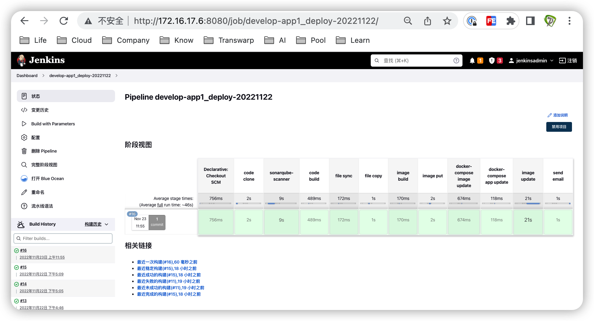

在172.16.17.1上再修改app1的代码，并推送到gitlab服务器

在jenkins上在再点击Build with Parameters进行构建

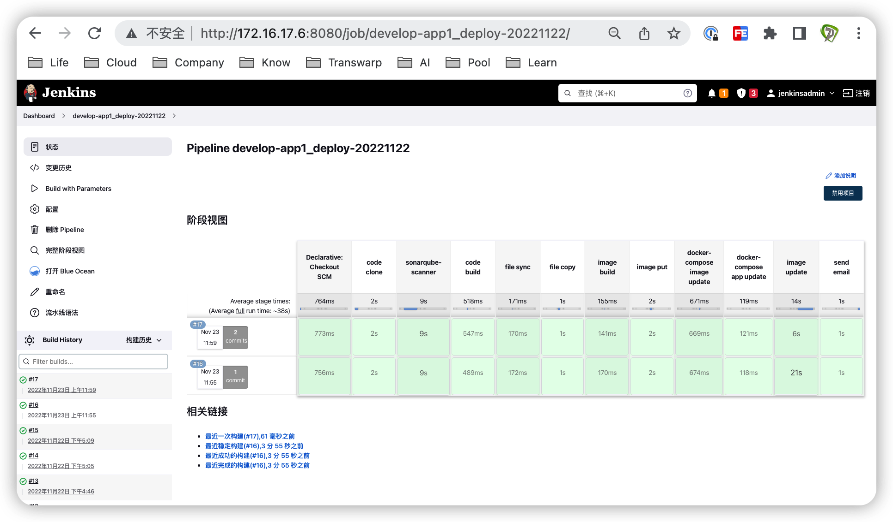

构建完毕后浏览172.16.17.2，主页如下：


## 2. 熟悉ELK各组件的功能、elasticsearch的节点角色类型

### ELK各组件功能

E：elasticsearch，负责数据存储、数据检索

L：logstash，负责数据采集，即日志收集、日志处理，发送到elasticsearch

K：kibana，负责从elasticsearch从读取数据，进行可视化展示与管理

### 节点角色类型

data node：数据节点，负责数据的存储，包括分片创建、分片删除、数据读写、数据更新、数据删除等

master node：主节点，负责索引创建、索引删除、分片分配、数据节点的添加、删除，一个ES集群只有一个活跃的master node，其它master备用节点将等待master宕机以后进行新的master的竞选

client node/coordinating-node：客户端节点或协调节点，负责将数据读写操作转发至data node，将集群管理操作转发到master node

Ingest节点：预处理节点，在检索数据之前对数据做预处理操作


## 3. 熟悉索引、doc、分片与副本的概念

索引index：一类相同类型的数据(doc)，在逻辑上通过同一个index进行查询、修改与删除等操作

doc：文档，简称doc，是指存储在Elasticsearch的数据

Index：索引，即一类相同类型的doc数据，在逻辑上通过同一个index索引，进行查询、修改与删除等操作

Shard：分片，是对Index索引的逻辑拆分存储，分片可以是一个也可以是多个，多个分片合起来就是Index的所有数据。

Replica：副本，是对分片的跨主机备份，分为主分片和副本分片，数据写入主分片时会同步到副本分片，以实现宕机的分片故障转移。副本分片平时只读，多副本分片可提升读性能，主分片宕机时副本分片才会升为主分片


## 4. 掌握不同环境的ELK部署规划，基于deb或二进制部署elasticsearch集群

### 各节点安排

```bash
# master,node
172.16.17.11
172.16.17.12
172.16.17.13

# es主机配置注意
内存：是宿主机内存的一半，最大不超过30G
CPU：核心越多越好，最大是32c
硬盘：选择ssd
网卡：万兆
```

### 各节点准备

```bash
# 修改主机名
hostnamectl set-hostname es1
hostnamectl set-hostname es2
hostnamectl set-hostname es3

# 配置主机解析
vim /etc/hosts

172.16.17.11 es1 es1.example.com
172.16.17.12 es2 es2.example.com
172.16.17.13 es3 es3.example.com

# 优化系统参数
vim /etc/sysctl.conf

vm.max_map_count=262144

# 优化资源
vim /etc/security/limits.conf

root          soft    core            unlimited
root          hard    core            unlimited
root          soft    nproc           1000000
root          hard    nproc           1000000
root          soft    nofile          1000000
root          hard    nofile          1000000
root          soft    memlock         32000
root          hard    memlock         32000
root          soft    msgqueue        8192000
root          hard    msgqueue        8192000

*             soft    core            unlimited
*             hard    core            unlimited
*             soft    nproc           1000000
*             hard    nproc           1000000
*             soft    nofile          1000000
*             hard    nofile          1000000
*             soft    memlock         32000
*             hard    memlock         32000
*             soft    msgqueue        8192000
*             hard    msgqueue        8192000

# 创建普通用户
groupadd -g 2888 elasticsearch && useradd -u 2888  -g 2888 -r -m -s /bin/bash elasticsearch

# 给elasticsearch用户设置密码
passwd elasticsearch

# 创建数据与日志目录
mkdir /data/esdata /data/eslogs /apps -pv && chown elasticsearch.elasticsearch /data /apps -R

# 安装必备包
apt install unzip

# 重启启动生效
reboot
```

### 二进制安装

```bash
# 下载安装包
cd /apps
wget https://artifacts.elastic.co/downloads/elasticsearch/elasticsearch-8.5.1-linux-x86_64.tar.gz

# 分发至其他节点
scp elasticsearch-8.5.1-linux-x86_64.tar.gz es2:/apps
scp elasticsearch-8.5.1-linux-x86_64.tar.gz es3:/apps

# 安装
tar xvf elasticsearch-8.5.1-linux-x86_64.tar.gz
ln -sv /apps/elasticsearch-8.5.1 /apps/elasticsearch
```

### xpack签发证书

```bash
# 切换为elasticsearch用户
su - elasticsearch

# 修改
cd /apps/elasticsearch
vim instances.yml

instances:
  - name: "es1.example.com"
    ip: 
      - "172.16.17.11"
  - name: "es2.example.com"
    ip:
      - "172.16.17.12"
  - name: "es3.example.com"
    ip:
      - "172.16.17.13"

# 生成CA私钥
bin/elasticsearch-certutil ca 
# 文件名称为elastic-stack-ca.p12
# 无需密码

# 生成CA公钥
bin/elasticsearch-certutil cert --ca elastic-stack-ca.p12
# 文件名称为elastic-certificates.p12
# 无需密码

# 签发elasticsearch集群主机证书
# 指定证书密码为123456
bin/elasticsearch-certutil cert --silent --in instances.yml --out certs.zip --pass 123456 --ca elastic-stack-ca.p12
# 文件名称为certs.zip
# 无需密码

# 证书分发
# 向本机es1分发证书
unzip certs.zip 
mkdir config/certs
su - elasticsearch
cp es1.example.com/es1.example.com.p12 config/certs/

# es2
mkdir -pv /apps/elasticsearch/config/certs
# 向es2分发证书
scp es2.example.com/es2.example.com.p12 es2:/apps/elasticsearch/config/certs/

# es3
mkdir -pv /apps/elasticsearch/config/certs
# 向es3分发证书
scp es3.example.com/es3.example.com.p12 es3:/apps/elasticsearch/config/certs/

# es1上⽣成keystore⽂件
bin/elasticsearch-keystore create
bin/elasticsearch-keystore add xpack.security.transport.ssl.keystore.secure_password
# 123456

bin/elasticsearch-keystore add xpack.security.transport.ssl.truststore.secure_password
# 123456

# 向es2分发认证⽂件
scp /apps/elasticsearch/config/elasticsearch.keystore   es2:/apps/elasticsearch/config/elasticsearch.keystore

# 向es3分发认证文件
scp /apps/elasticsearch/config/elasticsearch.keystore es3:/apps/elasticsearch/config/elasticsearch.keystore
```

### 修改配置文件

```bash
# es1
vim /apps/elasticsearch/config/elasticsearch.yml

# 集群名称
cluster.name: develop-es-cluster
# 节点名称
node.name: node-1
# 数据目录及日志目录
path.data: /data/esdata
path.logs: /data/eslogs
# 侦听地址及端口
network.host: 0.0.0.0
http.port: 9200
# 发现地址
discovery.seed_hosts: ["172.16.17.11", "172.16.17.12", "172.16.17.13"]
# 初始化master地址
cluster.initial_master_nodes: ["172.16.17.11", "172.16.17.12", "172.16.17.13"]
# 证书
action.destructive_requires_name: true
xpack.security.enabled: true
xpack.security.transport.ssl.enabled: true
xpack.security.transport.ssl.keystore.path: /apps/elasticsearch/config/certs/es1.example.com.p12 
xpack.security.transport.ssl.truststore.path: /apps/elasticsearch/config/certs/es1.example.com.p12
# 节点角色
node.roles: [master, data]

# 向es2分发
scp /apps/elasticsearch/config/elasticsearch.yml es2:/apps/elasticsearch/config/elasticsearch.yml

# 向es3分发
scp /apps/elasticsearch/config/elasticsearch.yml es3:/apps/elasticsearch/config/elasticsearch.yml

# es2修改配置文件
vim /apps/elasticsearch/config/elasticsearch.yml

node.name: node-2
xpack.security.transport.ssl.keystore.path: /apps/elasticsearch/config/certs/es2.example.com.p12 
xpack.security.transport.ssl.truststore.path: /apps/elasticsearch/config/certs/es2.example.com.p12

# es3修改配置文件
vim /apps/elasticsearch/config/elasticsearch.yml

node.name: node-3
xpack.security.transport.ssl.keystore.path: /apps/elasticsearch/config/certs/es3.example.com.p12 
xpack.security.transport.ssl.truststore.path: /apps/elasticsearch/config/certs/es3.example.com.p12
```

### 配置service

```bash
# 各节点创建服务配置文件
vim /lib/systemd/system/elasticsearch.service

[Unit]
Description=Elasticsearch
Documentation=http://www.elastic.co
Wants=network-online.target
After=network-online.target

[Service]
RuntimeDirectory=elasticsearch
Environment=ES_HOME=/apps/elasticsearch
Environment=ES_PATH_CONF=/apps/elasticsearch/config Environment=PID_DIR=/apps/elasticsearch
WorkingDirectory=/apps/elasticsearch
User=elasticsearch
Group=elasticsearch
ExecStart=/apps/elasticsearch/bin/elasticsearch --quiet
StandardOutput=journal
StandardError=inherit

[Install]
WantedBy=multi-user.target

# 各节点尽量同时启动服务
systemctl daemon-reload && systemctl restart elasticsearch.service && systemctl enable elasticsearch.service

# 检查日志
tail -f /data/eslogs/develop-es-cluster.log
```

### 用户管理

```bash
# 只在主节点批量修改默认账户密码
su - elasticsearch
bin/elasticsearch-setup-passwords interactive 

Please confirm that you would like to continue [y/N]y
# 密码均为123456
Enter password for [elastic]: 
Reenter password for [elastic]: 
Enter password for [apm_system]: 
Reenter password for [apm_system]: 
Enter password for [kibana_system]: 
Reenter password for [kibana_system]: 
Enter password for [logstash_system]: 
Reenter password for [logstash_system]: 
Enter password for [beats_system]: 
Reenter password for [beats_system]: 
Enter password for [remote_monitoring_user]: 
Reenter password for [remote_monitoring_user]: 


# 各节点创建超级管理员
bin/elasticsearch-users useradd admin -p 123456 -r superuser

# 各节点api访问测试
curl -u admin:123456 http://172.16.17.11:9200

curl -u admin:123456 http://172.16.17.12:9200

curl -u admin:123456 http://172.16.17.13:9200
```

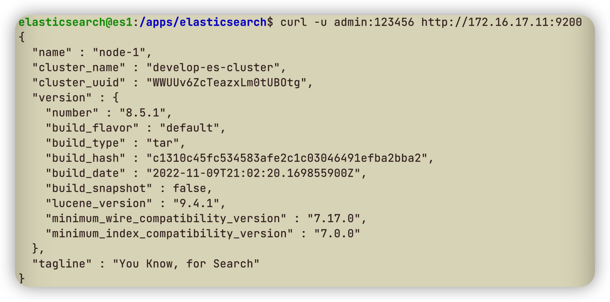


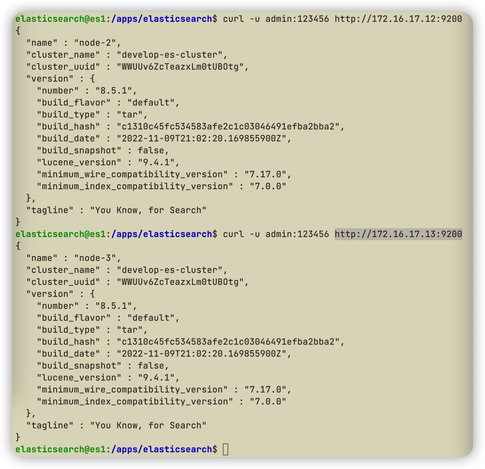

## 5. 了解elasticsearch API的简单使用，安装head插件管理ES数据

### 安装head插件

在客户端浏览器Chrome上应用商店，搜索安装Multi Elasticsearch Head插件，直接在浏览器右上角插件中点击Head插件

进入Elasticsearch主页，点击New输入服务器地址`http://172.16.17.11:9200`连接，登录admin，可看到节点情况

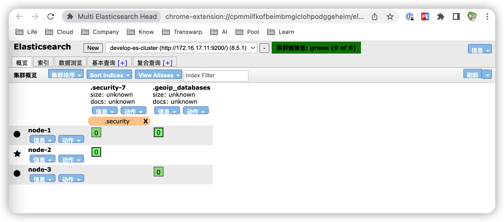

### API使用

```bash
# 获取集群状态
curl -u admin:123456 -X GET http://172.16.17.11:9200

# 集群支持操作
curl -u admin:123456 -X GET http://172.16.17.11:9200/_cat

# 集群健康状态
curl -u admin:123456 -X GET http://172.16.17.11:9200/_cat/health?v

# 修改最大可分配分片数为1000000
curl -u admin:123456 -X PUT http://172.16.17.11:9200/_cluster/settings -H 'Content-Type: application/json' -d'
{
    "persistent" : {
        "cluster.max_shards_per_node" : "1000000"
    }
}'
    
# 修改磁盘最高使用百分比到95%
curl -u admin:123456 -X PUT  http://172.16.17.11:9200/_cluster/settings -H 'Content-Type: application/json' -d'
{
  "persistent": {
    "cluster.routing.allocation.disk.watermark.low": "95%",
    "cluster.routing.allocation.disk.watermark.high": "95%"
  }
}'

# 创建索引test_index
curl -u admin:123456 -X PUT http://172.16.17.11:9200/test_index?pretty

# 查看索引
curl -u admin:123456 -X GET  http://172.16.17.11:9200/test_index?pretty

# 上传数据
curl -u admin:123456 -X POST "http://172.16.17.11:9200/test_index/_doc/1?pretty" -H 'Content-Type: application/json' -d' {"name": "Jack","age": 19}'

# 查看数据
curl -u admin:123456 -X GET  http://172.16.17.11:9200/test_index/_doc/1?pretty

# 删除索引
curl -u admin:123456 -X DELETE  http://172.16.17.11:9200/test_index?pretty
```

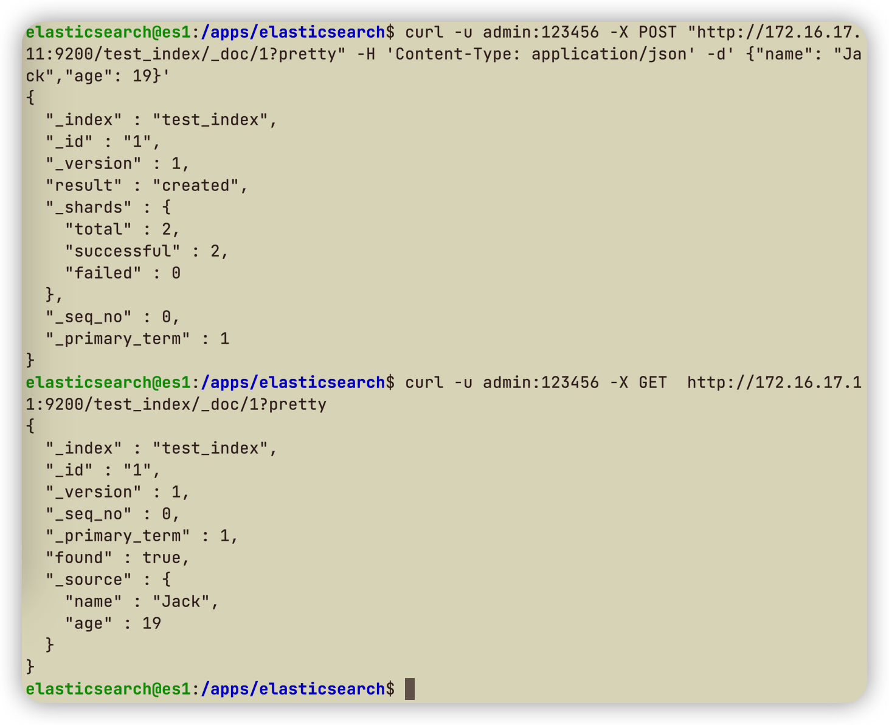


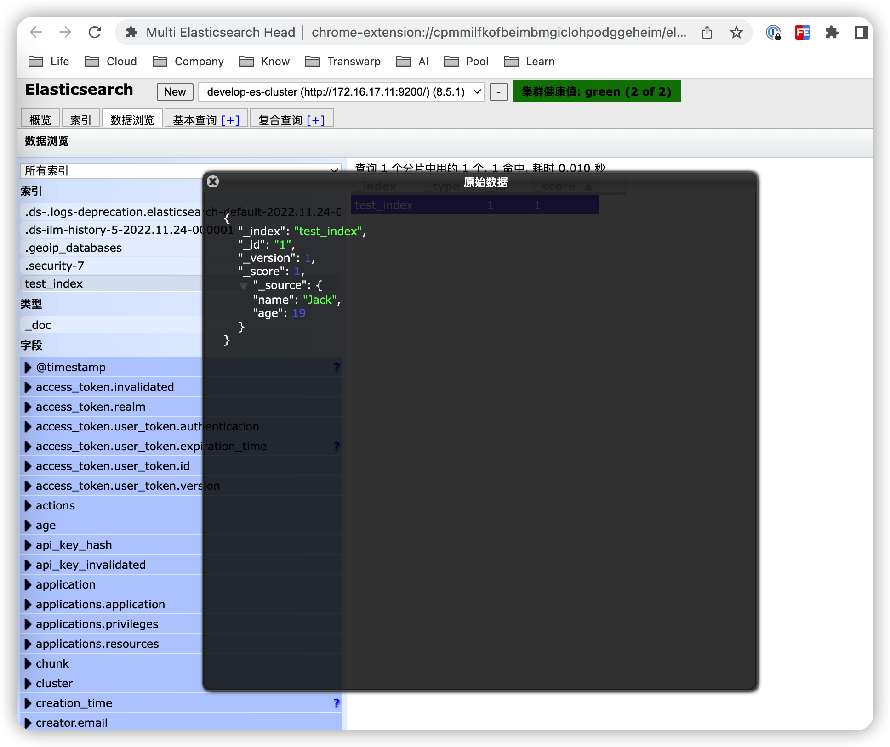

## 6. 安装logstash收集不同类型的系统日志并写入到ES 的不同index

### 节点

```bash
# logstash
172.16.17.14
```

### 安装logstash

```bash
# 下载
cd /usr/local/src
wget https://artifacts.elastic.co/downloads/logstash/logstash-8.5.1-amd64.deb

# 安装
dpkg -i logstash-8.5.1-amd64.deb

# 修改为root用户，对日志有权限
vim /usr/lib/systemd/system/logstash.service

User=root
Group=root

# 重启服务
systemctl daemon-reload
```

### 测试标准输出日志收集

```bash
# 创建配置文件
cd /etc/logstash/conf.d
vim stdin-to-stdout.conf

input {
  stdin{}
}
output {
  file{
    path => "/tmp/logstash-test.log"
  }
}

# 命令行启动
/usr/share/logstash/bin/logstash -f /etc/logstash/conf.d/stdin-to-stdout.conf
# 手动输入hello world

# 另启终端，持续检查文件输出
tail -f /tmp/logstash-test.log
```

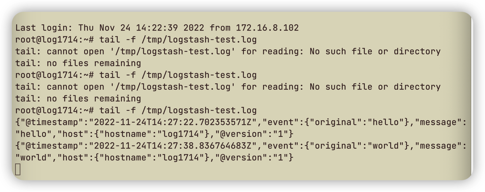

### 不同类型的系统日志收集

```bash
# 创建配置文件
cd /etc/logstash/conf.d
vim syslog-to-es.conf

input {
  file {
    path => "/var/log/syslog"
    stat_interval => "1"
    start_position => "beginning"
    type => "syslog"
  }

  file {
    path => "/var/log/auth.log"
    stat_interval => "1"
    start_position => "beginning"
    type => "authlog"
  }
}


output {
  if [type] == "syslog" {
    elasticsearch {
      hosts => ["172.16.17.11:9200"]
      index => "develop-app1-syslog-%{+yyyy.MM.dd}"
      user => "admin"
      password => "123456"
      }
    }

  if [type] == "authlog" {
    elasticsearch {
      hosts => ["172.16.17.11:9200"]
      index => "develop-app1-authlog-%{+yyyy.MM.dd}"
      user => "admin"
      password => "123456"
      }
    }
}

# 检查配置文件是否正确
/usr/share/logstash/bin/logstash -f /etc/logstash/conf.d/syslog-to-es.conf -t

# 命令行启动
/usr/share/logstash/bin/logstash -f /etc/logstash/conf.d/syslog-to-es.conf

# 采用服务方式启动采集
systemctl start logstash
systemctl enable logstash
```

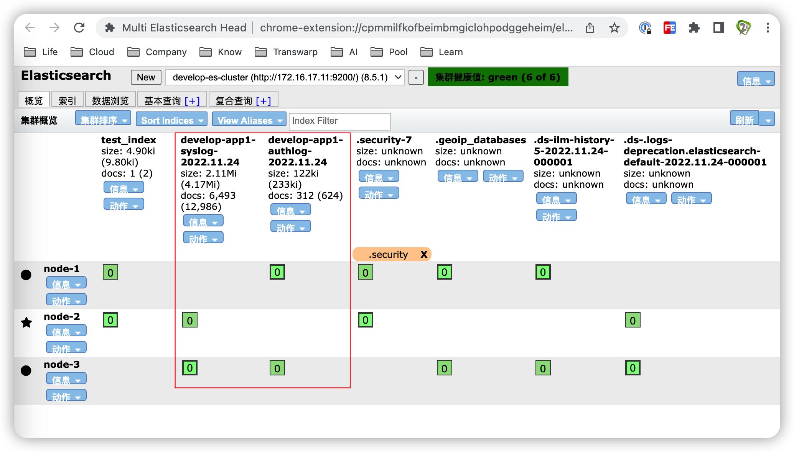


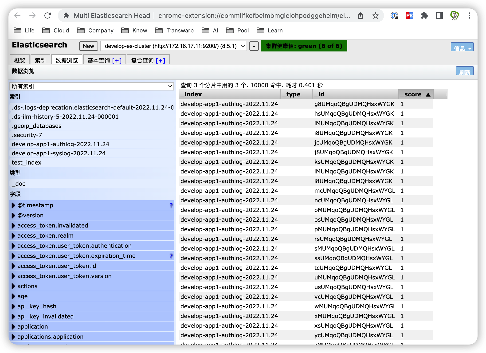

## 7. 安装kibana、查看ES集群的数据

### 节点

```bash
# Elasticsearch
172.16.17.11
```

### 安装kibnana

```bash
# 下载
cd /usr/local/src
wget https://artifacts.elastic.co/downloads/kibana/kibana-8.5.1-amd64.deb

# 安装
dpkg -i kibana-8.5.1-amd64.deb

# 修改配置文件
vim /etc/kibana/kibana.yml

server.port: 5601
server.host: "0.0.0.0"
elasticsearch.hosts: ["http://172.16.17.13:9200"]
elasticsearch.username: "kibana_system"
elasticsearch.password: "123456"
i18n.locale: "zh-CN"

# 启动服务
systemctl restart kibana.service 
systemctl enable kibana.service

ss -tnl
lsof -i:5601
tail -f /var/log/kibana/kibana.log
```

### 建立数据视图

访问`http://172.16.17.11:5601`，采用Elasticsearch的账户admin登录

选择Stack Management-->数据视图-->创建数据视图，名称为develop-app1-syslog，索引模式为develop-app1-syslog-*，时间戳字段为@timestamp，点击保存

选择Stack Management-->数据视图-->创建数据视图，名称为develop-app1-authlog，索引模式为develop-app1-authlog-*，时间戳字段为@timestamp，点击保存

选择Analytics-->discover，查看数据视图develop-app1-syslog

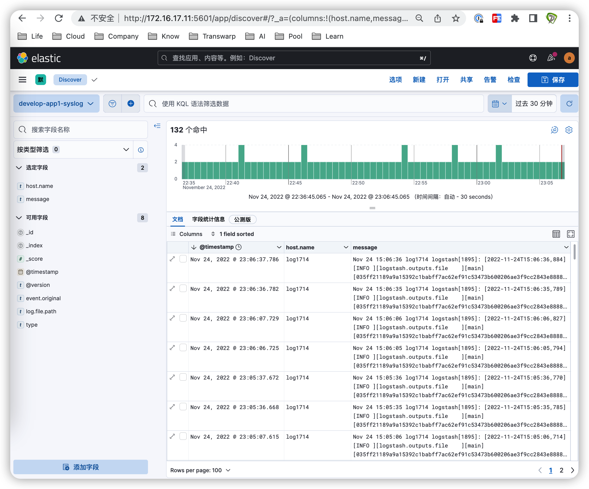

在logstash节点172.16.17.14产生新数据

```bash
echo "syslog v1111" >> /var/log/syslog
echo "authlog v1111" >> /var/log/authlog
```

检查develop-app1-syslog数据视图的数据收集

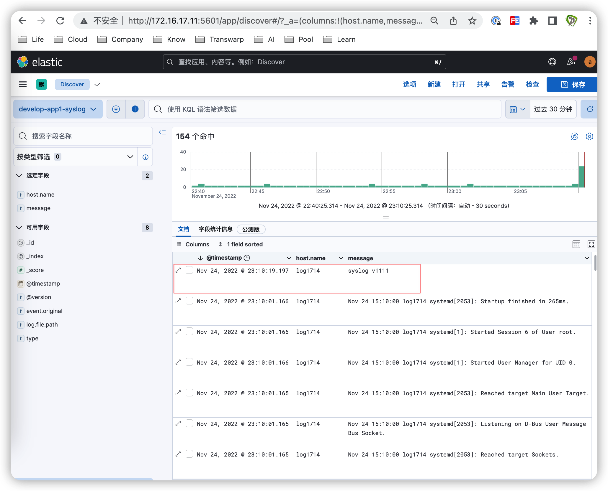


## 8. 了解heartbeat和metricbeat的使用

### 节点

```bash
# web
172.16.17.4
```

### 安装metricbeat

```bash
# 上传安装
cd /usr/local/src
wget https://artifacts.elastic.co/downloads/beats/metricbeat/metricbeat-8.5.1-amd64.deb

# 安装
dpkg -i metricbeat-8.5.1-amd64.deb

# 修改配置文件
vim /etc/metricbeat/metricbeat.yml

setup.kibana:
  host: "172.16.17.11:5601"
  setup_kibana_username: "admin"
  setup_kibana_password: "123456"
output.elasticsearch:
  hosts: ["172.16.17.11:9200"]
  username: "admin"
  password: "123456"

# 启动服务
systemctl restart metricbeat.service 
systemctl enable metricbeat.service

# kibana
在observability-概览中，发现并点击服务器172.16.17.4
```


### 安装heartbeat

```bash
# 上传安装
cd /usr/local/src
wget https://artifacts.elastic.co/downloads/beats/heartbeat/heartbeat-8.5.1-amd64.deb

# 安装
dpkg -i heartbeat-8.5.1-amd64.deb

# 修改配置文件
vim /etc/heartbeat/heartbeat.yml

heartbeat.monitors:
- type: http
  enabled: true
  id: http-monitor
  name: http-domain-monitor
  urls: ["http://172.16.17.11:9200","http://www.baidu.com"]
  schedule: '@every 10s'
  timeout: 5s
- type: icmp
  enabled: true
  id: icmp-monitor
  name: icmp-ip-monitor
  schedule: '@every 5s'
  hosts: ["172.16.17.11","172.16.16.1"]

setup.kibana:
  host: "172.16.17.11:5601"
  setup_kibana_username: "admin"
  setup_kibana_password: "123456"
output.elasticsearch:
  hosts: ["172.16.17.13:9200"]
  username: "admin"
  password: "123456"

# 启动服务
systemctl restart heartbeat-elastic.service 
systemctl enable heartbeat-elastic.service

# kibana
在observability-监测中查看
```


