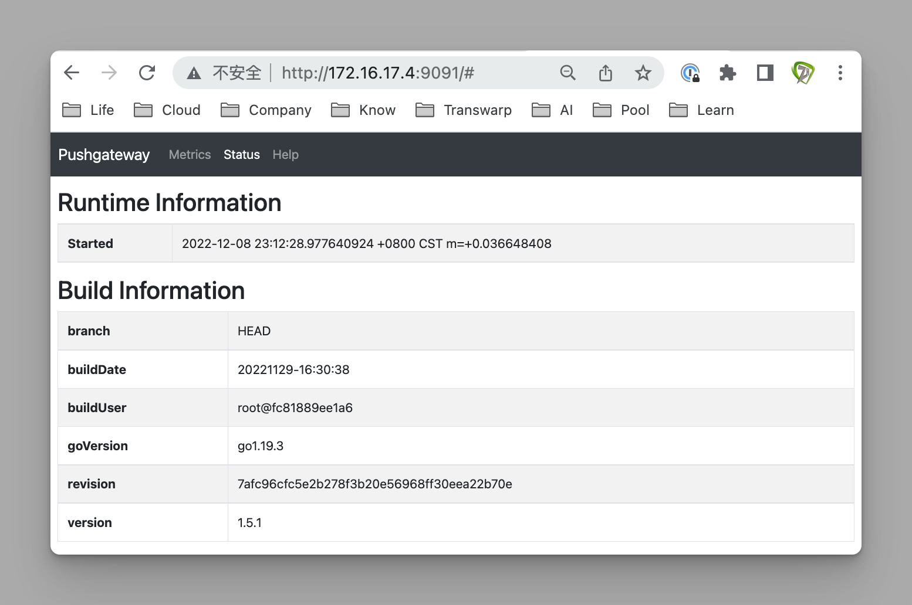

# 极客时间运维进阶训练营第七周作业


## 作业要求

1. 了解prometheus各组件的功能，熟悉prometheus的数据采集流程
2. 基于docker或二进制部署prometheus server 
3. 基于docker或二进制部署node-exporter，并通过prometheus收集node-exporter指标数据
4. 安装grafana并添加prometheus数据源，导入模板可以图形显示指标数据
5. 掌握prometheus的promQL语句的简单使用
6. 部署prometheus联邦集群并实现指标数据收集

扩展

1. 基于pushgateway实现指标数据收集


## 1. 了解prometheus各组件的功能，熟悉prometheus的数据采集流程

### 各组件功能

prometheus server：主服务，负责数据抓取及存储，对外提供接口，对外提供数据查询

prometheus targets：针对固定地址的目标，可通过配置文件抓取数据

service discovery：动态发现目标，进行数据抓取

prometheus alerting：对数据结合自定义规则进行对比，发送告警给alertmanager

push gateway：专门收集短期数据，有prometheus server向gateway发起请求，gateway返回数据给prometheus server

data visualization and export：数据可视化与数据导出，浏览器或其它client

### 数据采集流程

第一步 基于配置文件或通过动态发现获取需要监控的目标

第二步 prometheus server向目标发起http/https请求

第三步 目标接受请求并返回数据给prometheus server

第四步 prometheus server接受数据并将其存储到tsdb时序数据库，并对比告警规则，如果触发告警则触发alertmanager进行告警，不触发告警则只进行数据存储

第五步 prometheus server存储到本地后，即可通过grafana实现数据可视化

## 2. 基于docker或二进制部署prometheus server 

### 节点

```bash
# Prometheus
172.16.17.14
```

### 二进制方式部署

```bash
# 安装
cd /usr/local/src
tar xvf prometheus-server-2.40.5-onekey-install.tar.gz
bash prometheus-install.sh

# 修改配置文件
vim /apps/prometheus/prometheus.yml

- job_name: "prometheus"
  static_configs:
    - targets: ["172.16.17.14:9090"]

# 启动服务
systemctl restart prometheus.service
```

### 验证

访问prometheus，浏览`http://172.16.17.14:9090`


## 3. 基于docker或二进制部署node-exporter，并通过prometheus收集node-exporter指标数据

### 节点

```bash
# node-exporter
172.16.17.1
172.16.17.2
172.16.17.3
```

### 基于二进制方式安装

```bash
# 172.16.17.1
# 安装
cd /usr/local/src
tar xvf node-exporter-1.5.0-onekey-install.tar.gz
bash node-exporter-1.5.0-onekey-install.sh

# 服务配置
cat /etc/systemd/system/node-exporter.service 

[Unit]
Description=Prometheus Node Exporter
After=network.target

[Service]
ExecStart=/apps/node_exporter/node_exporter

[Install]
WantedBy=multi-user.target

# 启动服务
systemctl daemon-reload
systemctl restart node-exporter

# 验证
ss -tnl
浏览http://172.16.17.1:9100

# 同理在172.16.17.2上安装
# 同理在172.16.17.3上安装
```


### 配置prometheus-server

```bash
# 172.16.17.14
# 测试各节点的node_exporter指标输出
curl http://172.16.17.1:9100/metrics
curl http://172.16.17.2:9100/metrics
curl http://172.16.17.3:9100/metrics

# 修改配置文件
cd /apps/prometheus
vim prometheus.yml

- job_name: 'promethues-node'
  static_configs:
    - targets: ['172.16.17.1:9100','172.16.17.2:9100']

# 重新启动
systemctl restart prometheus.service
systemctl status prometheus.service
```

### prometheus验证

浏览`http://172.16.17.14:9090`，选择Status-->Targets，显示所抓取的实例


点击Graph，输入node_load1，点击Execute，检查返回结果


点击Graph标签可查看图形输出


## 4. 安装grafana并添加prometheus数据源，导入模板可以图形显示指标数据

### 节点

```bash
# Prometheus+grafana
172.16.17.14
```

### 安装grafana

```bash
# 安装依赖
apt-get install -y adduser libfontconfig1

# 下载并安装
cd /usr/local/src
dpkg -i grafana-enterprise_9.3.1_amd64.deb

# 修改配置文件
# 默认采用sqlite，生产环境可改为mysql
vim /etc/grafana/grafana.ini

[server]
protocol = http
http_addr = 0.0.0.0
http_port = 3000

# 启动服务
systemctl restart grafana-server
systemctl enable grafana-server
systemctl status grafana-server
```

### Grafana添加数据源

浏览`http://172.16.17.14:3000`，登录账户admin/admin，修改密码

点击Configuration-->data sources-->add datasource-->prometheus，选择添加prometheus数据源，名称为prometheus-develop，URL为`http://172.16.17.14:9090`，点击Save&test

### Grafana导入模板

浏览`https://grafana.com/grafana/dashboards`，搜索模板，如Dashboard EN 20201010，查看其id为11074

在grafana中，选择Dashboards-->import，输入模板id 11074，名称为develop-node-11074，选择数据源prometheus-develop，点击import可在线导入模板

如果网络连接有问题，可在dashboards官网该模板页面，点击Download JSON，下载模板文件，返回grafana中选择Dashboards-->import，点击Upload JSON file上传json模板文件

grafana会自动连接prometheus，看到如下数据视图


## 5. 掌握prometheus的promQL语句的简单使用

### 节点

```bash
# Prometheus+grafana
172.16.17.14
```

### Grafana导入模板

在grafana中，选择Dashboards-->import，输入模板id 8919，名称为develop-node-8919，选择数据源prometheus-develop，点击import可在线导入模板


### 命令行查询

```bash
# 任一节点操作
# 瞬时数据InstantVector
# 查询所有节点当前可用内存
curl 'http://172.16.17.14:9090/api/v1/query' --data 'query=node_memory_MemFree_bytes'
# 预期输出
{"status":"success","data":{"resultType":"vector","result":[{"metric":{"__name__":"node_memory_MemFree_bytes","instance":"172.16.17.1:9100","job":"promethues-node"},"value":[1670505439.620,"6824722432"]},{"metric":{"__name__":"node_memory_MemFree_bytes","instance":"172.16.17.2:9100","job":"promethues-node"},"value":[1670505439.620,"7008927744"]}]}}


# 范围数据RangeVector
# 查询单个节点5分钟的可用内存
curl 'http://172.16.17.14:9090/api/v1/query' --data 'query=node_memory_MemFree_bytes{instance="172.16.17.1:9100"}[5m]'
# 预期输出
{"status":"success","data":{"resultType":"matrix","result":[{"metric":{"__name__":"node_memory_MemFree_bytes","instance":"172.16.17.1:9100","job":"promethues-node"},"values":[[1670505465.801,"6824722432"],[1670505480.801,"6824722432"],[1670505495.801,"6824464384"],[1670505510.801,"6824464384"],[1670505525.801,"6824206336"],[1670505540.801,"6824382464"],[1670505555.801,"6824464384"],[1670505570.801,"6824464384"],[1670505585.801,"6824464384"],[1670505600.801,"6824464384"],[1670505615.801,"6824464384"],[1670505630.801,"6824464384"],[1670505645.801,"6824235008"],[1670505660.801,"6824493056"],[1670505675.801,"6824493056"],[1670505690.801,"6824493056"],[1670505705.801,"6824493056"],[1670505720.801,"6824493056"],[1670505735.801,"6824493056"],[1670505750.801,"6824493056"]]}]}}


# 瞬时向量转换为标量
curl 'http://172.16.17.14:9090/api/v1/query' --data 'query=scalar(sum(node_load1{instance="172.16.17.1:9100"}))' --data time=1670505465
# 预期输出
{"status":"success","data":{"resultType":"scalar","result":[1670505465,"0"]}}
```

### promQL

在prometheus上，点击Graph，输入以下查询语句，点击Execute执行

查询节点5分钟内的内存总量

```bash
node_memory_MemTotal_bytes{instance="172.16.17.1:9100"}[5m]
```


将内存单位从字节转行为兆

```bash
node_memory_MemFree_bytes/1024/1024
```


计算磁盘读写数据量

```bash
(node_disk_read_bytes_total{device="sda"} + node_disk_written_bytes_total{device="sda"}) / 1024 / 1024
```


计算每个节点最近五分钟每个device的最大流量

```bash
max(rate(node_network_receive_bytes_total[5m])) by (device)
```


统计节点系统版本数量

```bash
count(node_os_version)
```


统计节点系统版本数量并保存到node os versions标签中

```bash
count_values("node_os_version",node_os_version)
```


排名最大的6个

```bash
topk(6, prometheus_http_requests_total)
```


排名最小的6个

```bash
bottomk(6, prometheus_http_requests_total)
```


### Grafana绘图

选择Dashboards-->New dashboard，点击Add a new panel，Data source选择prometheus-develop，点击code，在Metrics browser中输入count(node_os_version)，点击Run queries进行查询；在右侧Title中输入要定义的名称为服务器数量，点击Apply保存

点击Save dashboard，Dashboard name为自定义图形，点击save保存


### 其它工具

```bash
# 如何将内存单位从字节转行为兆
bc
764727296/1024/1024
# 预期输出
729

# 如何计算时间戳
访问tool.chinaz.com/tools/unixtime.aspx
输入时间戳1670505660
# 预期输出
转换时间为2022-12-08 21:21:00
```


## 6. 部署prometheus联邦集群并实现指标数据收集

### 节点

```bash
# prometheus
172.16.17.5
172.16.17.14
172.16.17.15

# node-exporter
172.16.17.1
172.16.17.2
172.16.17.3
```

### 安装node

```bash
# 被监控的各node节点
cd /usr/local/src
tar xvf node-exporter-1.5.0-onekey-install.tar.gz
bash node-exporter-1.5.0-onekey-install.sh

# 验证
http://172.16.17.1:9100
http://172.16.17.2:9100
http://172.16.17.3:9100
```

### 安装prometheus-server

```bash
# 各server节点
cd /usr/local/src
tar xvf prometheus-server-2.40.5-onekey-install.tar.gz
bash prometheus-install.sh

# 验证
http://172.16.17.14:9090
http://172.16.17.15:9090
http://172.16.17.5:9090

# 安装grafana
# 安装依赖
apt-get install -y adduser libfontconfig1

# 下载并安装
cd /usr/local/src
dpkg -i grafana-enterprise_9.3.1_amd64.deb

# 修改配置文件
# 默认采用sqlite，生产环境可改为mysql
vim /etc/grafana/grafana.ini

[server]
protocol = http
http_addr = 0.0.0.0
http_port = 3000

# 启动服务
systemctl restart grafana-server
systemctl enable grafana-server
systemctl status grafana-server
```

### 配置联邦节点

```bash
# 172.16.17.14
# 采集172.16.17.1的数据
cd /apps/prometheus
vim prometheus.yml

- job_name: "prometheus-idc1"
  static_configs:
   - targets: ["172.16.17.1:9100"]

# 重启服务
systemctl restart prometheus.service

# 172.16.17.15
# 采集172.16.17.2、172.16.17.3的数据
cd /apps/prometheus
vim prometheus.yml

- job_name: "prometheus-idc2"
  static_configs:
   - targets: ["172.16.17.2:9100","172.16.17.3:9100"]
   
# 重启服务
systemctl restart prometheus.service

# 验证172.16.17.14
http://172.16.17.14:9090
点击Status-->Targets
在搜索栏中输入node_load1，点击Execute

# 验证172.16.17.15
http://172.16.17.15:9090
点击Status-->Targets
在搜索栏中输入node_load1，点击Execute
```


### 配置主Server

```bash
# 172.16.17.5
vim /apps/prometheus/prometheus.yml
 
- job_name: 'prometheus-federate-17.14'
  scrape_interval: 10s
  honor_labels: true
  metrics_path: '/federate'
  params:
    'match[]':
     - '{job="prometheus"}'
     - '{__name__=~"job:.*"}'
     - '{__name__=~"node.*"}'
  static_configs:
  - targets:
     - '172.16.17.14:9090'
    
- job_name: 'prometheus-federate-17.15'
  scrape_interval: 10s
  honor_labels: true
  metrics_path: '/federate'
  params:
    'match[]':
     - '{job="prometheus"}'
     - '{__name__=~"job:.*"}'
     - '{__name__=~"node.*"}'
  static_configs:
  - targets:
     - '172.16.17.15:9090'

# 重启服务
systemctl restart prometheus.service

# 测试
curl -X POST http://172.16.17.15:9090/-/reload
```

### Prometheus验证

浏览`http://172.16.17.5:9090`，点击Status-->Targets


点击Graph，在搜索栏中输入node_load1，点击Execute


### Grafana验证

浏览`http://172.16.17.5:3000`，定义数据源，名称为prometheus-develop，URL为`http://172.16.17.5:9090`

导入dashboard模板8919，名称为develop-node-8919，数据源选择prometheus-develop

点击General，查看develop-node-8919


## 扩展1. 基于pushgateway实现指标数据收集

### 节点

```bash
# Prometheus+grafana
172.16.17.14

# pushgateway
172.16.17.4
```

### 安装

```bash
# 172.16.17.4
# 安装
mkdir /apps
cd /apps
tar xvf pushgateway-1.5.1.linux-amd64.tar.gz 
ln -sv /apps/pushgateway-1.5.1.linux-amd64 /apps/pushgateway

# 服务配置文件
vim /etc/systemd/system/pushgateway.service

[Unit]
Description=Prometheus pushgateway
After=network.target

[Service]
ExecStart=/apps/pushgateway/pushgateway

[Install]
WantedBy=multi-user.target

# 启动服务
systemctl daemon-reload
systemctl start pushgateway
systemctl enable pushgateway

# 检查侦听服务
ss -tnl
# 预期输出
pushgateway 9091

# 浏览
172.16.17.4:9091
```



### 验证pushgateway

测试推送一个job，名称为mytest_job，key为mytest_metric值为2022

```bash
# 172.16.17.1
echo "mytest_metric 2088" | curl --data-binary @- http://172.16.17.4:9091/metrics/job/mytest_job

# pushgateway验证数据
http://172.16.17.4:9091
```


### 配置prometheus-server

```bash
# 172.16.17.14
# 修改配置文件
cd /apps/prometheus
vim prometheus.yml

scrape_configs:
  - job_name: 'prometheus-pushgateway'
    scrape_interval: 5s
    static_configs:
      - targets: ['172.16.17.4:9091']


# 重新启动
systemctl restart prometheus.service 

# 验证
http://172.16.17.14:9090
```


### 推送多条数据

```bash
# 172.16.17.1
cat <<EOF | curl --data-binary @- http://172.16.17.4:9091/metrics/job/test_job/instance/172.16.17.1
node_memory_usage 4311744512
node_memory_total 103481868288
EOF

# pushgateway验证数据
http://172.16.17.4:9091
```


### 脚本推送

```bash
# 创建脚本
vim memory_monitor.sh

#!/bin/bash 
total_memory=$(free |awk '/Mem/{print $2}')
used_memory=$(free |awk '/Mem/{print $3}')
job_name="custom_memory_monitor"
instance_name=`ifconfig  ens160 | grep -w inet | awk '{print $2}'`
pushgateway_server="http://172.16.17.4:9091/metrics/job"

cat <<EOF | curl --data-binary @- ${pushgateway_server}/${job_name}/instance/${instance_name}
#TYPE custom_memory_total gauge
custom_memory_total $total_memory
#TYPE custom_memory_used gauge
custom_memory_used $used_memory
EOF

# 172.16.17.1
bash memory_monitor.sh

# 172.16.17.2
bash memory_monitor.sh
```

### pushgateway验证数据


### prometheus验证数据


### pushgateway指标删除

```bash
# API删除
curl -X DELETE http://172.16.17.4:9091/metrics/job/custom_memory_monitor/instance/172.16.17.1

# pushgateway验证数据
http://172.16.17.4:9091
```

