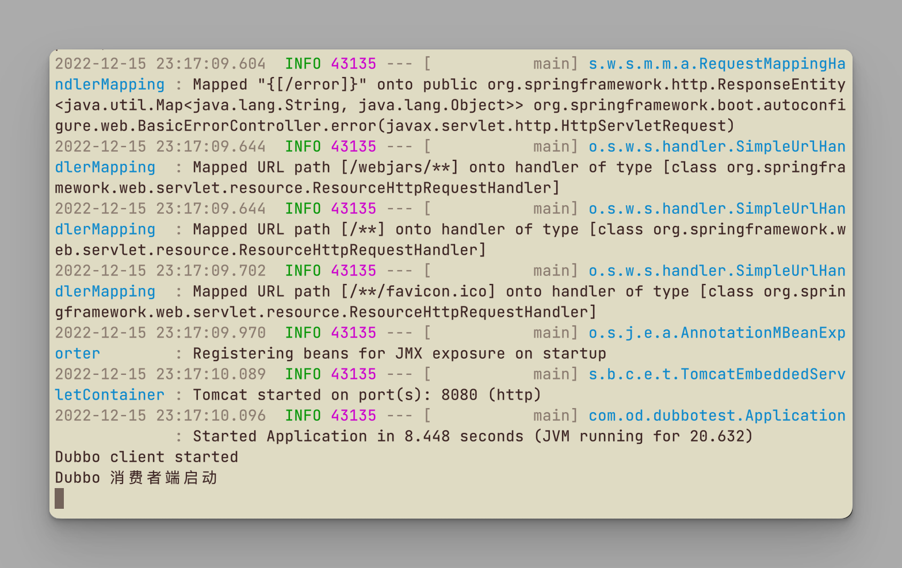

# 极客时间运维进阶训练营第八周作业


## 作业要求

1. 基于docker-compose或二进制部署skywalking
2. 实现单体服务halo博客和jenkins的请求链路跟踪
3. 实现dubbo微服务实现链路跟踪案例
4. 实现skywalking的钉钉告警

扩展

1. 实现python Django项目的请求链路跟踪
1. 实现OpenResty及后端java服务的全链路请求链路跟踪


## 1. 基于docker-compose或二进制部署skywalking

### 节点

```bash
# skywalking+es
172.16.17.2
```

### docker-compose部署

```bash
mkdir -pv /data/elasticsearch/
chown 1000.1000 -R /data/elasticsearch
mkdir /data/skywalking-9.3-docker-composefile -pv

# 创建docker-compose.yml
cd /data/skywalking-9.3-docker-composefile
vim docker-compose.yml

version: "3"

services:
  elasticsearch:
    image: elasticsearch:8.4.2
    container_name: elasticsearch
    ports:
      - "9200:9200"
    healthcheck:
      test: ["CMD-SHELL", "curl -sf http://localhost:9200/_cluster/health || exit 1"] # ⼼跳检测，成功之后不再执⾏后⾯的退出
      interval: 60s #⼼跳检测间隔周期
      timeout: 10s
      retries: 3
      start_period: 60s #⾸次检测延迟时间
    environment:
      discovery.type: single-node #单节点模式
      ingest.geoip.downloader.enabled: "false"
      bootstrap.memory_lock: "true"
      ES_JAVA_OPTS: "-Xms512m -Xmx512m"
      TZ: "Asia/Shanghai"
      xpack.security.enabled: "false" #单机模式
    ulimits:
      memlock:
        soft: -1
        hard: -1
  
  skywalking-oap:
    image: apache/skywalking-oap-server:9.3.0
    container_name: skywalking-oap
    depends_on:
      elasticsearch:
        condition: service_healthy
    links:
      - elasticsearch
    environment:
      SW_HEALTH_CHECKER: default
      SW_STORAGE: elasticsearch
      SW_STORAGE_ES_CLUSTER_NODES: elasticsearch:9200
      JAVA_OPTS: "-Xms2048m -Xmx2048m"
      TZ: Asia/Shanghai
      SW_TELEMETRY: prometheus
    healthcheck:
      test: ["CMD-SHELL", "/skywalking/bin/swctl ch"]
      interval: 30s
      timeout: 10s
      retries: 3
      start_period: 10s
    restart: on-failure
    ports:
      - "11800:11800"
      - "12800:12800"
      
  skywalking-ui:
    image: apache/skywalking-ui:9.3.0
    depends_on:
      skywalking-oap:
        condition: service_healthy
    links:
      - skywalking-oap
    ports:
    - "8080:8080"
    environment:
      SW_OAP_ADDRESS: http://skywalking-oap:12800
      SW_HEALTH_CHECKER: default
      TZ: Asia/Shanghai
    healthcheck:
      test: ["CMD-SHELL", "curl -sf http://localhost:8080 || exit 1"] #⼼跳检测，成功之后不再执⾏后⾯的退出
      interval: 60s #⼼跳检测间隔周期
      timeout: 10s
      retries: 3
      start_period: 60s #⾸次检测延迟时间
      
# 启动
docker-compose up -d
docker-compose ps
```


### 验证skywalking

```bash
# 访问skywalking
http://172.16.17.2:8080
```


### 验证ES

```bash
# 通过head插件访问连接
http://172.16.17.1:9200
```


## 2. 实现单体服务halo博客和jenkins的请求链路跟踪 

### 节点

```bash
# halo博客
172.16.17.3
```

### 准备java agent

```bash
# 上传agent包
mkdir /data
cd /data
tar xvf apache-skywalking-java-agent-8.13.0.tgz

# 配置agent
vim /data/skywalking-agent/config/agent.config

agent.service_name=${SW_AGENT_NAME:halo} agent.namespace=${SW_AGENT_NAMESPACE:develop1}
collector.backend_service=${SW_AGENT_COLLECTOR_BACKEND_SERVICES:172.16.17.2:11800}
```

### 安装halo博客

```bash
# 安装jdk11
apt install openjdk-11-jdk
java -version

# 下载halo博客包
mkdir /apps
cd /apps/
wget https://dl.halo.run/release/halo-1.6.1.jar

# 启动
java -javaagent:/data/skywalking-agent/skywalking-agent.jar -jar /apps/halo-1.6.1.jar
```


### 访问博客

```bash
# 访问博客
http://172.16.17.3:8090

# 输入管理员信息
用户名：admin
用户昵称：admin
邮件地址：15392532@qq.com
密码：需满足8位
博客标题：我的最美博客

# 登录测试
点击文章-->写文章，点击发布

# 其它节点浏览该博客，产生数据
```


### 验证skywalking

```bash
# 访问skywalking
http://172.16.17.2:8080
```

点击普通服务-->服务，右上角时间范围选择最近15分钟，刷新，发现服务halo|develop1|

可查看服务的每分钟访问次数Load、成功率SuccessRete、延迟时间Latency、应用性能指数Apdex


点击进入服务，可查看服务概览


点击架构图Topology，可查看访问经过了哪些节点


点击Trace，可查看访问了哪些URI和页面


### Tomcat运行jenkins

```bash
# 172.16.17.3
按Ctrl+C终止halo博客运行

# 安装tomcat
cd /apps
wget https://archive.apache.org/dist/tomcat/tomcat-8/v8.5.84/bin/apache-tomcat-8.5.84.tar.gz
tar xvf apache-tomcat-8.5.84.tar.gz

# 删除原apps上传Jenkins app
cd /apps/apache-tomcat-8.5.84/webapps/
rm -rf *
上传jenkins.war

# 修改tomcat配置，添加变量
vim /apps/apache-tomcat-8.5.84/bin/catalina.sh

CATALINA_OPTS="$CATALINA_OPTS -javaagent:/data/skywalking-agent/skywalking-agent.jar"; export CATALINA_OPTS

# 配置skywalking-agent，修改服务名
vim /data/skywalking-agent/config/agent.config

agent.service_name=${SW_AGENT_NAME:develop-jenkins}
agent.namespace=${SW_AGENT_NAMESPACE:develop1}
collector.backend_service=${SW_AGENT_COLLECTOR_BACKEND_SERVICES:172.16.17.2:11800}

# 启动tomcat
/apps/apache-tomcat-8.5.84/bin/catalina.sh run

# 运行提示中复制jenkins初始化密码
842119434d6f46c88adf00953696f14f
```

### 验证jenkins

```bash
# 访问jenkins web
http://172.16.17.3:8080/jenkins

粘贴jenkins初始化密码
```


### 验证skywalking

```bash
# 访问skywalking
http://172.16.17.2:8080
```

点击普通服务-->服务，右上角时间范围选择最近15分钟，刷新，发现服务develop-jenkins|develop1|

可查看服务的每分钟访问次数Load、成功率SuccessRete、延迟时间Latency、应用性能指数Apdex

点击进入服务，可查看服务概览


## 3. 实现dubbo微服务实现链路跟踪案例

### 节点

```bash
# ZooKeeper+dubboadmin
172.16.17.4

# provider
172.16.17.5

# consumer
172.16.17.6

# SkyWalking Server
172.16.17.2
```

### 部署注册中心

```bash
# 172.16.17.4
# 安装jdk8
apt install openjdk-8-jdk
java -version

# 解压
mkdir /apps
cd /apps
wget https://dlcdn.apache.org/zookeeper/zookeeper-3.7.1/apache-zookeeper-3.7.1-bin.tar.gz
tar xvf apache-zookeeper-3.7.1-bin.tar.gz

# 配置文件
cp /apps/apache-zookeeper-3.7.1-bin/conf/zoo_sample.cfg /apps/apache-zookeeper-3.7.1-bin/conf/zoo.cfg

# 启动
/apps/apache-zookeeper-3.7.1-bin/bin/zkServer.sh start

# 检查启动情况
/apps/apache-zookeeper-3.7.1-bin/bin/zkServer.sh status
lsof -i:2181
```


### 部署provider服务器端

```bash
# 172.16.17.5
# 安装jdk8
apt install openjdk-8-jdk -y

# 部署agent
mkdir /data && cd /data
tar xvf apache-skywalking-java-agent-8.13.0.tgz 

# 修改agent配置
vim /data/skywalking-agent/config/agent.config

agent.service_name=${SW_AGENT_NAME:dubbo-server1}
agent.namespace=${SW_AGENT_NAMESPACE:develop2}
collector.backend_service=${SW_AGENT_COLLECTOR_BACKEND_SERVICES:172.16.17.2:11800}

# 添加主机名解析，dubbo里面的zookeeper地址写在了源代码中，域名变量为ZK_SERVER1
vim /etc/profile

# 最后一行添加
export ZK_SERVER1=172.16.17.4

# 环境变量生效
source /etc/profile
echo $ZK_SERVER1
# 172.16.17.4

# 测试与Zookeeper的通信
telnet $ZK_SERVER1 2181

Trying 172.16.17.4...
Connected to 172.16.17.4.
Escape character is '^]'.

# 创建目录
mkdir -pv /apps/dubbo/provider
cd /apps/dubbo/provider

# 上传client包dubbo-server.jar

# 运行，需先启动server端
java -javaagent:/data/skywalking-agent/skywalking-agent.jar -jar /apps/dubbo/provider/dubbo-server.jar 
```


### 部署consumer

```bash
# 172.16.17.6
# 安装jdk
apt install openjdk-8-jdk -y

# 安装agent
mkdir /data && cd /data
tar xvf apache-skywalking-java-agent-8.13.0.tgz 

# 修改agent配置
vim /data/skywalking-agent/config/agent.config

agent.service_name=${SW_AGENT_NAME:dubbo-consumer1}
agent.namespace=${SW_AGENT_NAMESPACE:develop2}
collector.backend_service=${SW_AGENT_COLLECTOR_BACKEND_SERVICES:${SW_SERVER}:11800}

# 添加主机名解析，dubbo里面的zookeeper地址写在了源代码中，域名变量为ZK_SERVER1,SW也可以为agent设置环境变量
vim /etc/profile

export SW_SERVER="172.16.17.2"
export ZK_SERVER1="172.16.17.4"

# 环境变量生效
source /etc/profile
echo $ZK_SERVER1
echo $SW_SERVER

# 创建目录
mkdir -pv /apps/dubbo/consumer
cd /apps/dubbo/consumer
# 上传client包dubbo-client.jar

# 运行
java -javaagent:/data/skywalking-agent/skywalking-agent.jar -jar /apps/dubbo/consumer/dubbo-client.jar 
```



### 访问consumer

```bash
http://172.16.17.6:8080/hello?name=jerry
```


查看consumer端172.16.17.6，查看provider端172.16.17.5，是否已接收到消息


### 安装ZooInspector

```bash
# 下载地址
https://issues.apache.org/jira/secure/attachment/12436620/ZooInspector.zip

# 解压运行
java -jar zookeeper-dev-ZooInspector.jar

# 连接
172.16.17.4:2181

# 可看到注册在ZooKeeper的生产者和消费者
```


### 验证skywalking

```bash
# 访问skywalking
http://172.16.17.2:8080
```

点击普通服务-->服务，右上角时间范围选择最近15分钟，刷新，发现服务dubbo-consumer1|develop2|和dubbo-server1|develop2|

可查看服务的每分钟访问次数Load、成功率SuccessRete、延迟时间Latency、应用性能指数Apdex

点击进入服务，可查看服务概览


### 部署dubboadmin

```bash
# 172.16.17.4
# 安装tomcat
cd /apps
tar xvf apache-tomcat-8.5.84.tar.gz
cd /apps/apache-tomcat-8.5.84/webapps/
rm -rf ./*

# 上传dubboadmin.war

# 解压
unzip dubboadmin.war 
mv dubboadmin.war /opt

# 修改dubboadmin配置文件
vim dubboadmin/WEB-INF/dubbo.properties 

dubbo.registry.address=zookeeper://172.16.17.4:2181
dubbo.admin.root.password=root
dubbo.admin.guest.password=guest

# 由于8080被占用，修改tomcat端口
vim /apps/apache-tomcat-8.5.84/conf/server.xml

<Service name="Catalina">
  <connector port="8081" protocol="HTTP/1.1"
    connectionTimeout="20000"
    redirectPort="8443" />
    
# 启动tomcat
/apps/apache-tomcat-8.5.84/bin/catalina.sh run
```

### 验证dubboadmin

```bash
# 访问dubboadmin
http://172.16.17.4:8081/dubboadmin
默认账户root/root

点击服务治理-->应用，可查看注册中心的应用
```


## 4. 实现skywalking的钉钉告警

### 节点

```bash
# skywalking
172.16.17.2
```

### 查看告警指标

```bash
# 查看skywalking告警指标
docker exec -it skywalking-oap bash
cat config/oal/core.oal
```

### 定义钉钉群告警

```bash
# 获取钉钉关键字
在钉钉上创建至少3个人的群，普通群
点击群设置-->智能群助手-->添加机器人-->自定义
点击添加，名字为SkyWalking告警机器人，安全设置勾选自定义关键词，输入SkyWalking，表示只要告警消息中包含SkyWalking就可以，勾选同意并创建
复制产生的WebHook API地址

# 测试
curl 'https://oapi.dingtalk.com/robot/send?access_token=556af404c2205a8666312dcf561e1e5774eb5848035d08f6c5803032e8d0c7b9' \
 -H 'Content-Type: application/json' \
 -d '{"msgtype": "text","text": {"content":"SkyWalking Alarm - 我就是我, 是不一样的烟火"}}'
 
curl 'https://oapi.dingtalk.com/robot/send?access_token=556af404c2205a8666312dcf561e1e5774eb5848035d08f6c5803032e8d0c7b9' \
 -H 'Content-Type: application/json' \
 -d '{"msgtype": "text","text": {"content":"SkyWalking Alarm - 我就是我, 是不一样的烟火"}}'
```

### 设置钉钉告警

```bash
# 设置钉钉告警
docker exec -it skywalking-oap bash

# 安装vim
apt update
apt install vim

# 删除旧配置，创新新配置文件
cd config
rm -f alarm-settings.yml
vim alarm-settings.yml 

rules:  #定义rule规则
  service_cpm_rule: #唯一的规则名称,必须以_rule结尾
    # Metrics value need to be long, double or int
    metrics-name: service_cpm  #指标名称
    op: ">" #操作符,>, >=, <, <=, ==
    threshold: 1 #指标阈值
    # The length of time to evaluate the metrics
    period: 2 #评估指标的间隔周期
    # How many times after the metrics match the condition, will trigger alarm
    count: 1 #匹配成功多少次就会触发告警
    # How many times of checks, the alarm keeps silence after alarm triggered, default as same as period.
    #silence-period: 3
    silence-period: 2 #触发告警后的静默时间
    message: "dubbo-provider service_cpm 大于1了" #告警信息

dingtalkHooks:
  textTemplate: |-
    {
      "msgtype": "text",
      "text": {
        "content": "Apache SkyWalking Alarm: \n %s."
      }
    }
  webhooks:
    - url: https://oapi.dingtalk.com/robot/send?access_token=556af404c2205a8666312dcf561e1e5774eb5848035d08f6c5803032e8d0c7b9

# 重启服务
docker stop skywalking-oap
docker start skywalking-oap
```

### 访问consumer

多刷新几次产生数据

```bash
http://172.16.17.6:8080/hello?name=jerry
```

### 查看钉钉群告警


 

## 扩展1. 实现python Django项目的请求链路跟踪

### 节点

```bash
# skywalking
172.16.17.2

# python agent
172.16.17.7
```

### 安装python agent

```bash
# 172.16.17.7
# 安装python agent
apt install python3-pip
pip3 install "apache-skywalking"

# 启动agent测试
python3

from skywalking import agent,config
config.init(collector_address='172.16.17.2:11800', service_name='python-app')
agent.start()
```

### 安装Django案例

```bash
# 172.16.17.7
mkdir /apps
cd /apps

# 上传解压django-test.tgz 
tar xvf django-test.tgz

# 修改backports.zoneinfo防止python3.10安装报错
cd django-test/
vim requirements.txt
backports.zoneinfo==0.2.1;python_version<"3.9"

# 安装模块
pip3 install -r requirements.txt

# 创建django项目mysite
rm -rf mysite/
django-admin startproject mysite 

# 创建应用
cd mysite
python3 manage.py startapp myapp

# 初始化数据库
python3 manage.py makemigrations
python3 manage.py migrate

# 创建管理员
python3 manage.py createsuperuser

Username (leave blank to use 'root'): root
Email address: 15392532@qq.com
Password: 最小8位
Superuser created successfully.

# skywarking环境变量
export SW_AGENT_NAME='develop-python-app1'
export SW_AGENT_NAMESPACE='python-project'
export SW_AGENT_COLLECTOR_BACKEND_SERVICES='172.16.17.2:11800'

# 修改配置
vim mysite/settings.py

ALLOWED_HOSTS = ["*"]

# 启动服务
cd /apps/django-test/mysite
sw-python -d run python3 manage.py runserver 172.16.17.7:80

# 访问
http://172.16.17.7/admin
登录上面建立的root账户

# 创建测试用户以产生数据
点击Users后面的Add，Username输入Jerry
```

### 验证skywalking

```bash
# 访问skywalking
http://172.16.17.2:8080
```

点击普通服务-->服务，右上角时间范围选择最近15分钟，刷新，可看到服务数据


## 扩展2. 实现OpenResty及后端java服务的全链路请求链路跟踪

### 节点

```bash
# OpenResty
172.16.17.8

# skywalking
172.16.17.2

# apache
172.16.17.9
```

### 安装OpenResty

```bash
# 172.16.17.8
# 安装编译环境
apt install iproute2 ntpdate tcpdump telnet traceroute nfs-kernel-server nfs-common  lrzsz tree openssl libssl-dev libpcre3 libpcre3-dev zlib1g-dev ntpdate tcpdump telnet traceroute  gcc openssh-server lrzsz tree openssl libssl-dev libpcre3 libpcre3-dev zlib1g-dev ntpdate tcpdump telnet traceroute iotop unzip zip

# 编译
cd /usr/local/src
wget https://openresty.org/download/openresty-1.21.4.1.tar.gz
tar xvf openresty-1.21.4.1.tar.gz
cd openresty-1.21.4.1/

./configure --prefix=/apps/openresty  \
--with-luajit \
--with-pcre \
--with-http_iconv_module \
--with-http_realip_module \
--with-http_sub_module \
--with-http_stub_status_module \
--with-stream \
--with-stream_ssl_module

make && make install

# 测试配置文件
/apps/openresty/bin/openresty  -t

nginx: configuration file /apps/openresty/nginx/conf/nginx.conf test is successful

# 启动
/apps/openresty/bin/openresty

# 浏览
http://172.16.17.8/
```

### 安装apache

```bash
# 172.16.17.9
apt install apache2

# 配置
cd /var/www/html
mkdir myserver
vim myserver/index.html

<h1>myserver page</h1>

# 启动服务
systemctl restart apache2.service
```

### 配置域名

```bash
172.16.17.8 www.myserver.com
```

### 配置skywalking nginx agent

```bash
# 172.16.17.8
mkdir /data
cd /data/

# 上传解压
tar xvf skywalking-nginx-lua-0.6.0.tar.gz 

# 修改配置文件
cd /apps/openresty/nginx/conf/
vim nginx.conf

http {
include /apps/openresty/nginx/conf/conf.d/*.conf;
}

# 创建配置文件
cd /apps/openresty/nginx/conf/
mkdir conf.d
cd conf.d
vim www.myserver.com.conf

    lua_package_path "/data/skywalking-nginx-lua-0.6.0/lib/?.lua;;";
    # Buffer represents the register inform and the queue of the finished segment
    lua_shared_dict tracing_buffer 100m;

    # Init is the timer setter and keeper
    # Setup an infinite loop timer to do register and trace report.
    init_worker_by_lua_block {
        local metadata_buffer = ngx.shared.tracing_buffer

        metadata_buffer:set('serviceName', 'myserver-nginx') ---#在skywalking 显示的当前server 名称，用于区分事件是有哪个服务产生的
        -- Instance means the number of Nginx deloyment, does not mean the worker instances
        metadata_buffer:set('serviceInstanceName', 'myserver-nginx-node1') ---#当前示例名称，用户事件是在那台服务器产生的
        -- type 'boolean', mark the entrySpan include host/domain
        metadata_buffer:set('includeHostInEntrySpan', false) ---#在span信息中包含主机信息

        -- set randomseed
        require("skywalking.util").set_randomseed()

        require("skywalking.client"):startBackendTimer("http://172.16.17.2:12800")

        -- Any time you want to stop reporting metrics, call `destroyBackendTimer`
        -- require("skywalking.client"):destroyBackendTimer()

        -- If there is a bug of this `tablepool` implementation, we can
        -- disable it in this way
        -- require("skywalking.util").disable_tablepool()

        skywalking_tracer = require("skywalking.tracer")
    }

    server {
        listen 80;
        server_name   www.myserver.com;
        location / {
            root   html;
            index  index.html index.htm;
            #手动配置的一个上游服务名称或DNS名称，在skywalking会显示此名称
            rewrite_by_lua_block {
                ------------------------------------------------------
                -- NOTICE, this should be changed manually
                -- This variable represents the upstream logic address
                -- Please set them as service logic name or DNS name
                --
                -- Currently, we can not have the upstream real network address
                ------------------------------------------------------
                skywalking_tracer:start("www.myserver.com")
                -- If you want correlation custom data to the downstream service
                -- skywalking_tracer:start("upstream service", {custom = "custom_value"})
            }
            #用于修改响应内容(注入JS)
            body_filter_by_lua_block {
                if ngx.arg[2] then
                    skywalking_tracer:finish()
                end
            } 
            #记录日志
            log_by_lua_block { 
                skywalking_tracer:prepareForReport()
            } 

        }

        location /myserver {
            default_type text/html;

            rewrite_by_lua_block {
                ------------------------------------------------------
                -- NOTICE, this should be changed manually
                -- This variable represents the upstream logic address
                -- Please set them as service logic name or DNS name
                --
                -- Currently, we can not have the upstream real network address
                ------------------------------------------------------
                skywalking_tracer:start("www.myserver.com")
                -- If you want correlation custom data to the downstream service
                -- skywalking_tracer:start("upstream service", {custom = "custom_value"})
            }

            proxy_pass http://172.16.17.9;

            body_filter_by_lua_block {
                if ngx.arg[2] then
                    skywalking_tracer:finish()
                end
            }

            log_by_lua_block {
                skywalking_tracer:prepareForReport()
            }
        }

        location /hello {
            default_type text/html;

            rewrite_by_lua_block {
                ------------------------------------------------------
                -- NOTICE, this should be changed manually
                -- This variable represents the upstream logic address
                -- Please set them as service logic name or DNS name
                --
                -- Currently, we can not have the upstream real network address
                ------------------------------------------------------
                skywalking_tracer:start("www.myserver.com")
                -- If you want correlation custom data to the downstream service
                -- skywalking_tracer:start("upstream service", {custom = "custom_value"})
            }

            proxy_pass http://172.16.17.6:8080;

            body_filter_by_lua_block {
                if ngx.arg[2] then
                    skywalking_tracer:finish()
                end
            }

            log_by_lua_block {
                skywalking_tracer:prepareForReport()
            }
        }
}

# 测试配置文件
/apps/openresty/nginx/sbin/nginx -t

# 重新加载
/apps/openresty/nginx/sbin/nginx -s reload
```

### 访问OpenResty

```bash
http://www.myserver.com
```


### 访问openresty转发至apache

```bash
http://www.myserver.com/myserver
```


### 访问openresty转发至consumer

```bash
http://www.myserver.com/hello?name=camenm
```


### 验证skywalking

```bash
# 访问skywalking
http://172.16.17.2:8080
```

点击普通服务-->服务，右上角时间范围选择最近15分钟，刷新，可看到服务myserver-nginx


全链路跟踪拓扑


