# 极客时间运维进阶训练营第九周作业


## 作业要求

1. 梳理ceph的各组件及功能
2. 基于ceph-deploy部署ceph集群
3. 梳理块存储、文件存储及对象存储的使用场景
4. 基于ceph块存储实现块设备挂载及使用
5. 基于cephFS实现多主机数据共享


## 1. 梳理ceph的各组件及功能

RADOS Cluster：由多台主机组成的ceph集群

ceph-osd：对象存储守护程序，每个硬盘都会启动一个ceph-osd进程，负责处理磁盘复制、恢复、重新平衡，需要至少3个才能实现冗余

ceph-mon：ceph监视器，维护OSD和PG的集群状态，比如集群中有多少个存储池，每个存储池有多少PG等，提供认证，所以需要保证高可用。一个ceph集群至少有一个mon，一般是3、5、7等奇数个，便于选举

ceph-mgr：负责跟踪运行时指标和集群当前状态，包括存储IO、利用率、系统负载等，至少需要一个，至少需要2个ceph-mgr才能实现高可用性

ceph-mds：负责处理ceph-fs文件存储元数据，块存储和对象存储不需要

ceph管理节点：对ceph集群提供配置管理、升级及维护，建议专门的节点进行管理


## 2. 基于ceph-deploy部署ceph集群

### 节点

```bash
# osd存储服务器
172.16.17.16/192.168.17.16
172.16.17.17/192.168.17.17
172.16.17.18/192.168.17.18
172.16.17.19/192.168.17.19

# mon监视服务器
172.16.17.11/192.168.17.11
172.16.17.12/192.168.17.12
172.16.17.13/192.168.17.13

# mgr管理服务器
172.16.17.14/192.168.17.14
172.16.17.15/192.168.17.15

# 部署节点
172.16.17.20/192.168.17.20

# centos客户端
172.16.17.21

# ubuntu客户端
172.16.17.1

# 客户端以外的各节点
配置两块网卡
Ubuntu 18.04

# osd存储服务器
1块系统盘100G，厚置备
4块SATA盘2T，瘦置备
```

### 各节点环境准备

```bash
# 设置网卡地址
vim /etc/netplan/00-installer-config.yaml

network:
  ethernets:
    ens160:
      addresses:
      - 172.16.17.16/21
      gateway4: 172.16.16.1
      nameservers:
        addresses:
        - 172.16.5.1
        - 223.5.5.5
        search: []
    ens192:
      addresses:
      - 192.168.17.16/21
  version: 2

# 配置时间同步
rm -rf /etc/localtime && ln -s /usr/share/zoneinfo/Asia/Shanghai /etc/localtime

/usr/sbin/ntpdate cn.pool.ntp.org > /dev/null 2>&1 && hwclock -w

# 配置https仓库源
apt install -y apt-transport-https ca-certificates curl software-properties-common

# 更新key
wget -q -O- 'https://mirrors.tuna.tsinghua.edu.cn/ceph/keys/release.asc' | sudo apt-key add -

# 检查系统版本
lsb_release -a
# 预期输出
Distributor ID: Ubuntu
Description:    Ubuntu 18.04.5 LTS
Release:        18.04
Codename:       bionic

# 根据上述系统版本配置对应的源
echo "deb https://mirrors.tuna.tsinghua.edu.cn/ceph/debian-pacific bionic main" >> /etc/apt/sources.list

# 更新
apt update
```

### 创建普通用户

```bash
# 各节点添加用户cephadmin
groupadd -r -g 2088 cephadmin && useradd -r -m -s /bin/bash -u 2088 -g 2088 cephadmin && echo cephadmin:123456 | chpasswd

# 设置sudo权限
echo "cephadmin ALL=(ALL) NOPASSWD: ALL" >> /etc/sudoers

# ceph-deploy节点配置秘钥
su - cephadmin
ssh-keygen
ssh-copy-id cephadmin@172.16.17.11
ssh-copy-id cephadmin@172.16.17.12
ssh-copy-id cephadmin@172.16.17.13
ssh-copy-id cephadmin@172.16.17.14
ssh-copy-id cephadmin@172.16.17.15
ssh-copy-id cephadmin@172.16.17.16
ssh-copy-id cephadmin@172.16.17.17
ssh-copy-id cephadmin@172.16.17.18
ssh-copy-id cephadmin@172.16.17.19

# 各节点配置主机名解析
sudo vim /etc/hosts

172.16.17.16 ceph-node1.igalaxycn.com ceph-node1
172.16.17.17 ceph-node2.igalaxycn.com ceph-node2
172.16.17.18 ceph-node3.igalaxycn.com ceph-node3
172.16.17.19 ceph-node4.igalaxycn.com ceph-node4
172.16.17.11 ceph-mon1.igalaxycn.com ceph-mon1
172.16.17.12 ceph-mon2.igalaxycn.com ceph-mon2
172.16.17.13 ceph-mon3.igalaxycn.com ceph-mon3
172.16.17.14 ceph-mgr1.igalaxycn.com ceph-mgr1
172.16.17.15 ceph-mgr2.igalaxycn.com ceph-mgr2
172.16.17.20 ceph-deploy.igalaxycn.com ceph-deploy
```

### 安装ceph部署工具

```bash
# 各节点
# 以root身份安装python2
apt install python-pip -y
ln -sv /usr/bin/python2.7 /usr/bin/python2

# ceph-deploy节点
# 以root身份使用pip安装ceph-deploy 2.0.1
pip2 install ceph-deploy
ceph-deploy --help
```

### 初始化mon节点

```bash
# ceph-deploy节点
# 初始化mon节点
su - cephadmin
mkdir ceph-cluster
cd ceph-cluster/

# 初始化mon1，以后再扩容其它mon节点
ceph-deploy new --cluster-network 192.168.16.0/21 --public-network 172.16.16.0/21 ceph-mon1.igalaxycn.com

# 首次连接mon1需输入yes

# 查看生成的配置文件
cat ceph.conf
# 预期输出
[global]
fsid = a4603a06-1866-4c40-bbe9-0cd6660b9898
public_network = 172.16.16.0/21
cluster_network = 192.168.16.0/21
mon_initial_members = ceph-mon1
mon_host = 172.16.17.11
auth_cluster_required = cephx
auth_service_required = cephx
auth_client_required = cephx
```

### 初始化存储节点

```bash
# ceph-deploy节点
su - cephadmin
ceph-deploy install --no-adjust-repos --nogpgcheck ceph-node1 ceph-node2 ceph-node3 ceph-node4

# 首次连接各存储节点需输入yes
```

### 安装ceph-mon

```bash
# ceph-mon1节点
apt install ceph-mon -y

# Postfix邮件配置选择Internet Site
# 主机名为默认域名，无需修改

# ceph-deploy节点
# 集群添加ceph-mon服务
cd /home/ceph/ceph-cluster
ceph-deploy mon create-initial

# ceph-mon1节点
# 验证mon节点
ps -ef | grep ceph-mon
```

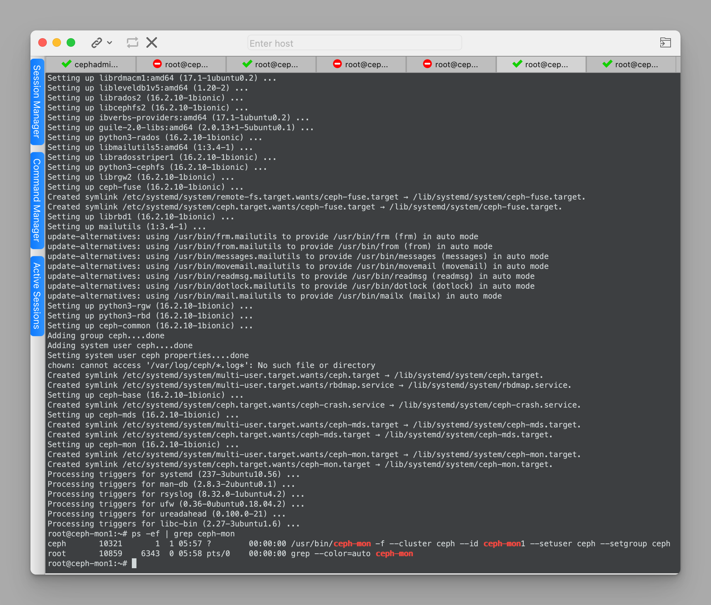

### 分发admin秘钥

```bash
# ceph-deploy节点
sudo apt install ceph-common -y

# 推送秘钥至各node节点
ceph-deploy admin ceph-node1 ceph-node2 ceph-node3 ceph-node4

# 推送秘钥给自己
ceph-deploy admin ceph-deploy

# ceph-deploy节点及node节点
# 验证key文件是否存在
ll /etc/ceph
# 预期输出
-rw-------   1 root root  151 Dec 24 06:01 ceph.client.admin.keyring

# ceph-deploy节点及node节点
# 以root身份执行，允许cephadmin用户执行ceph命令
setfacl -m u:cephadmin:rw /etc/ceph/ceph.client.admin.keyring

# 执行ceph命令测试
ceph -s
```

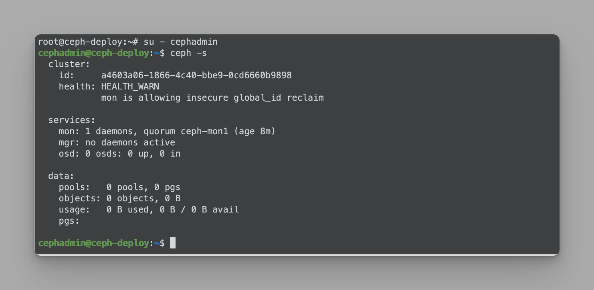

### 部署mgr节点

```bash
# ceph-mgr1节点
apt install ceph-mgr -y

# ceph-deploy节点
ceph-deploy mgr create ceph-mgr1

# Postfix邮件配置选择Internet Site
# 主机名为默认域名，无需修改

# 检查mgr1是否已启动 
ceph -s

# 在mgr1节点验证
ps -ef | grep ceph
```

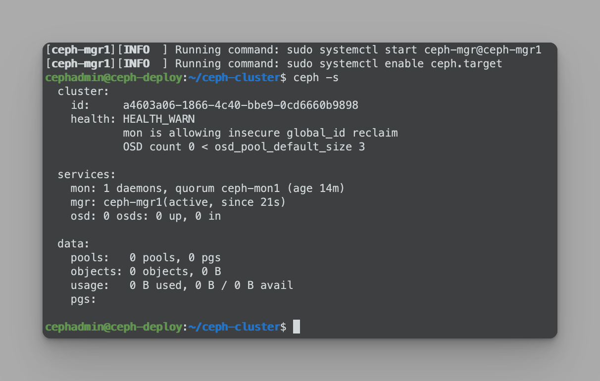

### 禁用非安全模式通信

```bash
# ceph-deploy节点
ceph config set mon auth_allow_insecure_global_id_reclaim false

# 检查状态
ceph -s
ceph versions
```

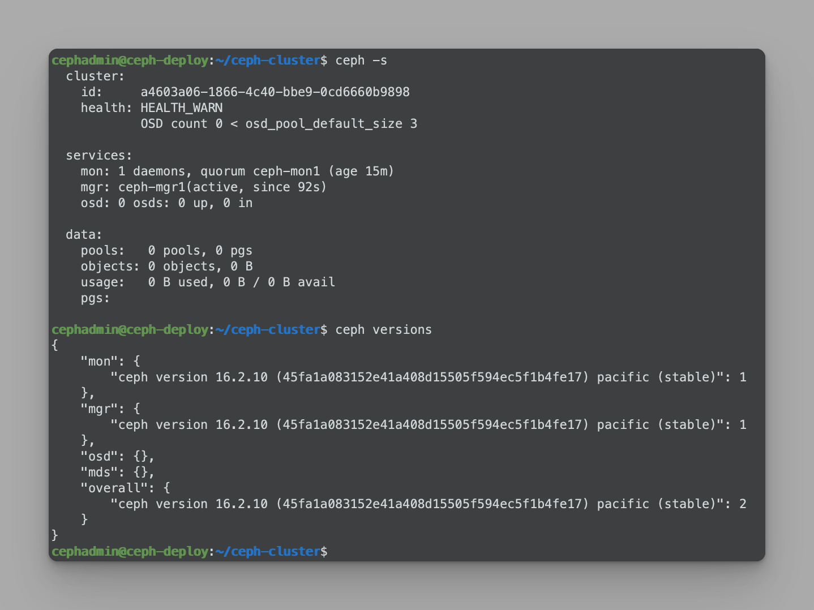

### 初始化存储节点

```bash
# ceph-deploy节点
# 初始化存储节点
ceph-deploy install --release pacific ceph-node1 ceph-node2 ceph-node3 ceph-node4

# ceph-deploy节点
# 列出各node节点磁盘
ceph-deploy disk list ceph-node1
ceph-deploy disk list ceph-node2
ceph-deploy disk list ceph-node3
ceph-deploy disk list ceph-node4
# 预期输出，以ceph-node1为例
[ceph-node1][INFO  ] Running command: sudo fdisk -l
[ceph-node1][INFO  ] Disk /dev/sda: 100 GiB, 107374182400 bytes, 209715200 sectors
[ceph-node1][INFO  ] Disk /dev/sde: 2 TiB, 2199023255552 bytes, 4294967296 sectors
[ceph-node1][INFO  ] Disk /dev/sdc: 2 TiB, 2199023255552 bytes, 4294967296 sectors
[ceph-node1][INFO  ] Disk /dev/sdb: 2 TiB, 2199023255552 bytes, 4294967296 sectors
[ceph-node1][INFO  ] Disk /dev/sdd: 2 TiB, 2199023255552 bytes, 4294967296 sectors

# 擦除所有node节点硬盘
ceph-deploy disk zap ceph-node1 /dev/sdb
ceph-deploy disk zap ceph-node1 /dev/sdc
ceph-deploy disk zap ceph-node1 /dev/sdd
ceph-deploy disk zap ceph-node1 /dev/sde

ceph-deploy disk zap ceph-node2 /dev/sdb
ceph-deploy disk zap ceph-node2 /dev/sdc
ceph-deploy disk zap ceph-node2 /dev/sdd
ceph-deploy disk zap ceph-node2 /dev/sde

ceph-deploy disk zap ceph-node3 /dev/sdb
ceph-deploy disk zap ceph-node3 /dev/sdc
ceph-deploy disk zap ceph-node3 /dev/sdd
ceph-deploy disk zap ceph-node3 /dev/sde

ceph-deploy disk zap ceph-node4 /dev/sdb
ceph-deploy disk zap ceph-node4 /dev/sdc
ceph-deploy disk zap ceph-node4 /dev/sdd
ceph-deploy disk zap ceph-node4 /dev/sde

# 如果有nvme硬盘
ceph-deploy disk zap ceph-node1 /dev/nvme0n1
ceph-deploy disk zap ceph-node2 /dev/nvme0n1
ceph-deploy disk zap ceph-node3 /dev/nvme0n1
ceph-deploy disk zap ceph-node4 /dev/nvme0n1
```

### 添加OSD

```bash
# ceph-deploy节点
# 添加osd
ceph-deploy osd --help
ceph-deploy osd create ceph-node1 --data /dev/sdb
ceph-deploy osd create ceph-node1 --data /dev/sdc
ceph-deploy osd create ceph-node1 --data /dev/sdd
ceph-deploy osd create ceph-node1 --data /dev/sde

ceph-deploy osd create ceph-node2 --data /dev/sdb
ceph-deploy osd create ceph-node2 --data /dev/sdc
ceph-deploy osd create ceph-node2 --data /dev/sdd
ceph-deploy osd create ceph-node2 --data /dev/sde

ceph-deploy osd create ceph-node3 --data /dev/sdb
ceph-deploy osd create ceph-node3 --data /dev/sdc
ceph-deploy osd create ceph-node3 --data /dev/sdd
ceph-deploy osd create ceph-node3 --data /dev/sde

ceph-deploy osd create ceph-node4 --data /dev/sdb
ceph-deploy osd create ceph-node4 --data /dev/sdc
ceph-deploy osd create ceph-node4 --data /dev/sdd
ceph-deploy osd create ceph-node4 --data /dev/sde


# ceph-node1
# 设置osd服务
ps -ef|grep osd
systemctl enable ceph-osd@0 ceph-osd@1 ceph-osd@2 ceph-osd@3

# ceph-node2
# 设置osd服务
ps -ef|grep osd
systemctl enable ceph-osd@4 ceph-osd@5 ceph-osd@6 ceph-osd@7

# ceph-node3
# 设置osd服务
ps -ef|grep osd
systemctl enable ceph-osd@8 ceph-osd@9 ceph-osd@10 ceph-osd@11

# ceph-node4
# 设置osd服务
ps -ef|grep osd
systemctl enable ceph-osd@12 ceph-osd@13 ceph-osd@14 ceph-osd@15

# 检查集群状态
ceph -s
```

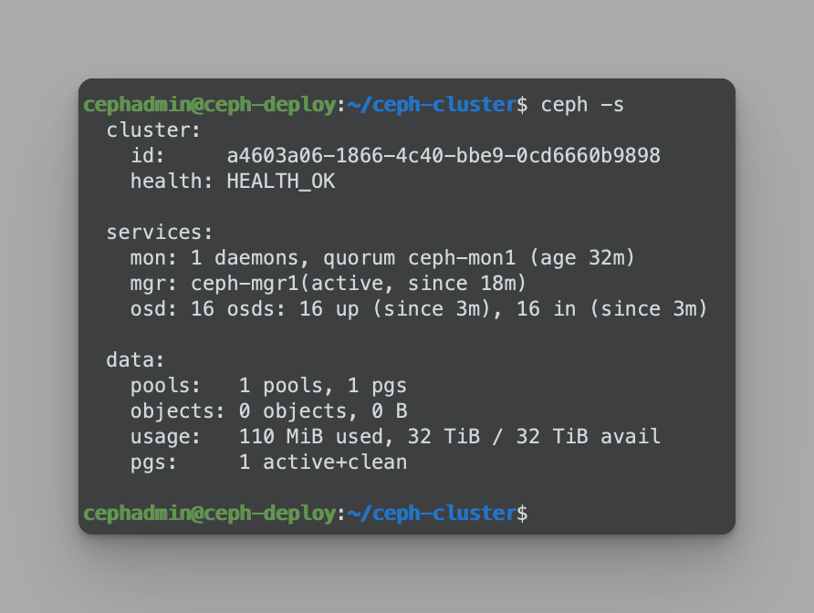

### 创建存储池并测试

```bash
# ceph-deploy节点
# 创建存储池测试
ceph osd pool create mypool 32 32
# 预期输出
pool 'mypool' created

# 验证PG与PGP组合
ceph pg ls-by-pool mypool | awk '{print $1,$2,$15}'
# 预期输出
PG OBJECTS ACTING
2.0 0 [7,10,3]p7
2.1 0 [14,0,8]p14
2.2 0 [5,1,14]p5
2.3 0 [14,5,9]p14
2.4 0 [1,10,15]p1
2.5 0 [8,0,4]p8
2.6 0 [1,8,14]p1
2.7 0 [6,13,2]p6
2.8 0 [12,9,0]p12
2.9 0 [1,7,14]p1
2.a 0 [11,3,15]p11
2.b 0 [8,7,12]p8
2.c 0 [11,0,5]p11
2.d 0 [9,13,3]p9
2.e 0 [2,9,13]p2
2.f 0 [8,13,4]p8
2.10 0 [15,8,0]p15
2.11 0 [15,6,1]p15
2.12 0 [10,3,7]p10
2.13 0 [15,4,3]p15
2.14 0 [6,9,12]p6
2.15 0 [14,1,8]p14
2.16 0 [5,11,12]p5
2.17 0 [6,10,2]p6
2.18 0 [13,4,11]p13
2.19 0 [3,6,8]p3
2.1a 0 [6,8,2]p6
2.1b 0 [11,7,13]p11
2.1c 0 [10,7,1]p10
2.1d 0 [15,10,7]p15
2.1e 0 [3,10,15]p3
2.1f 0 [0,7,8]p0

# 列出存储池
ceph osd pool ls
# 预期输出
device_health_metrics
mypool

# 文件存储和块存储暂时未启用，上传文件至对象存储
# 把messages文件上传到mypool并指定对象id为msg1
sudo rados put msg1 /var/log/syslog --pool=mypool
rados ls --pool=mypool

# 文件信息
ceph osd map mypool msg1
# 预期输出
osdmap e93 pool 'mypool' (2) object 'msg1' -> pg 2.c833d430 (2.10) -> up ([15,8,0], p15) acting ([15,8,0], p15)

# 下载文件
sudo rados get msg1 --pool=mypool /opt/my.txt
ll /opt/

# 查看文件
tail /opt/my.txt

# 删除文件
sudo rados rm msg1 --pool=mypool
rados ls --pool=mypool

# 删除存储池
# 设置允许删除
ceph tell mon.* injectargs --mon-allow-pool-delete=true
# 删除mypool
ceph osd pool rm mypool mypool --yes-i-really-really-mean-it
# 预期输出
pool 'mypool' removed
# 恢复删除设置
ceph tell mon.* injectargs --mon-allow-pool-delete=false
```

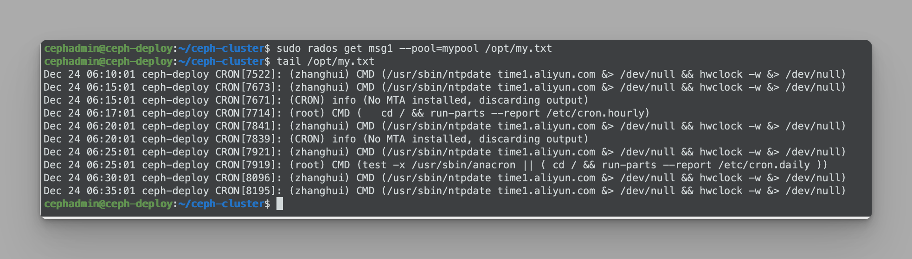

### 扩展mon节点

```bash
# ceph-mon2节点
apt install ceph-mon

# ceph-mon3节点
apt install ceph-mon

# ceph-deploy节点
ceph-deploy mon add ceph-mon2
ceph-deploy mon add ceph-mon3

# 验证mon状态，转换为json解析
ceph quorum_status --format json-pretty

# 验证集群状态
ceph -s
```

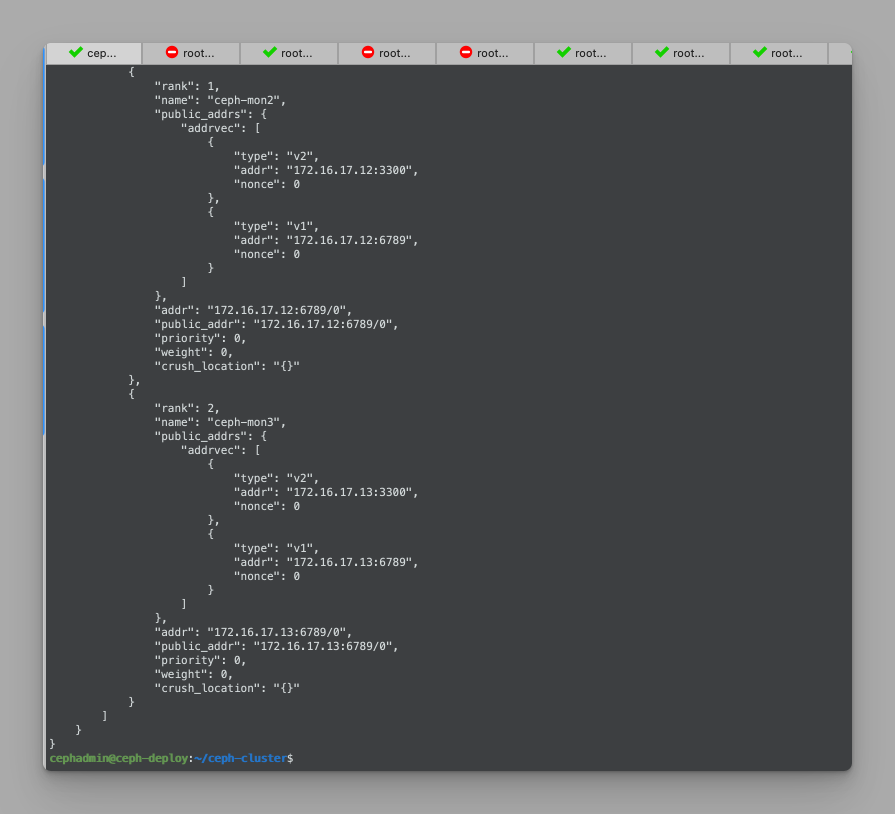


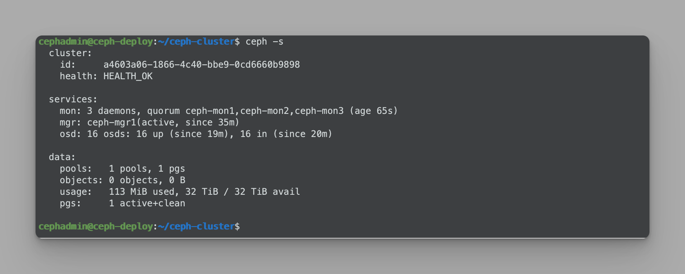

### 扩展mgr节点

```bash
# ceph-mgr2节点
apt install ceph-mgr

# ceph-deploy节点
ceph-deploy mgr create ceph-mgr2
# 同步配置文件到ceph-mgr2节点
ceph-deploy admin ceph-mgr2

# 验证mgr状态
ceph -s
```

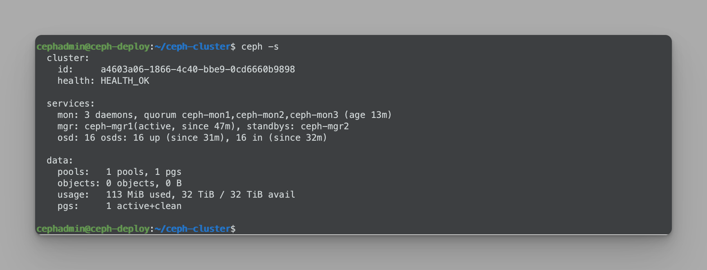


## 3. 梳理块存储、文件存储及对象存储的使用场景

### 块存储

块存储一是需要格式化、二是需要挂载、三是只能被一个节点使用，如 Redis的master和slave的块存储是独立的、zookeeper各节点的快存储是独立的、MySQL 的 master 和 slave 的块存储是独立的、也可以用于私有云与公有云的虚拟机的系统盘和云盘等场景

### 文件存储

对于需要在多个主机或多个容器之间实现数据共享的场景，比如多个nginx 读取由多个tomcat写入到存储的数据，客户端需支持ceph FS，谁使用谁挂载

### 对象存储

适合于写一次频繁读的场景，对于数据不会经常变化、删除和修改的场景，如短视频、APP下载等，可以使用对象存储，可通过SDK及API等在代码层实现读写访问，对象存储无法挂载，只需提供给使用方URL及认证的key


## 4. 基于ceph块存储实现块设备挂载及使用

### 创建存储池

```bash
# ceph-deploy节点
# 创建存储池
ceph osd pool create myrbd1 64 64

# 启用rbd
ceph osd pool application enable myrbd1 rbd

# 通过rbd命令对存储池初始化
rbd pool init -p myrbd1
```

### 创建镜像

```bash
# 在pool中创建两个镜像
rbd create myimg1 --size 5G --pool myrbd1
rbd create myimg2 --size 3G --pool myrbd1 --image-format 2 --image-feature layering

# 列出指定pool中所有的镜像
rbd ls --pool myrbd1
# 预期输出
myimg1
myimg2

# 查看指定rbd信息
rbd --image myimg1 --pool myrbd1 info
rbd --image myimg2 --pool myrbd1 info

# 查看ceph状态
ceph df
```

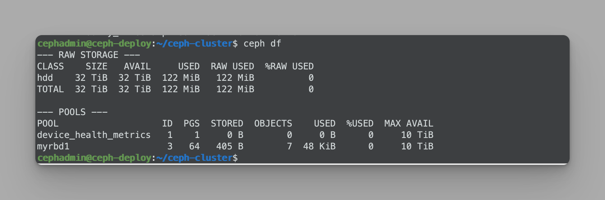

### 客户端使用

```bash
# centos节点172.16.17.21
# 配置octopus源
yum install epel-release -y
yum install https://mirrors.aliyun.com/ceph/rpm-octopus/el7/noarch/ceph-release-1-1.el7.noarch.rpm -y
# 安装ceph-common
yum install ceph-common -y

# ceph-deploy节点
# 拷贝etc目录下的认证文件到centos节点
cd /etc/ceph
scp ceph.conf ceph.client.admin.keyring root@172.16.17.21:/etc/ceph/

# centos节点
ceph -s

# 映射myrbd1池中的myimg2镜像
# myimg1默认特性很多不支持
rbd -p myrbd1 map myimg2

# 查看映射盘
lsblk

# 格式化并挂载
mkfs.xfs /dev/rbd0

# 挂载，且打开立即触发闲置块回收
mkdir /data
mount -t xfs -o discard /dev/rbd0 /data/

# 拷贝文件测试
cp /etc/passwd /data/
ll /data/
df -TH

# 测试写入500个文件
dd if=/dev/zero of=/data/file1 bs=1MB count=300
# 预期输出
300+0 records in
300+0 records out
300000000 bytes (300 MB) copied, 0.397059 s, 756 MB/s

ll -h /data/file1

# 查看是否有回收空间
ceph df

# 删除数据
rm -rf /data/file1

# 查看是否有回收空间
ceph df
```

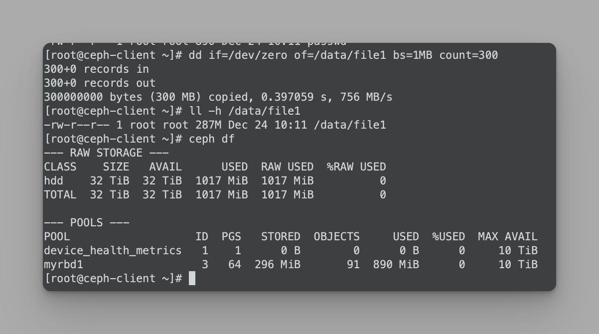


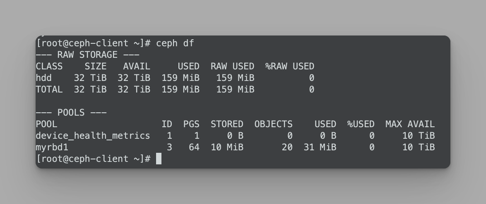


### 安装radosgw

```bash
# ceph-mgr1节点
# 安装
apt-cache madison radosgw
apt install radosgw=16.2.10-1bionic

# ceph-deploy节点
# 部署rgw
ceph-deploy --overwrite-conf rgw create ceph-mgr1

# 验证服务
# ceph-mgr1节点
ps -aux | grep radosgw

# 浏览
http://172.16.17.14:7480

# ceph-deploy节点
# 验证ceph状态
ceph -s

# 初始化存储池
ceph osd pool ls
# 预期输出
device_health_metrics
myrbd1
.rgw.root
default.rgw.log
default.rgw.control
default.rgw.meta
```

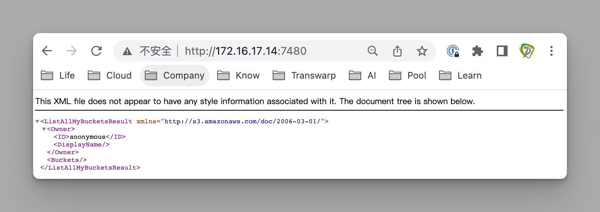


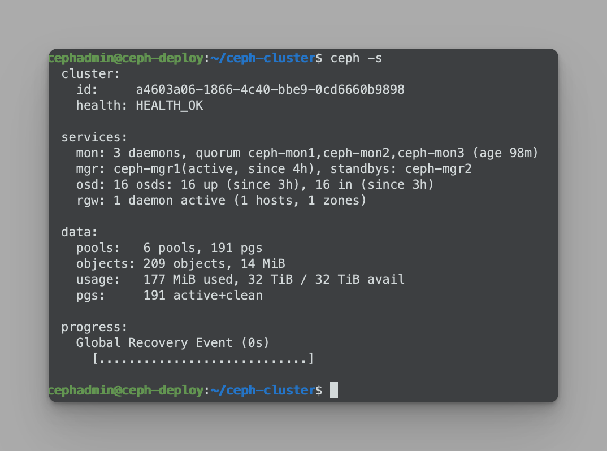


## 5. 基于cephFS实现多主机数据共享

### 部署MDS服务

```bash
# 选择ceph-mgr1节点作为ceph-mds服务器
apt-cache madison ceph-mds
apt install ceph-mds=16.2.10-1bionic

# 部署
# ceph-deploy节点
ceph-deploy mds create ceph-mgr1

# 验证服务
ceph mds stat
# 预期输出
1 up:standby

# 创建元数据和数据存储池
ceph osd pool create cephfs-metadata 32 32
ceph osd pool create cephfs-data 64 64

# 检查状态
ceph -s
ceph osd pool ls
# 预期输出
device_health_metrics
myrbd1
.rgw.root
default.rgw.log
default.rgw.control
default.rgw.meta
cephfs-metadata
cephfs-data

# 创建cephFS并验证
ceph fs new mycephfs cephfs-metadata cephfs-data

# 查看是否已创建
ceph fs ls
ceph fs status mycephfs

# 再次验证服务
ceph mds stat
```

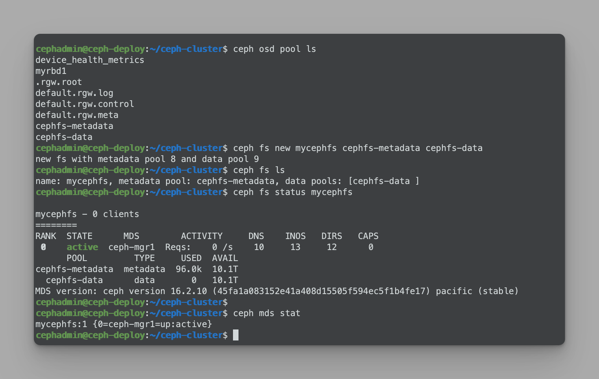

### 多客户端挂载

```bash
# ceph-deploy节点
# 获得有权限的key
cat /etc/ceph/ceph.client.admin.keyring


# centos-client节点
# 客户端通过key挂载mgr1上的文件系统
mkdir /data
# 注意地址需写mon节点的地址，需要mon做认证
mount -t ceph 172.16.17.11:6789:/ /data -o name=admin,secret=AQBeJKZjK/jnGRAA1H+RGPphxSQlDPNkXk5Hvw==

# 测试数据写入
cp /var/log/syslog /data/
df -TH


# ubuntu-client节点
# 客户端通过key挂载mgr1上的文件系统
mkdir /data
# 注意地址需写mon节点的地址，需要mon做认证
mount -t ceph 172.16.17.11:6789:/ /data -o name=admin,secret=AQBeJKZjK/jnGRAA1H+RGPphxSQlDPNkXk5Hvw==

# 检查已写入的数据
ls /data/
df -TH

# 注：上述挂载方式，无需client节点安装ceph包或复制key文件
```


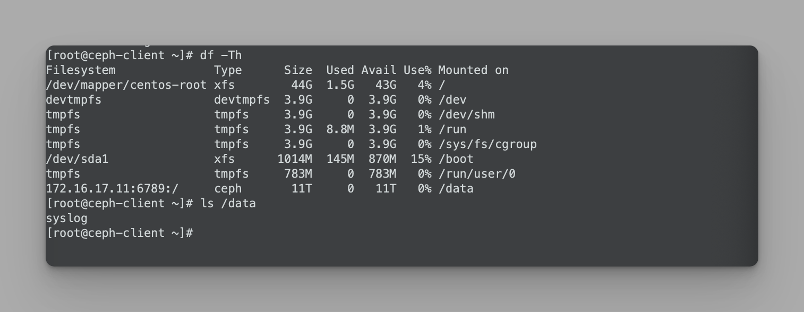


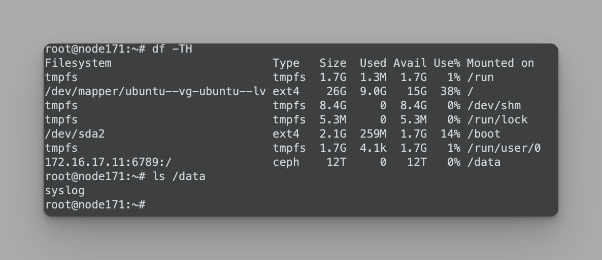


### Q&A

#### clock skew detected on mon.ceph-mon2

```bash
# ceph设置的mon的时间偏差阈值比较小
# 调整时间偏差阈值
vim ceph.conf

# 在global字段下添加
mon clock drift allowed = 1
mon clock drift warn backoff = 10
mon timecheck interval = 5

# 推送配置文件
ceph-deploy --overwrite-conf config push ceph-mon{1,2,3}

# 各mon节点重启服务
systemctl restart ceph-mon.target

# 检查状态
ceph -s
# 预期输出
health: HEALTH_OK
```

#### monclient(hunting): handle_auth_bad_method server allowed_methods [2] but i only support [2]

```bash
# 客户端连接报错原因
# 原因：秘钥未复制或复制不对
# ceph-deploy节点
# 拷贝etc目录下的认证文件到centos节点
cd /etc/ceph
scp ceph.conf ceph.client.admin.keyring root@172.16.17.21:/etc/ceph/

# 客户端验证
ceph -s
```
